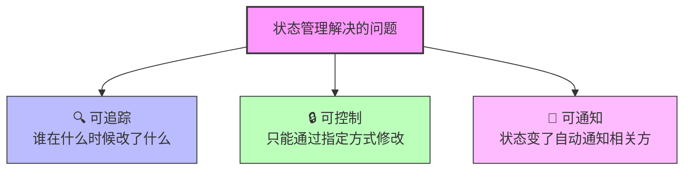
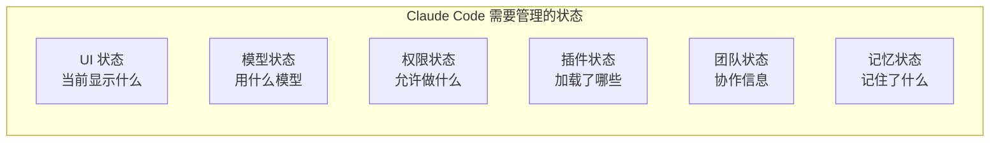
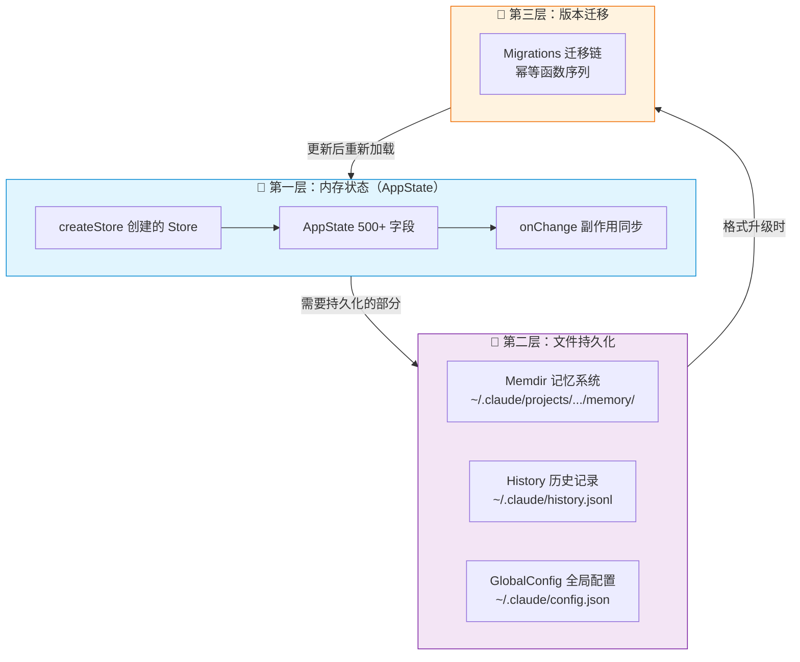

# 第 1 课：什么是状态管理？为什么需要它？

> 🎯 本课是整个系列的起点，帮助零基础读者理解"状态管理"这个核心概念。

---

## 学习目标

1. 理解什么是"状态"，以及它在程序中的含义
2. 明白为什么复杂应用需要统一的状态管理方案
3. 了解 Claude Code 中状态管理面临的挑战
4. 认识 Claude Code 的三层状态架构概览
5. 建立对后续课程的整体认知地图

---

## 一、什么是"状态"？

### 生活类比：你的书桌

想象你正在一张书桌前工作。书桌上有：

- 打开的几本书（**当前正在处理的数据**）
- 一杯咖啡的温度（**会随时间变化的属性**）
- 抽屉里的文件夹（**持久化存储的东西**）
- 你脑中对"接下来做什么"的计划（**应用逻辑的上下文**）

在编程中，**状态（State）** 就是程序在某一时刻所有"记住"的东西的总和。

### 用代码来感受

```typescript
// 最简单的"状态"——一个变量
let userName = "小明"        // 这就是一个状态
let isLoggedIn = false       // 这也是一个状态
let messageCount = 0         // 这还是一个状态
```

当 `isLoggedIn` 从 `false` 变成 `true`，我们就说"状态发生了变化"。

---

## 二、为什么需要"管理"状态？

### 生活类比：一个人 vs 一个团队

一个人在自己桌上工作，书桌怎么乱都无所谓——你知道东西在哪。

但想象 **10 个人共用一张桌子**：

- A 把文件放到左边，B 把它挪到了右边
- C 以为文件还在左边，结果找不到了
- D 不知道文件已经被修改过了

**这就是不做状态管理时的混乱。**

在 Claude Code 这样的复杂应用中，同样的问题会出现：

```
┌──────────────────────────────────────────────────┐
│              没有状态管理的世界                      │
├──────────────────────────────────────────────────┤
│  UI 组件 A → 直接改了全局变量 X                     │
│  模块 B → 也改了 X，覆盖了 A 的修改                  │
│  模块 C → 读到了过时的 X                            │
│  Bug 发生了，但你不知道是谁改的、什么时候改的          │
└──────────────────────────────────────────────────┘
```

### 状态管理解决的三大问题



| 问题 | 没有状态管理 | 有状态管理 |
|------|-------------|-----------|
| 修改方式 | 任何地方都能直接改 | 必须通过 `setState` |
| 变更通知 | 手动通知或忘记通知 | 自动通知所有订阅者 |
| 调试追踪 | 不知道谁改的 | 每次变更都经过统一入口 |

---

## 三、Claude Code 面临的状态挑战

Claude Code 是一个 **命令行 AI 编程助手**。它的状态比普通应用复杂得多：

### 3.1 种类繁多



### 3.2 生命周期不同

有的状态只在当前会话中有效（比如 UI 显示状态），有的需要跨会话保存（比如用户偏好），有的甚至需要跨项目共享（比如全局配置）。

### 3.3 真实源码中的 AppState

在 Claude Code 中，核心状态定义在 `state/AppStateStore.ts` 中。我们来看一小部分：

```typescript
// 源码文件：state/AppStateStore.ts（简化版）
export type AppState = DeepImmutable<{
  settings: SettingsJson           // 用户设置
  verbose: boolean                 // 是否详细输出
  mainLoopModel: ModelSetting      // 主循环使用的模型
  statusLineText: string | undefined  // 状态栏文字
  thinkingEnabled: boolean | undefined // 是否启用思考
  toolPermissionContext: ToolPermissionContext  // 工具权限
  // ... 还有几十个字段
}> & {
  tasks: { [taskId: string]: TaskState }    // 任务列表
  mcp: { clients: MCPServerConnection[]; tools: Tool[]; ... }  // MCP 插件
  fileHistory: FileHistoryState             // 文件历史
  // ... 更多字段
}
```

> 💡 **看到 `DeepImmutable` 了吗？** 这表示状态是不可直接修改的（不可变的），只能通过 `setState` 方法来更新。这是状态管理的核心设计原则。

---

## 四、Claude Code 的三层状态架构

Claude Code 并不是把所有状态都塞在一个地方，而是按照**生命周期**分成了三层：



| 层次 | 职责 | 生命周期 | 对应课程 |
|------|------|---------|---------|
| 内存状态 | 运行时所有数据 | 进程生命周期 | 第 2-4 课 |
| 文件持久化 | 跨会话保存的数据 | 跨会话/永久 | 第 5-7 课 |
| 版本迁移 | 数据格式升级 | 升级时一次性 | 第 8 课 |

---

## 五、为什么不用 Redux / Zustand / MobX？

你可能会问：市面上有那么多状态管理库，为什么 Claude Code 要自己写一个？

答案在 `state/store.ts` —— 这个文件只有 **34 行代码**：

```typescript
// 源码文件：state/store.ts（完整文件！只有 34 行）
type Listener = () => void
type OnChange<T> = (args: { newState: T; oldState: T }) => void

export type Store<T> = {
  getState: () => T
  setState: (updater: (prev: T) => T) => void
  subscribe: (listener: Listener) => () => void
}

export function createStore<T>(
  initialState: T,
  onChange?: OnChange<T>,
): Store<T> {
  let state = initialState
  const listeners = new Set<Listener>()

  return {
    getState: () => state,
    setState: (updater: (prev: T) => T) => {
      const prev = state
      const next = updater(prev)
      if (Object.is(next, prev)) return
      state = next
      onChange?.({ newState: next, oldState: prev })
      for (const listener of listeners) listener()
    },
    subscribe: (listener: Listener) => {
      listeners.add(listener)
      return () => listeners.delete(listener)
    },
  }
}
```

**为什么选择自己写？**

| 维度 | 第三方库 | 自研 34 行 Store |
|------|---------|----------------|
| 依赖 | 引入额外包 | 零依赖 |
| 体积 | 几 KB ~ 几十 KB | 34 行 |
| 功能 | 很多用不到的功能 | 刚好够用 |
| 理解成本 | 需要学习 API | 一眼看懂 |
| 定制性 | 受限于库的设计 | 完全可控 |

> 🎯 **设计哲学**：不要为了用库而用库。当需求简单明确时，最小实现往往是最好的选择。

---

## 动手练习

### 练习 1：识别状态

想想你用过的手机 APP（比如微信），列出 5 个你能想到的"状态"：

```
例：
1. 未读消息数量 → 数字，会变化
2. 当前打开的聊天窗口 → 会切换
3. ____________
4. ____________
5. ____________
```

### 练习 2：思考题

如果微信没有统一的状态管理，以下场景会出什么问题？

- 你在聊天列表页看到"3 条未读"，点进去发现只有 1 条
- 你发了一条消息，聊天列表没有更新顺序
- 你改了头像，但有的页面还显示旧头像

这些问题的根本原因是什么？

### 练习 3：阅读源码

打开 `state/store.ts`，回答以下问题：

1. `createStore` 接受几个参数？分别是什么？
2. `Store<T>` 类型提供了哪三个方法？
3. `setState` 中 `Object.is(next, prev)` 这行代码的作用是什么？

---

## 本课小结

| 关键概念 | 一句话解释 |
|---------|----------|
| 状态（State） | 程序在某一时刻"记住"的所有东西 |
| 状态管理 | 用统一的方式管理状态的读取、修改和通知 |
| 可追踪 | 知道谁在什么时候改了什么 |
| 可控制 | 只能通过指定方式修改状态 |
| 可通知 | 状态变了自动通知关心的人 |
| DeepImmutable | Claude Code 中确保状态不被直接修改的类型约束 |

---

## 下节预告

下一课我们将深入 `state/store.ts` 这 34 行代码，逐行拆解：

- 闭包是怎么保存状态的？
- `Object.is` 为什么比 `===` 更好？
- 发布-订阅模式是怎么实现的？
- `onChange` 回调有什么妙用？

👉 [第 2 课：createStore 源码解析 →](./02-create-store.md)
