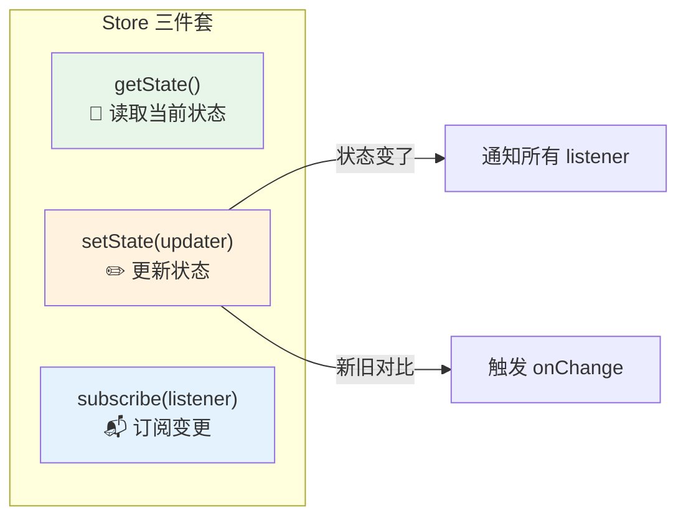
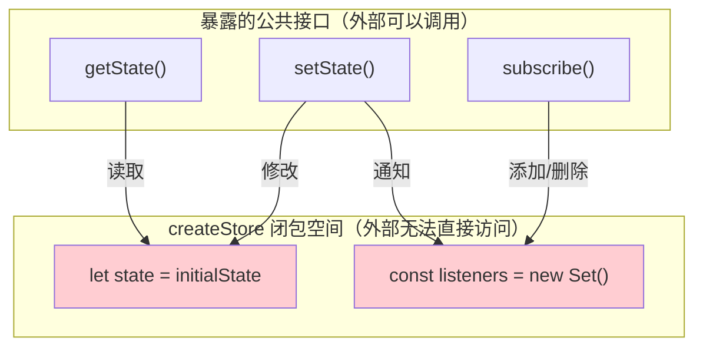
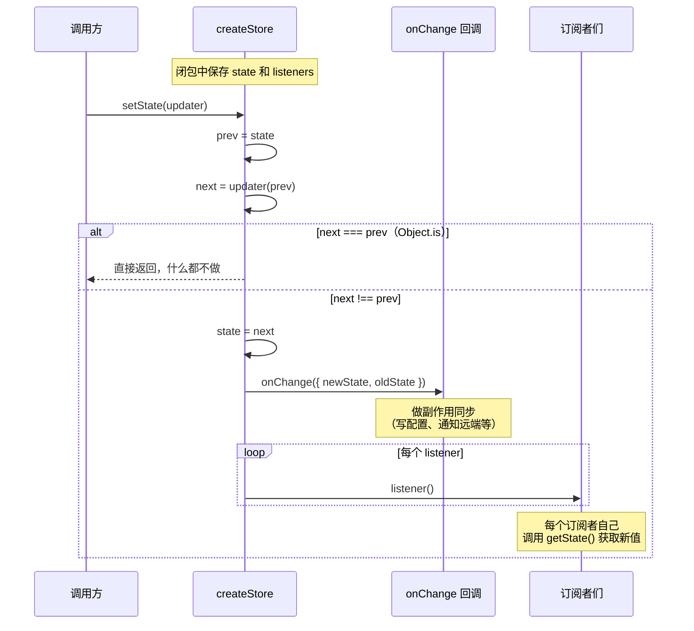

# 第 2 课：createStore 源码解析 —— 34 行极简 Store

> 🎯 本课逐行拆解 Claude Code 状态管理的核心引擎：`state/store.ts`

---

## 学习目标

1. 理解闭包如何实现私有状态存储
2. 掌握发布-订阅（Pub/Sub）模式的原理和实现
3. 搞懂 `Object.is` 短路优化的意义
4. 理解 `onChange` 回调如何架起"内存 → 磁盘"的桥梁
5. 能自己写出一个类似的极简 Store

---

## 一、完整源码一览

先看完整的源码，只有 34 行（包括类型定义）：

```typescript
// 源码文件：state/store.ts（完整 34 行）
type Listener = () => void
type OnChange<T> = (args: { newState: T; oldState: T }) => void

export type Store<T> = {
  getState: () => T
  setState: (updater: (prev: T) => T) => void
  subscribe: (listener: Listener) => () => void
}

export function createStore<T>(
  initialState: T,
  onChange?: OnChange<T>,
): Store<T> {
  let state = initialState
  const listeners = new Set<Listener>()

  return {
    getState: () => state,

    setState: (updater: (prev: T) => T) => {
      const prev = state
      const next = updater(prev)
      if (Object.is(next, prev)) return
      state = next
      onChange?.({ newState: next, oldState: prev })
      for (const listener of listeners) listener()
    },

    subscribe: (listener: Listener) => {
      listeners.add(listener)
      return () => listeners.delete(listener)
    },
  }
}
```

---

## 二、类型定义：先画图纸

### 2.1 Listener —— 监听者

```typescript
type Listener = () => void
```

**生活类比**：想象一个"订报纸"的系统。`Listener` 就是订阅者留下的联系方式——"有新报纸就通知我"。它不关心具体发生了什么，只需要知道"变了"。

### 2.2 OnChange —— 变更回调

```typescript
type OnChange<T> = (args: { newState: T; oldState: T }) => void
```

与 `Listener` 不同，`OnChange` **同时拿到新旧状态**，可以做差异比较。这是实现副作用同步（第 4 课）的关键。

### 2.3 Store —— 仓库的接口

```typescript
export type Store<T> = {
  getState: () => T                              // 读
  setState: (updater: (prev: T) => T) => void    // 写
  subscribe: (listener: Listener) => () => void  // 订阅
}
```

只有 **三个方法**，这就是状态管理的最小 API：



---

## 三、createStore 逐行解析

### 3.1 函数签名

```typescript
export function createStore<T>(
  initialState: T,
  onChange?: OnChange<T>,
): Store<T> {
```

- `<T>` ——泛型参数，意味着这个 Store 可以管理**任何类型**的状态
- `initialState` —— 状态的初始值
- `onChange?` —— 可选的变更回调（`?` 表示可选）

### 3.2 闭包：私有状态的秘密

```typescript
  let state = initialState
  const listeners = new Set<Listener>()
```

**生活类比**：把 `state` 想象成一个上了锁的保险箱，钥匙只在 `createStore` 返回的三个方法手里。外部代码无法直接访问 `state` 变量——这就是**闭包**的威力。



**为什么用 `Set` 而不用数组？**

```typescript
// Set 的优势：
// 1. 不会重复添加同一个 listener
// 2. 删除是 O(1) 而非 O(n)
const listeners = new Set<Listener>()
```

### 3.3 getState —— 最简单的读

```typescript
    getState: () => state,
```

就是返回当前状态，没有任何多余逻辑。简单就是美。

### 3.4 setState —— 核心方法，逐行拆解

```typescript
    setState: (updater: (prev: T) => T) => {
      const prev = state           // ① 保存旧状态
      const next = updater(prev)   // ② 基于旧状态计算新状态
      if (Object.is(next, prev)) return  // ③ 没变？什么都不做
      state = next                 // ④ 更新状态
      onChange?.({ newState: next, oldState: prev })  // ⑤ 触发变更回调
      for (const listener of listeners) listener()    // ⑥ 通知所有订阅者
    },
```

让我们逐步分析：

#### ① 为什么参数是函数而不是值？

```typescript
// ✅ Claude Code 的方式：传入函数
store.setState(prev => ({ ...prev, verbose: true }))

// ❌ 另一种方式：直接传值
store.setState({ ...store.getState(), verbose: true })
```

传函数的好处：**保证读写原子性**。如果传值，在你读取旧状态和写入新状态之间，可能有其他代码也改了状态，造成数据丢失。

#### ② Object.is 短路优化

```typescript
if (Object.is(next, prev)) return
```

**生活类比**：如果你翻开保险箱发现里面东西没变，就不需要通知所有人"保险箱更新了"。

`Object.is` 比 `===` 更精确，体现在两个特殊场景：

```typescript
// Object.is vs ===
Object.is(NaN, NaN)   // true  ✅ （=== 返回 false）
Object.is(+0, -0)     // false ✅ （=== 返回 true）
```

但这里更重要的用途是**引用相等性检查**：如果 `updater` 返回了跟之前相同的对象引用，就跳过后续所有操作，避免不必要的副作用和重渲染。

#### ③ onChange 的设计意图

```typescript
onChange?.({ newState: next, oldState: prev })
```

`?.` 是可选链调用——如果创建 Store 时没传 `onChange`，就跳过。

**关键设计**：`onChange` 同时拿到 `newState` 和 `oldState`，可以做精准的差异检测。这是第 4 课 `onChangeAppState` 的基础：

```typescript
// 实际使用场景（来自 onChangeAppState.ts）
if (prevMode !== newMode) {
  // 只在权限模式真正改变时才同步到远端
  notifyPermissionModeChanged(newMode)
}
```

#### ④ 通知所有订阅者

```typescript
for (const listener of listeners) listener()
```

所有通过 `subscribe` 注册的监听者都会被逐一调用。注意 `listener` 不接收参数——它只是一个"嘿，变了！"的信号。

### 3.5 subscribe —— 订阅与取消

```typescript
    subscribe: (listener: Listener) => {
      listeners.add(listener)
      return () => listeners.delete(listener)
    },
```

**生活类比**：像订报纸一样——你打电话订阅，得到一个"取消订阅"的方法。什么时候不想看了，调用返回的函数就行。

```typescript
// 使用示例
const unsubscribe = store.subscribe(() => {
  console.log('状态更新了！', store.getState())
})

// 不再需要监听时
unsubscribe()
```

---

## 四、完整数据流图



---

## 五、与 React 的 useState 对比

如果你学过 React，可以用这个对比表加深理解：

| 特性 | React useState | Claude Code createStore |
|------|---------------|------------------------|
| 作用域 | 单个组件 | 整个应用 |
| 订阅机制 | 自动（React 调度） | 手动 subscribe |
| 更新方式 | `setState(newVal)` 或 `setState(prev => ...)` | 只有 `setState(prev => ...)` |
| 批量更新 | React 18 自动批量 | 每次 setState 立即生效 |
| 变更通知 | React 自动 re-render | 手动 onChange + listeners |

---

## 六、设计中的取舍

### 为什么没有 middleware？

Redux 有中间件机制，但 Claude Code 用 `onChange` 一个回调搞定了所有副作用。原因：

- 副作用类型有限（写配置、通知远端、清缓存）
- 一个函数比中间件链更容易理解和调试
- 不需要异步中间件（副作用里的异步操作自己管理）

### 为什么没有 selector？

状态选择器（selector）可以优化性能，但 Claude Code 选择了更简单的方案：

- UI 组件直接 `getState()` 取需要的字段
- `Object.is` 短路已经避免了不必要的通知
- 34 行代码不值得为了优化而增加复杂度

---

## 动手练习

### 练习 1：自己实现一个 Store

不看源码，尝试自己写一个 `createStore`：

```typescript
function createStore<T>(initialState: T) {
  // 你的代码...
  // 提示：需要 let state, const listeners
  // 返回 { getState, setState, subscribe }
}
```

### 练习 2：使用你的 Store

```typescript
const counterStore = createStore({ count: 0 })

// 1. 订阅变更
const unsub = counterStore.subscribe(() => {
  console.log('Count is now:', counterStore.getState().count)
})

// 2. 更新状态
counterStore.setState(prev => ({ count: prev.count + 1 }))
// 应该输出什么？

// 3. 再次更新
counterStore.setState(prev => prev)  // 返回同一个引用
// 会触发 listener 吗？为什么？

// 4. 取消订阅后再更新
unsub()
counterStore.setState(prev => ({ count: prev.count + 1 }))
// 会输出什么？为什么？
```

### 练习 3：思考题

1. 如果在 `listener` 回调里再次调用 `setState`，会发生什么？会死循环吗？
2. 如果两个 `setState` 调用几乎同时发生（比如在 Promise.all 中），会有竞态条件吗？为什么？
3. 为什么 Claude Code 选择 `let state` 而不是 `const state`？

---

## 本课小结

| 概念 | 解释 |
|------|------|
| 闭包存储 | `let state` 被闭包保护，外部只能通过暴露的方法访问 |
| 函数式更新 | `setState(prev => ...)` 保证基于最新状态计算 |
| Object.is 短路 | 状态没变就不触发后续操作，避免不必要的副作用 |
| onChange 回调 | 架起内存状态和磁盘持久化的桥梁 |
| subscribe 模式 | 发布-订阅模式，返回取消函数实现优雅清理 |
| Set 管理监听者 | 比数组更快地添加和删除监听者 |

---

## 下节预告

下一课我们将探索 `AppState` —— 那个由 500+ 字段组成的庞大状态对象：

- 这么多字段是怎么组织的？
- `DeepImmutable` 是什么？有什么用？
- `getDefaultAppState()` 工厂函数的设计意义
- 不同领域的状态是怎么分类的？

👉 [第 3 课：AppState 500+ 字段的组织之道 →](./03-app-state.md)
