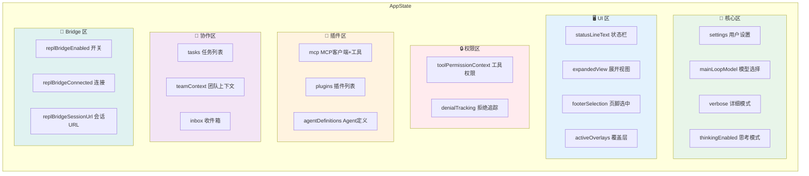
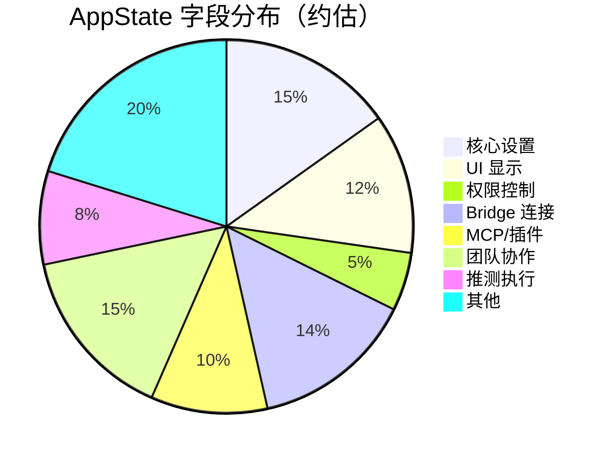

# 第 3 课：AppState 500+ 字段的组织之道

> 🎯 本课揭秘 Claude Code 如何把几百个状态字段组织得井井有条。

---

## 学习目标

1. 理解 `AppState` 的整体结构和分域设计
2. 掌握 `DeepImmutable` 的作用和不可变数据原则
3. 学会 `getDefaultAppState()` 工厂函数的设计思路
4. 认识不同类型的状态字段（标量、对象、嵌套结构）
5. 理解为什么有些字段在 `DeepImmutable` 内，有些在外

---

## 一、先看全貌：AppState 有多大？

`state/AppStateStore.ts` 文件有 **570 行**，其中 `AppState` 类型定义约占 **380 行**。

**生活类比**：如果说一个普通 APP 的状态像一个三居室的家，Claude Code 的 `AppState` 就像一座 50 层的写字楼——每一层都有不同的部门和功能。

### 状态分域总览



---

## 二、DeepImmutable：状态的"只读护甲"

### 2.1 为什么需要不可变性？

```typescript
// ❌ 危险操作：直接修改状态
const state = store.getState()
state.verbose = true  // 绕过了 setState！没有人被通知！

// ✅ 正确操作：通过 setState 产生新状态
store.setState(prev => ({ ...prev, verbose: true }))
```

`DeepImmutable` 就是在 TypeScript 层面阻止第一种写法：

```typescript
// 源码中的定义方式
export type AppState = DeepImmutable<{
  settings: SettingsJson
  verbose: boolean
  // ...
}>
```

`DeepImmutable<T>` 会递归地把所有属性变成 `readonly`，让 TypeScript 编译器在你试图直接修改时报错。

### 2.2 哪些在 DeepImmutable 里，哪些在外？

```typescript
// 源码结构（简化）
export type AppState = DeepImmutable<{
  // 这些是"纯数据"——可以安全冻结
  settings: SettingsJson
  verbose: boolean
  mainLoopModel: ModelSetting
  thinkingEnabled: boolean | undefined
  // ... 100+ 字段
}> & {
  // 这些包含函数类型或可变引用——不适合 DeepImmutable
  tasks: { [taskId: string]: TaskState }       // TaskState 包含函数
  agentNameRegistry: Map<string, AgentId>      // Map 是可变的
  mcp: { clients: MCPServerConnection[]; ... } // 包含复杂对象
  replContext?: { vmContext: import('vm').Context; ... }  // VM 上下文
}
```

**为什么分开？**

| 在 DeepImmutable 内 | 在 DeepImmutable 外 |
|---------------------|---------------------|
| 纯数据（string, number, boolean） | 包含函数的类型（TaskState） |
| 可以安全冻结 | 运行时需要调用方法 |
| 占大多数字段 | 少数特殊字段 |

---

## 三、字段分域详解

### 3.1 核心设置区

```typescript
// 来自源码 AppStateStore.ts
settings: SettingsJson           // 用户的 settings.json 配置
verbose: boolean                 // 是否启用详细输出
mainLoopModel: ModelSetting      // 当前使用的 AI 模型
mainLoopModelForSession: ModelSetting  // 本次会话的模型（覆盖）
thinkingEnabled: boolean | undefined   // 是否启用深度思考
effortValue?: EffortValue        // 推理努力程度
fastMode?: boolean               // 快速模式
```

**设计亮点**：注意 `mainLoopModel` 和 `mainLoopModelForSession` 的区分——一个是持久的（写入配置文件），一个只在当前会话有效。这种"全局 vs 会话"的分层在 Claude Code 中很常见。

### 3.2 UI 显示区

```typescript
statusLineText: string | undefined   // 底部状态栏文字
expandedView: 'none' | 'tasks' | 'teammates'  // 展开的面板
isBriefOnly: boolean                 // 是否简洁模式
footerSelection: FooterItem | null   // 底部栏焦点
activeOverlays: ReadonlySet<string>  // 活跃的弹出层
coordinatorTaskIndex: number         // 任务面板选中索引
viewSelectionMode: 'none' | 'selecting-agent' | 'viewing-agent'
```

**设计亮点**：`expandedView` 使用联合类型 `'none' | 'tasks' | 'teammates'` 而不是多个 boolean，避免了"同时展开两个面板"的非法状态。

### 3.3 Bridge 连接区（一整组相关字段）

```typescript
// 源码中 replBridge* 系列字段（共 14 个！）
replBridgeEnabled: boolean        // 是否启用
replBridgeExplicit: boolean       // 是否通过命令显式启用
replBridgeOutboundOnly: boolean   // 是否仅单向
replBridgeConnected: boolean      // 是否已连接
replBridgeSessionActive: boolean  // 会话是否活跃
replBridgeReconnecting: boolean   // 是否正在重连
replBridgeConnectUrl: string | undefined   // 连接 URL
replBridgeSessionUrl: string | undefined   // 会话 URL
replBridgeEnvironmentId: string | undefined
replBridgeSessionId: string | undefined
replBridgeError: string | undefined
replBridgeInitialName: string | undefined
showRemoteCallout: boolean        // 是否显示远程提示
replBridgePermissionCallbacks?: BridgePermissionCallbacks
```

> 💡 **思考**：这 14 个字段都以 `replBridge` 开头，形成一个命名空间。为什么不把它们放进一个嵌套对象 `replBridge: { enabled, connected, ... }` 呢？这是一个设计取舍——扁平结构让 `onChange` 中的字段比较更简单（`newState.replBridgeConnected !== oldState.replBridgeConnected`），而嵌套结构需要先解构。

### 3.4 复杂嵌套区

有些字段本身就是复杂的嵌套结构：

```typescript
// MCP 插件系统状态
mcp: {
  clients: MCPServerConnection[]
  tools: Tool[]
  commands: Command[]
  resources: Record<string, ServerResource[]>
  pluginReconnectKey: number
}

// 插件状态
plugins: {
  enabled: LoadedPlugin[]
  disabled: LoadedPlugin[]
  commands: Command[]
  errors: PluginError[]
  installationStatus: {
    marketplaces: Array<{ name: string; status: 'pending' | 'installing' | ... }>
    plugins: Array<{ id: string; name: string; status: ... }>
  }
  needsRefresh: boolean
}
```

---

## 四、getDefaultAppState()：工厂函数

### 4.1 为什么需要工厂函数？

```typescript
// ❌ 不好的做法：共享默认值对象
const DEFAULT_STATE = { tasks: {}, mcp: { clients: [] } }
// 所有 Store 实例共享同一个 clients 数组——修改一个影响所有！

// ✅ 好的做法：每次创建新的对象
function getDefaultAppState(): AppState {
  return {
    tasks: {},                    // 每次都是新对象
    mcp: { clients: [], ... },    // 每次都是新数组
    // ...
  }
}
```

### 4.2 源码中的初始化逻辑

```typescript
// 源码文件：state/AppStateStore.ts
export function getDefaultAppState(): AppState {
  return {
    settings: getInitialSettings(),     // 从配置文件读取
    tasks: {},
    agentNameRegistry: new Map(),       // 新的 Map 实例
    verbose: false,
    mainLoopModel: null,
    mainLoopModelForSession: null,
    toolPermissionContext: {
      ...getEmptyToolPermissionContext(),
      mode: initialMode,                // 动态计算初始模式
    },
    mcp: {
      clients: [],
      tools: [],
      commands: [],
      resources: {},
      pluginReconnectKey: 0,
    },
    fileHistory: {
      snapshots: [],
      trackedFiles: new Set(),          // 新的 Set 实例
      snapshotSequence: 0,
    },
    thinkingEnabled: shouldEnableThinkingByDefault(),  // 动态计算
    promptSuggestionEnabled: shouldEnablePromptSuggestion(),
    sessionHooks: new Map(),
    // ... 还有更多
  }
}
```

**三类初始值：**

| 类型 | 举例 | 特点 |
|------|------|------|
| 静态默认值 | `verbose: false` | 写死在代码里 |
| 动态计算值 | `thinkingEnabled: shouldEnableThinkingByDefault()` | 根据环境决定 |
| 从配置读取 | `settings: getInitialSettings()` | 从文件加载 |

---

## 五、类型系统的组合式定义

### CompletionBoundary —— 联合类型实战

```typescript
// 源码：state/AppStateStore.ts
export type CompletionBoundary =
  | { type: 'complete'; completedAt: number; outputTokens: number }
  | { type: 'bash'; command: string; completedAt: number }
  | { type: 'edit'; toolName: string; filePath: string; completedAt: number }
  | { type: 'denied_tool'; toolName: string; detail: string; completedAt: number }
```

**生活类比**：这就像快递的签收状态——可能是"已签收"、"已放代收点"、"已退回"，每种状态携带不同的附加信息。

### SpeculationState —— 状态机类型

```typescript
export type SpeculationState =
  | { status: 'idle' }
  | {
      status: 'active'
      id: string
      abort: () => void
      startTime: number
      messagesRef: { current: Message[] }
      // ... 更多字段
    }
```

`idle` 状态只有一个字段，`active` 状态有十几个字段。TypeScript 的可辨识联合（Discriminated Union）让你在判断 `status === 'active'` 之后，自动获得所有 `active` 专属字段的类型提示。

---

## 六、字段数量统计



---

## 动手练习

### 练习 1：设计你的 AppState

假设你要做一个"在线聊天室"应用，设计一个 `AppState` 类型：

```typescript
type ChatAppState = {
  // 用户信息
  // 聊天室列表
  // 当前聊天室
  // 消息列表
  // 连接状态
  // UI 状态
}
```

### 练习 2：分析字段设计

看以下源码片段，回答问题：

```typescript
expandedView: 'none' | 'tasks' | 'teammates'
```

1. 为什么用联合字符串类型而不是 `expandedTasks: boolean; expandedTeammates: boolean`？
2. 如果以后要支持同时展开两个面板，这个设计需要怎么改？

### 练习 3：DeepImmutable 实验

```typescript
// 尝试理解 DeepImmutable 的行为
type MyState = DeepImmutable<{
  name: string
  scores: number[]
  config: { theme: string }
}>

// 以下哪些操作会被 TypeScript 阻止？
const s: MyState = { name: "test", scores: [1,2,3], config: { theme: "dark" } }
s.name = "new"           // ?
s.scores.push(4)         // ?
s.scores[0] = 99         // ?
s.config.theme = "light" // ?
```

---

## 本课小结

| 概念 | 解释 |
|------|------|
| 分域设计 | 把字段按功能分区（核心、UI、权限、插件、协作等） |
| DeepImmutable | 递归只读类型，防止直接修改状态 |
| 扁平 vs 嵌套 | Bridge 用扁平前缀、MCP 用嵌套对象——各有取舍 |
| 工厂函数 | `getDefaultAppState()` 每次返回新对象，避免共享引用 |
| 联合类型 | 用 `type` 字段区分不同状态，避免非法状态组合 |
| 动态初始化 | 部分字段根据环境、配置动态计算初始值 |

---

## 下节预告

状态变了之后，某些变更需要同步到外部系统（写配置文件、通知远端服务器等）。下一课我们将学习 `onChangeAppState` —— Claude Code 如何用一个函数收口所有副作用：

- 什么是副作用？为什么需要统一管理？
- `onChange` 回调如何做精准的差异检测？
- 从权限模式同步到模型设置保存——6 种副作用类型

👉 [第 4 课：副作用同步 —— onChangeAppState 收口设计 →](./04-side-effects.md)
