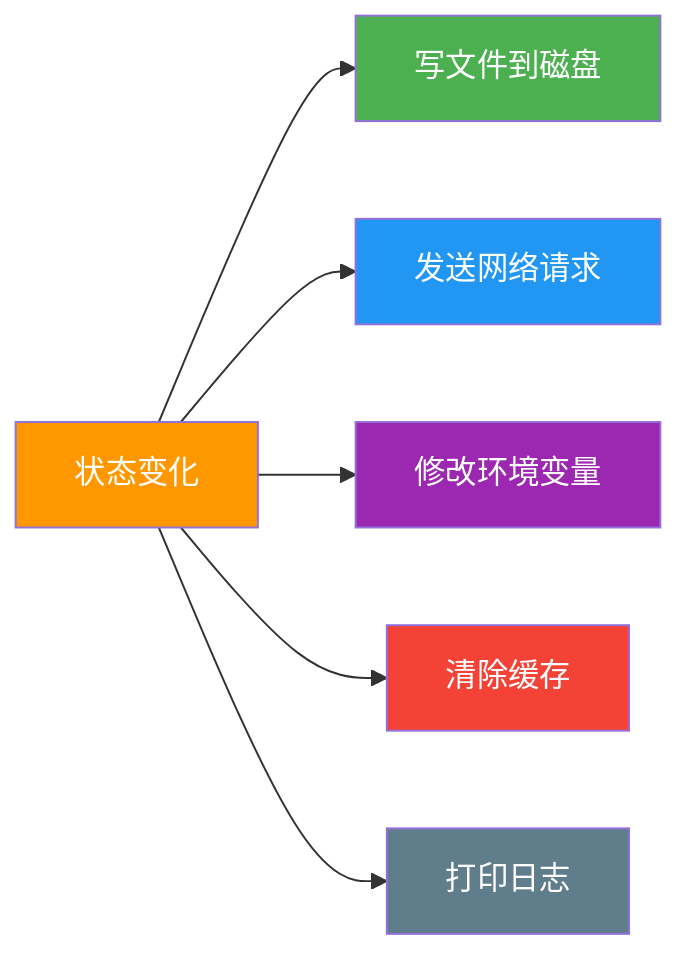
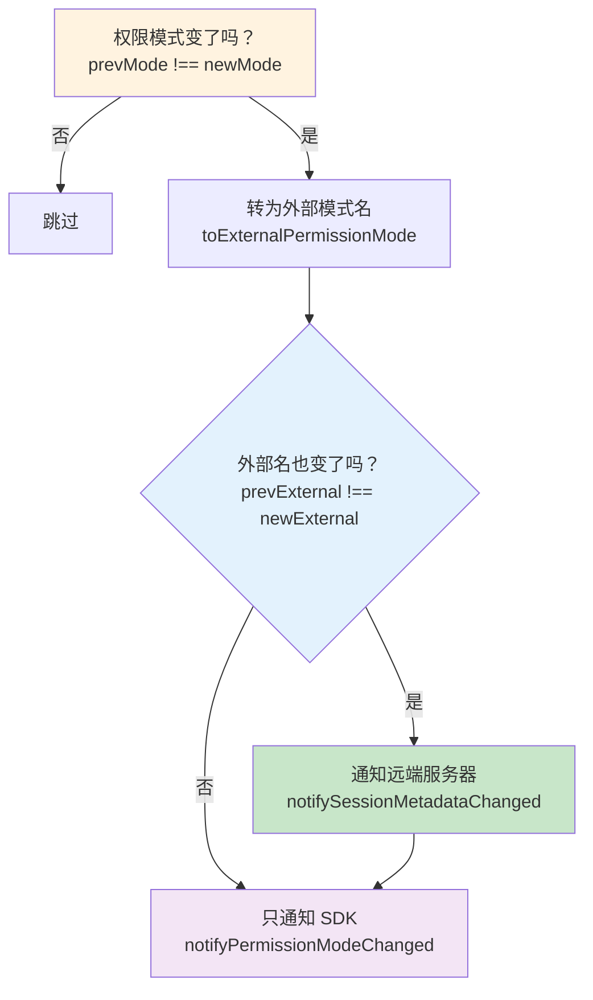
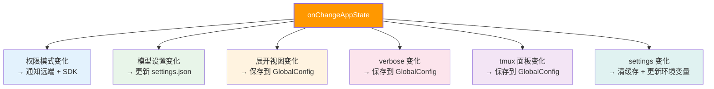
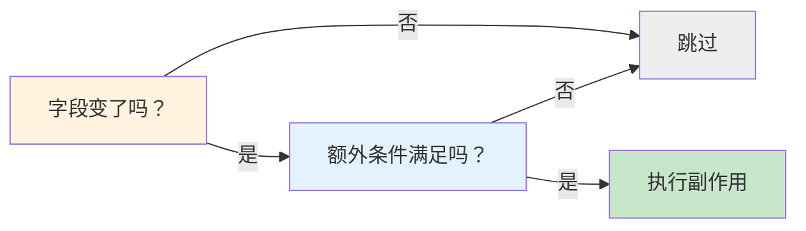

# 第 4 课：副作用同步 —— onChangeAppState 收口设计

> 🎯 本课揭秘 Claude Code 如何用一个函数统一管理所有"状态变了就要做的事"。

---

## 学习目标

1. 理解什么是"副作用"，以及为什么需要统一管理
2. 掌握 `onChangeAppState` 的差异检测模式
3. 学会分析每种副作用的触发条件和执行逻辑
4. 理解"收口"设计的优势——对比分散式副作用的痛点
5. 认识 `externalMetadataToAppState` 的逆向同步

---

## 一、什么是副作用？

### 生活类比：温度计和空调

你家里有一个恒温器：

- **状态变化**：室温从 25°C 降到 20°C
- **副作用**：恒温器自动打开暖气

"打开暖气"就是一个**副作用**——它是由状态变化**自动触发**的、在状态管理系统**之外**发生的操作。

在编程中，副作用包括：



### 核心问题：副作用放哪里？

```
❌ 分散式：每个修改状态的地方各自处理副作用
   setAppState(prev => ({ ...prev, verbose: true }))
   saveGlobalConfig({ verbose: true })   // 每个调用方自己写
   // 问题：容易漏掉！有 8 个地方改权限模式，只有 2 个通知了远端

✅ 收口式：所有副作用集中在 onChange 回调中
   setAppState(prev => ({ ...prev, verbose: true }))
   // onChange 自动检测到 verbose 变了，自动保存配置
```

---

## 二、onChange 是怎么连上 Store 的？

回顾第 2 课的 `createStore`：

```typescript
// state/store.ts
export function createStore<T>(
  initialState: T,
  onChange?: OnChange<T>,  // ← 就是这个参数
): Store<T> {
  // ...
  setState: (updater) => {
    // ...
    onChange?.({ newState: next, oldState: prev })  // ← 每次状态变化都调用
  }
}
```

在应用启动时，Claude Code 这样创建 Store：

```typescript
// 概念上的使用方式
const appStore = createStore(
  getDefaultAppState(),
  onChangeAppState  // ← 传入副作用处理函数
)
```

---

## 三、onChangeAppState 源码逐段解析

### 3.1 函数签名

```typescript
// 源码文件：state/onChangeAppState.ts
export function onChangeAppState({
  newState,
  oldState,
}: {
  newState: AppState
  oldState: AppState
}) {
```

接收新旧两个完整的 `AppState`，通过比较它们的差异来决定执行哪些副作用。

### 3.2 副作用 #1：权限模式同步

这是最复杂的一个副作用，让我们仔细看：

```typescript
// 源码文件：state/onChangeAppState.ts 第 50-92 行
const prevMode = oldState.toolPermissionContext.mode
const newMode = newState.toolPermissionContext.mode
if (prevMode !== newMode) {
  const prevExternal = toExternalPermissionMode(prevMode)
  const newExternal = toExternalPermissionMode(newMode)
  if (prevExternal !== newExternal) {
    const isUltraplan =
      newExternal === 'plan' &&
      newState.isUltraplanMode &&
      !oldState.isUltraplanMode
        ? true
        : null
    notifySessionMetadataChanged({
      permission_mode: newExternal,
      is_ultraplan_mode: isUltraplan,
    })
  }
  notifyPermissionModeChanged(newMode)
}
```

**流程图**：



**源码注释翻译**：

> 在这个代码块之前，权限模式变更只在 8+ 个修改路径中的 2 个通知了远端（CCR）。Shift+Tab 切换、ExitPlanMode 对话框、/plan 命令、rewind、REPL bridge 等路径都在改 AppState 但没告诉 CCR，导致远端状态过时。
>
> 在 onChange 里钩住差异意味着**任何** `setAppState` 调用只要改了模式就会自动通知，散布在各处的调用方不需要做任何改动。

这就是**收口设计**的核心价值：

```mermaid
graph TB
    subgraph "之前：分散式（有 Bug）"
        direction LR
        M1[Shift+Tab 切换] --> |"❌ 忘记通知远端"| X1[Bug!]
        M2[/plan 命令] --> |"❌ 忘记通知远端"| X2[Bug!]
        M3[set_permission_mode] --> |"✅ 通知了"| OK1[OK]
        M4[print.ts] --> |"✅ 通知了"| OK2[OK]
        M5[ExitPlanMode] --> |"❌ 忘记通知远端"| X3[Bug!]
    end

    subgraph "现在：收口式（无 Bug）"
        direction LR
        N1[任何地方 setState] --> OC[onChangeAppState]
        OC --> |"自动检测并通知"| Y1[永远正确]
    end

    style X1 fill:#ffcdd2
    style X2 fill:#ffcdd2
    style X3 fill:#ffcdd2
    style Y1 fill:#c8e6c9
```

### 3.3 副作用 #2：模型设置保存

```typescript
// 源码：删除模型设置
if (
  newState.mainLoopModel !== oldState.mainLoopModel &&
  newState.mainLoopModel === null
) {
  updateSettingsForSource('userSettings', { model: undefined })
  setMainLoopModelOverride(null)
}

// 源码：保存模型设置
if (
  newState.mainLoopModel !== oldState.mainLoopModel &&
  newState.mainLoopModel !== null
) {
  updateSettingsForSource('userSettings', { model: newState.mainLoopModel })
  setMainLoopModelOverride(newState.mainLoopModel)
}
```

**两步差异检测**：先判断"变了没"，再判断"变成了什么"。

### 3.4 副作用 #3：展开视图持久化

```typescript
// 源码：expandedView 变化时保存到 GlobalConfig
if (newState.expandedView !== oldState.expandedView) {
  const showExpandedTodos = newState.expandedView === 'tasks'
  const showSpinnerTree = newState.expandedView === 'teammates'
  if (
    getGlobalConfig().showExpandedTodos !== showExpandedTodos ||
    getGlobalConfig().showSpinnerTree !== showSpinnerTree
  ) {
    saveGlobalConfig(current => ({
      ...current,
      showExpandedTodos,
      showSpinnerTree,
    }))
  }
}
```

注意**双重检查**：先检查 AppState 有没有变，再检查 GlobalConfig 是否已经是最新值，避免无意义的磁盘写入。

### 3.5 副作用 #4：verbose 模式保存

```typescript
if (
  newState.verbose !== oldState.verbose &&
  getGlobalConfig().verbose !== newState.verbose
) {
  const verbose = newState.verbose
  saveGlobalConfig(current => ({
    ...current,
    verbose,
  }))
}
```

同样的双重检查模式：State 变了 **并且** Config 还没更新 → 才写磁盘。

### 3.6 副作用 #5：设置变更时清缓存

```typescript
// 源码：settings 整体变化时清除鉴权缓存
if (newState.settings !== oldState.settings) {
  try {
    clearApiKeyHelperCache()
    clearAwsCredentialsCache()
    clearGcpCredentialsCache()

    if (newState.settings.env !== oldState.settings.env) {
      applyConfigEnvironmentVariables()
    }
  } catch (error) {
    logError(toError(error))
  }
}
```

**注意**：这段代码被 `try/catch` 包裹——副作用失败不应该影响状态管理的主流程。

---

## 四、副作用的完整清单



---

## 五、逆向同步：externalMetadataToAppState

有时候，变更从**外部**传入（比如远端服务器告诉本地"用户在 web 端切换了权限模式"）。Claude Code 用一个"逆向转换器"来处理：

```typescript
// 源码：state/onChangeAppState.ts
export function externalMetadataToAppState(
  metadata: SessionExternalMetadata,
): (prev: AppState) => AppState {
  return prev => ({
    ...prev,
    ...(typeof metadata.permission_mode === 'string'
      ? {
          toolPermissionContext: {
            ...prev.toolPermissionContext,
            mode: permissionModeFromString(metadata.permission_mode),
          },
        }
      : {}),
    ...(typeof metadata.is_ultraplan_mode === 'boolean'
      ? { isUltraplanMode: metadata.is_ultraplan_mode }
      : {}),
  })
}
```

**设计亮点**：这个函数返回一个 `(prev: AppState) => AppState`——正好是 `setState` 需要的 updater 格式！可以直接这样用：

```typescript
store.setState(externalMetadataToAppState(metadata))
```

---

## 六、设计模式总结

### 收口模式的检查清单

每个副作用遵循统一的模式：

```typescript
// 模板
if (newState.XXX !== oldState.XXX) {    // ① 字段变了吗？
  if (/* 额外条件 */) {                 // ② 需要进一步筛选？
    doSideEffect(newState.XXX)           // ③ 执行副作用
  }
}
```



---

## 动手练习

### 练习 1：设计你的 onChange

假设你有一个 `TodoApp` 的 Store：

```typescript
type TodoState = {
  todos: Todo[]
  filter: 'all' | 'active' | 'completed'
  theme: 'light' | 'dark'
}
```

写一个 `onChangeTodoState` 函数，实现：
- `theme` 变化时保存到 `localStorage`
- `todos` 变化时自动保存到服务器
- `filter` 变化时不做任何副作用

### 练习 2：找出分散式的 Bug

以下代码有什么问题？

```typescript
// 路径 A：手动切换模式
function switchMode(newMode: string) {
  store.setState(prev => ({ ...prev, mode: newMode }))
  notifyServer(newMode)  // ✅ 记得通知了
}

// 路径 B：快捷键切换
function onShortcutPressed() {
  store.setState(prev => ({
    ...prev,
    mode: prev.mode === 'plan' ? 'default' : 'plan'
  }))
  // ❌ 忘记通知服务器了！
}
```

如何用收口模式修复？

### 练习 3：阅读源码

打开 `state/onChangeAppState.ts`，回答：

1. 一共有几个 `if (newState.XXX !== oldState.XXX)` 检查？
2. 哪些副作用写入了 `GlobalConfig`？哪些发了网络请求？
3. 为什么 `tungstenPanelVisible` 的副作用前面有 `process.env.USER_TYPE === 'ant'` 的检查？

---

## 本课小结

| 概念 | 解释 |
|------|------|
| 副作用 | 状态变化自动触发的外部操作（写文件、发请求、清缓存） |
| 收口设计 | 所有副作用集中在 onChange 一个函数中处理 |
| 差异检测 | 比较 newState 和 oldState 的具体字段来决定触发 |
| 双重检查 | 先检查 AppState 变没变，再检查目标是否需要更新 |
| 逆向同步 | externalMetadataToAppState 将外部变更转为状态更新器 |
| 容错设计 | 副作用用 try/catch 包裹，不影响主流程 |

---

## 下节预告

到目前为止我们学习了内存中的状态管理。但当程序关闭后，所有内存状态都会消失。下一课我们将进入**持久化**的世界——Memdir 记忆系统：

- Claude Code 如何"记住"用户的偏好和习惯？
- 基于文件系统的长期记忆是怎么设计的？
- `~/.claude/projects/.../ memory/` 目录里到底存了什么？

👉 [第 5 课：Memdir 记忆魔法 →](./05-memdir-memory.md)
