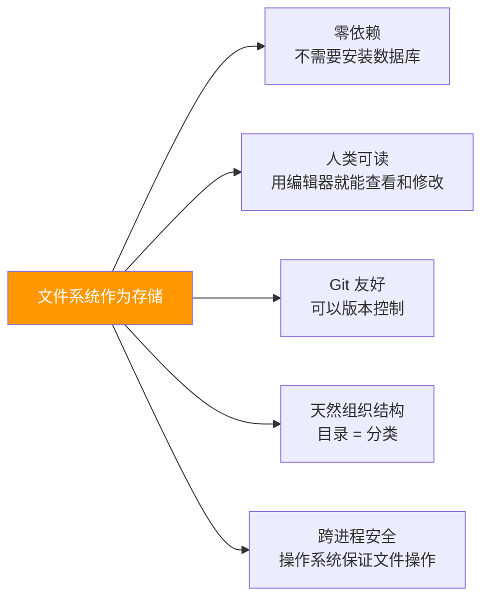
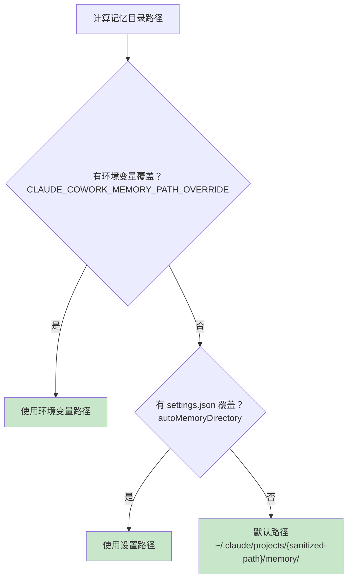
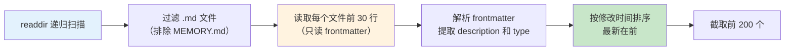
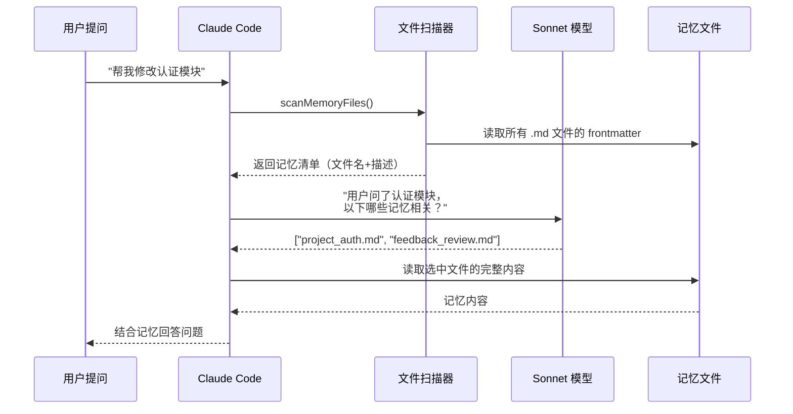

# 第 5 课：Memdir 记忆魔法 —— 基于文件系统的长期记忆

> 🎯 本课探索 Claude Code 如何利用文件系统让 AI 拥有"跨会话记忆"。

---

## 学习目标

1. 理解 Memdir 的设计理念——为什么选择文件系统而非数据库
2. 掌握记忆目录的路径计算和文件组织方式
3. 学会 `MEMORY.md` 入口文件的索引机制
4. 了解记忆的扫描、截断和新鲜度管理
5. 理解 `findRelevantMemories` 的智能召回流程

---

## 一、为什么 AI 需要"记忆"？

### 生活类比：每次看医生都要重新介绍自己

想象你去一个诊所，每次都遇到不同的医生：

- 你：我之前做过 X 手术……
- 医生：哦？你的病历上没写，再说一次？

如果医生有你的完整病历，你就不用每次都重复了。

**Claude Code 的记忆系统就是给 AI 建立的"病历本"**——让它记住用户偏好、项目上下文和工作反馈，下次对话时不需要从零开始。

---

## 二、为什么用文件系统？

| 方案 | 优点 | 缺点 |
|------|------|------|
| 数据库 (SQLite) | 查询快、结构化 | 需要额外依赖、迁移复杂 |
| 内存 (Map) | 最快 | 进程结束就没了 |
| **文件系统** ✅ | 零依赖、人类可读、git 友好 | 扫描慢（但记忆文件不多） |

Claude Code 选择文件系统的原因：



---

## 三、记忆目录在哪里？

### 3.1 路径计算

```typescript
// 源码文件：memdir/paths.ts
export const getAutoMemPath = memoize(
  (): string => {
    const override = getAutoMemPathOverride() ?? getAutoMemPathSetting()
    if (override) {
      return override
    }
    const projectsDir = join(getMemoryBaseDir(), 'projects')
    return (
      join(projectsDir, sanitizePath(getAutoMemBase()), AUTO_MEM_DIRNAME) + sep
    ).normalize('NFC')
  },
  () => getProjectRoot(),
)
```

**路径解析优先级**：



**默认路径示例**：

```
~/.claude/
  └── projects/
      └── Users-alice-myproject/    ← sanitizePath('/Users/alice/myproject')
          └── memory/               ← 记忆文件都在这里
              ├── MEMORY.md         ← 入口索引
              ├── user_role.md      ← 用户角色记忆
              ├── feedback_testing.md ← 反馈记忆
              └── project_auth.md   ← 项目记忆
```

### 3.2 Git 仓库共享记忆

```typescript
// 源码：memdir/paths.ts
function getAutoMemBase(): string {
  return findCanonicalGitRoot(getProjectRoot()) ?? getProjectRoot()
}
```

**亮点**：如果你有多个 git worktree（同一个仓库的不同工作目录），它们会共享同一个记忆目录！因为 `findCanonicalGitRoot` 会找到它们共同的 git 根。

### 3.3 安全验证

```typescript
// 源码：memdir/paths.ts（路径验证）
function validateMemoryPath(raw: string | undefined, expandTilde: boolean): string | undefined {
  // 拒绝相对路径、根路径、UNC 路径、包含空字节的路径
  if (
    !isAbsolute(normalized) ||
    normalized.length < 3 ||
    /^[A-Za-z]:$/.test(normalized) ||
    normalized.startsWith('\\\\') ||
    normalized.startsWith('//') ||
    normalized.includes('\0')
  ) {
    return undefined
  }
  return (normalized + sep).normalize('NFC')
}
```

> 🔒 **安全设计**：恶意仓库的 `.claude/settings.json` 不能设置 `autoMemoryDirectory: "~/.ssh"` 来偷看你的 SSH 密钥——`projectSettings` 来源被排除在外。

---

## 四、MEMORY.md —— 记忆索引

### 4.1 角色定位

`MEMORY.md` 不存储实际记忆内容，而是一个**索引目录**：

```markdown
<!-- MEMORY.md 示例 -->
- [用户角色](user_role.md) — 高级后端工程师，偏好函数式编程
- [代码审查偏好](feedback_review.md) — 不要自动提交，先让用户看 diff
- [项目背景](project_auth.md) — 正在重写认证中间件，合规驱动
```

### 4.2 截断保护

当 `MEMORY.md` 太长时，Claude Code 会自动截断：

```typescript
// 源码文件：memdir/memdir.ts
export const MAX_ENTRYPOINT_LINES = 200
export const MAX_ENTRYPOINT_BYTES = 25_000

export function truncateEntrypointContent(raw: string): EntrypointTruncation {
  const contentLines = trimmed.split('\n')
  const wasLineTruncated = lineCount > MAX_ENTRYPOINT_LINES
  const wasByteTruncated = byteCount > MAX_ENTRYPOINT_BYTES

  if (!wasLineTruncated && !wasByteTruncated) {
    return { content: trimmed, lineCount, byteCount, wasLineTruncated, wasByteTruncated }
  }

  // 先按行截断
  let truncated = wasLineTruncated
    ? contentLines.slice(0, MAX_ENTRYPOINT_LINES).join('\n')
    : trimmed

  // 再按字节截断（在换行符处切，不切断行中间）
  if (truncated.length > MAX_ENTRYPOINT_BYTES) {
    const cutAt = truncated.lastIndexOf('\n', MAX_ENTRYPOINT_BYTES)
    truncated = truncated.slice(0, cutAt > 0 ? cutAt : MAX_ENTRYPOINT_BYTES)
  }

  return {
    content: truncated + `\n\n> WARNING: MEMORY.md is ${reason}...`,
    // ...
  }
}
```

**双重限制**：200 行 **且** 25KB。先按行切，再按字节切——在换行符处切断，不会把一行切成两半。

---

## 五、记忆的扫描与读取

### 5.1 scanMemoryFiles —— 扫描所有记忆文件

```typescript
// 源码文件：memdir/memoryScan.ts
export async function scanMemoryFiles(
  memoryDir: string,
  signal: AbortSignal,
): Promise<MemoryHeader[]> {
  const entries = await readdir(memoryDir, { recursive: true })
  const mdFiles = entries.filter(
    f => f.endsWith('.md') && basename(f) !== 'MEMORY.md',
  )

  const headerResults = await Promise.allSettled(
    mdFiles.map(async (relativePath): Promise<MemoryHeader> => {
      const filePath = join(memoryDir, relativePath)
      const { content, mtimeMs } = await readFileInRange(
        filePath, 0, FRONTMATTER_MAX_LINES, undefined, signal,
      )
      const { frontmatter } = parseFrontmatter(content, filePath)
      return {
        filename: relativePath,
        filePath,
        mtimeMs,
        description: frontmatter.description || null,
        type: parseMemoryType(frontmatter.type),
      }
    }),
  )

  return headerResults
    .filter(r => r.status === 'fulfilled')
    .map(r => r.value)
    .sort((a, b) => b.mtimeMs - a.mtimeMs)  // 最新的排前面
    .slice(0, MAX_MEMORY_FILES)               // 最多 200 个
}
```

**设计亮点**：



- 只读每个文件的前 30 行（frontmatter），不读全部内容——性能优化
- 用 `Promise.allSettled` 而非 `Promise.all`——一个文件读取失败不影响其他
- 上限 200 个文件——防止记忆目录过大

### 5.2 记忆文件的格式

每个记忆文件使用 YAML frontmatter：

```markdown
---
name: 用户角色
description: 用户是高级后端工程师，偏好函数式编程风格
type: user
---

用户在 Anthropic 工作，主要使用 TypeScript 和 Go。
偏好函数式编程风格，喜欢用 map/filter/reduce。
不喜欢 OOP 的深继承。
```

---

## 六、智能召回：findRelevantMemories

每次用户提问时，Claude Code 会调用 Sonnet 模型来选择最相关的记忆文件：

```typescript
// 源码文件：memdir/findRelevantMemories.ts
export async function findRelevantMemories(
  query: string,
  memoryDir: string,
  signal: AbortSignal,
  recentTools: readonly string[] = [],
  alreadySurfaced: ReadonlySet<string> = new Set(),
): Promise<RelevantMemory[]> {
  const memories = (await scanMemoryFiles(memoryDir, signal))
    .filter(m => !alreadySurfaced.has(m.filePath))

  if (memories.length === 0) return []

  const selectedFilenames = await selectRelevantMemories(
    query, memories, signal, recentTools,
  )
  // ...
}
```

**召回流程**：



**选择器的 prompt**：

```typescript
const SELECT_MEMORIES_SYSTEM_PROMPT = `You are selecting memories that will be useful...
Return a list of filenames for the memories that will clearly be useful (up to 5).
Only include memories that you are certain will be helpful...`
```

---

## 七、记忆新鲜度管理

时间会让记忆变得不可靠。Claude Code 有一套新鲜度系统：

```typescript
// 源码文件：memdir/memoryAge.ts
export function memoryAgeDays(mtimeMs: number): number {
  return Math.max(0, Math.floor((Date.now() - mtimeMs) / 86_400_000))
}

export function memoryAge(mtimeMs: number): string {
  const d = memoryAgeDays(mtimeMs)
  if (d === 0) return 'today'
  if (d === 1) return 'yesterday'
  return `${d} days ago`
}

export function memoryFreshnessText(mtimeMs: number): string {
  const d = memoryAgeDays(mtimeMs)
  if (d <= 1) return ''
  return (
    `This memory is ${d} days old. ` +
    `Memories are point-in-time observations, not live state — ` +
    `claims about code behavior or file:line citations may be outdated. ` +
    `Verify against current code before asserting as fact.`
  )
}
```

**为什么用 "47 days ago" 而不是 ISO 时间戳？** 源码注释说得好：

> Models are poor at date arithmetic — a raw ISO timestamp doesn't trigger staleness reasoning the way "47 days ago" does.

AI 不擅长计算日期差，但 "47天前" 能直接触发"这可能过时了"的推理。

---

## 八、目录自动创建

```typescript
// 源码文件：memdir/memdir.ts
export async function ensureMemoryDirExists(memoryDir: string): Promise<void> {
  const fs = getFsImplementation()
  try {
    await fs.mkdir(memoryDir)  // 递归创建，已存在不报错
  } catch (e) {
    logForDebugging(`ensureMemoryDirExists failed: ${code ?? String(e)}`)
  }
}
```

系统提示中还会告诉 AI：

```typescript
export const DIR_EXISTS_GUIDANCE =
  'This directory already exists — write to it directly with the Write tool ' +
  '(do not run mkdir or check for its existence).'
```

**为什么需要这个提示？** 因为 AI 经常浪费一个步骤去 `ls` 或 `mkdir -p`，提前告诉它"目录已经存在"可以节省一个工具调用。

---

## 动手练习

### 练习 1：模拟记忆目录结构

在你的电脑上创建一个类似的记忆目录结构：

```bash
mkdir -p ~/test-memory/
touch ~/test-memory/MEMORY.md
touch ~/test-memory/user_role.md
touch ~/test-memory/feedback_style.md
```

在 `MEMORY.md` 中写一个索引，在各文件中写 frontmatter。

### 练习 2：思考题

1. 为什么 `scanMemoryFiles` 只读取每个文件的前 30 行？如果一个记忆文件有 1000 行怎么办？
2. 如果两个 git worktree 的 Claude Code 同时写同一个记忆文件，会发生什么？
3. 为什么 `MEMORY.md` 有 200 行/25KB 的限制？如果不限制会怎样？

### 练习 3：设计改进

如果你来设计记忆系统，你会做哪些不同的选择？

- 搜索方式：全文搜索 vs 向量搜索 vs 关键字匹配？
- 存储格式：Markdown vs JSON vs SQLite？
- 过期策略：自动删除 vs 手动管理 vs 标记为过时？

---

## 本课小结

| 概念 | 解释 |
|------|------|
| Memdir | 基于文件系统的持久化记忆目录 |
| MEMORY.md | 记忆索引文件，每行一个指针，不超过 200 行 |
| Frontmatter | 记忆文件头部的 YAML 元数据（name, description, type） |
| scanMemoryFiles | 扫描目录，只读 frontmatter，按时间排序 |
| findRelevantMemories | 用 Sonnet 模型从记忆清单中选择最相关的（≤5个） |
| memoryAge | 人类可读的新鲜度标签，帮助 AI 判断记忆是否过时 |
| 路径安全 | 拒绝危险路径，projectSettings 不能覆盖记忆目录 |

---

## 下节预告

我们知道记忆有不同类型（user、feedback、project、reference），下一课将深入每种类型的含义和使用场景：

- 四种记忆类型分别解决什么问题？
- 什么该存、什么不该存？
- 怎么判断一个记忆是"用户偏好"还是"项目上下文"？

👉 [第 6 课：四种记忆分类法详解 →](./06-memory-types.md)
