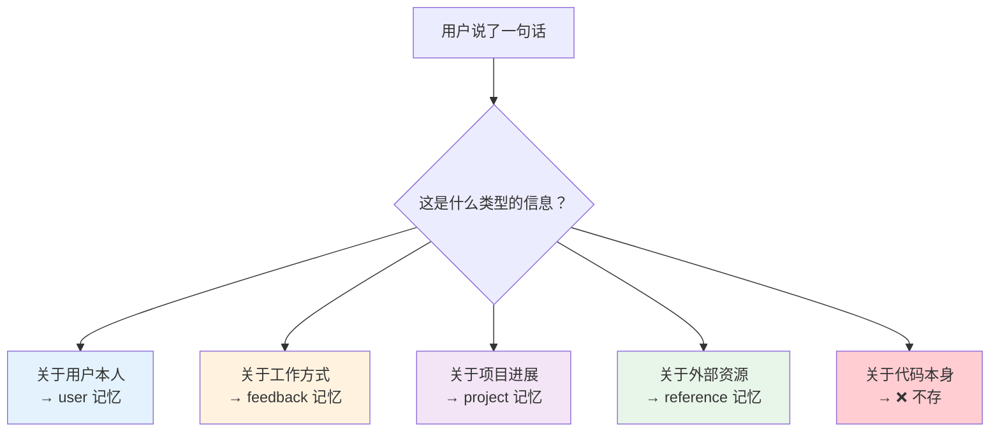
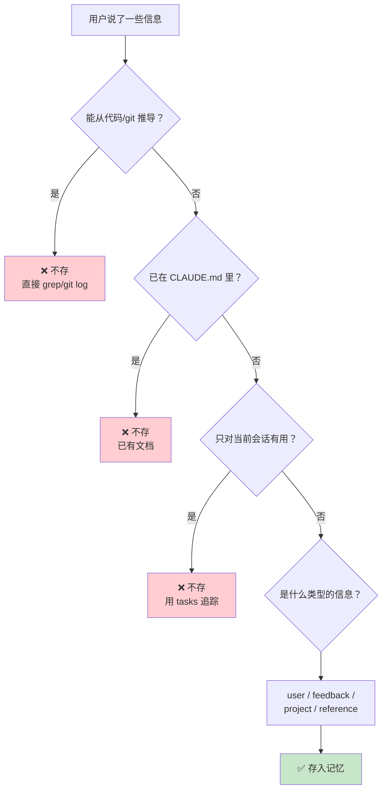

# 第 6 课：四种记忆分类法详解

> 🎯 本课深入解析 Claude Code 记忆系统的四种类型——让 AI 精准地记住该记的、忽略不该记的。

---

## 学习目标

1. 掌握四种记忆类型（user / feedback / project / reference）的定义和区别
2. 理解每种类型的"何时存"和"如何用"
3. 学会判断什么信息**不该**存为记忆
4. 了解 Frontmatter 格式的设计意义
5. 认识个人模式与团队模式的差异

---

## 一、为什么需要分类？

### 生活类比：图书馆的分类系统

如果图书馆把所有书堆在一起，不分类、不编号，你找一本书需要多久？

记忆也一样。Claude Code 每次对话可能产生很多值得记住的信息，但它们的用途完全不同：



---

## 二、四种类型定义

```typescript
// 源码文件：memdir/memoryTypes.ts
export const MEMORY_TYPES = [
  'user',
  'feedback',
  'project',
  'reference',
] as const

export type MemoryType = (typeof MEMORY_TYPES)[number]
```

只有这四种——简洁且完备。

---

## 三、类型 1：User（用户记忆）

### 定义

> 关于用户的角色、目标、职责和知识水平的信息。帮助 AI 根据用户的偏好和视角调整行为。

### 什么时候存？

当你了解到用户的身份、技能、偏好时。

### 源码中的例子

```typescript
// 源码文件：memdir/memoryTypes.ts（TYPES_SECTION_INDIVIDUAL）
// 示例 1：
// user: I'm a data scientist investigating what logging we have in place
// assistant: [saves user memory: user is a data scientist,
//            currently focused on observability/logging]

// 示例 2：
// user: I've been writing Go for ten years but this is my first
//       time touching the React side of this repo
// assistant: [saves user memory: deep Go expertise, new to React
//            — frame frontend explanations in terms of backend analogues]
```

### 实际记忆文件示例

```markdown
---
name: 用户技术背景
description: 用户是高级 Go 工程师，React 新手，需要用后端类比解释前端概念
type: user
---

- 10年 Go 经验，擅长并发和微服务
- 首次接触 React，不熟悉 hooks 和组件生命周期
- 解释前端概念时用后端类比效果最好
  - useState → 类似 Go 的 channel 状态管理
  - useEffect → 类似 goroutine 启动时的初始化
```

### 关键原则

> 目标是**帮助用户**。避免写可能被视为负面评价的记忆，或与工作无关的记忆。

---

## 四、类型 2：Feedback（反馈记忆）

### 定义

> 用户关于工作方式的指导——包括要避免什么和要继续做什么。

### 什么时候存？

- 用户**纠正**你时：「不要这样做」「别用 mock」
- 用户**确认**非显而易见的做法时：「对，就是这样」「完美」

### 源码中的例子

```typescript
// 源码文件：memdir/memoryTypes.ts（TYPES_SECTION_INDIVIDUAL）
// 纠正型：
// user: don't mock the database in these tests — we got burned last
//       quarter when mocked tests passed but the prod migration failed
// assistant: [saves feedback memory: integration tests must hit a real
//            database, not mocks. Reason: prior incident...]

// 确认型：
// user: yeah the single bundled PR was the right call here,
//       splitting this one would've just been churn
// assistant: [saves feedback memory: for refactors in this area,
//            user prefers one bundled PR over many small ones]
```

### 反馈记忆的结构

源码要求 feedback 记忆有特定结构：

```typescript
// 源码中的结构指导
'Lead with the rule itself, then a **Why:** line ' +
'and a **How to apply:** line. ' +
'Knowing *why* lets you judge edge cases instead of blindly following the rule.'
```

实际文件示例：

```markdown
---
name: 不要 mock 数据库
description: 集成测试必须使用真实数据库，不用 mock
type: feedback
---

集成测试必须使用真实数据库，不使用 mock。

**Why:** 上个季度 mock 测试通过了但生产环境迁移失败，mock 和真实数据库的行为不一致导致 bug 被掩盖。

**How to apply:** 在写测试时，即使 mock 看起来更简单，也要连接真实的测试数据库。
```

### 成功 + 失败都要记

```typescript
// 源码中的关键指导
'Record from failure AND success: if you only save corrections, ' +
'you will avoid past mistakes but drift away from approaches ' +
'the user has already validated, and may grow overly cautious.'
```

> 如果只记录用户的纠正（失败），AI 会变得过于谨慎——因为它记住了一堆"不要做"，但不知道什么是"请继续做"。

---

## 五、类型 3：Project（项目记忆）

### 定义

> 关于正在进行的工作、目标、计划、bug 或事件的信息，这些信息**不能从代码或 git 历史中推导出来**。

### 什么时候存？

当你了解到项目的背景、计划、期限、决策原因时。

### 源码中的例子

```typescript
// 源码：memdir/memoryTypes.ts
// user: we're freezing all non-critical merges after Thursday —
//       mobile team is cutting a release branch
// assistant: [saves project memory: merge freeze begins 2026-03-05
//            for mobile release cut]

// user: the reason we're ripping out the old auth middleware is that
//       legal flagged it for storing session tokens in a way that
//       doesn't meet the new compliance requirements
// assistant: [saves project memory: auth middleware rewrite is driven
//            by legal/compliance, not tech-debt cleanup]
```

### 日期转换规则

```typescript
// 源码中的指导
'Always convert relative dates in user messages to absolute dates ' +
'when saving (e.g., "Thursday" → "2026-03-05"), so the memory ' +
'remains interpretable after time passes.'
```

> 用户说"下周四"，记忆里必须写"2026-03-05"。因为三个月后再看到"下周四"就完全无法理解了。

---

## 六、类型 4：Reference（引用记忆）

### 定义

> 指向外部系统中信息位置的指针。让 AI 记住到哪里去找更新的信息。

### 什么时候存？

当你了解到外部系统（Jira、Slack、Grafana 等）的用途和位置时。

### 源码中的例子

```typescript
// 源码：memdir/memoryTypes.ts
// user: check the Linear project "INGEST" if you want context on
//       these tickets, that's where we track all pipeline bugs
// assistant: [saves reference memory: pipeline bugs are tracked
//            in Linear project "INGEST"]

// user: the Grafana board at grafana.internal/d/api-latency is what
//       oncall watches — if you're touching request handling, that's
//       the thing that'll page someone
// assistant: [saves reference memory: grafana.internal/d/api-latency
//            is the oncall latency dashboard]
```

---

## 七、什么不该存？

这是同样重要的一面。源码中明确列出了**不该存为记忆的内容**：

```typescript
// 源码文件：memdir/memoryTypes.ts
export const WHAT_NOT_TO_SAVE_SECTION: readonly string[] = [
  '## What NOT to save in memory',
  '',
  '- Code patterns, conventions, architecture, file paths, or project structure ' +
    '— these can be derived by reading the current project state.',
  '- Git history, recent changes, or who-changed-what — `git log` / `git blame` are authoritative.',
  '- Debugging solutions or fix recipes — the fix is in the code; the commit message has the context.',
  '- Anything already documented in CLAUDE.md files.',
  '- Ephemeral task details: in-progress work, temporary state, current conversation context.',
  '',
  'These exclusions apply even when the user explicitly asks you to save.',
]
```

### 判断决策树



### 即使用户要求也不存

```typescript
// 源码中的关键句子
'These exclusions apply even when the user explicitly asks you to save. ' +
'If they ask you to save a PR list or activity summary, ask what was ' +
'*surprising* or *non-obvious* about it — that is the part worth keeping.'
```

> 用户说"记住我今天提交的 PR 列表"→ AI 不应该照做，而应该问"这些 PR 中有什么值得记住的决策或意外？"

---

## 八、Frontmatter 格式

每个记忆文件都以 YAML frontmatter 开头：

```typescript
// 源码文件：memdir/memoryTypes.ts
export const MEMORY_FRONTMATTER_EXAMPLE: readonly string[] = [
  '```markdown',
  '---',
  'name: {{memory name}}',
  'description: {{one-line description — used to decide relevance...}}',
  `type: {{${MEMORY_TYPES.join(', ')}}}`,
  '---',
  '',
  '{{memory content}}',
  '```',
]
```

**为什么 description 这么重要？** 因为 `findRelevantMemories` 只读 frontmatter 的 description 来决定是否召回——好的 description 直接决定记忆能不能被找到。

### 解析逻辑

```typescript
// 源码文件：memdir/memoryTypes.ts
export function parseMemoryType(raw: unknown): MemoryType | undefined {
  if (typeof raw !== 'string') return undefined
  return MEMORY_TYPES.find(t => t === raw)
}
```

宽容解析：无效的 type 返回 `undefined` 而不是报错——老文件或手写文件照样能工作。

---

## 九、个人 vs 团队模式

Claude Code 有两套记忆指导文本：

| | 个人模式 (INDIVIDUAL) | 团队模式 (COMBINED) |
|---|---|---|
| 目录 | 一个 memory/ | memory/ + memory/team/ |
| 范围标记 | 无 `<scope>` | 有 `<scope>` 标签 |
| feedback 默认 | 全部个人 | 默认个人，除非是项目级规范 |
| project 默认 | 全部个人 | 偏向 team |

```typescript
// 个人模式标题
'There are several discrete types of memory that you can store:'

// 团队模式标题
'There are several discrete types of memory... ' +
'Each type below declares a <scope> of private, team, ' +
'or guidance for choosing between the two.'
```

---

## 十、记忆信任与验证

存了记忆不代表可以盲目信任。Claude Code 有一整套"使用前验证"的规则：

```typescript
// 源码文件：memdir/memoryTypes.ts（TRUSTING_RECALL_SECTION）
export const TRUSTING_RECALL_SECTION: readonly string[] = [
  '## Before recommending from memory',
  '',
  'A memory that names a specific function, file, or flag is a claim that ' +
  'it existed *when the memory was written*. It may have been renamed, ' +
  'removed, or never merged. Before recommending it:',
  '',
  '- If the memory names a file path: check the file exists.',
  '- If the memory names a function or flag: grep for it.',
  '- If the user is about to act on your recommendation, verify first.',
  '',
  '"The memory says X exists" is not the same as "X exists now."',
]
```

> 记忆说"X 存在"≠"X 现在存在"。

---

## 动手练习

### 练习 1：分类练习

以下信息应该存为哪种记忆类型？

| 信息 | 类型 |
|------|------|
| "我是前端实习生，今天第一天" | ? |
| "不要用 var，我们项目统一用 const/let" | ? |
| "下周三之前要完成支付模块重构" | ? |
| "API 文档在 Notion 的 Engineering 空间里" | ? |
| "这个函数在 src/utils/auth.ts 的第 42 行" | ? |
| "昨天的 PR 都合并了" | ? |

### 练习 2：写一个好的 feedback 记忆

用户说了这句话：

> "别在 PR 描述里写那么多废话，就列出改了什么、为什么改就行。上次那个 PR 描述写了一页纸，review 的人根本不想看。"

请按照 `rule → Why → How to apply` 的结构写一个 feedback 记忆文件。

### 练习 3：判断该不该存

以下用户请求，哪些应该存为记忆？

1. "记住：我们的 CI 流水线在 GitHub Actions"
2. "记住：这个 bug 是因为数组越界"
3. "记住：我喜欢用 tab 缩进而不是空格"
4. "记住：上周的代码改动列表"
5. "记住：测试要跑 `npm run test:integration`"

---

## 本课小结

| 类型 | 核心问题 | 存什么 | 不存什么 |
|------|---------|--------|---------|
| user | 用户是谁？ | 角色、技能、偏好 | 负面评价 |
| feedback | 怎么工作？ | 纠正+确认+原因 | 不含 Why 的规则 |
| project | 在做什么？ | 计划、期限、决策 | 可从 git 推导的 |
| reference | 去哪找？ | 外部系统链接 | 代码内的路径 |

**黄金法则**：不存能从代码推导的东西，即使用户要求也要追问"值得记的非显而易见的部分"。

---

## 下节预告

记忆是跨会话的长期存储，但会话本身的历史也需要保存。下一课我们将学习 Claude Code 的 History 系统——如何用缓冲写入和分级存储高效管理命令历史：

- `history.jsonl` 的追加写入模式
- 缓冲区和磁盘的双层读取
- 大段粘贴内容的哈希存储
- 会话隔离和去重

👉 [第 7 课：History 会话历史 →](./07-history.md)
