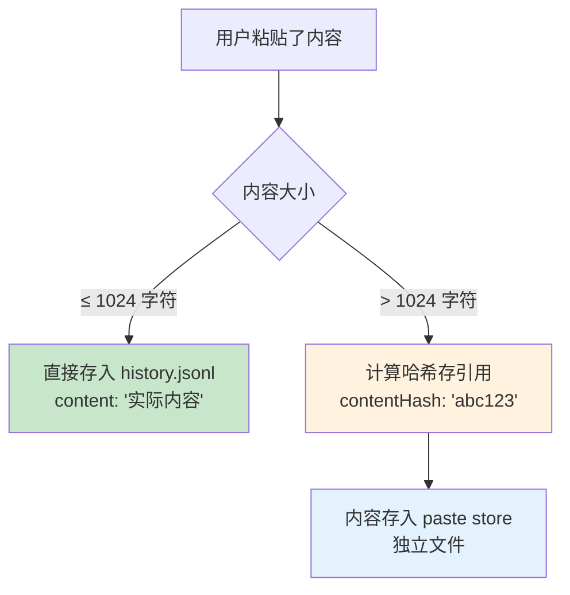
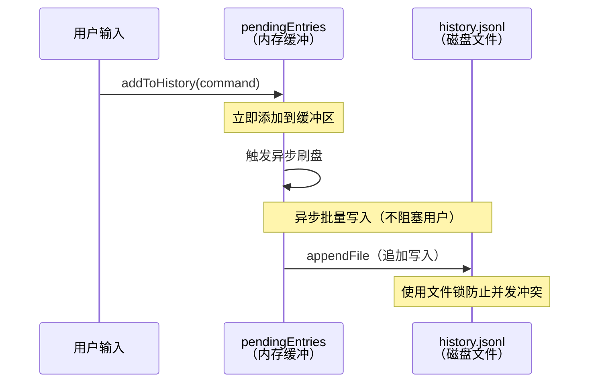
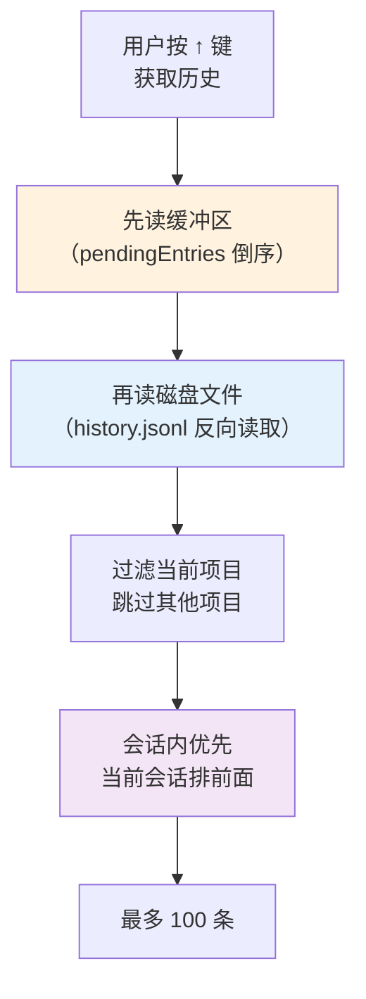
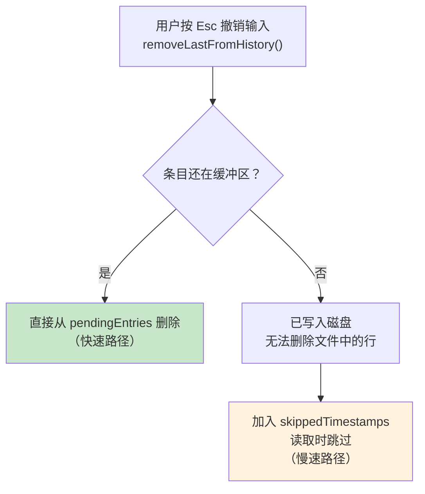
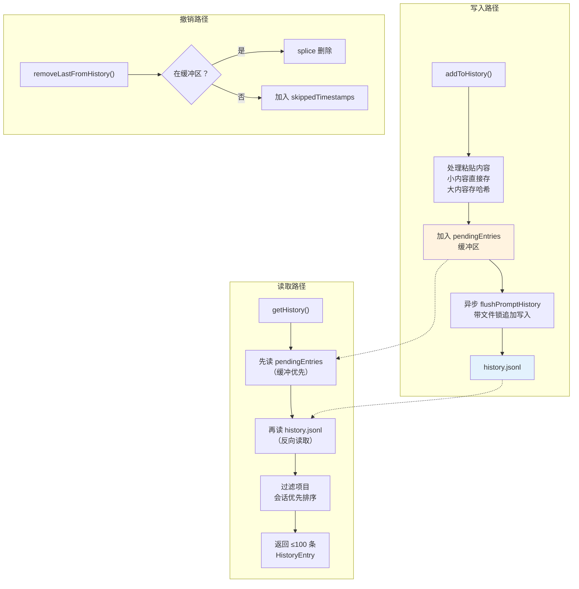

# 第 7 课：History 会话历史 —— 缓冲写入与分级存储

> 🎯 本课解析 Claude Code 如何高效保存和检索用户的命令历史。

---

## 学习目标

1. 理解 History 系统的"缓冲区 + 磁盘"双层架构
2. 掌握 JSONL 追加写入模式的优势
3. 学会缓冲写入和延迟刷盘的设计思路
4. 了解大段粘贴内容的哈希外置存储
5. 认识会话隔离、反向读取和撤销机制

---

## 一、History 系统概览

### 生活类比：日记本

想象你在写日记：
- **写**的时候：先在便签纸上记几笔（缓冲区），晚上再统一誊到日记本上（磁盘）
- **读**的时候：先看便签纸上有没有（最新的），再翻日记本（历史的）
- **特殊情况**：如果你贴了一大段报纸剪报，你不会抄一遍——你把它放在信封里，日记本上标注"见信封 #3"（哈希引用）

Claude Code 的 History 系统几乎就是这个模式。

### 存储位置

```
~/.claude/history.jsonl     ← 全局历史文件（所有项目共享）
```

注意：是 `.jsonl`（JSON Lines），不是 `.json`——每一行是一条独立的 JSON 记录。

---

## 二、核心数据结构

### 2.1 LogEntry —— 磁盘上的记录

```typescript
// 源码文件：history.ts
type LogEntry = {
  display: string                           // 显示文本
  pastedContents: Record<number, StoredPastedContent>  // 粘贴内容
  timestamp: number                         // 时间戳
  project: string                           // 所属项目路径
  sessionId?: string                        // 所属会话 ID
}
```

### 2.2 StoredPastedContent —— 粘贴内容的两种存储方式

```typescript
// 源码文件：history.ts
type StoredPastedContent = {
  id: number
  type: 'text' | 'image'
  content?: string      // 小内容直接存（≤1024 字符）
  contentHash?: string  // 大内容存哈希引用
  mediaType?: string
  filename?: string
}
```



```typescript
// 源码中的阈值定义
const MAX_PASTED_CONTENT_LENGTH = 1024
```

---

## 三、写入流程：缓冲 + 延迟刷盘

### 3.1 两层写入



### 3.2 addToHistory —— 入口函数

```typescript
// 源码文件：history.ts
export function addToHistory(command: HistoryEntry | string): void {
  // 跳过测试/验证会话的历史记录
  if (isEnvTruthy(process.env.CLAUDE_CODE_SKIP_PROMPT_HISTORY)) {
    return
  }

  // 首次使用时注册清理回调
  if (!cleanupRegistered) {
    cleanupRegistered = true
    registerCleanup(async () => {
      if (currentFlushPromise) {
        await currentFlushPromise
      }
      if (pendingEntries.length > 0) {
        await immediateFlushHistory()
      }
    })
  }

  void addToPromptHistory(command)
}
```

**设计亮点**：
- `registerCleanup` 确保进程退出时刷盘——不丢数据
- `void` 前缀表示"我知道这是异步的，但我不等它"——非阻塞

### 3.3 addToPromptHistory —— 处理粘贴内容

```typescript
// 源码文件：history.ts（简化版）
async function addToPromptHistory(command: HistoryEntry | string): Promise<void> {
  const entry = typeof command === 'string'
    ? { display: command, pastedContents: {} }
    : command

  const storedPastedContents: Record<number, StoredPastedContent> = {}

  for (const [id, content] of Object.entries(entry.pastedContents)) {
    if (content.type === 'image') continue  // 图片不存

    if (content.content.length <= MAX_PASTED_CONTENT_LENGTH) {
      storedPastedContents[Number(id)] = { ...content }  // 小内容直接存
    } else {
      const hash = hashPastedText(content.content)
      storedPastedContents[Number(id)] = {
        ...content, content: undefined, contentHash: hash,
      }
      void storePastedText(hash, content.content)  // 大内容异步存外部
    }
  }

  const logEntry: LogEntry = {
    ...entry,
    pastedContents: storedPastedContents,
    timestamp: Date.now(),
    project: getProjectRoot(),
    sessionId: getSessionId(),
  }

  pendingEntries.push(logEntry)
  lastAddedEntry = logEntry
  currentFlushPromise = flushPromptHistory(0)
}
```

### 3.4 flushPromptHistory —— 带重试的刷盘

```typescript
// 源码文件：history.ts
async function flushPromptHistory(retries: number): Promise<void> {
  if (isWriting || pendingEntries.length === 0) return
  if (retries > 5) return  // 最多重试 5 次

  isWriting = true
  try {
    await immediateFlushHistory()
  } finally {
    isWriting = false
    if (pendingEntries.length > 0) {
      await sleep(500)  // 避免热循环
      void flushPromptHistory(retries + 1)
    }
  }
}
```

### 3.5 immediateFlushHistory —— 实际写磁盘

```typescript
// 源码文件：history.ts
async function immediateFlushHistory(): Promise<void> {
  if (pendingEntries.length === 0) return

  let release
  try {
    const historyPath = join(getClaudeConfigHomeDir(), 'history.jsonl')

    // 确保文件存在
    await writeFile(historyPath, '', { encoding: 'utf8', mode: 0o600, flag: 'a' })

    // 获取文件锁（防止多个 Claude Code 进程同时写）
    release = await lock(historyPath, {
      stale: 10000,
      retries: { retries: 3, minTimeout: 50 },
    })

    // 批量序列化并写入
    const jsonLines = pendingEntries.map(entry => jsonStringify(entry) + '\n')
    pendingEntries = []  // 清空缓冲区

    await appendFile(historyPath, jsonLines.join(''), { mode: 0o600 })
  } finally {
    if (release) await release()
  }
}
```

**关键细节**：

| 特性 | 实现 | 为什么 |
|------|------|--------|
| 文件锁 | `lock(historyPath, ...)` | 多个进程可能同时运行 |
| 追加模式 | `appendFile` | 不读取整个文件，只追加尾部 |
| 权限 `0o600` | 仅所有者可读写 | 历史可能包含敏感信息 |
| 批量写入 | `jsonLines.join('')` | 减少 I/O 次数 |

---

## 四、读取流程：反向读取 + 缓冲优先

### 4.1 读取优先级



### 4.2 makeLogEntryReader —— 缓冲优先的读取器

```typescript
// 源码文件：history.ts
async function* makeLogEntryReader(): AsyncGenerator<LogEntry> {
  const currentSession = getSessionId()

  // 第一步：先从缓冲区读（最新的）
  for (let i = pendingEntries.length - 1; i >= 0; i--) {
    yield pendingEntries[i]!
  }

  // 第二步：从磁盘文件反向读取
  const historyPath = join(getClaudeConfigHomeDir(), 'history.jsonl')
  for await (const line of readLinesReverse(historyPath)) {
    try {
      const entry = deserializeLogEntry(line)
      // 跳过已被撤销的条目
      if (entry.sessionId === currentSession && skippedTimestamps.has(entry.timestamp)) {
        continue
      }
      yield entry
    } catch (error) {
      logForDebugging(`Failed to parse history line: ${error}`)
    }
  }
}
```

**使用 `async function*` （异步生成器）**的好处：
- 惰性求值——不需要读完所有历史就能返回前几条
- 内存友好——不把整个文件加载到内存

### 4.3 getHistory —— 会话隔离

```typescript
// 源码文件：history.ts
export async function* getHistory(): AsyncGenerator<HistoryEntry> {
  const currentProject = getProjectRoot()
  const currentSession = getSessionId()
  const otherSessionEntries: LogEntry[] = []
  let yielded = 0

  for await (const entry of makeLogEntryReader()) {
    if (!entry || typeof entry.project !== 'string') continue
    if (entry.project !== currentProject) continue  // 只看当前项目

    if (entry.sessionId === currentSession) {
      yield await logEntryToHistoryEntry(entry)  // 当前会话优先
      yielded++
    } else {
      otherSessionEntries.push(entry)  // 其他会话暂存
    }

    if (yielded + otherSessionEntries.length >= MAX_HISTORY_ITEMS) break
  }

  // 最后输出其他会话的条目
  for (const entry of otherSessionEntries) {
    if (yielded >= MAX_HISTORY_ITEMS) return
    yield await logEntryToHistoryEntry(entry)
    yielded++
  }
}
```

**为什么当前会话优先？**

> 并发会话不应该互相干扰上箭头历史。当你打开了两个终端窗口，各自的 ↑ 键应该先显示自己窗口的历史。

---

## 五、撤销机制：removeLastFromHistory

```typescript
// 源码文件：history.ts
export function removeLastFromHistory(): void {
  if (!lastAddedEntry) return
  const entry = lastAddedEntry
  lastAddedEntry = null

  const idx = pendingEntries.lastIndexOf(entry)
  if (idx !== -1) {
    pendingEntries.splice(idx, 1)    // 快速路径：还在缓冲区
  } else {
    skippedTimestamps.add(entry.timestamp)  // 慢速路径：已写入磁盘
  }
}
```



**场景**：用户输入了一条命令，按了回车，然后立刻按 Esc 想撤销。这时候需要从历史中移除这条记录，否则 ↑ 键会显示重复内容。

---

## 六、粘贴内容引用系统

用户经常粘贴大段文本或图片。Claude Code 用一套引用系统来管理：

```typescript
// 源码文件：history.ts
export function formatPastedTextRef(id: number, numLines: number): string {
  if (numLines === 0) return `[Pasted text #${id}]`
  return `[Pasted text #${id} +${numLines} lines]`
}

export function formatImageRef(id: number): string {
  return `[Image #${id}]`
}
```

用户看到的是 `[Pasted text #1 +10 lines]`，实际内容存在别处。

```typescript
// 展开引用——把占位符替换为真实内容
export function expandPastedTextRefs(
  input: string,
  pastedContents: Record<number, PastedContent>,
): string {
  const refs = parseReferences(input)
  let expanded = input
  // 从后往前替换，保持前面的偏移量正确
  for (let i = refs.length - 1; i >= 0; i--) {
    const ref = refs[i]!
    const content = pastedContents[ref.id]
    if (content?.type !== 'text') continue
    expanded =
      expanded.slice(0, ref.index) +
      content.content +
      expanded.slice(ref.index + ref.match.length)
  }
  return expanded
}
```

---

## 七、完整架构图



---

## 动手练习

### 练习 1：理解 JSONL 格式

以下是 `history.jsonl` 的三行内容，分析每一行：

```jsonl
{"display":"帮我重构认证模块","pastedContents":{},"timestamp":1711987200000,"project":"/Users/alice/myapp","sessionId":"abc123"}
{"display":"[Pasted text #1 +15 lines] 分析这段代码","pastedContents":{"1":{"id":1,"type":"text","contentHash":"sha256-abc"}},"timestamp":1711987260000,"project":"/Users/alice/myapp","sessionId":"abc123"}
{"display":"运行测试","pastedContents":{},"timestamp":1711987320000,"project":"/Users/bob/other","sessionId":"def456"}
```

1. 如果当前项目是 `/Users/alice/myapp`，↑ 键会显示几条？
2. 第二条的粘贴内容是直接存储还是哈希引用？

### 练习 2：设计题

如果 `history.jsonl` 增长到 100MB，读取性能会怎样？你能提出什么优化方案？

（提示：考虑文件分片、索引文件、定期清理等策略）

### 练习 3：缓冲区竞态

以下场景会发生什么？

```
时间线：
T1: 用户输入 "hello"  → addToHistory("hello")
T2: 缓冲区开始刷盘 → flush 开始
T3: 用户输入 "world"  → addToHistory("world")
T4: flush 完成
T5: 用户按 ↑ 键 → getHistory()
```

- "world" 会在缓冲区还是磁盘上？
- ↑ 键能看到 "world" 吗？

---

## 本课小结

| 概念 | 解释 |
|------|------|
| JSONL 格式 | 每行一条 JSON——追加友好、反向读取高效 |
| 双层存储 | 内存缓冲区 + 磁盘文件，缓冲优先读取 |
| 文件锁 | `lock()` 防止多进程并发写入冲突 |
| 会话隔离 | 当前会话的记录排在前面 |
| 粘贴外置 | 大段粘贴内容用哈希引用，存在独立文件中 |
| 撤销机制 | 缓冲区直接删除，已刷盘的加入跳过集合 |
| 异步非阻塞 | 写入不阻塞用户交互，`registerCleanup` 保证退出前刷盘 |

---

## 下节预告

当 Claude Code 升级版本时，旧格式的配置文件可能需要更新。下一课我们将学习 Migrations 系统——如何用幂等函数链安全地升级数据格式：

- 什么是幂等函数？为什么迁移必须是幂等的？
- 模型别名迁移：`fennec-latest` → `opus`
- 设置位置迁移：从项目配置到 settings.json
- 迁移版本号和跳过优化

👉 [第 8 课：Migrations 版本迁移 →](./08-migrations.md)
