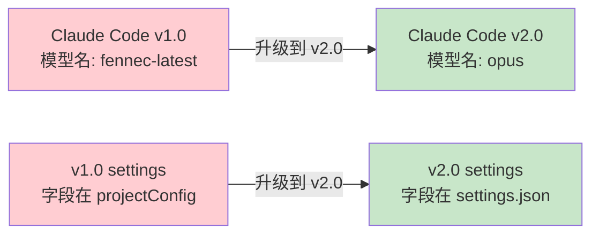
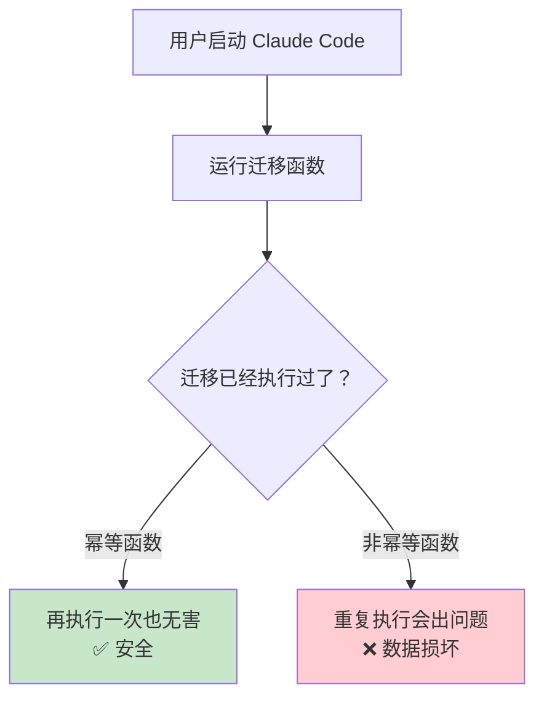
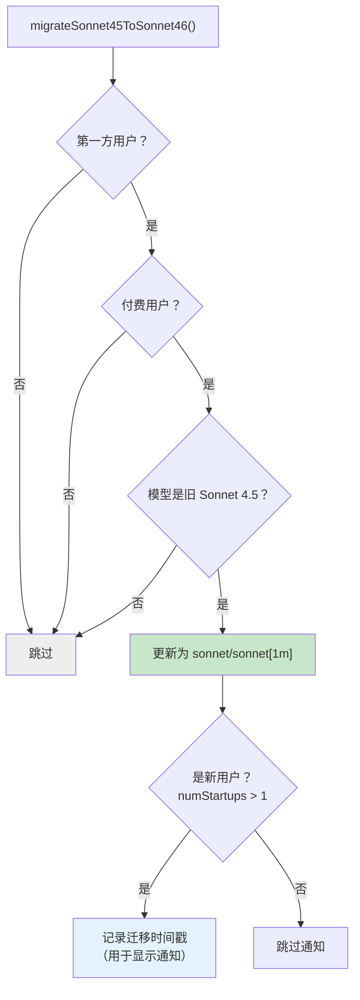
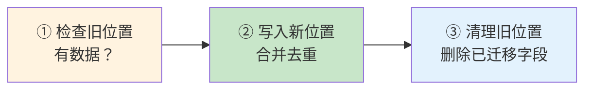
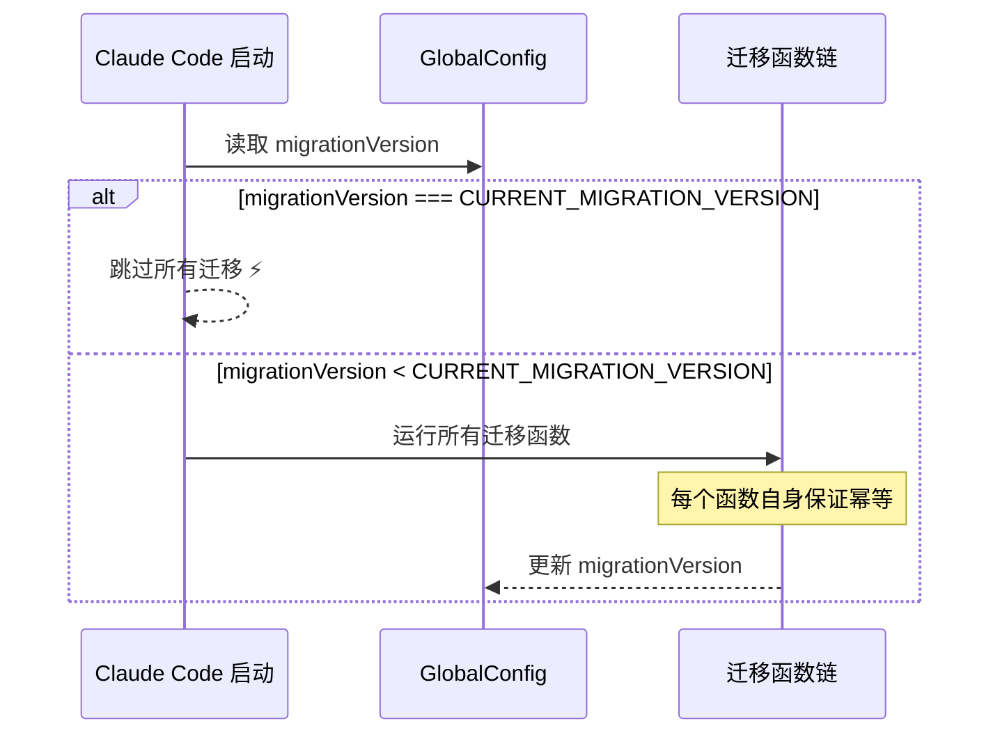
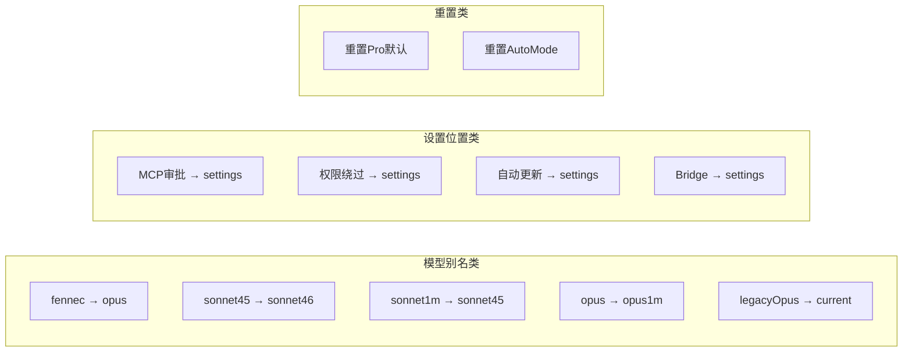

# 第 8 课：Migrations 版本迁移 —— 幂等函数链

> 🎯 本课揭秘 Claude Code 如何安全地升级旧格式的配置和数据。

---

## 学习目标

1. 理解为什么软件升级需要数据迁移
2. 掌握"幂等"的含义和为什么迁移函数必须幂等
3. 学会分析真实的迁移函数（模型别名、设置位置）
4. 了解迁移版本号和跳过优化机制
5. 认识迁移系统的容错设计

---

## 一、为什么需要迁移？

### 生活类比：搬家整理

你从旧房子搬到新房子：
- 旧房子的插座是两孔的，新房子是三孔的 → **需要转接头（适配）**
- 旧房子的衣柜分区方式不合理 → **衣服要重新整理（重组）**
- 旧房子的某些家具在新房子不适用 → **需要替换（淘汰）**

软件升级也一样——旧版本的配置格式、数据结构在新版本中可能不再适用。

### Claude Code 面临的迁移场景



---

## 二、什么是幂等？

### 定义

> **幂等（Idempotent）**：一个操作执行一次和执行多次的结果是一样的。

### 生活例子

| 操作 | 幂等？ | 说明 |
|------|--------|------|
| 关灯 | ✅ 是 | 关一次和关十次，灯都是灭的 |
| 存款 100 元 | ❌ 否 | 存一次是 100，存两次是 200 |
| 设置温度为 25°C | ✅ 是 | 设一次和设十次，温度都是 25°C |
| 发一条短信 | ❌ 否 | 发一次和发两次，收到的数量不同 |

### 为什么迁移必须幂等？



因为用户每次启动程序都会运行迁移——如果迁移不幂等，重复运行就会出问题。

---

## 三、迁移案例 1：模型别名迁移

### 背景

Claude Code 的模型经历了多次重命名：
- `fennec-latest` → `opus`
- `fennec-latest[1m]` → `opus[1m]`
- `sonnet-4-5` → `sonnet`（因为 Sonnet 4.6 发布了）

### 源码解析：migrateFennecToOpus

```typescript
// 源码文件：migrations/migrateFennecToOpus.ts
export function migrateFennecToOpus(): void {
  // 只对内部用户生效
  if (process.env.USER_TYPE !== 'ant') {
    return
  }

  // 只读 userSettings（不读合并后的设置）
  const settings = getSettingsForSource('userSettings')
  const model = settings?.model

  if (typeof model === 'string') {
    if (model.startsWith('fennec-latest[1m]')) {
      updateSettingsForSource('userSettings', { model: 'opus[1m]' })
    } else if (model.startsWith('fennec-latest')) {
      updateSettingsForSource('userSettings', { model: 'opus' })
    } else if (
      model.startsWith('fennec-fast-latest') ||
      model.startsWith('opus-4-5-fast')
    ) {
      updateSettingsForSource('userSettings', {
        model: 'opus[1m]',
        fastMode: true,
      })
    }
  }
}
```

**幂等性分析**：

```
第一次运行：
  settings.model = "fennec-latest"
  → 改为 "opus" ✅

第二次运行：
  settings.model = "opus"
  → 不匹配任何 if 条件 → 什么都不做 ✅

第 N 次运行：
  同第二次，什么都不做 ✅
```

**设计要点**：

```typescript
// 只读 userSettings，不读 merged settings
const settings = getSettingsForSource('userSettings')
```

> 为什么不读合并后的设置？因为 project/local/policy 设置中的模型别名不应该被改——改了会导致无限重运行 + 静默提升权限。

### 源码解析：migrateSonnet45ToSonnet46

```typescript
// 源码文件：migrations/migrateSonnet45ToSonnet46.ts
export function migrateSonnet45ToSonnet46(): void {
  // 只对第一方用户生效
  if (getAPIProvider() !== 'firstParty') return

  // 只对付费用户生效
  if (!isProSubscriber() && !isMaxSubscriber() && !isTeamPremiumSubscriber()) return

  const model = getSettingsForSource('userSettings')?.model
  if (
    model !== 'claude-sonnet-4-5-20250929' &&
    model !== 'claude-sonnet-4-5-20250929[1m]' &&
    model !== 'sonnet-4-5-20250929' &&
    model !== 'sonnet-4-5-20250929[1m]'
  ) {
    return  // 不匹配任何旧别名 → 跳过
  }

  const has1m = model.endsWith('[1m]')
  updateSettingsForSource('userSettings', {
    model: has1m ? 'sonnet[1m]' : 'sonnet',
  })

  // 非新用户：记录迁移时间戳（用于显示通知）
  const config = getGlobalConfig()
  if (config.numStartups > 1) {
    saveGlobalConfig(current => ({
      ...current,
      sonnet45To46MigrationTimestamp: Date.now(),
    }))
  }
}
```

**多重守卫条件**：



---

## 四、迁移案例 2：设置位置迁移

### 背景

MCP 服务器的审批字段原来存在 `projectConfig` 中，需要迁移到 `settings.json`（localSettings）中。

### 源码解析

```typescript
// 源码文件：migrations/migrateEnableAllProjectMcpServersToSettings.ts
export function migrateEnableAllProjectMcpServersToSettings(): void {
  const projectConfig = getCurrentProjectConfig()

  // 检查需要迁移的字段
  const hasEnableAll = projectConfig.enableAllProjectMcpServers !== undefined
  const hasEnabledServers = projectConfig.enabledMcpjsonServers?.length > 0
  const hasDisabledServers = projectConfig.disabledMcpjsonServers?.length > 0

  // 没有需要迁移的字段 → 直接返回（幂等！）
  if (!hasEnableAll && !hasEnabledServers && !hasDisabledServers) {
    return
  }

  try {
    const existingSettings = getSettingsForSource('localSettings') || {}
    const updates = {}

    // 迁移 enableAllProjectMcpServers
    if (hasEnableAll && existingSettings.enableAllProjectMcpServers === undefined) {
      updates.enableAllProjectMcpServers = projectConfig.enableAllProjectMcpServers
    }

    // 迁移 enabledMcpjsonServers（合并，去重）
    if (hasEnabledServers) {
      updates.enabledMcpjsonServers = [
        ...new Set([
          ...(existingSettings.enabledMcpjsonServers || []),
          ...projectConfig.enabledMcpjsonServers,
        ]),
      ]
    }

    // 写入新位置
    if (Object.keys(updates).length > 0) {
      updateSettingsForSource('localSettings', updates)
    }

    // 从旧位置删除
    saveCurrentProjectConfig(current => {
      const { enableAllProjectMcpServers, enabledMcpjsonServers,
              disabledMcpjsonServers, ...rest } = current
      return rest
    })
  } catch (e) {
    logError(e)  // 迁移失败不影响启动
  }
}
```

**迁移三步曲**：



**幂等性保证**：
- 步骤 ① 如果旧位置已清空，直接返回
- 步骤 ② 检查新位置是否已有值（`existingSettings.XXX === undefined`），避免覆盖
- 步骤 ③ 使用解构删除，已删除的字段不会报错

---

## 五、迁移版本号机制

为了避免每次启动都运行所有迁移，Claude Code 使用版本号机制：

```typescript
// 源码文件：utils/config.ts
// Version of the last-applied migration set. When equal to
// CURRENT_MIGRATION_VERSION, runMigrations() skips all sync migrations
// (avoiding 11× saveGlobalConfig lock+re-read on every startup).
migrationVersion?: number
```



**为什么还需要幂等？**

即使有版本号，以下场景仍然需要幂等性：
1. 版本号更新和迁移执行之间程序崩溃
2. 数据恢复导致版本号回退
3. 手动清除配置文件

---

## 六、迁移函数的通用模式

所有迁移函数遵循同样的结构：

```typescript
// 迁移函数模板
export function migrateXxxToYyy(): void {
  // 1️⃣ 前置条件检查（提前返回）
  if (!shouldRun()) return

  // 2️⃣ 读取当前状态
  const currentValue = readCurrentState()

  // 3️⃣ 判断是否需要迁移
  if (isAlreadyMigrated(currentValue)) return

  // 4️⃣ 执行迁移
  try {
    writeNewState(transform(currentValue))
    cleanupOldState()
  } catch (e) {
    // 5️⃣ 容错：记录错误但不中断启动
    logError(e)
  }
}
```

### 容错设计

```typescript
// 源码中每个迁移函数都有类似的 try/catch
try {
  // 迁移逻辑
} catch (e: unknown) {
  logError(e)
  logEvent('tengu_migrate_xxx_error', {})
  // 不 throw！迁移失败不应该阻止用户使用
}
```

> 迁移失败绝不能让应用无法启动——用户宁愿用旧格式继续工作，也不愿意被"升级"搞崩。

---

## 七、Claude Code 的迁移清单

当前源码中有 11 个迁移函数：

| 迁移 | 作用 |
|------|------|
| `migrateFennecToOpus` | 模型别名：fennec → opus |
| `migrateSonnet45ToSonnet46` | 模型别名：sonnet-4.5 → sonnet |
| `migrateSonnet1mToSonnet45` | 模型别名：sonnet[1m] → sonnet-4.5 |
| `migrateOpusToOpus1m` | 模型别名：opus → opus[1m] |
| `migrateLegacyOpusToCurrent` | 旧版 opus 别名更新 |
| `resetProToOpusDefault` | 重置 Pro 用户的默认模型 |
| `resetAutoModeOptInForDefaultOffer` | 重置自动模式选择 |
| `migrateEnableAllProjectMcpServersToSettings` | MCP 审批字段位置迁移 |
| `migrateBypassPermissionsAcceptedToSettings` | 权限绕过字段迁移 |
| `migrateAutoUpdatesToSettings` | 自动更新设置迁移 |
| `migrateReplBridgeEnabledToRemoteControlAtStartup` | Bridge 启动设置迁移 |



---

## 八、与数据库迁移的对比

| 特性 | 数据库迁移（Rails/Django） | Claude Code 迁移 |
|------|--------------------------|------------------|
| 存储 | SQL 数据库 | JSON 配置文件 |
| 迁移文件 | 带时间戳的 SQL/代码文件 | 独立的 TS 函数 |
| 执行顺序 | 严格按时间戳顺序 | 全部运行，各自幂等 |
| 回滚 | 有 down 迁移 | 无回滚（幂等保证安全） |
| 版本记录 | 数据库表 | GlobalConfig.migrationVersion |
| 失败处理 | 回滚事务 | 忽略错误继续 |

---

## 动手练习

### 练习 1：写一个幂等迁移

假设你的应用旧版本把主题设置存在 `config.theme`（值为 "dark" 或 "light"），新版本改为 `config.appearance.colorScheme`（值为 "dark-mode" 或 "light-mode"）。

写一个幂等的迁移函数：

```typescript
function migrateThemeToAppearance(): void {
  // 你的代码...
}
```

要求：
- 旧字段存在时迁移到新字段
- 新字段已存在时不覆盖
- 迁移后清理旧字段
- 运行多次结果相同

### 练习 2：分析幂等性

以下迁移函数是幂等的吗？为什么？

```typescript
function migrateCount(): void {
  const config = getConfig()
  config.count = (config.count || 0) + 1  // 每次运行加1
  saveConfig(config)
}
```

### 练习 3：思考题

1. 如果迁移 A 和迁移 B 有依赖关系（B 需要 A 先完成），在 Claude Code 的"全部运行"模式下怎么处理？
2. 为什么 Claude Code 选择"无回滚"策略？什么情况下需要回滚？

---

## 本课小结

| 概念 | 解释 |
|------|------|
| 数据迁移 | 软件升级时将旧格式数据转换为新格式 |
| 幂等性 | 执行一次和执行多次结果相同 |
| 前置守卫 | 迁移函数开头的 `if (!condition) return` 保证幂等 |
| 版本号跳过 | `migrationVersion` 避免每次启动都运行迁移 |
| 容错优先 | 迁移失败不阻塞启动，记录错误继续运行 |
| 迁移三步曲 | 读旧值 → 写新位置 → 清理旧位置 |
| 源级隔离 | 只读写 `userSettings`，不碰 `projectSettings` |

---

## 下节预告

我们已经学习了内存状态（Store + AppState）、文件持久化（Memdir + History）和版本迁移（Migrations）。下一课将站在更高的视角，探讨**持久化策略**——什么数据该存磁盘、什么只放内存、什么时候写盘：

- 瞬态 vs 持久态的划分标准
- 写入时机：立即写 vs 延迟写 vs 退出前写
- 存储位置：GlobalConfig vs Settings vs Memory

👉 [第 9 课：持久化策略 →](./09-persistence-strategy.md)
