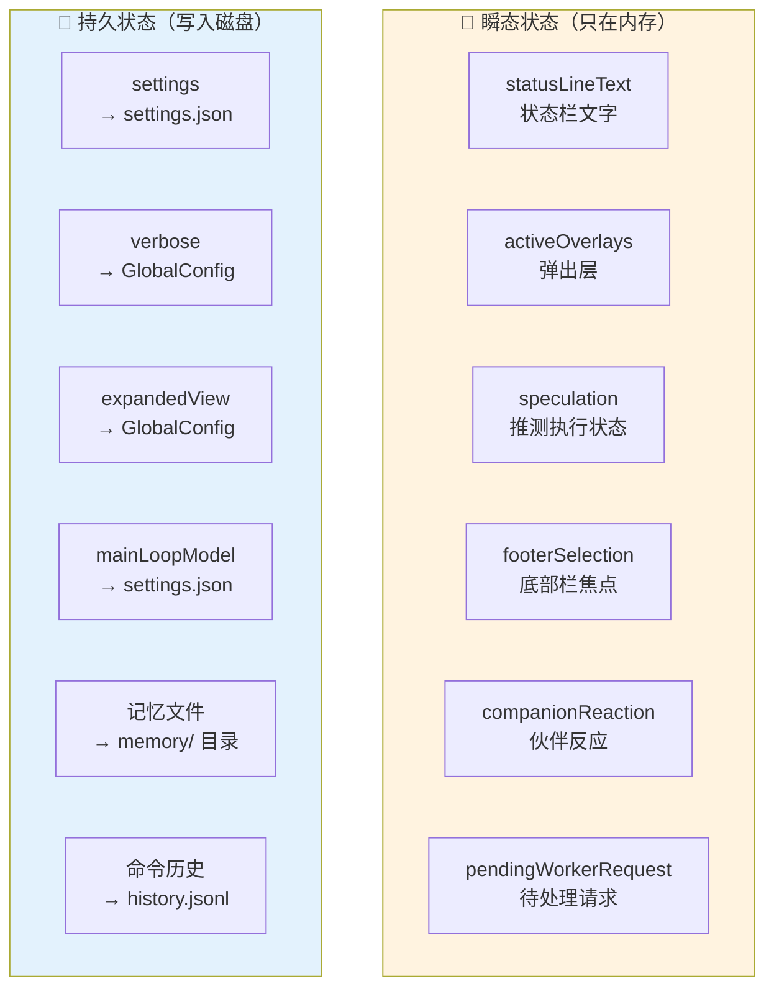
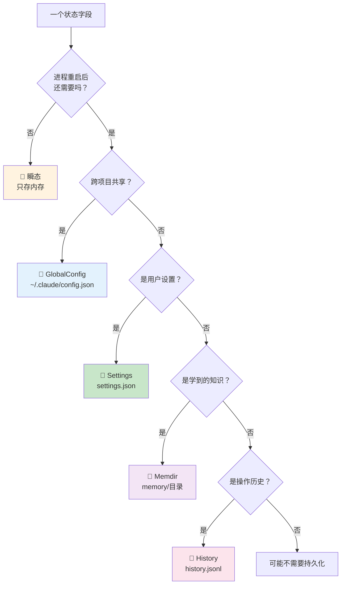
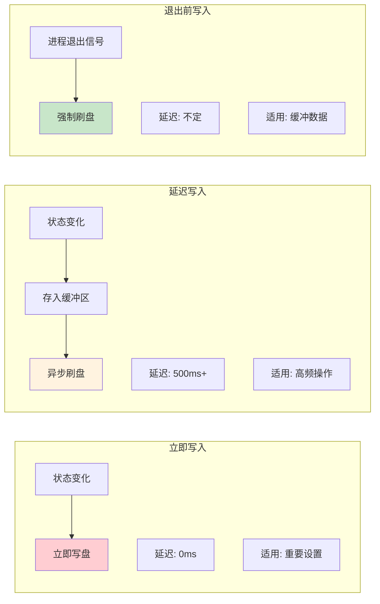
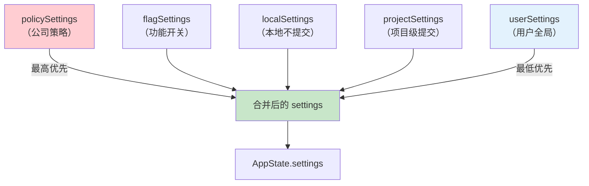
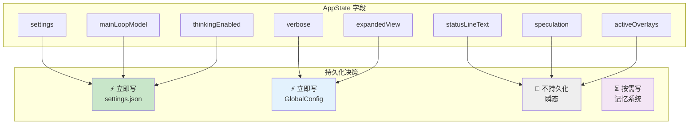

# 第 9 课：持久化策略 —— 何时写盘、何时只存内存

> 🎯 本课从全局视角分析 Claude Code 的持久化决策——不是所有状态都值得写进磁盘。

---

## 学习目标

1. 理解瞬态状态 vs 持久状态的划分标准
2. 掌握三种写入时机（立即 / 延迟 / 退出前）的适用场景
3. 学会分析不同存储位置的选型逻辑
4. 了解 Claude Code 中"不持久化"的设计智慧
5. 认识安全和性能对持久化策略的影响

---

## 一、不是所有状态都需要持久化

### 生活类比：什么值得写进日记？

- 今天吃了什么午饭？→ **不记**（太琐碎）
- 今天遇到了一个重要的人？→ **记**（有长期价值）
- 现在心情不好？→ **不记**（过一会就好了）
- 做了一个重要决定？→ **记**（影响未来）

### AppState 中的瞬态 vs 持久态



---

## 二、划分标准：该不该持久化？

### 决策树



### 五问判断法

| 问题 | 答案为"是"则 |
|------|-------------|
| 1. 进程重启后需要恢复吗？ | 需要持久化 |
| 2. 需要跨项目共享吗？ | 存 GlobalConfig |
| 3. 用户可能想手动编辑吗？ | 存人类可读格式（JSON/MD） |
| 4. 变化频率很高吗？ | 延迟写入或不持久化 |
| 5. 包含敏感信息吗？ | 注意权限（`0o600`） |

---

## 三、三种写入时机

### 3.1 立即写入（Immediate）

**适用场景**：重要设置变更，丢失会造成困扰。

```typescript
// 来自 onChangeAppState.ts：模型设置变更立即保存
if (newState.mainLoopModel !== oldState.mainLoopModel) {
  updateSettingsForSource('userSettings', { model: newState.mainLoopModel })
}
```

**特点**：`onChange` 回调中立即触发 → 用户改了模型就写盘。

### 3.2 延迟写入（Deferred / Buffered）

**适用场景**：高频操作，立即写会造成性能问题。

```typescript
// 来自 history.ts：命令历史用缓冲区延迟写入
pendingEntries.push(logEntry)
currentFlushPromise = flushPromptHistory(0)  // 异步刷盘

async function flushPromptHistory(retries: number): Promise<void> {
  if (isWriting || pendingEntries.length === 0) return
  // 批量写入所有待处理条目
  await immediateFlushHistory()
  if (pendingEntries.length > 0) {
    await sleep(500)  // 等 500ms 再尝试
    void flushPromptHistory(retries + 1)
  }
}
```

**特点**：先存内存 → 异步批量写磁盘 → 重试机制。

### 3.3 退出前写入（On-exit）

**适用场景**：缓冲数据在进程退出前必须落盘。

```typescript
// 来自 history.ts：注册退出清理
registerCleanup(async () => {
  if (currentFlushPromise) {
    await currentFlushPromise  // 等待进行中的写入
  }
  if (pendingEntries.length > 0) {
    await immediateFlushHistory()  // 最终刷盘
  }
})
```

**特点**：进程退出信号触发 → 确保缓冲区数据不丢。

### 时机对比



---

## 四、存储位置详解

Claude Code 有四个主要的持久化位置：

### 4.1 GlobalConfig（全局配置）

```
位置：~/.claude/config.json
范围：跨项目共享
格式：JSON
```

存储的数据：

```typescript
// 部分字段示例（来自 utils/config.ts）
{
  numStartups: 42,          // 启动次数
  verbose: false,           // 详细模式
  theme: 'dark',            // 主题
  showExpandedTodos: true,  // 展开任务面板
  showSpinnerTree: false,   // 展开队友面板
  tungstenPanelVisible: true, // tmux 面板可见
  migrationVersion: 11,     // 迁移版本
}
```

**写入方式**：

```typescript
// 来自 onChangeAppState.ts
saveGlobalConfig(current => ({
  ...current,
  verbose,
}))
```

函数式更新——读取当前值、合并变更、写回。

### 4.2 Settings（用户设置）

```
位置：多层合并
  - ~/.claude/settings.json      (userSettings)
  - .claude/settings.local.json  (localSettings)
  - .claude/settings.json        (projectSettings)
范围：可以是全局或项目级
格式：JSON
```

**多源合并优先级**：



### 4.3 Memory 目录（记忆）

```
位置：~/.claude/projects/{sanitized-path}/memory/
范围：项目级（git worktree 共享）
格式：Markdown with YAML frontmatter
```

**写入时机**：AI 决定"这值得记住"时。不是每次对话都写，而是有新知识时写。

### 4.4 History 文件（历史）

```
位置：~/.claude/history.jsonl
范围：全局（但按项目过滤读取）
格式：JSONL（每行一条 JSON）
```

**写入时机**：每次用户输入命令时。延迟缓冲写入。

---

## 五、不持久化的设计智慧

有些状态**故意**不持久化：

### 5.1 推测执行状态

```typescript
// AppState 中的 speculation 字段
speculation: SpeculationState  // idle 或 active
speculationSessionTimeSavedMs: number
```

**为什么不持久化？** 推测执行是一个运行时优化——进程重启后，旧的推测结果已经没有意义了。

### 5.2 Bridge 连接状态

```typescript
replBridgeConnected: boolean      // WebSocket 是否连接
replBridgeSessionActive: boolean  // 会话是否活跃
replBridgeReconnecting: boolean   // 是否正在重连
```

**为什么不持久化？** 网络连接状态本质是瞬态的——重启后需要重新建立连接。但 `replBridgeEnabled`（是否启用 Bridge）**需要**持久化，因为它是用户的意图。

### 5.3 UI 焦点状态

```typescript
footerSelection: FooterItem | null
activeOverlays: ReadonlySet<string>
coordinatorTaskIndex: number
```

**为什么不持久化？** UI 焦点在用户重新打开程序时应该从默认位置开始，而不是恢复到上次关闭时的位置。

---

## 六、安全与权限

### 6.1 文件权限

```typescript
// history.ts 中写文件时的权限设置
await writeFile(historyPath, '', { mode: 0o600, ... })
await appendFile(historyPath, jsonLines.join(''), { mode: 0o600 })
```

`0o600` = 仅文件所有者可读写（rw-------）。因为历史记录和配置可能包含路径、命令等敏感信息。

### 6.2 记忆目录安全

```typescript
// memdir/paths.ts：projectSettings 不能覆盖记忆目录
// SECURITY: projectSettings (.claude/settings.json committed to the repo) is
// intentionally excluded — a malicious repo could otherwise set
// autoMemoryDirectory: "~/.ssh" and gain silent write access
```

### 6.3 迁移源级隔离

```typescript
// migrations：只读写 userSettings
const settings = getSettingsForSource('userSettings')
// 不碰 projectSettings——防止恶意仓库的配置被"升级"后获得更高权限
```

---

## 七、持久化策略全景



---

## 八、性能与可靠性的平衡

| 策略 | 数据安全性 | 性能影响 | 适用场景 |
|------|-----------|---------|---------|
| 每次变更立即写 | ⭐⭐⭐⭐⭐ | ⭐（最慢） | 关键设置 |
| 缓冲+定期刷盘 | ⭐⭐⭐⭐ | ⭐⭐⭐（中等） | 高频操作 |
| 仅退出前写 | ⭐⭐⭐ | ⭐⭐⭐⭐⭐（最快） | 可重建数据 |
| 不持久化 | ⭐ | ⭐⭐⭐⭐⭐（零开销） | 纯瞬态数据 |

**Claude Code 的选择**：

- 关键设置（模型、权限）→ 立即写
- 命令历史 → 缓冲 + 退出保底
- UI 状态 → 不持久化
- 展开面板偏好 → 立即写（频率低）

---

## 动手练习

### 练习 1：持久化决策

以下状态字段应该怎么持久化？

| 字段 | 写入时机 | 存储位置 | 理由 |
|------|---------|---------|------|
| 用户选择的语言 | ? | ? | ? |
| 鼠标悬停的按钮 | ? | ? | ? |
| 用户的 API Key | ? | ? | ? |
| 最近打开的文件列表 | ? | ? | ? |
| 当前的搜索关键字 | ? | ? | ? |

### 练习 2：设计题

如果你在做一个在线文档编辑器，以下功能该怎么持久化？

1. 文档内容（正在编辑中的）
2. 光标位置
3. 最近使用的字体
4. 协作者列表
5. 撤销/重做栈

### 练习 3：阅读源码

对比 `onChangeAppState.ts` 中的副作用：
1. 哪些写 GlobalConfig？哪些写 Settings？
2. 有没有既写 GlobalConfig 又写 Settings 的副作用？
3. 为什么 `expandedView` 写 GlobalConfig 而 `mainLoopModel` 写 Settings？

---

## 本课小结

| 概念 | 解释 |
|------|------|
| 瞬态状态 | 只存内存，进程结束就消失（UI 焦点、连接状态） |
| 持久状态 | 写入磁盘，跨会话保留（设置、记忆、历史） |
| 立即写入 | 状态变化时立刻写盘（关键设置） |
| 延迟写入 | 先缓冲再批量写盘（高频操作） |
| 退出保底 | `registerCleanup` 确保缓冲数据不丢 |
| 存储选型 | GlobalConfig（跨项目）/ Settings（可配置）/ Memory（知识）/ History（历史） |
| 安全考量 | 文件权限 `0o600`、源级隔离、路径验证 |

---

## 下节预告

最后一课！我们将站在最高的视角，回顾整个状态管理架构——从 Store 到 Memdir，从 History 到 Migrations，画出完整的架构全景图，并提炼出可以应用到你自己项目中的设计原则。

👉 [第 10 课：状态管理架构全景与设计启示 →](./10-architecture-overview.md)
