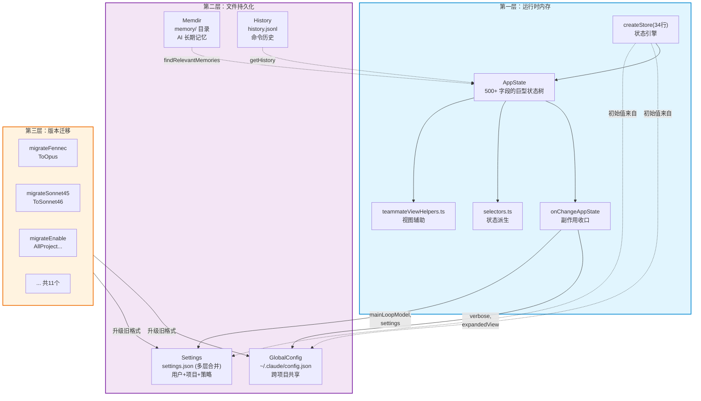
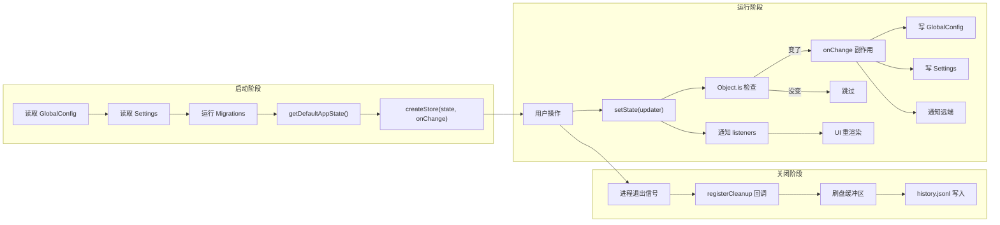
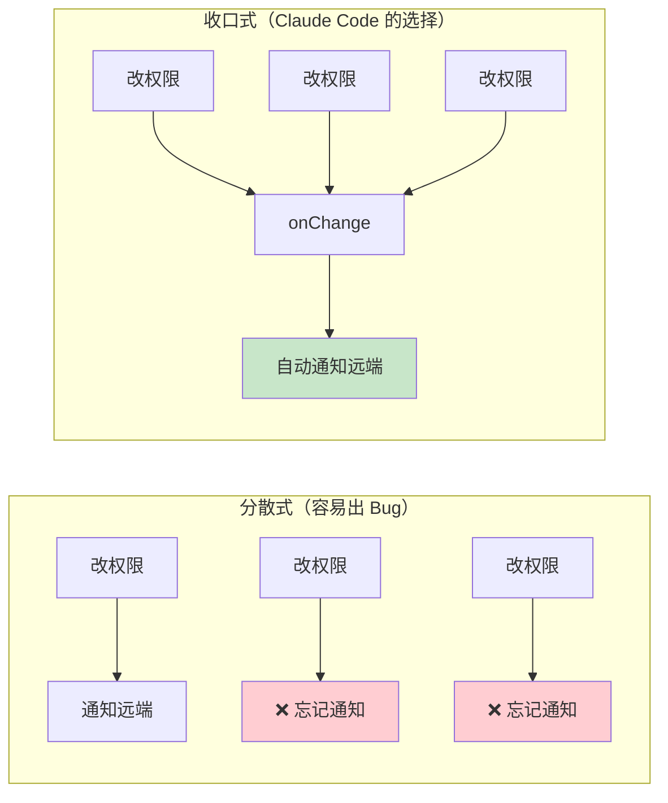
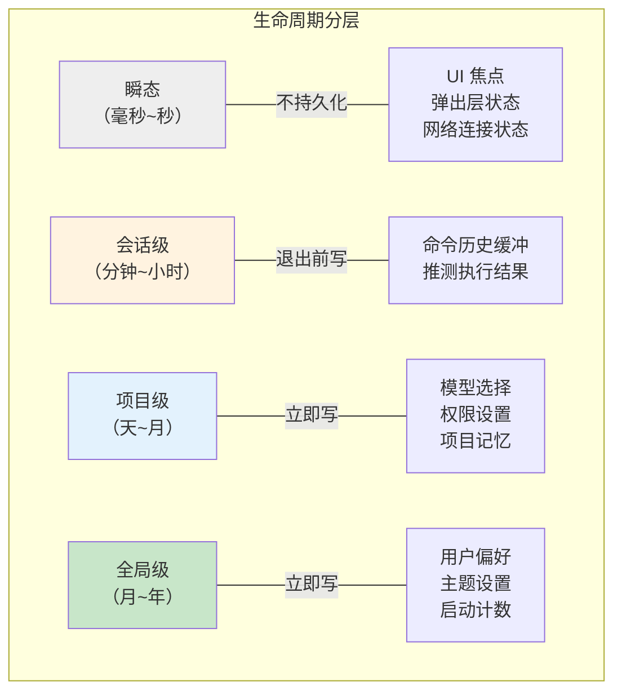

# 第 10 课：状态管理架构全景与设计启示

> 🎯 最后一课！站在最高点俯瞰整个架构，提炼可复用的设计原则。

---

## 学习目标

1. 建立 Claude Code 状态管理的完整心智模型
2. 理解各子系统之间的协作关系
3. 掌握 5 个可直接应用到自己项目的设计原则
4. 了解这套架构的局限性和可能的演进方向
5. 获得独立分析开源项目架构的能力

---

## 一、架构全景图

### 1.1 三层架构



### 1.2 数据流总览



---

## 二、各子系统关系矩阵

| 子系统 | 读取 | 写入 | 触发条件 |
|--------|------|------|---------|
| **createStore** | 被所有组件读取 | 只能通过 setState | 程序启动时创建 |
| **AppState** | 被 Store 管理 | 通过 Store.setState | 随 Store 创建 |
| **onChangeAppState** | 读 newState/oldState | 写 GlobalConfig/Settings | 每次 setState 后 |
| **Memdir** | 被 AI 按需读取 | 被 AI 按需写入 | 用户提问/AI 学到东西时 |
| **History** | 按 ↑ 或 Ctrl+R 读 | 用户每次输入时写 | 命令提交时 |
| **Migrations** | 读 Settings/Config | 写 Settings/Config | 每次启动时（版本检查） |

---

## 三、核心组件源码文件清单

| 文件 | 行数 | 核心职责 |
|------|------|---------|
| `state/store.ts` | 34 | 极简 Store 引擎 |
| `state/AppStateStore.ts` | 570 | 状态类型定义 + 工厂函数 |
| `state/onChangeAppState.ts` | 172 | 副作用收口 |
| `state/selectors.ts` | 77 | 派生状态计算 |
| `memdir/memdir.ts` | 508 | 记忆系统主模块 |
| `memdir/memoryTypes.ts` | 272 | 四种记忆类型定义 |
| `memdir/paths.ts` | 279 | 记忆路径计算 |
| `memdir/memoryScan.ts` | 95 | 记忆文件扫描 |
| `memdir/findRelevantMemories.ts` | 142 | AI 智能召回 |
| `memdir/memoryAge.ts` | 54 | 新鲜度计算 |
| `history.ts` | 465 | 命令历史系统 |
| `migrations/*.ts` | ~11 个文件 | 版本迁移函数 |

---

## 四、5 个可复用的设计原则

### 原则 1：最小必要 Store

```
🎯 状态管理的核心可以非常小——34 行足够。
```

```typescript
// Claude Code 的选择
createStore<T>(initialState, onChange)  // 就这么多

// 没有 middleware、没有 devtools、没有 selector、没有 action creator
// 需要什么就在 onChange 里加什么
```

**适用场景**：
- 状态逻辑不复杂
- 团队对底层机制需要完全掌控
- 不想引入外部依赖

**不适用场景**：
- 需要时间旅行调试
- 多人协作需要统一范式
- 需要 Redux DevTools 等生态

### 原则 2：副作用收口

```
🎯 所有副作用集中在一个地方处理，而不是分散在各个调用方。
```



**实践方法**：
1. 找到所有"修改状态后需要做的事"
2. 把它们全部放进 `onChange` 回调
3. 用 `if (newState.X !== oldState.X)` 做精准触发

### 原则 3：文件系统即数据库

```
🎯 对于配置和记忆类数据，文件系统是零成本的数据库。
```

| Claude Code 的做法 | 等价的数据库操作 |
|-------------------|----------------|
| `readFileSync('MEMORY.md')` | `SELECT * FROM memories WHERE is_index = true` |
| `writeFile('user_role.md', content)` | `INSERT INTO memories (type, content) VALUES ('user', ...)` |
| `readdir(memoryDir, { recursive: true })` | `SELECT filename FROM memories` |
| `readLinesReverse('history.jsonl')` | `SELECT * FROM history ORDER BY id DESC` |

**适用条件**：
- 数据量不大（几百个文件以内）
- 不需要复杂查询（JOIN、聚合）
- 需要人类可读和可编辑
- 需要 git 版本控制

### 原则 4：分层持久化

```
🎯 不同生命周期的数据用不同策略持久化。
```



### 原则 5：幂等迁移链

```
🎯 数据格式升级用幂等函数，而不是记录"是否已迁移"的标志位。
```

```typescript
// ✅ 幂等迁移：每次运行自行判断是否需要
function migrate(): void {
  const value = read()
  if (isOldFormat(value)) {
    write(convertToNewFormat(value))
  }
  // 如果已经是新格式，什么都不做
}

// ❌ 非幂等迁移：依赖外部标志
function migrate(): void {
  if (hasMigrated) return     // 标志位可能丢失
  write(convertToNewFormat(read()))
  hasMigrated = true
}
```

---

## 五、架构中的精妙细节

### 5.1 Object.is 短路 —— 零成本跳过

```typescript
// store.ts 中的短路
if (Object.is(next, prev)) return
```

这一行避免了：
- 不必要的 onChange 调用
- 不必要的磁盘写入
- 不必要的 UI 重渲染
- 不必要的网络请求

### 5.2 Set 管理监听者 —— O(1) 操作

```typescript
const listeners = new Set<Listener>()
// 添加：O(1)，不重复
// 删除：O(1)，不需要遍历
// 遍历：有序，按添加顺序
```

### 5.3 异步生成器读取 —— 内存友好

```typescript
async function* makeLogEntryReader(): AsyncGenerator<LogEntry> {
  // 惰性读取：需要多少读多少，不把整个文件加载到内存
  for await (const line of readLinesReverse(historyPath)) {
    yield deserializeLogEntry(line)
  }
}
```

### 5.4 双重检查避免无意义写入

```typescript
// 先检查 AppState 变没变
if (newState.verbose !== oldState.verbose) {
  // 再检查磁盘上的值是否已经正确
  if (getGlobalConfig().verbose !== newState.verbose) {
    saveGlobalConfig(...)  // 真正需要写才写
  }
}
```

### 5.5 Sonnet 作为"记忆选择器"

```typescript
// 不是关键字匹配，不是向量搜索，而是直接用 LLM 判断相关性
const result = await sideQuery({
  model: getDefaultSonnetModel(),
  system: SELECT_MEMORIES_SYSTEM_PROMPT,
  messages: [{ role: 'user', content: `Query: ${query}\n\nAvailable memories:\n${manifest}` }],
})
```

用小模型（Sonnet）来帮大模型（Opus）选择上下文——模型分工协作。

---

## 六、架构的局限性

### 6.1 单进程假设

Store 是进程内的闭包状态。如果 Claude Code 需要多进程共享状态（比如多个终端窗口），当前架构需要通过文件系统（GlobalConfig）间接同步，延迟较高。

### 6.2 无状态快照/回滚

当前的 Store 没有历史快照功能——不能回到"5 分钟前的状态"。如果需要撤销一系列操作，需要在应用层自己实现。

### 6.3 记忆的线性扫描

`scanMemoryFiles` 对所有 .md 文件做线性扫描。当记忆文件增长到几百个以上时，这可能成为性能瓶颈。向量数据库或倒排索引可以更高效。

### 6.4 JSONL 文件的增长

`history.jsonl` 只追加不清理。长期使用后文件可能变得很大，反向读取变慢。

---

## 七、与主流方案的对比

| 维度 | Claude Code | Redux | Zustand | MobX |
|------|------------|-------|---------|------|
| 核心代码量 | 34 行 | ~1500 行 | ~300 行 | ~5000 行 |
| 依赖 | 0 | 0 | 0 | 0 |
| 学习曲线 | 极低 | 中 | 低 | 中 |
| 中间件 | onChange 收口 | middleware chain | middleware | reactions |
| 持久化 | 内置（文件系统） | 需要插件 | 需要插件 | 需要插件 |
| DevTools | 无 | 有 | 有 | 有 |
| 适合场景 | CLI 工具 | 大型 SPA | 中型 React 应用 | 响应式需求 |

---

## 八、将设计应用到你的项目

### 如果你在做一个 CLI 工具

```
1. 用 createStore 模式管理运行时状态
2. 用 onChange 收口副作用
3. 用 JSON 文件持久化配置
4. 用 JSONL 追加写入日志/历史
5. 用幂等函数做版本迁移
```

### 如果你在做一个 Web 应用

```
1. 考虑用 Zustand（理念类似但有 React 集成）
2. onChange 模式可以用 middleware 替代
3. localStorage/IndexedDB 替代文件系统
4. 数据库迁移用 Prisma/Knex 等工具
```

### 如果你在做一个桌面应用

```
1. 文件系统持久化非常适合
2. 多窗口场景需要考虑 IPC 状态同步
3. 记忆系统可以直接借鉴 Memdir 模式
```

---

## 动手练习

### 练习 1：画出你的应用架构图

选择一个你正在做（或想做）的项目，参考本课的架构图格式，画出：
1. 运行时状态有哪些？
2. 哪些需要持久化？持久化到哪里？
3. 有哪些副作用？怎么管理？

### 练习 2：迷你 Claude Code

尝试实现一个极简版的"有记忆的 CLI 助手"：

```typescript
// 1. 用 createStore 管理状态
// 2. 用 onChange 自动保存设置到 JSON 文件
// 3. 用 JSONL 追加写入命令历史
// 4. 用 Markdown 文件作为"记忆"
```

### 练习 3：架构评审

如果你是 Claude Code 的代码审查者，你会：
1. 对哪个设计决策给出"赞"？为什么？
2. 对哪个设计决策提出改进建议？怎么改？
3. 如果要加一个新功能（比如"状态快照和回滚"），你会怎么设计？

---

## 全系列回顾


| 课程 | 一句话总结 |
|------|----------|
| 第 1 课 | 状态管理 = 统一管理数据的读取、修改和通知 |
| 第 2 课 | 34 行代码实现完整的 Store：闭包 + 发布订阅 + Object.is |
| 第 3 课 | 500+ 字段按功能分域，DeepImmutable 保护不可变性 |
| 第 4 课 | 一个 onChange 函数收口所有副作用，消灭分散式 Bug |
| 第 5 课 | 文件系统即数据库，MEMORY.md 做索引，Sonnet 做智能召回 |
| 第 6 课 | user/feedback/project/reference 四种类型，不存能从代码推导的 |
| 第 7 课 | JSONL 追加写入，缓冲区优先读取，文件锁防并发 |
| 第 8 课 | 幂等迁移函数，前置守卫保证安全，失败不阻塞启动 |
| 第 9 课 | 瞬态/会话/项目/全局四级，立即写/延迟写/退出写三种时机 |
| 第 10 课 | 三层架构全景，5 个可复用原则，架构的局限与演进 |

---

## 结语

Claude Code 的状态管理架构证明了一个重要道理：

> **简单的设计，用对了地方，就是好设计。**

34 行的 Store、170 行的副作用收口、基于文件系统的记忆——这些都不是"高深"的技术，但它们组合在一起，支撑了一个有着数百万用户的复杂 CLI 工具。

核心不是用了什么框架，而是做出了正确的**设计决策**：

- 什么该持久化、什么不该
- 副作用该集中还是分散
- 数据格式升级该怎么安全进行
- 状态变化该通知谁、不该通知谁

这些决策能力，才是一个工程师最核心的竞争力。

---

**恭喜你完成了全部 10 节课！** 🎉

现在，打开源码，开始你自己的探索吧。
