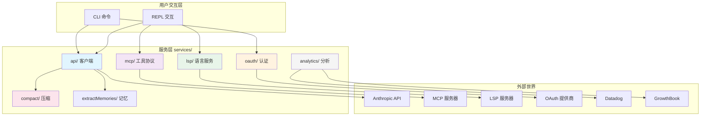
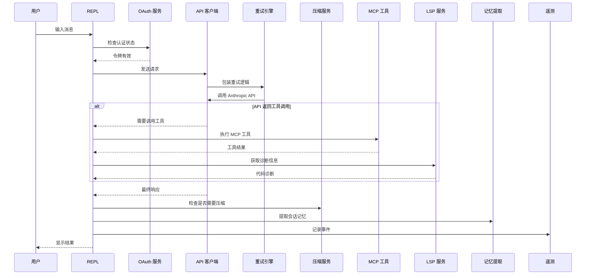

# 第1课：服务层概览 —— Claude Code 的外部集成架构

## 学习目标

1. 理解 Claude Code CLI 中 `services/` 目录的整体定位和作用
2. 掌握服务层各子模块（API、MCP、LSP、OAuth、Compact、Analytics）的职责划分
3. 了解服务层如何连接"内核"与"外部世界"
4. 学会用分层思维审视一个大型 TypeScript 项目

---

## 一、什么是"服务层"？—— 快递站的比喻

想象你经营一家网店：

- **你的大脑**（核心逻辑）决定卖什么、怎么定价
- **快递站**（服务层）负责把包裹寄出去、把退货收回来
- **快递公司**（外部 API / 协议）是真正跑腿的

Claude Code 的 `services/` 目录就是这个**快递站**。它不直接"思考"代码问题，而是负责：

| 职责 | 对应的子目录 | 类比 |
|------|-------------|------|
| 调用 Anthropic API | `api/` | 寄出包裹（发送请求） |
| 连接外部工具 | `mcp/` | 对接不同快递公司 |
| 获取代码智能 | `lsp/` | 专业质检服务 |
| 用户身份验证 | `oauth/` | 快递实名制验证 |
| 对话压缩 | `compact/` | 包裹瘦身打包 |
| 数据统计 | `analytics/` | 快递追踪系统 |
| 记忆提取 | `extractMemories/` | 重要信件归档 |
| 会话记忆 | `SessionMemory/` | 订单备忘录 |

---

## 二、源码目录全景图

在 Claude Code CLI 的源码中，`services/` 是一个关键的顶层目录：

```
claude-code-cli-master/
├── services/              ← 🎯 本课程的主角
│   ├── api/               ← API 客户端、错误处理、重试
│   ├── mcp/               ← Model Context Protocol 集成
│   ├── lsp/               ← Language Server Protocol 集成
│   ├── oauth/             ← OAuth 2.0 认证流程
│   ├── compact/           ← 上下文压缩算法
│   ├── analytics/         ← 遥测与特性标志
│   ├── extractMemories/   ← 自动记忆提取
│   ├── SessionMemory/     ← 会话记忆管理
│   ├── plugins/           ← 插件系统
│   ├── autoDream/         ← 自动梦境(后台整理)
│   ├── tools/             ← 工具执行服务
│   └── ...               ← 其他辅助服务
├── tools/                 ← 具体工具实现（Read、Write、Bash...）
├── commands/              ← CLI 命令处理
├── context/               ← 上下文管理
└── utils/                 ← 通用工具函数
```

---

## 三、服务层的六大核心模块

### 3.1 API 客户端 (`services/api/`)

这是 Claude Code 与 Anthropic API 通信的"大使馆"。核心文件包括：

```typescript
// services/api/client.ts — 客户端工厂函数
export async function getAnthropicClient({
  apiKey,
  maxRetries,
  model,
  fetchOverride,
  source,
}: {
  apiKey?: string
  maxRetries: number
  model?: string
  fetchOverride?: ClientOptions['fetch']
  source?: string
}): Promise<Anthropic> {
  // 支持多种提供商：Direct API、AWS Bedrock、Vertex AI、Foundry
  // ...
}
```

**关键能力**：
- 支持 4 种 API 提供商（Direct、Bedrock、Vertex、Foundry）
- 自动刷新 OAuth 令牌
- 智能重试机制（指数退避 + 抖动）

### 3.2 MCP 协议 (`services/mcp/`)

MCP（Model Context Protocol）让 Claude 能够调用外部工具和数据源。

```typescript
// services/mcp/types.ts — MCP 支持的传输类型
export const TransportSchema = lazySchema(() =>
  z.enum(['stdio', 'sse', 'sse-ide', 'http', 'ws', 'sdk']),
)
```

**关键能力**：
- 5 种传输方式（stdio、SSE、HTTP、WebSocket、SDK）
- 工具发现与注册
- 企业级权限控制（allowlist / denylist）

### 3.3 LSP 集成 (`services/lsp/`)

LSP（Language Server Protocol）为 Claude 提供代码级智能。

```typescript
// services/lsp/LSPClient.ts — LSP 客户端接口
export type LSPClient = {
  readonly capabilities: ServerCapabilities | undefined
  start: (command: string, args: string[]) => Promise<void>
  initialize: (params: InitializeParams) => Promise<InitializeResult>
  sendRequest: <TResult>(method: string, params: unknown) => Promise<TResult>
  stop: () => Promise<void>
}
```

**关键能力**：
- 代码诊断（错误提示）
- 代码导航（跳转定义）
- 文件同步通知

### 3.4 OAuth 认证 (`services/oauth/`)

确保用户身份安全的认证系统。

```typescript
// services/oauth/crypto.ts — PKCE 安全机制
export function generateCodeVerifier(): string {
  return base64URLEncode(randomBytes(32))
}

export function generateCodeChallenge(verifier: string): string {
  const hash = createHash('sha256')
  hash.update(verifier)
  return base64URLEncode(hash.digest())
}
```

**关键能力**：
- OAuth 2.0 + PKCE 流程
- 令牌自动刷新
- 多组织支持

### 3.5 上下文压缩 (`services/compact/`)

当对话变得太长时，自动压缩以节省上下文窗口。

**关键能力**：
- 三层压缩（微压缩 → 自动压缩 → 完整压缩）
- 智能保留最近文件状态
- Prompt-too-long 自动恢复

### 3.6 分析与遥测 (`services/analytics/`)

跟踪使用情况、管理特性标志。

```typescript
// services/analytics/index.ts — 事件日志接口
export function logEvent(
  eventName: string,
  metadata: LogEventMetadata,
): void {
  if (sink === null) {
    eventQueue.push({ eventName, metadata, async: false })
    return
  }
  sink.logEvent(eventName, metadata)
}
```

**关键能力**：
- 事件队列（启动前缓冲）
- GrowthBook 特性标志
- Datadog 日志上报

---

## 四、模块间的协作关系



---

## 五、请求的完整生命周期

当用户在 Claude Code 中输入一条消息时，服务层是这样协作的：



---

## 六、动手练习

### 练习 1：目录探索

浏览 `services/` 目录，回答以下问题：

1. `services/api/` 目录下有多少个 `.ts` 文件？各自负责什么？
2. `services/mcp/types.ts` 中定义了几种 MCP 服务器类型？
3. `services/compact/` 目录下哪个文件负责自动压缩决策？

### 练习 2：画一张你自己的架构图

用纸笔画出你理解的 Claude Code 服务层架构，标注：
- 每个模块的核心职责
- 模块之间的依赖关系
- 哪些模块面向外部网络

### 思考题

1. 为什么要把 API 调用、认证、工具协议分成不同的模块，而不是写在一个文件里？
2. 如果你要给 Claude Code 添加一个新的外部集成（比如接入 GitHub API），你会在 `services/` 下创建什么结构？
3. `analytics/index.ts` 中使用了事件队列缓冲机制，这解决了什么问题？

---

## 本课小结

- `services/` 是 Claude Code 连接外部世界的**服务层**，包含 6 大核心模块
- **API 客户端**负责与 Anthropic 通信，支持多种云提供商
- **MCP** 让 Claude 能调用外部工具，**LSP** 提供代码智能
- **OAuth** 保障认证安全，**Compact** 管理上下文窗口
- **Analytics** 提供遥测和特性标志控制
- 各模块之间通过清晰的接口协作，遵循**关注点分离**原则

## 下节预告

下一课我们将深入 `services/api/client.ts`，学习 API 客户端的**工厂模式**设计 —— 一个函数如何优雅地支持 4 种不同的 API 提供商（Direct、Bedrock、Vertex、Foundry），以及智能重试机制是如何保护你的请求不丢失的。
