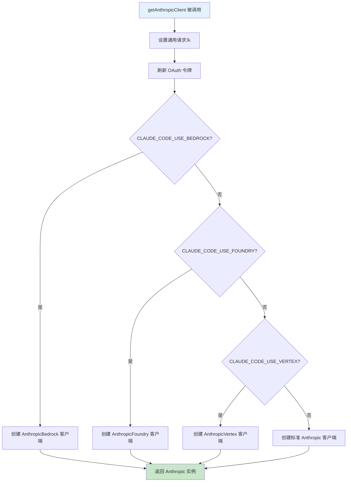
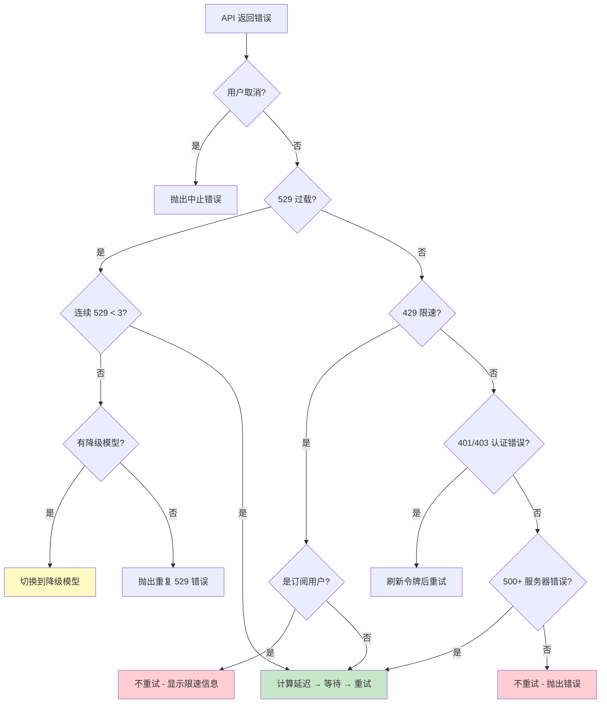

# 第2课：API 客户端封装 —— 工厂模式与智能重试

## 学习目标

1. 理解 `getAnthropicClient()` 工厂函数如何支持 4 种 API 提供商
2. 掌握工厂模式在真实项目中的应用场景
3. 学会 `withRetry()` 的指数退避 + 抖动算法
4. 了解 API 请求的完整生命周期（从发送到重试到降级）

---

## 一、"万能翻译机"的比喻

想象你要同时跟四个国家的客户打电话：

- **直连电话**（Direct API）—— 直接拨号，最简单
- **美国转接**（AWS Bedrock）—— 通过亚马逊中转
- **谷歌转接**（Google Vertex）—— 通过谷歌云中转
- **微软转接**（Azure Foundry）—— 通过微软中转

你需要一个"万能翻译机"，根据对方国家自动选择拨号方式。这就是 `getAnthropicClient()` 的工厂模式。

---

## 二、工厂函数：`getAnthropicClient()`

### 2.1 函数签名

```typescript
// services/api/client.ts
export async function getAnthropicClient({
  apiKey,
  maxRetries,
  model,
  fetchOverride,
  source,
}: {
  apiKey?: string
  maxRetries: number
  model?: string
  fetchOverride?: ClientOptions['fetch']
  source?: string
}): Promise<Anthropic> {
  // ...根据环境变量选择不同的客户端
}
```

### 2.2 四条分支路径

函数内部通过环境变量判断使用哪种提供商：



### 2.3 通用配置（所有提供商共享）

```typescript
// 所有提供商共享的基础配置
const ARGS = {
  defaultHeaders,           // 通用请求头
  maxRetries,               // 最大重试次数
  timeout: parseInt(        // 超时时间（默认 10 分钟）
    process.env.API_TIMEOUT_MS || String(600 * 1000), 10
  ),
  dangerouslyAllowBrowser: true,
  fetchOptions: getProxyFetchOptions({ forAnthropicAPI: true }),
}
```

### 2.4 Bedrock 分支细节

```typescript
if (isEnvTruthy(process.env.CLAUDE_CODE_USE_BEDROCK)) {
  const { AnthropicBedrock } = await import('@anthropic-ai/bedrock-sdk')

  // 支持小模型使用不同 AWS 区域
  const awsRegion =
    model === getSmallFastModel() &&
    process.env.ANTHROPIC_SMALL_FAST_MODEL_AWS_REGION
      ? process.env.ANTHROPIC_SMALL_FAST_MODEL_AWS_REGION
      : getAWSRegion()

  const bedrockArgs = {
    ...ARGS,
    awsRegion,
    // 支持 Bearer Token 和 AWS 凭证两种认证方式
  }

  return new AnthropicBedrock(bedrockArgs) as unknown as Anthropic
}
```

**设计亮点**：使用 `await import()` 动态导入，未使用的 SDK 不会被加载，减小包体积。

---

## 三、请求追踪：`buildFetch()`

每个 API 请求都会被注入一个唯一的客户端请求 ID：

```typescript
function buildFetch(
  fetchOverride: ClientOptions['fetch'],
  source: string | undefined,
): ClientOptions['fetch'] {
  const inner = fetchOverride ?? globalThis.fetch
  return (input, init) => {
    const headers = new Headers(init?.headers)
    // 注入唯一请求 ID，即使超时也能与服务器日志关联
    if (!headers.has(CLIENT_REQUEST_ID_HEADER)) {
      headers.set(CLIENT_REQUEST_ID_HEADER, randomUUID())
    }
    return inner(input, { ...init, headers })
  }
}
```

这就像给每个快递包裹贴上追踪号码 —— 即使包裹丢了，也能查到它最后出现在哪里。

---

## 四、智能重试：`withRetry()`

### 4.1 为什么需要重试？

API 调用可能因为网络抖动、服务器过载、令牌过期等原因失败。`withRetry()` 是一个**异步生成器**，它在重试等待期间会向调用者汇报状态。

### 4.2 核心参数

```typescript
// services/api/withRetry.ts
const DEFAULT_MAX_RETRIES = 10     // 默认最多重试 10 次
const BASE_DELAY_MS = 500          // 基础延迟 500ms
const MAX_529_RETRIES = 3          // 529（过载）最多重试 3 次
```

### 4.3 指数退避 + 抖动算法

```typescript
export function getRetryDelay(
  attempt: number,
  retryAfterHeader?: string | null,
  maxDelayMs = 32000,
): number {
  // 如果服务器告诉了我们等多久，就听它的
  if (retryAfterHeader) {
    const seconds = parseInt(retryAfterHeader, 10)
    if (!isNaN(seconds)) {
      return seconds * 1000
    }
  }

  // 指数退避：500ms, 1s, 2s, 4s, 8s, 16s, 32s
  const baseDelay = Math.min(
    BASE_DELAY_MS * Math.pow(2, attempt - 1),
    maxDelayMs,
  )
  // 加入 25% 的随机抖动，避免"惊群效应"
  const jitter = Math.random() * 0.25 * baseDelay
  return baseDelay + jitter
}
```

**生活类比**：就像排队买奶茶 —— 第一次排了 30 秒发现排错了，第二次等 1 分钟，第三次等 2 分钟……而且每次都随机抖动一下，免得所有人同时冲过去。

### 4.4 重试延迟可视化

```
尝试 1: |====| 500ms
尝试 2: |========| 1000ms
尝试 3: |================| 2000ms
尝试 4: |================================| 4000ms
尝试 5: |================================================================| 8000ms
         ↑ 加上 25% 随机抖动
```

### 4.5 重试决策流程



---

## 五、降级策略：模型回退

当主模型反复过载时，系统会自动降级到备用模型：

```typescript
export class FallbackTriggeredError extends Error {
  constructor(
    public readonly originalModel: string,
    public readonly fallbackModel: string,
  ) {
    super(`Model fallback triggered: ${originalModel} -> ${fallbackModel}`)
  }
}
```

降级链示例：
- `opus-4-6` → `opus-4-1`
- `sonnet-4-6` → `sonnet-4-5`
- `sonnet-4-5` → `sonnet-4-0`

---

## 六、持久重试模式

对于无人值守的会话（CI/CD 场景），系统提供了"永不放弃"模式：

```typescript
const PERSISTENT_MAX_BACKOFF_MS = 5 * 60 * 1000     // 最大退避 5 分钟
const PERSISTENT_RESET_CAP_MS = 6 * 60 * 60 * 1000  // 最长等待 6 小时
const HEARTBEAT_INTERVAL_MS = 30_000                  // 每 30 秒心跳

function isPersistentRetryEnabled(): boolean {
  return isEnvTruthy(process.env.CLAUDE_CODE_UNATTENDED_RETRY)
}
```

在持久模式下，重试循环不会终止，而是不断发送心跳，防止会话被服务器关闭。

---

## 七、动手练习

### 练习 1：理解工厂模式

阅读 `services/api/client.ts`，画出以下情况的执行路径：
1. 设置了 `CLAUDE_CODE_USE_BEDROCK=1` 和 `AWS_BEARER_TOKEN_BEDROCK=xxx`
2. 设置了 `CLAUDE_CODE_USE_VERTEX=1` 且跳过了认证

### 练习 2：计算重试延迟

使用 `getRetryDelay()` 的公式，计算以下场景的延迟时间（不考虑抖动）：
1. 第 1 次重试
2. 第 5 次重试
3. 第 8 次重试（提示：会命中 maxDelayMs）

### 思考题

1. 为什么使用 `await import()` 而不是顶层 `import` 来加载 Bedrock/Vertex SDK？
2. 指数退避中加入"抖动"解决了什么问题？如果 100 个客户端同时重试会怎样？
3. 持久重试模式的"心跳"机制解决了什么问题？

---

## 本课小结

- `getAnthropicClient()` 是一个**工厂函数**，根据环境变量创建不同提供商的客户端
- 所有客户端共享统一的请求头、超时设置和代理配置
- `withRetry()` 实现了**指数退避 + 随机抖动**的重试策略
- 连续 529 错误会触发**模型降级**机制
- 持久模式为无人值守场景提供了**永不放弃 + 心跳**的可靠性保障

## 下节预告

下一课我们将深入 `services/api/errors.ts`，学习 Claude Code 如何将几十种不同的 API 错误分类为有意义的用户提示 —— 从 "prompt too long" 到 "credit balance too low"，每种错误都有精心设计的处理策略。
