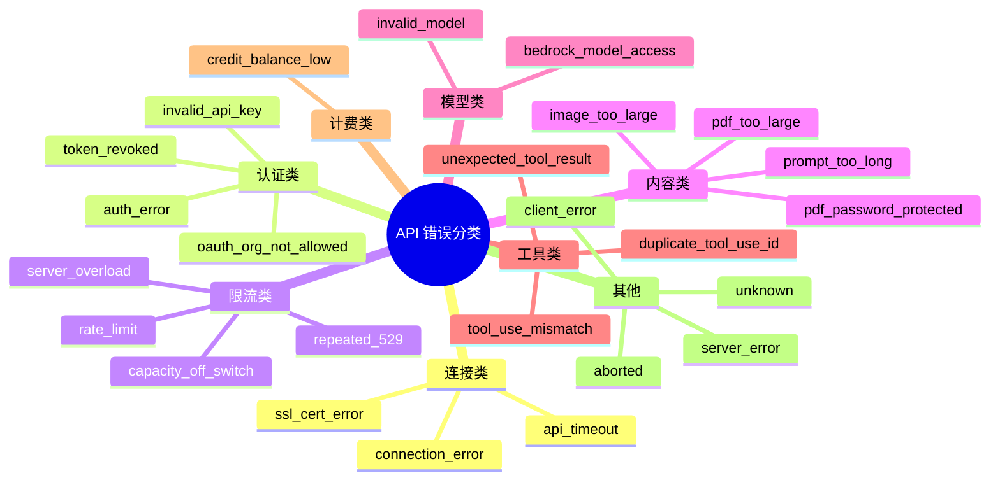
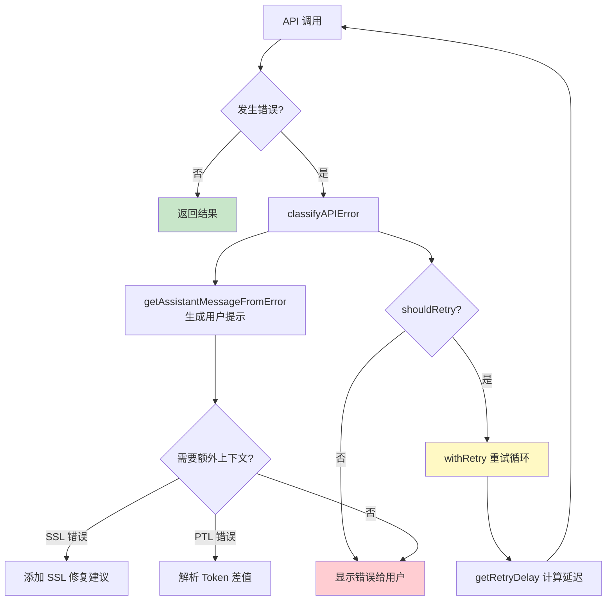

# 第3课：错误分类与降级策略详解

## 学习目标

1. 理解 Claude Code 如何将 API 错误分类为 20+ 种具体类型
2. 掌握错误处理的分层架构：识别 → 分类 → 提示 → 恢复
3. 学会 SSL/TLS 错误链遍历技术
4. 了解"用户友好错误提示"的设计哲学

---

## 一、"医院分诊台"的比喻

当你去医院看病，分诊台护士会先判断：
- 发烧 → 去内科
- 骨折 → 去骨科
- 过敏 → 去皮肤科
- 心脏骤停 → 立刻急救

Claude Code 的错误处理系统也是这样一个**分诊台**。API 返回的原始错误千奇百怪，系统必须快速分类，决定：给用户看什么提示？是否可以重试？要不要降级？

---

## 二、错误分类体系

### 2.1 `classifyAPIError()` —— 错误分诊函数

```typescript
// services/api/errors.ts
export function classifyAPIError(error: unknown): string {
  // 用户取消
  if (error instanceof Error && error.message === 'Request was aborted.') {
    return 'aborted'
  }
  // 超时
  if (error instanceof APIConnectionTimeoutError) {
    return 'api_timeout'
  }
  // 限速
  if (error instanceof APIError && error.status === 429) {
    return 'rate_limit'
  }
  // 服务器过载
  if (error instanceof APIError && error.status === 529) {
    return 'server_overload'
  }
  // ... 20+ 种错误类型
  return 'unknown'
}
```

### 2.2 完整的错误分类表



---

## 三、用户友好的错误提示

### 3.1 提示信息设计原则

Claude Code 的错误提示遵循一个公式：**问题描述 · 操作建议**

```typescript
export const INVALID_API_KEY_ERROR_MESSAGE =
  'Not logged in · Please run /login'

export const CREDIT_BALANCE_TOO_LOW_ERROR_MESSAGE =
  'Credit balance is too low'

export const TOKEN_REVOKED_ERROR_MESSAGE =
  'OAuth token revoked · Please run /login'
```

### 3.2 场景感知的提示

同一个错误在不同场景下显示不同提示：

```typescript
export function getImageTooLargeErrorMessage(): string {
  return getIsNonInteractiveSession()
    ? 'Image was too large. Try resizing the image or using a different approach.'
    : 'Image was too large. Double press esc to go back and try again with a smaller image.'
}
```

| 场景 | 提示内容 |
|------|---------|
| CLI 交互模式 | "按两次 esc 返回" |
| SDK/CI 模式 | "尝试缩小图片或换一种方式" |

### 3.3 `getAssistantMessageFromError()` —— 错误消息构建器

这个函数是错误处理的核心调度器，包含 20+ 个 `if` 分支，每个分支处理一种特定错误：

```typescript
export function getAssistantMessageFromError(
  error: unknown,
  model: string,
): AssistantMessage {
  // 1. 超时错误
  if (error instanceof APIConnectionTimeoutError) {
    return createAssistantAPIErrorMessage({
      content: API_TIMEOUT_ERROR_MESSAGE,
      error: 'unknown',
    })
  }

  // 2. 429 限速 —— 最复杂的分支
  if (error instanceof APIError && error.status === 429) {
    // 解析新版限速头
    const rateLimitType = error.headers?.get?.(
      'anthropic-ratelimit-unified-representative-claim',
    )
    // ... 复杂的限速处理逻辑
  }

  // 3. Prompt 过长
  if (error.message.toLowerCase().includes('prompt is too long')) {
    return createAssistantAPIErrorMessage({
      content: PROMPT_TOO_LONG_ERROR_MESSAGE,
      error: 'invalid_request',
      errorDetails: error.message,  // 保留原始信息用于重试
    })
  }

  // ... 更多分支
}
```

---

## 四、SSL/TLS 错误链遍历

### 4.1 为什么需要遍历错误链？

企业用户常常在 TLS 代理（如 Zscaler）后面，这会导致 SSL 证书错误。但 Anthropic SDK 把底层错误包装了好几层。

### 4.2 错误链遍历算法

```typescript
// services/api/errorUtils.ts
export function extractConnectionErrorDetails(
  error: unknown,
): ConnectionErrorDetails | null {
  let current: unknown = error
  const maxDepth = 5  // 最多遍历 5 层，防止无限循环

  while (current && depth < maxDepth) {
    if (
      current instanceof Error &&
      'code' in current &&
      typeof current.code === 'string'
    ) {
      const code = current.code
      const isSSLError = SSL_ERROR_CODES.has(code)
      return { code, message: current.message, isSSLError }
    }
    // 沿 cause 链向下走
    if (current instanceof Error && 'cause' in current) {
      current = current.cause
      depth++
    } else {
      break
    }
  }
  return null
}
```

**生活类比**：就像打开一个俄罗斯套娃 —— 外面是"连接错误"，拆开是"TLS 握手失败"，再拆开才是真正的"证书已过期"。

### 4.3 SSL 错误码集合

```typescript
const SSL_ERROR_CODES = new Set([
  'UNABLE_TO_VERIFY_LEAF_SIGNATURE',    // 无法验证叶证书
  'DEPTH_ZERO_SELF_SIGNED_CERT',        // 自签名证书
  'SELF_SIGNED_CERT_IN_CHAIN',          // 链中有自签名证书
  'CERT_HAS_EXPIRED',                    // 证书已过期
  'CERT_REVOKED',                        // 证书被吊销
  'ERR_TLS_CERT_ALTNAME_INVALID',       // 主机名不匹配
  // ...
])
```

### 4.4 针对性的 SSL 错误提示

```typescript
export function formatAPIError(error: APIError): string {
  const connectionDetails = extractConnectionErrorDetails(error)

  if (connectionDetails?.isSSLError) {
    switch (connectionDetails.code) {
      case 'DEPTH_ZERO_SELF_SIGNED_CERT':
        return 'Unable to connect to API: Self-signed certificate detected. Check your proxy or corporate SSL certificates'
      case 'CERT_HAS_EXPIRED':
        return 'Unable to connect to API: SSL certificate has expired'
      // ...
    }
  }
}
```

---

## 五、Prompt-Too-Long 的 Token 解析

### 5.1 从错误消息中提取 Token 数量

```typescript
export function parsePromptTooLongTokenCounts(rawMessage: string): {
  actualTokens: number | undefined
  limitTokens: number | undefined
} {
  // 匹配："prompt is too long: 137500 tokens > 135000 maximum"
  const match = rawMessage.match(
    /prompt is too long[^0-9]*(\d+)\s*tokens?\s*>\s*(\d+)/i,
  )
  return {
    actualTokens: match ? parseInt(match[1]!, 10) : undefined,
    limitTokens: match ? parseInt(match[2]!, 10) : undefined,
  }
}
```

### 5.2 计算超出的 Token 差值

```typescript
export function getPromptTooLongTokenGap(
  msg: AssistantMessage,
): number | undefined {
  const { actualTokens, limitTokens } = parsePromptTooLongTokenCounts(
    msg.errorDetails,
  )
  const gap = actualTokens - limitTokens
  return gap > 0 ? gap : undefined
}
```

这个差值被压缩模块用来**精确裁剪**上下文，而不是盲目地删除。

---

## 六、错误处理流程总览



---

## 七、动手练习

### 练习 1：错误分类练习

对以下错误场景，说出 `classifyAPIError()` 会返回什么值：

1. HTTP 状态码 429，无限速头
2. HTTP 状态码 401，错误消息包含 "x-api-key"
3. `APIConnectionError`，底层 `cause.code` 为 `DEPTH_ZERO_SELF_SIGNED_CERT`
4. HTTP 状态码 400，消息包含 "prompt is too long: 200000 tokens > 180000"

### 练习 2：解析练习

给定错误消息 `"prompt is too long: 137500 tokens > 135000 maximum"`，手动执行 `parsePromptTooLongTokenCounts()` 的正则匹配，写出返回值。

### 思考题

1. 为什么 `getAssistantMessageFromError()` 要区分交互模式和非交互模式？
2. SSL 错误链最多遍历 5 层 (`maxDepth = 5`)，为什么不设更大？
3. 错误分类函数为什么要返回字符串而不是枚举？这对 Datadog 统计有什么好处？

---

## 本课小结

- Claude Code 将 API 错误分为 **20+ 种类型**，每种都有专门的处理策略
- 错误提示遵循 **"问题 · 操作建议"** 格式，并根据运行环境调整
- SSL 错误通过**错误链遍历**技术从嵌套的 `cause` 中提取真正的错误码
- Prompt-Too-Long 错误会解析出**精确的 Token 差值**，供压缩模块使用
- 整个系统形成 **识别 → 分类 → 提示 → 恢复** 的完整闭环

## 下节预告

下一课我们将进入 MCP（Model Context Protocol）的世界 —— 学习 Claude Code 如何通过一套开放协议连接外部工具，让 AI 能够读取数据库、操作 Slack、甚至控制浏览器。
