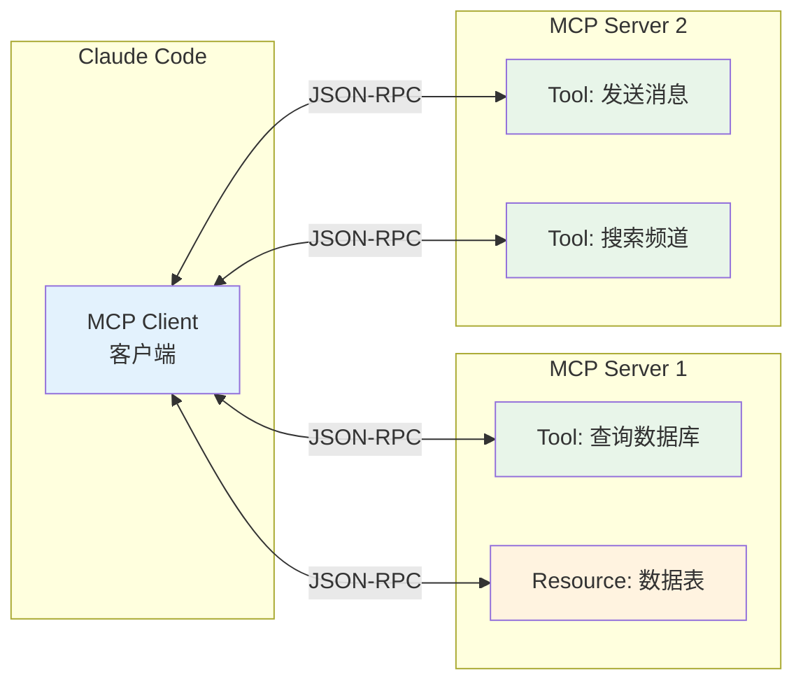
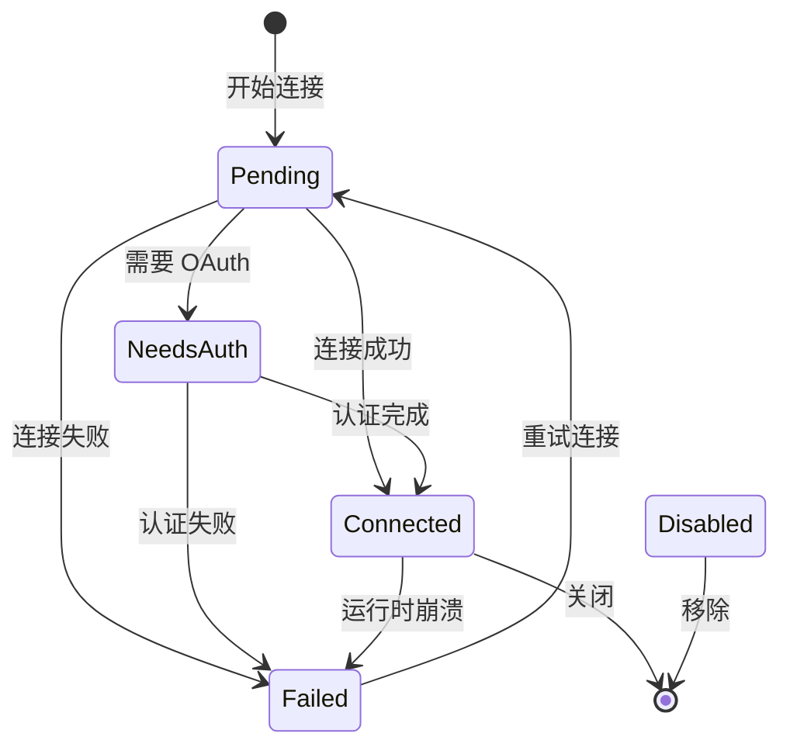
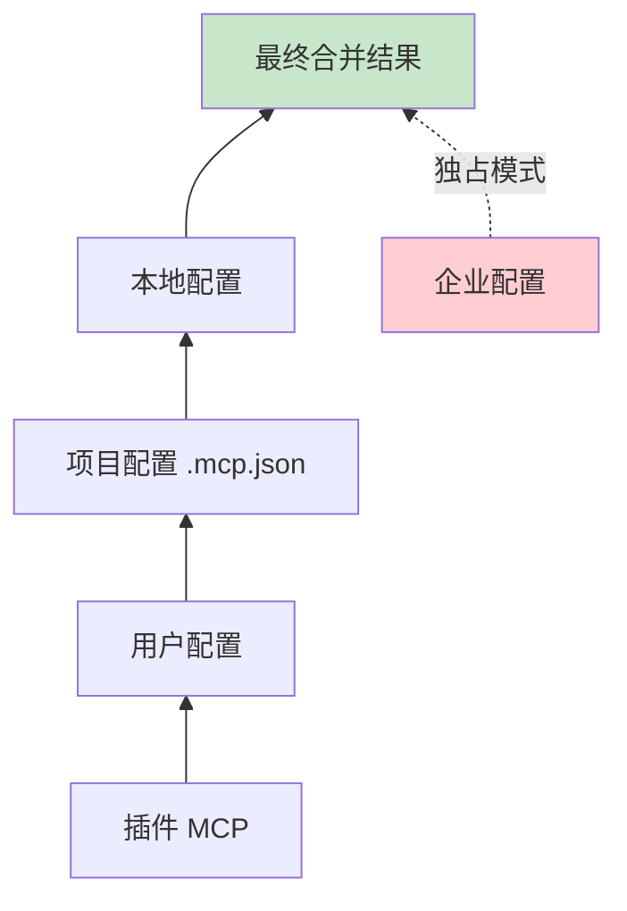
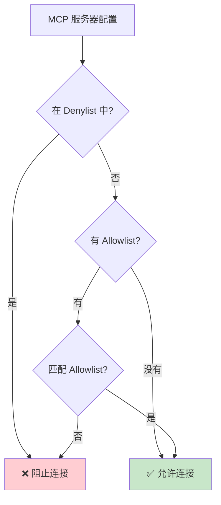

# 第4课：MCP 模型上下文协议深入

## 学习目标

1. 理解 MCP（Model Context Protocol）的设计理念和解决的问题
2. 掌握 MCP 的核心概念：Server、Client、Tool、Resource
3. 学会从源码中识别 MCP 服务器的配置体系（类型定义、作用域、策略过滤）
4. 了解 MCP 连接的生命周期和状态管理

---

## 一、"万能插座"的比喻

想象你有一台笔记本电脑，要在全世界使用：

- 在中国用三孔插座
- 在美国用两孔扁插
- 在英国用三孔方插
- 在澳洲又是另一种

你需要一个**万能转换插头** —— 它有统一的输入接口，但能适配不同国家的插座。

MCP 就是 AI 世界的"万能转换插头"：

- **统一接口**：AI 模型用标准方式调用工具
- **多种插座**：数据库、Slack、GitHub、浏览器……
- **标准化协议**：不管后端是什么技术栈，接口都一样

---

## 二、MCP 的核心概念

### 2.1 四大组件



| 组件 | 作用 | 类比 |
|------|------|------|
| **Client** | 发起请求的一方（Claude Code） | 你的手机 |
| **Server** | 提供工具和资源的一方 | App 后端 |
| **Tool** | 可执行的操作（函数调用） | App 的功能按钮 |
| **Resource** | 可读取的数据 | App 展示的内容 |

### 2.2 连接状态

```typescript
// services/mcp/types.ts — 五种连接状态
export type MCPServerConnection =
  | ConnectedMCPServer    // 已连接，可用
  | FailedMCPServer       // 连接失败
  | NeedsAuthMCPServer    // 需要认证
  | PendingMCPServer      // 连接中
  | DisabledMCPServer     // 被禁用
```



---

## 三、MCP 服务器类型定义

### 3.1 八种服务器类型

```typescript
// services/mcp/types.ts
export const McpServerConfigSchema = lazySchema(() =>
  z.union([
    McpStdioServerConfigSchema(),     // stdio: 本地子进程
    McpSSEServerConfigSchema(),       // sse: 服务器推送事件
    McpSSEIDEServerConfigSchema(),    // sse-ide: IDE 专用 SSE
    McpWebSocketIDEServerConfigSchema(), // ws-ide: IDE 专用 WebSocket
    McpHTTPServerConfigSchema(),      // http: HTTP 流式传输
    McpWebSocketServerConfigSchema(), // ws: WebSocket
    McpSdkServerConfigSchema(),       // sdk: SDK 内嵌
    McpClaudeAIProxyServerConfigSchema(), // claudeai-proxy: Claude.ai 代理
  ]),
)
```

### 3.2 各类型配置详解

**Stdio 类型**（最常见）：
```typescript
export const McpStdioServerConfigSchema = lazySchema(() =>
  z.object({
    type: z.literal('stdio').optional(), // 可省略（向后兼容）
    command: z.string().min(1),          // 启动命令
    args: z.array(z.string()).default([]), // 命令参数
    env: z.record(z.string(), z.string()).optional(), // 环境变量
  }),
)
```

**HTTP 类型**（远程服务）：
```typescript
export const McpHTTPServerConfigSchema = lazySchema(() =>
  z.object({
    type: z.literal('http'),
    url: z.string(),                     // 服务器 URL
    headers: z.record(z.string(), z.string()).optional(),
    oauth: McpOAuthConfigSchema().optional(), // 可选 OAuth 认证
  }),
)
```

---

## 四、配置管理的作用域体系

### 4.1 七种配置作用域

```typescript
export const ConfigScopeSchema = lazySchema(() =>
  z.enum([
    'local',       // 项目本地 (.claude/settings.local.json)
    'user',        // 用户全局 (~/.claude.json)
    'project',     // 项目共享 (.mcp.json)
    'dynamic',     // 运行时动态注入
    'enterprise',  // 企业管理
    'claudeai',    // Claude.ai 连接器
    'managed',     // 托管配置
  ]),
)
```

### 4.2 配置优先级



企业配置有**独占控制权** —— 如果存在企业 MCP 配置文件，其他所有来源都会被忽略。

### 4.3 多层配置合并代码

```typescript
// services/mcp/config.ts
export async function getClaudeCodeMcpConfigs(): Promise<{
  servers: Record<string, ScopedMcpServerConfig>
}> {
  // 检查企业配置是否存在
  if (doesEnterpriseMcpConfigExist()) {
    return { servers: filtered, errors: [] }  // 独占返回
  }

  // 否则按优先级合并
  const configs = Object.assign(
    {},
    dedupedPluginServers,    // 最低优先级
    userServers,             // 用户配置
    approvedProjectServers,  // 项目配置（需审批）
    localServers,            // 最高优先级
  )
  // ...
}
```

---

## 五、安全策略：Allowlist / Denylist

### 5.1 双重过滤机制



### 5.2 三种匹配维度

```typescript
// 按名称匹配
{ serverName: 'my-slack-server' }

// 按命令匹配（stdio 服务器）
{ serverCommand: ['npx', '@modelcontextprotocol/server-slack'] }

// 按 URL 匹配（远程服务器，支持通配符）
{ serverUrl: 'https://*.example.com/*' }
```

### 5.3 URL 通配符匹配

```typescript
function urlPatternToRegex(pattern: string): RegExp {
  const escaped = pattern.replace(/[.+?^${}()|[\]\\]/g, '\\$&')
  const regexStr = escaped.replace(/\*/g, '.*')
  return new RegExp(`^${regexStr}$`)
}
```

示例：
- `https://example.com/*` → 匹配 `https://example.com/api/v1`
- `https://*.example.com/*` → 匹配 `https://api.example.com/path`

---

## 六、插件去重机制

当多个配置源提供了相同的 MCP 服务器时，需要去重：

```typescript
// 计算服务器"指纹"
export function getMcpServerSignature(config: McpServerConfig): string | null {
  const cmd = getServerCommandArray(config)
  if (cmd) {
    return `stdio:${jsonStringify(cmd)}`  // stdio → 命令指纹
  }
  const url = getServerUrl(config)
  if (url) {
    return `url:${unwrapCcrProxyUrl(url)}`  // 远程 → URL 指纹
  }
  return null  // SDK 类型没有指纹
}
```

去重规则：
1. **手动配置 > 插件配置**：同一服务器，手动优先
2. **先注册 > 后注册**：插件之间先到先得
3. **启用的 > 禁用的**：只有启用的配置参与去重

---

## 七、动手练习

### 练习 1：配置文件编写

编写一个 `.mcp.json` 文件，配置以下两个 MCP 服务器：
1. 一个 Stdio 类型的 Slack 服务器
2. 一个 HTTP 类型的自定义 API 服务器

### 练习 2：安全策略设计

设计一套企业级 MCP 安全策略：
- 只允许名为 `slack` 和 `github` 的服务器
- 拒绝所有 URL 匹配 `http://localhost:*` 的服务器
- 允许所有 `https://*.company.com/*` 的远程服务器

### 思考题

1. 为什么企业配置拥有"独占控制权"而不是简单的最高优先级？
2. CCR（Claude Code Remote）代理 URL 需要"解包"后再去重，这解决了什么问题？
3. `lazySchema()` 延迟初始化 Zod schema 的好处是什么？

---

## 本课小结

- MCP 是 AI 调用外部工具的**标准化协议**，基于 JSON-RPC
- 支持 **8 种服务器类型**（stdio、sse、http、ws 等）
- 配置体系有 **7 种作用域**，企业配置拥有独占控制权
- 安全策略采用 **Denylist 优先 + Allowlist 过滤** 的双重机制
- 去重算法通过**服务器指纹**（命令或 URL）避免重复连接

## 下节预告

下一课我们将深入 MCP 的**五种传输方式**（Stdio、SSE、HTTP、WebSocket、In-Process），学习 Claude Code 如何根据不同场景选择最佳传输方式，以及工具发现与注册的完整流程。
