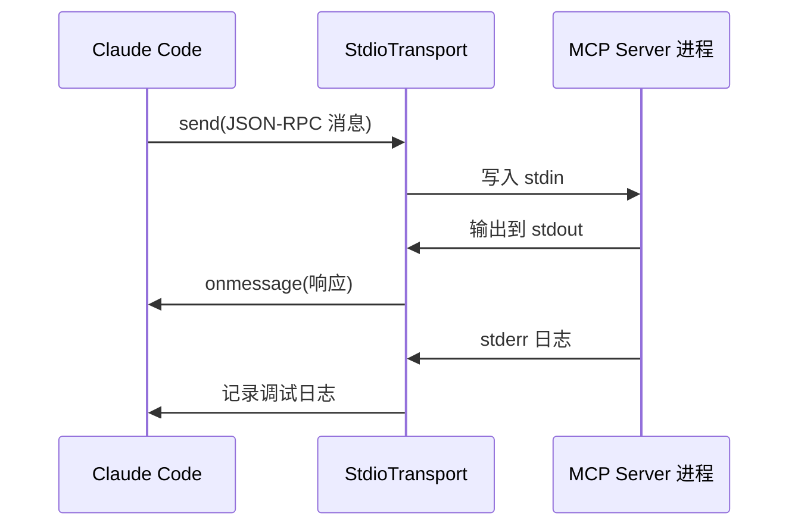
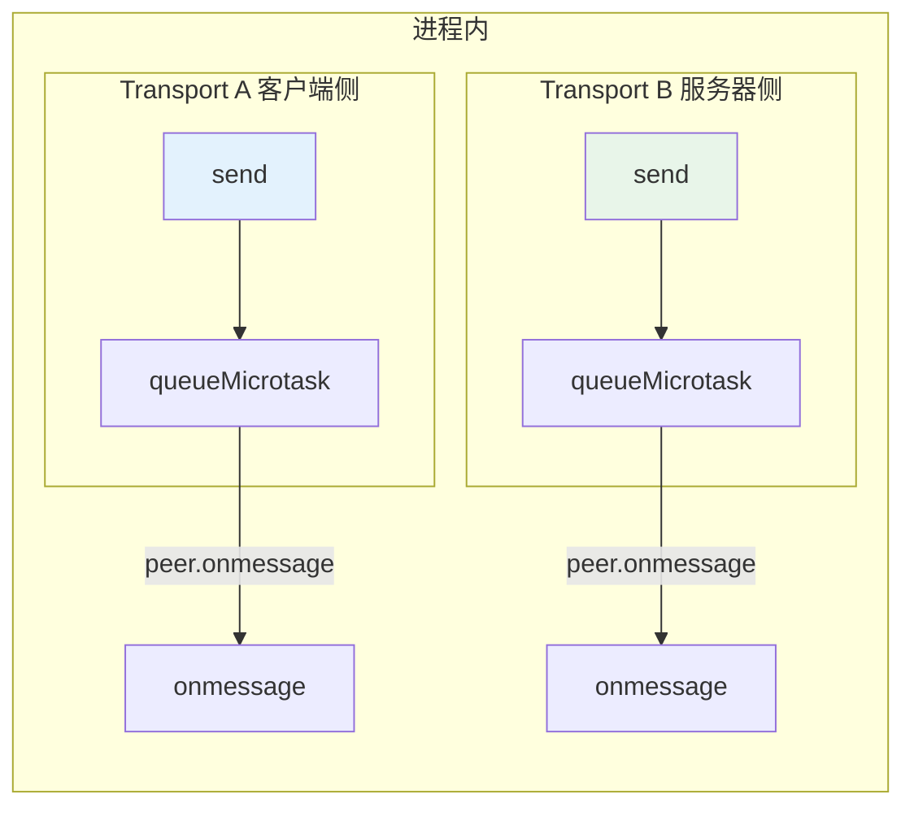
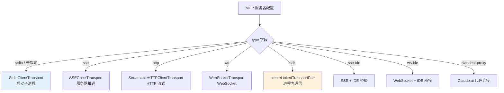
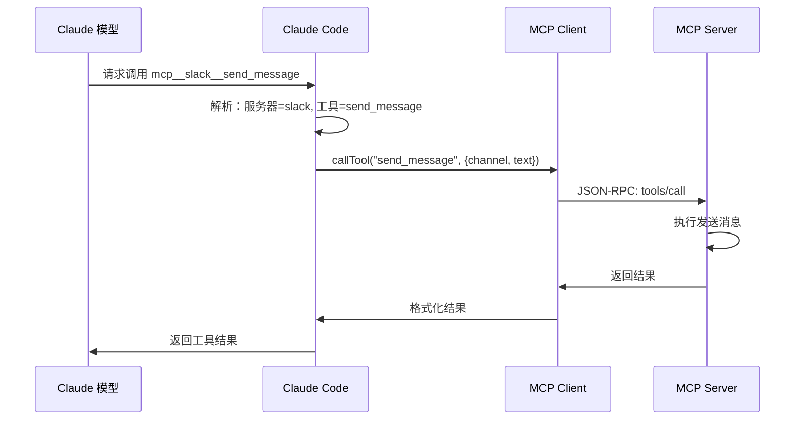

# 第5课：MCP 五种传输方式与工具发现

## 学习目标

1. 理解 MCP 五种传输方式的适用场景和技术差异
2. 掌握 In-Process Transport 的双向消息传递原理
3. 学会 MCP 工具发现、注册和调用的完整流程
4. 了解环境变量展开和配置验证的实现细节

---

## 一、"通信方式"的比喻

想象你要联系不同类型的合作伙伴：

| 传输方式 | 类比 | 特点 |
|---------|------|------|
| **Stdio** | 对讲机 | 最简单，面对面，延迟低 |
| **SSE** | 广播电台 | 服务器单向推送，客户端HTTP请求 |
| **HTTP** | 打电话 | 一来一回，标准请求/响应 |
| **WebSocket** | 视频通话 | 双向实时，保持长连接 |
| **In-Process** | 自言自语 | 同进程内通信，零延迟 |

---

## 二、Stdio 传输 —— 最经典的方式

Stdio 通过子进程的标准输入/输出进行通信：

```typescript
// MCP SDK 的 StdioClientTransport
import { StdioClientTransport } from '@modelcontextprotocol/sdk/client/stdio.js'

// 启动 MCP 服务器子进程
const transport = new StdioClientTransport({
  command: 'npx',
  args: ['@modelcontextprotocol/server-slack'],
  env: { SLACK_TOKEN: 'xoxb-...' },
})
```



---

## 三、HTTP/SSE 传输 —— 远程服务器

### 3.1 SSE（Server-Sent Events）

```typescript
import {
  SSEClientTransport,
} from '@modelcontextprotocol/sdk/client/sse.js'

// SSE 连接：服务器可以主动推送
const transport = new SSEClientTransport(url, {
  requestInit: {
    headers: { Authorization: 'Bearer token' }
  }
})
```

### 3.2 Streamable HTTP

```typescript
import {
  StreamableHTTPClientTransport,
} from '@modelcontextprotocol/sdk/client/streamableHttp.js'

// HTTP 流式传输：支持双向流
const transport = new StreamableHTTPClientTransport(url, {
  requestInit: {
    headers: customHeaders
  }
})
```

---

## 四、WebSocket 传输 —— 实时双向

```typescript
import { WebSocketTransport } from '../../utils/mcpWebSocketTransport.js'

// WebSocket 连接
const transport = new WebSocketTransport(url, {
  headers: customHeaders,
  // 支持 TLS 客户端证书
  ...getWebSocketTLSOptions(),
  // 支持 HTTP 代理
  agent: getWebSocketProxyAgent(),
})
```

---

## 五、In-Process 传输 —— 零延迟通信

这是最有趣的传输方式 —— 在同一个进程内创建一对"互相连接"的传输通道：

```typescript
// services/mcp/InProcessTransport.ts
class InProcessTransport implements Transport {
  private peer: InProcessTransport | undefined
  private closed = false

  onmessage?: (message: JSONRPCMessage) => void

  async send(message: JSONRPCMessage): Promise<void> {
    if (this.closed) {
      throw new Error('Transport is closed')
    }
    // 异步投递到对端，避免栈溢出
    queueMicrotask(() => {
      this.peer?.onmessage?.(message)
    })
  }

  async close(): Promise<void> {
    if (this.closed) return
    this.closed = true
    this.onclose?.()
    // 同时关闭对端
    if (this.peer && !this.peer.closed) {
      this.peer.closed = true
      this.peer.onclose?.()
    }
  }
}

// 创建配对的传输通道
export function createLinkedTransportPair(): [Transport, Transport] {
  const a = new InProcessTransport()
  const b = new InProcessTransport()
  a._setPeer(b)  // A 的发送 → B 的接收
  b._setPeer(a)  // B 的发送 → A 的接收
  return [a, b]
}
```

### 工作原理图



**为什么用 `queueMicrotask` 而不是直接调用？**

避免同步请求/响应导致的栈溢出。如果 A 发送消息后 B 立即响应，B 的响应又触发 A 的处理……无限递归！微任务队列打破了这个同步调用链。

---

## 六、传输方式选择决策



---

## 七、工具发现与注册

### 7.1 连接后列出工具

```typescript
// 连接 MCP 服务器后，列出可用工具
const toolsResult: ListToolsResult = await client.listTools()

// 工具定义结构
interface SerializedTool {
  name: string
  description: string
  inputJSONSchema?: {
    type: 'object'
    properties?: Record<string, unknown>
  }
  isMcp?: boolean
  originalToolName?: string  // MCP 原始名称
}
```

### 7.2 工具名称规范化

MCP 工具名称需要转换为 Claude API 兼容的格式：

```typescript
// services/mcp/mcpStringUtils.ts
// "server-name" + "tool-name" → "mcp__server_name__tool_name"
export function buildMcpToolName(
  serverName: string,
  toolName: string,
): string {
  // 规范化：替换特殊字符，添加前缀
}
```

### 7.3 工具调用流程



---

## 八、环境变量展开

MCP 配置中的字符串可以包含环境变量引用：

```typescript
// services/mcp/config.ts — expandEnvVars
function expandEnvVars(config: McpServerConfig): {
  expanded: McpServerConfig
  missingVars: string[]
} {
  function expandString(str: string): string {
    const { expanded, missingVars: vars } = expandEnvVarsInString(str)
    missingVars.push(...vars)
    return expanded
  }

  // 对不同类型的配置展开不同字段
  switch (config.type) {
    case 'stdio':
      return {
        command: expandString(config.command),
        args: config.args.map(expandString),
        env: config.env ? mapValues(config.env, expandString) : undefined,
      }
    case 'http':
      return {
        url: expandString(config.url),
        headers: config.headers ? mapValues(config.headers, expandString) : undefined,
      }
  }
}
```

示例配置：
```json
{
  "mcpServers": {
    "my-db": {
      "command": "npx",
      "args": ["@mcp/server-postgres"],
      "env": {
        "DATABASE_URL": "${POSTGRES_URL}"
      }
    }
  }
}
```

---

## 九、动手练习

### 练习 1：In-Process Transport 模拟

用伪代码模拟以下场景：
1. 创建一对 linked transport
2. A 端发送 `{ method: "hello" }`
3. B 端接收并回复 `{ result: "world" }`
4. A 端接收回复

### 练习 2：传输方式选择

对以下场景，选择最合适的传输方式并说明理由：
1. 本地运行的 Python 脚本作为 MCP 服务器
2. 远程的 Slack API 网关
3. VS Code 插件提供的工具
4. 嵌入在同一个 Node.js 进程中的工具

### 思考题

1. `queueMicrotask` 和 `setTimeout(fn, 0)` 有什么区别？为什么 In-Process Transport 选择前者？
2. 为什么 MCP 工具名称需要规范化？如果两个不同 MCP 服务器的工具同名怎么办？
3. 环境变量展开时如果变量不存在（`missingVars`），为什么不直接报错而是记录下来？

---

## 本课小结

- MCP 支持 **5 种核心传输方式**：Stdio、SSE、HTTP、WebSocket、In-Process
- **In-Process Transport** 通过配对的传输通道实现零延迟进程内通信
- `queueMicrotask` 避免了同步消息循环导致的栈溢出
- 工具发现通过 `listTools()` 完成，名称经过**规范化**后注入 Claude 工具列表
- 环境变量展开支持 `${VAR}` 语法，缺失的变量会被**记录但不阻塞**

## 下节预告

下一课我们将学习 LSP（Language Server Protocol）集成 —— Claude Code 如何通过 LSP 获得代码级智能，包括错误诊断、跳转定义和文件同步通知。
