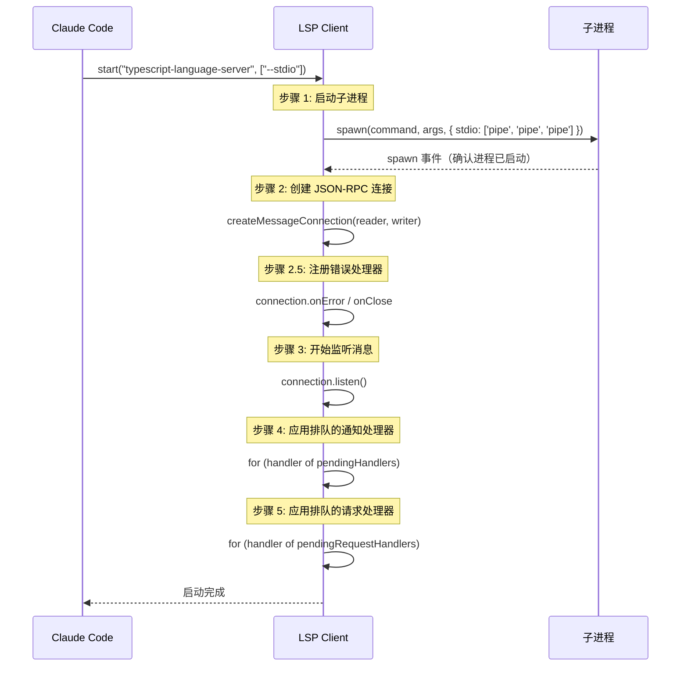
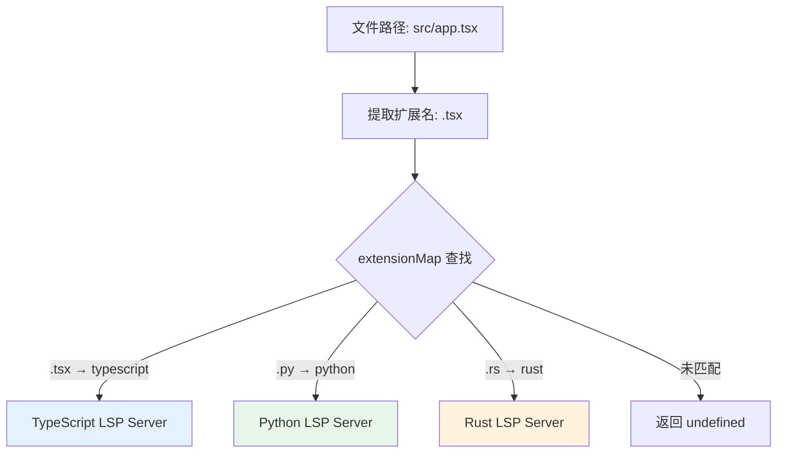
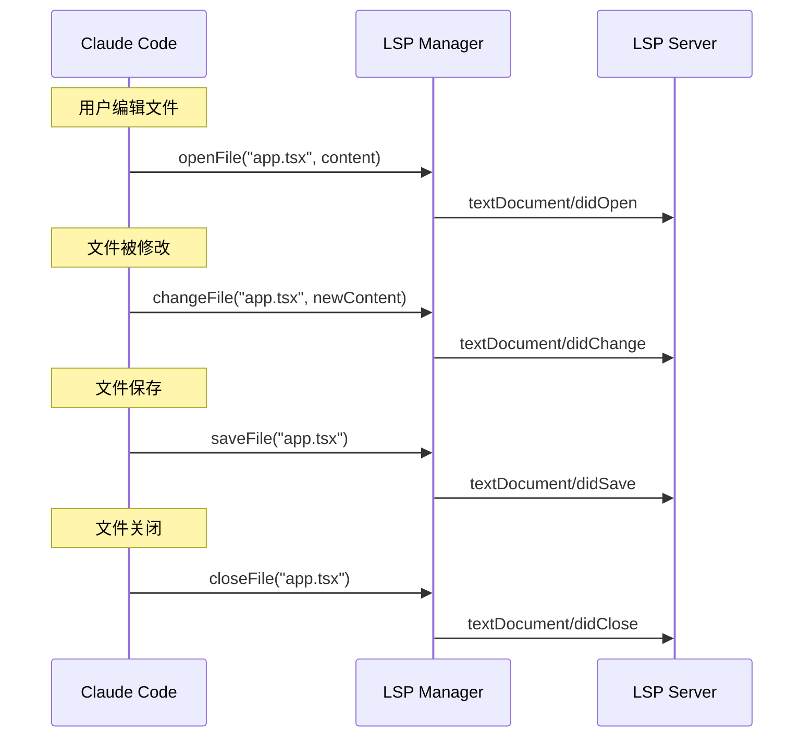

# 第6课：LSP 语言服务器协议集成

## 学习目标

1. 理解 LSP（Language Server Protocol）的基本概念和在 Claude Code 中的角色
2. 掌握 `createLSPClient()` 的闭包模式状态管理
3. 学会 `LSPServerManager` 的多服务器路由机制
4. 了解文件生命周期通知（didOpen / didChange / didSave / didClose）

---

## 一、"代码助教"的比喻

如果说 Claude 是"主讲老师"，那 LSP 就是"助教"：

- **主讲老师**（Claude）：理解你的意图，给出解决方案
- **助教**（LSP）：帮你检查拼写错误、告诉你变量定义在哪里

LSP 不替你写代码，但它能实时告诉你：
- 这行有语法错误 ❌
- 这个变量没被使用 ⚠️
- 这个函数定义在第 42 行 📍

---

## 二、LSP 客户端：`createLSPClient()`

### 2.1 闭包模式的状态管理

LSP 客户端使用**工厂函数 + 闭包**模式，而不是传统的 class：

```typescript
// services/lsp/LSPClient.ts
export function createLSPClient(
  serverName: string,
  onCrash?: (error: Error) => void,
): LSPClient {
  // 闭包内的私有状态
  let process: ChildProcess | undefined
  let connection: MessageConnection | undefined
  let capabilities: ServerCapabilities | undefined
  let isInitialized = false
  let isStopping = false

  // 延迟注册的处理器队列
  const pendingHandlers: Array<{
    method: string
    handler: (params: unknown) => void
  }> = []

  return {
    get capabilities() { return capabilities },
    get isInitialized() { return isInitialized },

    async start(command, args, options) { /* ... */ },
    async initialize(params) { /* ... */ },
    async sendRequest(method, params) { /* ... */ },
    async stop() { /* ... */ },
  }
}
```

**为什么用闭包而不是 class？**
- 状态完全私有，外部无法直接修改
- 无需 `this` 绑定问题
- 更容易进行单元测试

### 2.2 启动流程（5 步）



### 2.3 关键实现细节

**等待进程真正启动**：

```typescript
// spawn() 是异步的，ENOENT 等错误是异步触发的
// 必须等待 'spawn' 事件才能安全使用 stdio 流
await new Promise<void>((resolve, reject) => {
  spawnedProcess.once('spawn', resolve)
  spawnedProcess.once('error', reject)
})
```

**崩溃检测与回调**：

```typescript
process.on('exit', (code) => {
  if (code !== 0 && code !== null && !isStopping) {
    isInitialized = false
    const crashError = new Error(
      `LSP server ${serverName} crashed with exit code ${code}`
    )
    onCrash?.(crashError)  // 通知所有者，触发重启
  }
})
```

---

## 三、LSP 服务器管理器

### 3.1 `createLSPServerManager()` 的职责

```typescript
// services/lsp/LSPServerManager.ts
export type LSPServerManager = {
  initialize(): Promise<void>        // 加载所有配置
  shutdown(): Promise<void>          // 关闭所有服务器
  getServerForFile(filePath: string) // 根据文件找服务器
  ensureServerStarted(filePath: string) // 确保服务器已启动
  sendRequest<T>(filePath, method, params) // 发送请求
  openFile(filePath, content): Promise<void>
  changeFile(filePath, content): Promise<void>
  saveFile(filePath): Promise<void>
  closeFile(filePath): Promise<void>
  isFileOpen(filePath): boolean
}
```

### 3.2 文件扩展名路由



```typescript
// 初始化时构建扩展名 → 服务器映射
for (const ext of Object.keys(config.extensionToLanguage)) {
  if (!extensionMap.has(ext.toLowerCase())) {
    extensionMap.set(ext.toLowerCase(), [])
  }
  extensionMap.get(ext)!.push(serverName)
}
```

### 3.3 按需启动

服务器不会在初始化时全部启动，而是**按需启动**：

```typescript
async function ensureServerStarted(filePath: string) {
  const server = getServerForFile(filePath)
  if (!server) return undefined

  // 只有在 stopped 或 error 状态时才启动
  if (server.state === 'stopped' || server.state === 'error') {
    await server.start()
  }
  return server
}
```

---

## 四、文件生命周期管理

### 4.1 四种通知



### 4.2 防重复打开

```typescript
async function openFile(filePath: string, content: string) {
  const fileUri = pathToFileURL(path.resolve(filePath)).href

  // 如果已在同一服务器上打开，跳过
  if (openedFiles.get(fileUri) === server.name) {
    return  // 避免重复 didOpen
  }

  // LSP 协议要求先 didOpen 再 didChange
  await server.sendNotification('textDocument/didOpen', {
    textDocument: {
      uri: fileUri,
      languageId: server.config.extensionToLanguage[ext] || 'plaintext',
      version: 1,
      text: content,
    },
  })
  openedFiles.set(fileUri, server.name)
}
```

---

## 五、LSP 配置来源

LSP 服务器目前只通过**插件系统**配置（不像 MCP 有多种配置源）：

```typescript
// services/lsp/config.ts
export async function getAllLspServers(): Promise<{
  servers: Record<string, ScopedLspServerConfig>
}> {
  const { enabled: plugins } = await loadAllPluginsCacheOnly()

  // 并行加载所有插件的 LSP 服务器配置
  const results = await Promise.all(
    plugins.map(async plugin => {
      const scopedServers = await getPluginLspServers(plugin, errors)
      return { plugin, scopedServers, errors }
    }),
  )

  // 合并（后加载的插件覆盖先加载的同名服务器）
  for (const { scopedServers } of results) {
    if (scopedServers) {
      Object.assign(allServers, scopedServers)
    }
  }
  return { servers: allServers }
}
```

---

## 六、优雅关闭

LSP 协议要求按顺序关闭：`shutdown` → `exit` → kill 进程：

```typescript
async stop(): Promise<void> {
  isStopping = true  // 标记正在关闭，防止错误日志

  try {
    // LSP 协议：先发 shutdown 请求
    await connection.sendRequest('shutdown', {})
    // 再发 exit 通知
    await connection.sendNotification('exit', {})
  } catch (error) {
    // 即使关闭失败也要继续清理
  } finally {
    // 清理 JSON-RPC 连接
    connection?.dispose()
    // 清理子进程
    process?.removeAllListeners()
    process?.kill()
    // 重置状态
    isInitialized = false
    capabilities = undefined
    isStopping = false
  }
}
```

---

## 七、动手练习

### 练习 1：LSP 客户端状态机

画出 LSP 客户端的状态转换图，包含以下状态：
- 未启动 → 启动中 → 已启动 → 已初始化 → 关闭中 → 已关闭
- 启动失败、运行崩溃等异常路径

### 练习 2：文件路由模拟

假设有以下 LSP 服务器配置：
- typescript-server: `.ts`, `.tsx`, `.js`, `.jsx`
- python-server: `.py`, `.pyw`
- rust-server: `.rs`

模拟以下文件的路由结果：
1. `src/main.ts`
2. `scripts/deploy.py`
3. `README.md`
4. `lib/parser.rs`

### 思考题

1. 为什么 `pendingHandlers` 队列是必要的？如果没有它，在连接建立前注册通知处理器会怎样？
2. `isStopping` 标志的作用是什么？如果去掉它，关闭时会发生什么？
3. 为什么 LSP 只通过插件配置而不像 MCP 那样支持用户手动配置？

---

## 本课小结

- LSP 为 Claude Code 提供**代码级智能**（诊断、导航、补全）
- `createLSPClient()` 使用**闭包模式**管理私有状态
- `LSPServerManager` 通过**文件扩展名路由**将请求分发到正确的 LSP 服务器
- 文件生命周期通过 **didOpen/didChange/didSave/didClose** 四种通知同步
- 服务器**按需启动**，避免浪费资源
- 关闭时遵循 LSP 协议的 **shutdown → exit** 顺序

## 下节预告

下一课我们将学习 OAuth 2.0 + PKCE 安全认证 —— Claude Code 如何安全地让你登录，而不暴露你的密码或令牌。
