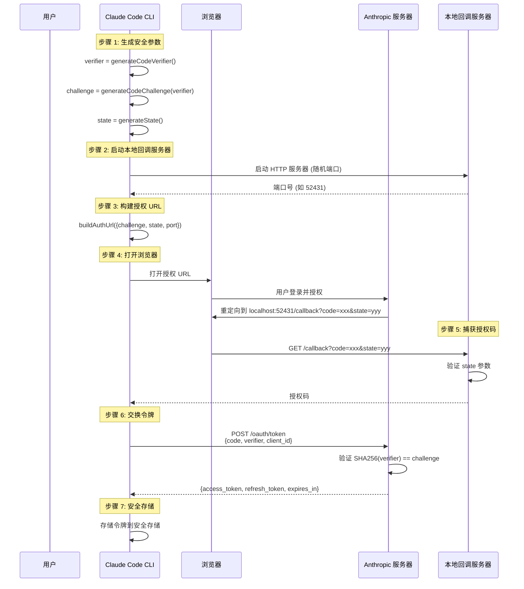

# 第7课：OAuth 2.0 + PKCE 安全认证

## 学习目标

1. 理解 OAuth 2.0 授权码流程的基本原理
2. 掌握 PKCE（Proof Key for Code Exchange）防劫持机制
3. 学会从源码中识别认证流程的每个步骤
4. 了解令牌刷新、多组织支持和 CCR 模式的特殊处理

---

## 一、"代领快递"的比喻

OAuth 就像你让朋友帮你取快递：

1. **你**（用户）告诉快递站：允许**小李**（Claude Code）代领
2. **快递站**（Anthropic 服务器）给小李一张**取件码**（授权码）
3. 小李用取件码换了一张**快递卡**（Access Token）
4. 以后小李凭卡就能直接领快递，不用每次都打电话给你

**PKCE 的作用**：防止有人偷听到取件码后冒充小李 —— 你和小李事先约定了一个暗号（Code Verifier），取件码必须配合暗号才能使用。

---

## 二、PKCE 密码学基础

### 2.1 三个安全随机值

```typescript
// services/oauth/crypto.ts

// 1. Code Verifier：43-128 字符的随机字符串
export function generateCodeVerifier(): string {
  return base64URLEncode(randomBytes(32))
}

// 2. Code Challenge：Verifier 的 SHA-256 哈希
export function generateCodeChallenge(verifier: string): string {
  const hash = createHash('sha256')
  hash.update(verifier)
  return base64URLEncode(hash.digest())
}

// 3. State：防 CSRF 的随机状态参数
export function generateState(): string {
  return base64URLEncode(randomBytes(32))
}
```

### 2.2 Base64URL 编码

```typescript
function base64URLEncode(buffer: Buffer): string {
  return buffer
    .toString('base64')
    .replace(/\+/g, '-')    // + → -
    .replace(/\//g, '_')    // / → _
    .replace(/=/g, '')      // 去掉填充
}
```

为什么不用普通 Base64？因为 `+`、`/`、`=` 在 URL 中有特殊含义，会导致参数解析错误。

---

## 三、完整认证流程



---

## 四、授权 URL 构建

```typescript
// services/oauth/client.ts
export function buildAuthUrl({
  codeChallenge, state, port, isManual,
  loginWithClaudeAi, orgUUID, loginHint,
}: { ... }): string {
  const authUrl = new URL(
    loginWithClaudeAi
      ? getOauthConfig().CLAUDE_AI_AUTHORIZE_URL
      : getOauthConfig().CONSOLE_AUTHORIZE_URL
  )

  authUrl.searchParams.append('client_id', getOauthConfig().CLIENT_ID)
  authUrl.searchParams.append('response_type', 'code')
  authUrl.searchParams.append('redirect_uri',
    isManual
      ? getOauthConfig().MANUAL_REDIRECT_URL
      : `http://localhost:${port}/callback`
  )
  authUrl.searchParams.append('scope', scopesToUse.join(' '))
  authUrl.searchParams.append('code_challenge', codeChallenge)
  authUrl.searchParams.append('code_challenge_method', 'S256')
  authUrl.searchParams.append('state', state)

  // 可选：预填邮箱
  if (loginHint) {
    authUrl.searchParams.append('login_hint', loginHint)
  }

  return authUrl.toString()
}
```

---

## 五、本地回调服务器

```typescript
// services/oauth/auth-code-listener.ts
export class AuthCodeListener {
  private localServer: Server
  private port: number = 0
  private expectedState: string | null = null

  // 启动监听（随机端口避免冲突）
  async start(port?: number): Promise<number> {
    return new Promise((resolve, reject) => {
      this.localServer.listen(port ?? 0, 'localhost', () => {
        const address = this.localServer.address() as AddressInfo
        this.port = address.port
        resolve(this.port)
      })
    })
  }

  // 等待浏览器回调
  async waitForAuthorization(
    state: string,
    onReady: () => Promise<void>,
  ): Promise<string> {
    return new Promise<string>((resolve, reject) => {
      this.promiseResolver = resolve
      this.promiseRejecter = reject
      this.expectedState = state  // CSRF 保护
      this.startLocalListener(onReady)
    })
  }
}
```

**为什么要用随机端口？** 固定端口可能被其他应用占用。端口 `0` 让操作系统自动选择一个空闲端口。

---

## 六、令牌交换与刷新

### 6.1 授权码换令牌

```typescript
export async function exchangeCodeForTokens(
  authorizationCode: string,
  state: string,
  codeVerifier: string,  // PKCE 的关键：提交原始 verifier
  port: number,
): Promise<OAuthTokenExchangeResponse> {
  const response = await axios.post(getOauthConfig().TOKEN_URL, {
    grant_type: 'authorization_code',
    code: authorizationCode,
    redirect_uri: `http://localhost:${port}/callback`,
    client_id: getOauthConfig().CLIENT_ID,
    code_verifier: codeVerifier,  // 服务器会验证 SHA256(verifier) == challenge
    state,
  })

  return response.data
}
```

### 6.2 令牌刷新

```typescript
export async function refreshOAuthToken(
  refreshToken: string,
): Promise<OAuthTokens> {
  const response = await axios.post(getOauthConfig().TOKEN_URL, {
    grant_type: 'refresh_token',
    refresh_token: refreshToken,
    client_id: getOauthConfig().CLIENT_ID,
    scope: CLAUDE_AI_OAUTH_SCOPES.join(' '),
  })

  const { access_token, refresh_token, expires_in } = response.data
  const expiresAt = Date.now() + expires_in * 1000

  return { accessToken: access_token, refreshToken: refresh_token, expiresAt }
}
```

### 6.3 令牌过期检查

```typescript
export function isOAuthTokenExpired(expiresAt: number | null): boolean {
  if (expiresAt === null) return false

  const bufferTime = 5 * 60 * 1000  // 提前 5 分钟刷新
  return Date.now() + bufferTime >= expiresAt
}
```

---

## 七、PKCE 安全性图解

```mermaid
flowchart LR
    subgraph 客户端
        V[Code Verifier<br/>随机生成] --> H[SHA-256 哈希]
        H --> C[Code Challenge]
    end

    subgraph 授权服务器
        C -->|步骤1: 发送 Challenge| AuthReq[授权请求]
        AuthReq --> Code[返回授权码]
        Code -->|步骤2: 发送 Verifier + 授权码| TokenReq[令牌请求]
        TokenReq --> Verify{SHA256(Verifier) == Challenge?}
        Verify -->|匹配| Token[发放令牌 ✅]
        Verify -->|不匹配| Reject[拒绝 ❌]
    end

    Attacker[攻击者<br/>截获授权码] -.->|没有 Verifier| TokenReq
    Attacker -.-> Reject

    style Token fill:#c8e6c9
    style Reject fill:#ffcdd2
    style Attacker fill:#ffcdd2,stroke-dasharray: 5 5
```

即使攻击者截获了授权码，没有 Code Verifier 也无法换取令牌。

---

## 八、动手练习

### 练习 1：手动执行 PKCE

1. 生成一个 32 字节的随机字符串作为 Code Verifier
2. 计算它的 SHA-256 哈希
3. 进行 Base64URL 编码得到 Code Challenge
4. 验证 Challenge 的长度是否为 43 字符

### 练习 2：安全分析

分析以下攻击场景，说明 PKCE 如何防御：
1. 中间人截获了浏览器重定向中的授权码
2. 恶意应用注册了相同的回调 URL scheme
3. CSRF 攻击（伪造状态参数）

### 思考题

1. 为什么 `bufferTime` 是 5 分钟而不是 0？如果令牌在 API 请求发出后才过期怎么办？
2. 为什么有"手动重定向" (`MANUAL_REDIRECT_URL`) 模式？在什么场景下用？
3. 为什么刷新令牌时也要发送 `scope` 参数？

---

## 本课小结

- OAuth 2.0 是一种**安全的第三方授权**协议，不需要共享密码
- PKCE 通过 **Code Verifier + Code Challenge** 防止授权码被劫持
- 认证流程：生成安全参数 → 启动本地回调服务器 → 浏览器授权 → 交换令牌
- 令牌会提前 **5 分钟**刷新，避免请求中途过期
- State 参数提供 **CSRF 防护**

## 下节预告

下一课我们将深入 Claude Code 最核心的服务之一 —— 上下文压缩。当对话变得超长时，系统如何通过三层递进算法（微压缩 → 自动压缩 → 完整压缩）来保持对话的连贯性？
