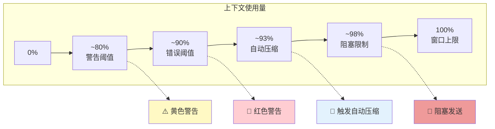
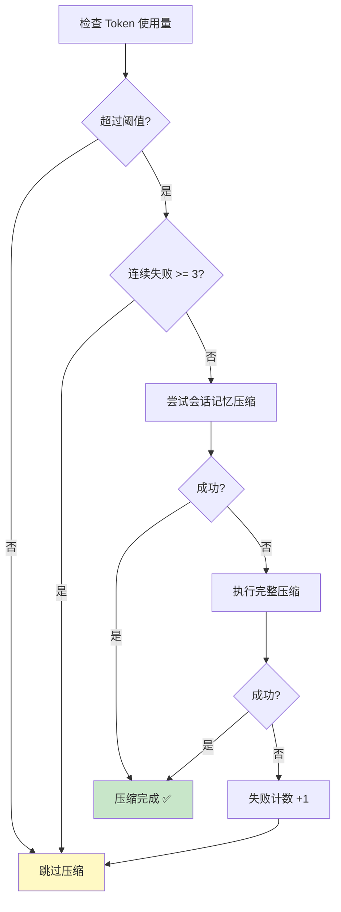
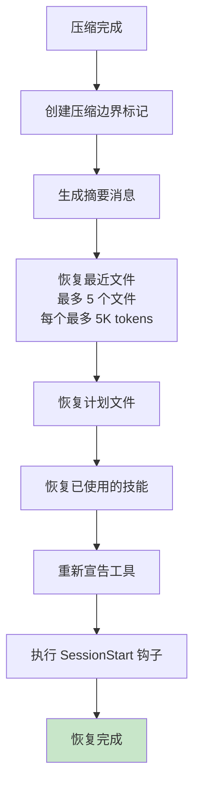

# 第8课：上下文压缩 —— 三层递进算法详解

## 学习目标

1. 理解上下文压缩的必要性（Token 窗口限制）
2. 掌握三层压缩体系：微压缩 → 自动压缩 → 完整压缩
3. 学会自动压缩的阈值计算和触发逻辑
4. 了解压缩后的上下文恢复（文件重建、计划保留、技能注入）

---

## 一、"笔记本空间"的比喻

想象你用一个只有 200 页的笔记本记录所有工作：

- **第 1-50 页**：项目背景和需求
- **第 51-150 页**：开发过程和代码
- **第 151-200 页**：最近的工作

当笔记本快写满时，你有三种策略：

| 策略 | 对应压缩层 | 做法 |
|------|-----------|------|
| 擦掉旧的草稿 | 微压缩 (MicroCompact) | 清理旧工具结果 |
| 把前面的内容缩写成摘要 | 自动压缩 (AutoCompact) | 用 AI 生成对话摘要 |
| 手动整理，保留关键笔记 | 完整压缩 (Manual Compact) | 用户主动触发 /compact |

---

## 二、压缩阈值计算

### 2.1 有效上下文窗口

```typescript
// services/compact/autoCompact.ts
export function getEffectiveContextWindowSize(model: string): number {
  const reservedTokensForSummary = Math.min(
    getMaxOutputTokensForModel(model),
    20_000,  // 摘要最多 20K tokens
  )
  let contextWindow = getContextWindowForModel(model)

  // 支持自定义窗口大小
  const autoCompactWindow = process.env.CLAUDE_CODE_AUTO_COMPACT_WINDOW
  if (autoCompactWindow) {
    contextWindow = Math.min(contextWindow, parseInt(autoCompactWindow))
  }

  return contextWindow - reservedTokensForSummary
}
```

### 2.2 自动压缩触发点

```typescript
const AUTOCOMPACT_BUFFER_TOKENS = 13_000

export function getAutoCompactThreshold(model: string): number {
  return getEffectiveContextWindowSize(model) - AUTOCOMPACT_BUFFER_TOKENS
}
```

### 2.3 多级阈值体系



```typescript
export function calculateTokenWarningState(tokenUsage: number, model: string) {
  const threshold = getEffectiveContextWindowSize(model)
  return {
    percentLeft: Math.max(0, Math.round(((threshold - tokenUsage) / threshold) * 100)),
    isAboveWarningThreshold: tokenUsage >= threshold - 20_000,
    isAboveErrorThreshold: tokenUsage >= threshold - 20_000,
    isAboveAutoCompactThreshold: tokenUsage >= getAutoCompactThreshold(model),
    isAtBlockingLimit: tokenUsage >= threshold - 3_000,
  }
}
```

---

## 三、第一层：微压缩 (MicroCompact)

微压缩是最轻量的压缩方式 —— 只清理旧的工具调用结果：

```typescript
// services/compact/microCompact.ts
const COMPACTABLE_TOOLS = new Set([
  'Read',        // 文件读取结果
  'Bash',        // Shell 命令输出
  'Grep',        // 搜索结果
  'Glob',        // 文件匹配结果
  'WebSearch',   // 网页搜索结果
  'WebFetch',    // 网页抓取结果
  'Edit',        // 编辑确认
  'Write',       // 写入确认
])

// 清理消息：[Old tool result content cleared]
const TIME_BASED_MC_CLEARED_MESSAGE = '[Old tool result content cleared]'
```

**原理**：对话中最老的工具调用结果通常不再需要。例如，30 分钟前读取的文件内容已经过时了，可以安全地用一个占位符替代。

---

## 四、第二层：自动压缩 (AutoCompact)

### 4.1 触发条件

```typescript
export async function shouldAutoCompact(
  messages: Message[],
  model: string,
  querySource?: QuerySource,
): Promise<boolean> {
  // 递归保护：压缩/记忆提取不触发自身的压缩
  if (querySource === 'session_memory' || querySource === 'compact') {
    return false
  }

  if (!isAutoCompactEnabled()) return false

  const tokenCount = tokenCountWithEstimation(messages)
  const threshold = getAutoCompactThreshold(model)

  return tokenCount >= threshold
}
```

### 4.2 压缩流程



### 4.3 熔断器机制

```typescript
const MAX_CONSECUTIVE_AUTOCOMPACT_FAILURES = 3

// 连续失败 3 次后停止尝试
if (tracking?.consecutiveFailures >= MAX_CONSECUTIVE_AUTOCOMPACT_FAILURES) {
  return { wasCompacted: false }
}
```

---

## 五、第三层：完整压缩 (Full Compact)

### 5.1 压缩提示词

```typescript
// services/compact/prompt.ts
const BASE_COMPACT_PROMPT = `Your task is to create a detailed summary of the conversation so far...

Your summary should include:
1. Primary Request and Intent
2. Key Technical Concepts
3. Files and Code Sections
4. Errors and fixes
5. All user messages
6. Pending Tasks
7. Current Work
8. Optional Next Step
`
```

### 5.2 压缩前的预处理

```typescript
// 剥离图片（减少 Token 消耗）
export function stripImagesFromMessages(messages: Message[]): Message[] {
  return messages.map(message => {
    // 将图片替换为 [image] 占位符
    // 将文档替换为 [document] 占位符
  })
}
```

### 5.3 压缩后的上下文恢复



```typescript
// 文件恢复的预算限制
export const POST_COMPACT_MAX_FILES_TO_RESTORE = 5
export const POST_COMPACT_TOKEN_BUDGET = 50_000
export const POST_COMPACT_MAX_TOKENS_PER_FILE = 5_000
export const POST_COMPACT_MAX_TOKENS_PER_SKILL = 5_000
export const POST_COMPACT_SKILLS_TOKEN_BUDGET = 25_000
```

---

## 六、Prompt-Too-Long 的自动恢复

当压缩请求本身也触发 prompt-too-long 错误时（元错误），系统会自动裁剪：

```typescript
export function truncateHeadForPTLRetry(
  messages: Message[],
  ptlResponse: AssistantMessage,
): Message[] | null {
  const groups = groupMessagesByApiRound(messages)
  if (groups.length < 2) return null

  // 解析需要裁剪的 Token 数
  const tokenGap = getPromptTooLongTokenGap(ptlResponse)

  let dropCount: number
  if (tokenGap !== undefined) {
    // 精确裁剪：删除足够覆盖差值的最老消息组
    let acc = 0
    dropCount = 0
    for (const g of groups) {
      acc += roughTokenCountEstimationForMessages(g)
      dropCount++
      if (acc >= tokenGap) break
    }
  } else {
    // 模糊裁剪：删除 20% 的消息组
    dropCount = Math.max(1, Math.floor(groups.length * 0.2))
  }

  return groups.slice(dropCount).flat()
}
```

---

## 七、动手练习

### 练习 1：阈值计算

假设模型上下文窗口为 200,000 tokens，计算：
1. 有效上下文窗口大小
2. 自动压缩触发阈值
3. 阻塞限制阈值
4. 如果当前使用了 175,000 tokens，会触发什么级别的警告？

### 练习 2：压缩策略选择

对以下场景，选择最合适的压缩策略：
1. 对话已进行 30 分钟，Token 使用量达到 85%
2. Token 使用量达到 95%，5 分钟前刚压缩过但失败了
3. 用户手动输入 `/compact`

### 思考题

1. 为什么压缩后要恢复最近的文件？不恢复会有什么影响？
2. 熔断器为什么设置为 3 次？设太低或太高有什么问题？
3. 压缩提示词要求生成"分析"块后再生成"摘要"块，这种两步法有什么好处？

---

## 本课小结

- 上下文窗口有限，需要三层递进的压缩策略
- **微压缩**清理旧工具结果，最轻量
- **自动压缩**在 Token 达到阈值时自动触发，生成 AI 摘要
- **完整压缩**由用户主动触发或作为自动压缩的后备
- 压缩后通过**文件恢复、计划保留、技能注入**重建上下文
- **熔断器**防止连续失败的压缩浪费资源
- **PTL 自动恢复**处理压缩请求本身超长的递归问题

## 下节预告

下一课我们将学习特性标志（Feature Flags）和遥测系统 —— Claude Code 如何通过 GrowthBook 动态控制功能的开关，以及如何安全地收集使用数据。
