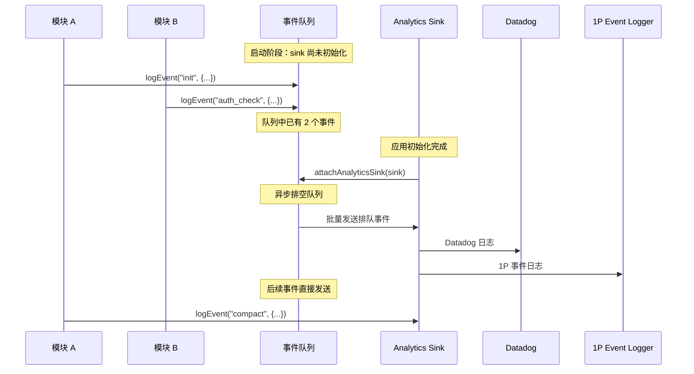
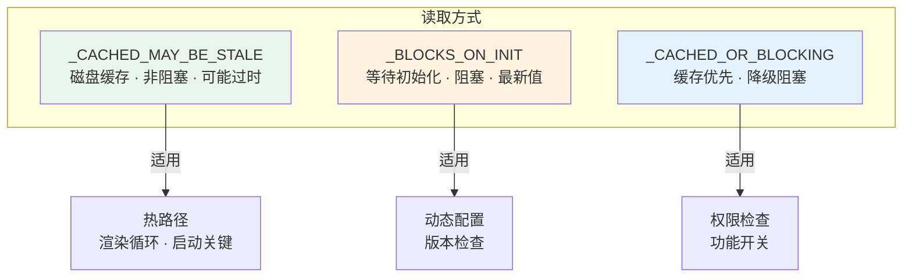

# 第9课：特性标志与遥测系统

## 学习目标

1. 理解特性标志（Feature Flags）的概念和在 Claude Code 中的用途
2. 掌握 GrowthBook 集成的三种读取模式
3. 学会事件日志系统的队列架构和安全约束
4. 了解 Datadog 日志上报和采样策略

---

## 一、"遥控器"的比喻

想象你在驾驶一架飞机（Claude Code 的新版本）：

- **特性标志** = 驾驶舱的开关面板：你可以远程开关每个功能，不需要重新起飞（不需要重新发布）
- **遥测系统** = 飞行黑匣子：记录所有关键事件，出问题时可以回放分析

| 概念 | 类比 | 作用 |
|------|------|------|
| Feature Flag | 电灯开关 | 远程控制功能启用/禁用 |
| A/B 测试 | 药物临床试验 | 将用户分组测试效果 |
| 遥测事件 | 心电监测仪 | 实时监控运行状态 |
| 采样 | 抽样调查 | 降低数据量和成本 |

---

## 二、事件日志：最小依赖原则

### 2.1 设计理念

```typescript
// services/analytics/index.ts
/**
 * DESIGN: This module has NO dependencies to avoid import cycles.
 * Events are queued until attachAnalyticsSink() is called during app initialization.
 */
```

analytics 模块被设计为**零依赖** —— 它可以被任何其他模块安全导入，不会形成循环依赖。

### 2.2 事件队列架构



### 2.3 核心 API

```typescript
// 同步日志（fire-and-forget）
export function logEvent(
  eventName: string,
  metadata: LogEventMetadata,  // 不允许字符串类型！
): void {
  if (sink === null) {
    eventQueue.push({ eventName, metadata, async: false })
    return
  }
  sink.logEvent(eventName, metadata)
}

// 异步日志（等待确认）
export async function logEventAsync(
  eventName: string,
  metadata: LogEventMetadata,
): Promise<void> {
  if (sink === null) {
    eventQueue.push({ eventName, metadata, async: true })
    return
  }
  await sink.logEventAsync(eventName, metadata)
}
```

### 2.4 安全类型约束

```typescript
// 防止意外记录代码或文件路径
type LogEventMetadata = {
  [key: string]: boolean | number | undefined
  // 注意：不允许 string 类型！
}

// 需要字符串时，必须显式标记已验证
type AnalyticsMetadata_I_VERIFIED_THIS_IS_NOT_CODE_OR_FILEPATHS = never

// 使用时必须强制类型转换
logEvent('tengu_error', {
  error: errorMsg as AnalyticsMetadata_I_VERIFIED_THIS_IS_NOT_CODE_OR_FILEPATHS,
})
```

这个设计确保开发者在记录字符串数据时**必须有意识地确认**它不包含敏感信息。

### 2.5 Proto 字段隔离

```typescript
// _PROTO_ 前缀的字段会被路由到 PII 保护的存储
export function stripProtoFields<V>(
  metadata: Record<string, V>,
): Record<string, V> {
  let result: Record<string, V> | undefined
  for (const key in metadata) {
    if (key.startsWith('_PROTO_')) {
      if (result === undefined) result = { ...metadata }
      delete result[key]
    }
  }
  return result ?? metadata  // 无修改时返回原对象，避免内存分配
}
```

---

## 三、GrowthBook 特性标志

### 3.1 三种读取模式



### 3.2 非阻塞读取（最常用）

```typescript
export function getFeatureValue_CACHED_MAY_BE_STALE<T>(
  feature: string,
  defaultValue: T,
): T {
  // 1. 检查环境变量覆盖（测试用）
  const overrides = getEnvOverrides()
  if (overrides && feature in overrides) {
    return overrides[feature] as T
  }

  // 2. 检查本地配置覆盖（开发者调试）
  const configOverrides = getConfigOverrides()
  if (configOverrides && feature in configOverrides) {
    return configOverrides[feature] as T
  }

  // 3. 内存中的最新值
  if (remoteEvalFeatureValues.has(feature)) {
    return remoteEvalFeatureValues.get(feature) as T
  }

  // 4. 磁盘缓存（跨进程持久化）
  try {
    const cached = getGlobalConfig().cachedGrowthBookFeatures?.[feature]
    return cached !== undefined ? (cached as T) : defaultValue
  } catch {
    return defaultValue
  }
}
```

### 3.3 覆盖优先级

```
环境变量覆盖 > 本地配置覆盖 > 内存值 > 磁盘缓存 > 默认值
```

### 3.4 周期性刷新

```typescript
// 内部员工：每 20 分钟刷新
// 外部用户：每 6 小时刷新
const GROWTHBOOK_REFRESH_INTERVAL_MS =
  process.env.USER_TYPE !== 'ant'
    ? 6 * 60 * 60 * 1000  // 6 hours
    : 20 * 60 * 1000       // 20 min

export function setupPeriodicGrowthBookRefresh(): void {
  refreshInterval = setInterval(() => {
    void refreshGrowthBookFeatures()
  }, GROWTHBOOK_REFRESH_INTERVAL_MS)
  refreshInterval.unref?.()  // 不阻止进程退出
}
```

---

## 四、Datadog 日志上报

### 4.1 事件白名单

```typescript
// services/analytics/datadog.ts
const DATADOG_ALLOWED_EVENTS = new Set([
  'tengu_api_error',
  'tengu_api_success',
  'tengu_compact_failed',
  'tengu_exit',
  'tengu_init',
  'tengu_oauth_error',
  'tengu_tool_use_error',
  'tengu_uncaught_exception',
  // ... 只有明确列出的事件才会上报
])
```

### 4.2 批量发送

```typescript
const DEFAULT_FLUSH_INTERVAL_MS = 15000  // 每 15 秒批量发送
const MAX_BATCH_SIZE = 100                // 每批最多 100 个事件
const NETWORK_TIMEOUT_MS = 5000           // 网络超时 5 秒
```

---

## 五、实验曝光记录

```typescript
// 记录用户看到了哪个实验的哪个变体
function logExposureForFeature(feature: string): void {
  if (loggedExposures.has(feature)) return  // 每个特性只记录一次

  const expData = experimentDataByFeature.get(feature)
  if (expData) {
    loggedExposures.add(feature)
    logGrowthBookExperimentTo1P({
      experimentId: expData.experimentId,
      variationId: expData.variationId,
      userAttributes: getUserAttributes(),
    })
  }
}
```

---

## 六、认证变更后的刷新

```typescript
export function refreshGrowthBookAfterAuthChange(): void {
  // 必须销毁和重建客户端
  // 因为 apiHostRequestHeaders 创建后不可变
  resetGrowthBook()

  // 通知订阅者值可能已变
  refreshed.emit()

  // 异步重新初始化
  reinitializingPromise = initializeGrowthBook()
    .catch(error => logError(error))
    .finally(() => { reinitializingPromise = null })
}
```

---

## 七、动手练习

### 练习 1：事件队列模拟

模拟以下场景：
1. 启动时连续记录 3 个事件（sink 未就绪）
2. sink 初始化完成
3. 验证排队事件是否被正确排空

### 练习 2：特性标志决策

一个特性标志 `tengu_new_compact` 的值在不同来源有不同值：
- 环境变量：未设置
- 本地配置覆盖：`true`
- 内存值：`false`
- 磁盘缓存：`true`
- 默认值：`false`

按照优先级，`getFeatureValue_CACHED_MAY_BE_STALE` 会返回什么？

### 思考题

1. 为什么事件日志不允许直接传入 `string` 类型？这解决了什么安全问题？
2. `refreshInterval.unref?.()` 的作用是什么？如果不调用会有什么影响？
3. 为什么 GrowthBook 客户端需要在认证变更后完全重建而不是简单更新头信息？

---

## 本课小结

- 事件日志采用**零依赖 + 队列缓冲**设计，避免循环依赖
- `LogEventMetadata` 类型约束**禁止直接传入字符串**，防止泄露代码/文件路径
- GrowthBook 提供**三种读取模式**：缓存非阻塞、阻塞等待、混合模式
- 特性值有 **5 级覆盖优先级**：环境变量 > 配置 > 内存 > 磁盘 > 默认
- Datadog 日志使用**白名单 + 批量发送**策略，控制数据量
- 认证变更后 GrowthBook 需要**完全重建**客户端

## 下节预告

最后一课我们将探索自动记忆提取（Auto Memory Extraction）—— Claude Code 如何在对话结束时自动识别值得记住的信息，并将其持久化到文件系统中，让 AI 真正拥有"长期记忆"。
