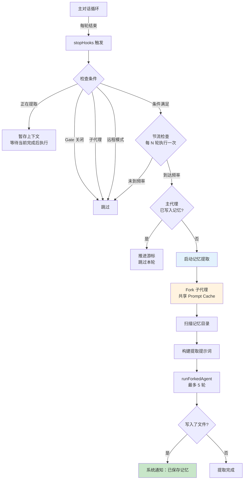
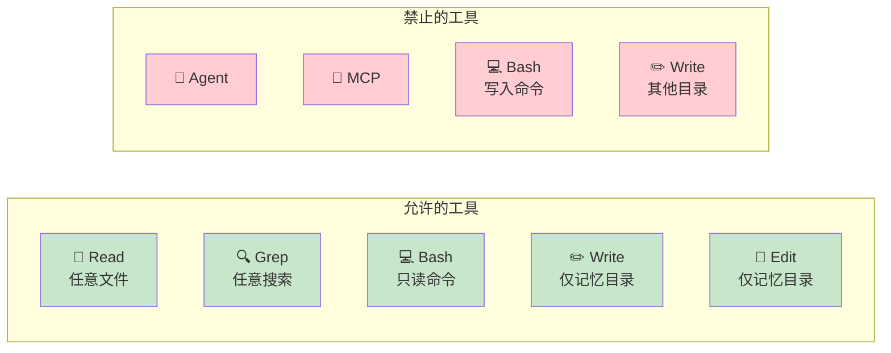
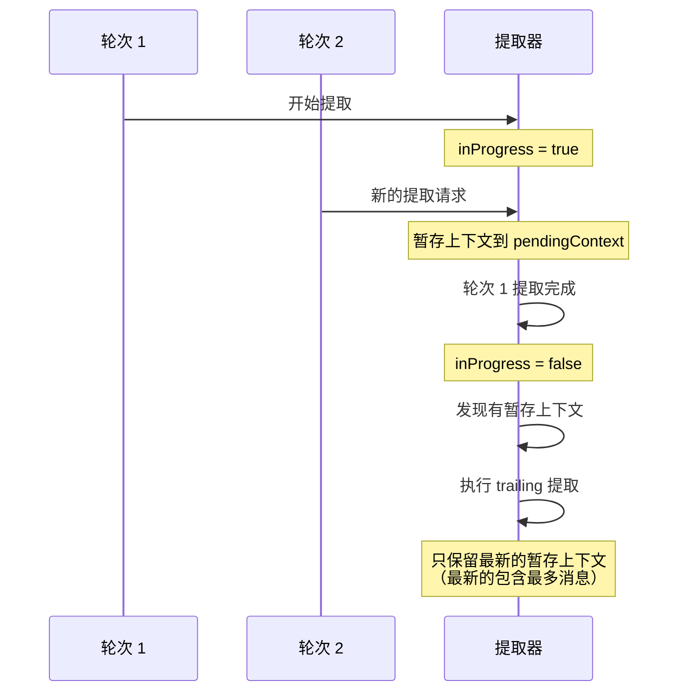
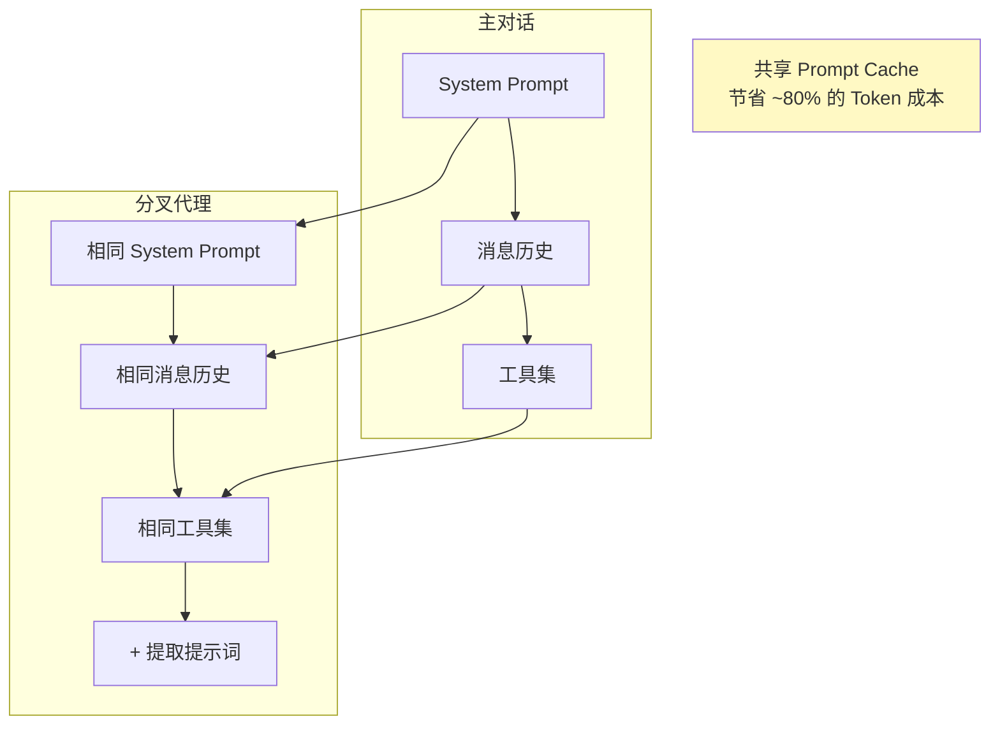

# 第10课：自动记忆提取与持久化

## 学习目标

1. 理解自动记忆提取的设计理念和架构
2. 掌握 Forked Agent 模式的工作原理
3. 学会记忆文件的组织方式和安全约束
4. 了解记忆提取的触发时机、频率控制和互斥机制

---

## 一、"日记本"的比喻

想象你有一个聪明的助手，每天下班后他会自动帮你：

1. **回顾今天的对话**："老板说了什么重要的事？"
2. **判断是否值得记录**："这个项目偏好用 TypeScript，值得记住"
3. **写入日记本**：分类归档到不同的主题文件
4. **更新目录**：在目录页添加索引

这就是 Claude Code 的自动记忆提取系统做的事。

---

## 二、系统架构概览



---

## 三、初始化与闭包状态

```typescript
// services/extractMemories/extractMemories.ts
export function initExtractMemories(): void {
  // 闭包内的私有状态
  const inFlightExtractions = new Set<Promise<void>>()
  let lastMemoryMessageUuid: string | undefined  // 游标
  let inProgress = false                          // 互斥锁
  let turnsSinceLastExtraction = 0                // 节流计数
  let pendingContext: { ... } | undefined         // 暂存上下文

  // 内部提取逻辑
  async function runExtraction({ context, appendSystemMessage }) {
    // ...
  }

  // 公开入口
  extractor = async (context, appendSystemMessage) => {
    const p = executeExtractMemoriesImpl(context, appendSystemMessage)
    inFlightExtractions.add(p)
    try { await p }
    finally { inFlightExtractions.delete(p) }
  }

  // 等待所有提取完成
  drainer = async (timeoutMs = 60_000) => {
    await Promise.race([
      Promise.all(inFlightExtractions),
      new Promise(r => setTimeout(r, timeoutMs).unref()),
    ])
  }
}
```

---

## 四、工具权限控制

记忆提取代理**不是万能的**，它有严格的工具限制：

```typescript
export function createAutoMemCanUseTool(memoryDir: string): CanUseToolFn {
  return async (tool, input) => {
    // ✅ 允许：读取任意文件
    if (tool.name === 'Read' || tool.name === 'Grep' || tool.name === 'Glob') {
      return { behavior: 'allow', updatedInput: input }
    }

    // ✅ 允许：只读的 Shell 命令
    if (tool.name === 'Bash') {
      if (tool.isReadOnly(input)) {
        return { behavior: 'allow', updatedInput: input }
      }
      return deny('Only read-only shell commands are permitted')
    }

    // ✅ 允许：只在记忆目录内写入
    if ((tool.name === 'Edit' || tool.name === 'Write') &&
        isAutoMemPath(input.file_path)) {
      return { behavior: 'allow', updatedInput: input }
    }

    // ❌ 拒绝：其他所有工具
    return deny(`Only read tools and memory-dir writes are allowed`)
  }
}
```



---

## 五、互斥与合并机制

### 5.1 与主代理的互斥

```typescript
function hasMemoryWritesSince(messages, sinceUuid): boolean {
  // 如果主代理已经写入了记忆文件
  // → 跳过后台提取，推进游标
  for (const message of messages) {
    for (const block of message.content) {
      const filePath = getWrittenFilePath(block)
      if (filePath && isAutoMemPath(filePath)) {
        return true  // 主代理已处理，后台不重复
      }
    }
  }
  return false
}
```

### 5.2 提取请求合并



---

## 六、提取提示词

### 6.1 提示词结构

```typescript
// services/extractMemories/prompts.ts
export function buildExtractAutoOnlyPrompt(
  newMessageCount: number,
  existingMemories: string,
): string {
  return [
    // 角色定义
    `You are now acting as the memory extraction subagent.`,
    `Analyze the most recent ~${newMessageCount} messages above.`,

    // 工具限制
    `Available tools: Read, Grep, Glob, read-only Bash, Edit/Write for memory directory only.`,

    // 效率指导
    `You have a limited turn budget.`,
    `Turn 1: issue all Read calls in parallel`,
    `Turn 2: issue all Write/Edit calls in parallel`,

    // 内容限制
    `You MUST only use content from the last ~${newMessageCount} messages.`,
    `Do not waste turns investigating or verifying that content.`,

    // 已有记忆清单
    `## Existing memory files`,
    existingMemories,
    `Check this list before writing — update rather than creating a duplicate.`,

    // 记忆类型
    `## What to save`,
    // ... 四种记忆类型的说明

    // 不该保存的
    `## What NOT to save`,
    // ... 排除规则

    // 如何保存
    `## How to save memories`,
    // ... frontmatter 格式说明
  ].join('\n')
}
```

### 6.2 记忆文件格式

```markdown
---
type: preference
confidence: high
created: 2026-03-31
---

# 用户偏好：TypeScript 严格模式

用户总是要求在 TypeScript 项目中使用 strict 模式，
包括 noImplicitAny 和 strictNullChecks。
```

---

## 七、Forked Agent 模式

记忆提取使用**分叉代理**模式 —— 它是主对话的一个"完美复制"，共享 prompt cache：

```typescript
const result = await runForkedAgent({
  promptMessages: [createUserMessage({ content: userPrompt })],
  cacheSafeParams,         // 共享主对话的缓存参数
  canUseTool,              // 受限的工具权限
  querySource: 'extract_memories',
  forkLabel: 'extract_memories',
  skipTranscript: true,    // 不记录到会话日志
  maxTurns: 5,             // 最多 5 轮工具调用
})
```



---

## 八、写入结果追踪

```typescript
function extractWrittenPaths(agentMessages: Message[]): string[] {
  const paths: string[] = []
  for (const message of agentMessages) {
    if (message.type !== 'assistant') continue
    for (const block of message.content) {
      // 检查 Edit 和 Write 工具的 file_path
      const filePath = getWrittenFilePath(block)
      if (filePath) paths.push(filePath)
    }
  }
  return uniq(paths)  // 去重
}
```

写入的路径会被分类：
- **索引文件** (`MEMORY.md`)：机械更新，不算"记忆"
- **主题文件** (`user_role.md` 等)：真正的记忆

```typescript
const memoryPaths = writtenPaths.filter(
  p => basename(p) !== ENTRYPOINT_NAME  // 排除 MEMORY.md
)
```

---

## 九、动手练习

### 练习 1：权限判断

判断以下工具调用是否会被 `createAutoMemCanUseTool` 允许：

1. `Read` 读取 `/src/main.ts`
2. `Bash` 执行 `ls ~/.claude/memory/`
3. `Bash` 执行 `rm ~/.claude/memory/old.md`
4. `Write` 写入 `~/.claude/projects/xxx/memory/new.md`
5. `Write` 写入 `/src/config.ts`
6. `Agent` 启动子代理

### 练习 2：合并场景

画出以下时间线中的提取行为：
- T=0: 轮次 1 完成，触发提取 A
- T=5s: 轮次 2 完成，提取 A 仍在运行
- T=8s: 轮次 3 完成，提取 A 仍在运行
- T=10s: 提取 A 完成

问题：提取 B 会使用轮次 2 还是轮次 3 的上下文？为什么？

### 思考题

1. 为什么 Forked Agent 共享 prompt cache 能节省成本？具体节省了哪部分？
2. 为什么 `maxTurns` 限制为 5？如果设为 1 或 100 会怎样？
3. 为什么记忆提取只在主代理运行，子代理（subagent）不触发？

---

## 本课小结

- 自动记忆提取是一个**后台运行的分叉代理**，在每轮对话结束时触发
- 使用**闭包模式**管理状态：游标位置、互斥锁、节流计数
- **工具权限严格限制**：只能读取任意文件，写入仅限记忆目录
- **互斥机制**：如果主代理已写入记忆，后台跳过；并发请求被合并
- **Forked Agent 模式**共享 prompt cache，节省约 80% Token 成本
- 记忆文件使用 **frontmatter 格式**，按主题组织在专用目录中

---

## 课程总结

恭喜你完成了 Claude Code 服务层的全部 10 节课程！让我们回顾一下学到的内容：

| 课程 | 核心知识点 |
|------|-----------|
| 第1课 | 服务层整体架构，6大模块概览 |
| 第2课 | API 客户端工厂模式，指数退避重试 |
| 第3课 | 20+ 种错误分类，SSL 链遍历，用户提示设计 |
| 第4课 | MCP 协议概念，8种服务器类型，安全策略 |
| 第5课 | 5种传输方式，In-Process Transport，工具发现 |
| 第6课 | LSP 闭包模式，文件扩展名路由，生命周期通知 |
| 第7课 | OAuth 2.0 + PKCE，授权码流程，令牌刷新 |
| 第8课 | 三层压缩体系，阈值计算，PTL 自动恢复 |
| 第9课 | GrowthBook 特性标志，事件队列，安全类型约束 |
| 第10课 | Forked Agent 记忆提取，工具权限，互斥合并 |

这些知识不仅适用于理解 Claude Code，也是现代软件工程中**服务层设计**的通用模式。希望你能将这些设计思想应用到自己的项目中！
