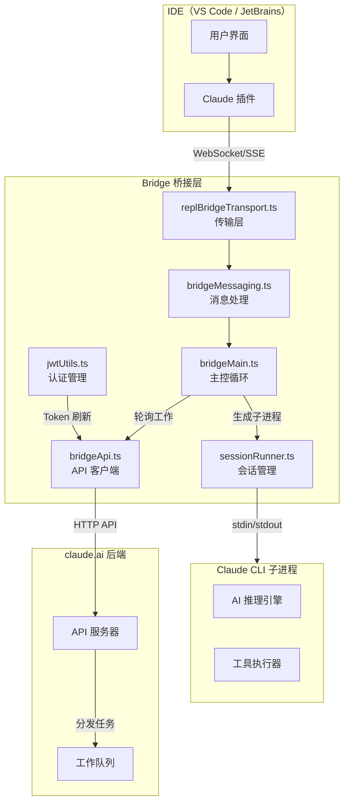
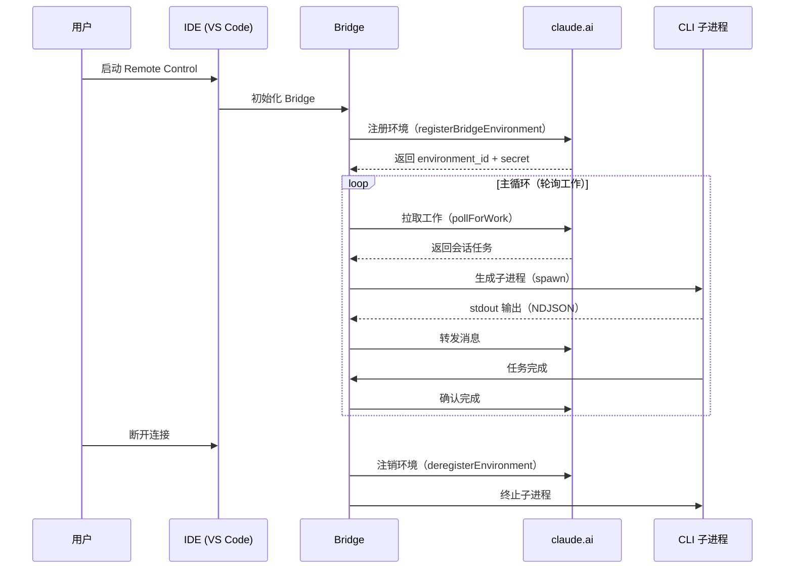

# 第一课：什么是 Bridge？为什么 CLI 需要连接 IDE？

> 🎯 难度：⭐ 入门级 | ⏱ 预计学习时间：20 分钟

## 学习目标

学完本课，你将能够：

1. **理解 Bridge 的角色**——它是 CLI 和 IDE 之间的「翻译官」
2. **解释为什么需要 Bridge**——CLI 和 IDE 是两个独立的程序，无法直接对话
3. **画出 Bridge 的基本通信架构图**——知道消息从哪里来、到哪里去
4. **了解 Bridge 的核心组成模块**——对后续课程有全局认知

---

## 一、什么是 Bridge？

### 1.1 生活类比：同声传译

想象联合国大会上，中国代表讲中文，美国代表讲英文。他们无法直接交流，需要一个**同声传译员**坐在中间，把一方的话翻译成另一方能听懂的语言。

在 Claude Code 的世界里：

| 角色 | 对应 |
|------|------|
| 中国代表（说中文） | **CLI**（命令行工具，在终端运行） |
| 美国代表（说英文） | **IDE**（VS Code / JetBrains，图形界面） |
| 同声传译员 | **Bridge**（桥接系统） |

Bridge 就是这个「同声传译员」。它让两个完全不同的程序能够实时协作。

### 1.2 一句话定义

> **Bridge 是 Claude Code CLI 和 IDE 之间的通信桥梁。它通过网络协议（WebSocket/SSE/HTTP）实现跨进程通信，让用户在 IDE 中操作时，CLI 能够实时响应。**

---

## 二、为什么需要 Bridge？

### 2.1 问题的本质：两个独立的进程

当你在 VS Code 中使用 Claude Code 插件时，实际上有**两个完全独立的程序**在运行：

```
进程 A：VS Code（IDE）          进程 B：Claude CLI
┌─────────────────────┐         ┌─────────────────────┐
│  你的代码编辑器       │         │  AI 推理引擎         │
│  文件浏览器          │         │  工具执行器           │
│  终端面板            │         │  会话管理器           │
└─────────────────────┘         └─────────────────────┘
        ？？？ 它们怎么对话 ？？？
```

这就像两栋没有电话线的大楼——即使住在隔壁，也无法直接沟通。

### 2.2 没有 Bridge 会怎样？

如果没有 Bridge：

- 你在 IDE 中输入的指令，CLI **看不到**
- CLI 生成的代码修改，IDE **不知道**
- 权限请求（"是否允许写入文件？"）无法传达
- 会话状态无法同步

### 2.3 Bridge 解决了什么？

Bridge 是两个进程之间的**消息中继站**：

```
IDE（VS Code）                                CLI（Claude）
     │                                            │
     │  "请帮我重构这个函数"                         │
     │  ────────────────────► Bridge ──────────►   │
     │                                            │
     │                        Bridge ◄──────────   │
     │  ◄────────────────────                      │
     │  "已完成，修改了 3 个文件"                      │
```

---

## 三、Bridge 的核心架构

### 3.1 整体架构图



### 3.2 从源码看 Bridge 的定义

Bridge 在代码中的「身份证」定义在 `types.ts` 中：

```typescript
// 来自 bridge/types.ts
export type BridgeConfig = {
  dir: string              // 工作目录
  machineName: string      // 机器名
  branch: string           // Git 分支
  gitRepoUrl: string | null // Git 仓库 URL
  maxSessions: number      // 最大并发会话数
  spawnMode: SpawnMode     // 工作模式
  verbose: boolean         // 详细日志
  sandbox: boolean         // 沙箱模式
  bridgeId: string         // Bridge 唯一标识
  workerType: string       // 工作类型
  environmentId: string    // 环境标识
  apiBaseUrl: string       // API 地址
  sessionIngressUrl: string // 会话入口 URL
  // ...
}
```

每一个 Bridge 实例都有自己的身份信息——就像每个翻译员都有自己的工牌。

### 3.3 Bridge 的三种工作模式

```typescript
// 来自 bridge/types.ts
export type SpawnMode = 'single-session' | 'worktree' | 'same-dir'
```

| 模式 | 类比 | 说明 |
|------|------|------|
| `single-session` | 一对一私教 | 一个 Bridge 只服务一个会话 |
| `worktree` | 多间教室 | 每个会话有独立的 Git worktree |
| `same-dir` | 共享教室 | 所有会话共享同一个工作目录 |

---

## 四、Bridge 的生命周期

### 4.1 从启动到退出



### 4.2 启动入口：bridgeMain.ts

Bridge 的启动函数定义在 `bridgeMain.ts` 中：

```typescript
// 来自 bridge/bridgeMain.ts
export async function runBridgeLoop(
  config: BridgeConfig,
  environmentId: string,
  environmentSecret: string,
  api: BridgeApiClient,
  spawner: SessionSpawner,
  logger: BridgeLogger,
  signal: AbortSignal,
  backoffConfig: BackoffConfig = DEFAULT_BACKOFF,
  initialSessionId?: string,
  getAccessToken?: () => string | undefined | Promise<string | undefined>,
): Promise<void> {
  const controller = new AbortController()
  // 链接外部信号，外部取消时内部也取消
  if (signal.aborted) {
    controller.abort()
  } else {
    signal.addEventListener('abort', () => controller.abort(), { once: true })
  }
  // ...主循环开始
}
```

注意这里的 `AbortSignal`——它就像一个「紧急停止按钮」，随时可以优雅地关闭 Bridge。

---

## 五、Bridge 的核心文件清单

为了给后续课程做铺垫，这里列出 Bridge 系统的所有核心文件：

| 文件 | 职责 | 对应课程 |
|------|------|---------|
| `bridgeMain.ts` | 主循环、轮询、会话调度 | 第 3 课 |
| `bridgeMessaging.ts` | 消息解析、路由、去重 | 第 4 课 |
| `types.ts` | 类型定义（协议、配置） | 第 4 课 |
| `bridgeApi.ts` | HTTP API 客户端 | 第 2 课 |
| `jwtUtils.ts` | JWT 认证、Token 刷新 | 第 6 课 |
| `sessionRunner.ts` | 子进程生命周期管理 | 第 7 课 |
| `replBridgeTransport.ts` | 传输层抽象（v1/v2） | 第 8 课 |
| `bridgeConfig.ts` | 配置解析 | 第 1 课 |
| `bridgeEnabled.ts` | 功能开关检查 | 第 9 课 |
| `workSecret.ts` | 工作密钥解码 | 第 6 课 |

---

## 六、动手练习

### 练习 1：画架构图

在纸上（或用工具）画出以下元素之间的关系：
- IDE（VS Code）
- Bridge
- Claude CLI
- claude.ai 服务器

标注出它们之间的通信方式（WebSocket、HTTP、stdin/stdout）。

### 练习 2：思考题

1. 为什么 Bridge 不直接内嵌在 IDE 插件中，而是作为独立模块存在？
2. `SpawnMode` 有三种模式，在什么场景下你会选择 `worktree` 模式？
3. 如果 Bridge 突然崩溃，IDE 和 CLI 会发生什么？

### 练习 3：阅读源码

打开 `bridge/types.ts`，找到 `BridgeConfig` 类型定义，数一数它有多少个字段。每个字段的作用你能猜出来吗？

---

## 本课小结

| 要点 | 内容 |
|------|------|
| Bridge 是什么 | CLI 和 IDE 之间的通信桥梁 |
| 为什么需要 | 两个独立进程无法直接通信 |
| 核心架构 | Bridge 在中间做消息中继 |
| 三种模式 | single-session、worktree、same-dir |
| 关键入口 | `runBridgeLoop()` 在 bridgeMain.ts |

---

## 下节预告

> **第 2 课：跨进程通信基础——WebSocket / SSE / HTTP**
>
> Bridge 是怎么实现「翻译」的？它用了哪些网络协议？WebSocket 和 SSE 有什么区别？
> 我们将深入了解 Bridge 底层的通信机制，为理解源码打下基础。

---

*📖 配套漫画：《Bridge 诞生记——翻译官的第一天》*
