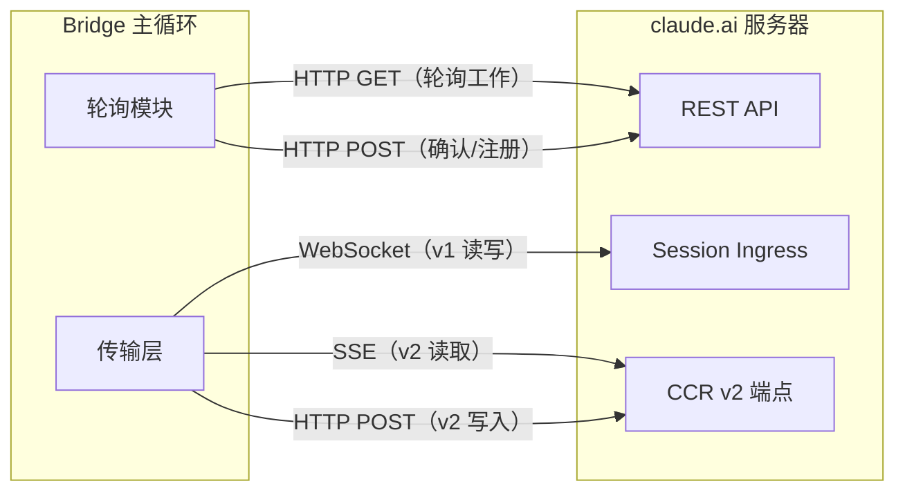
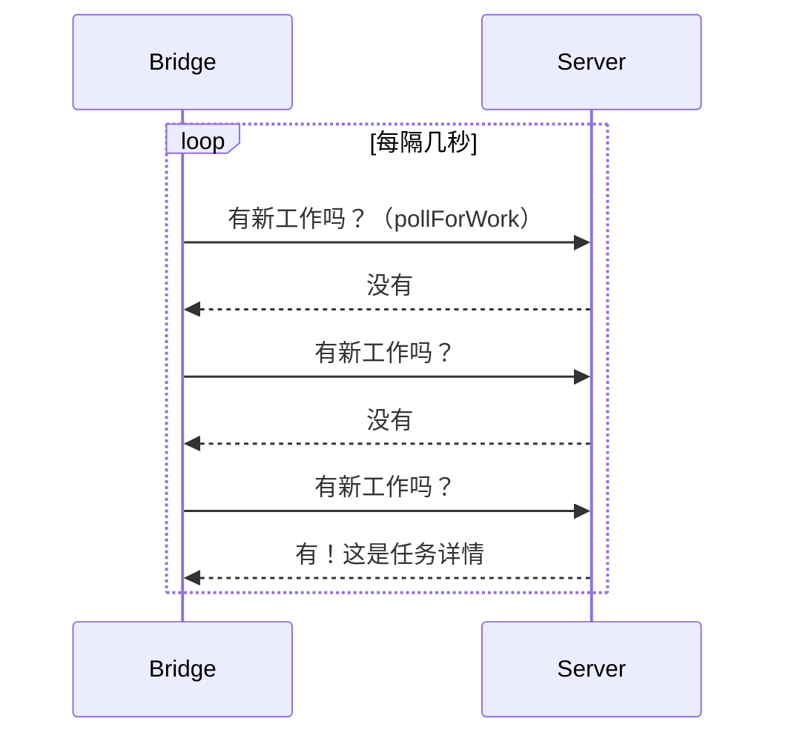
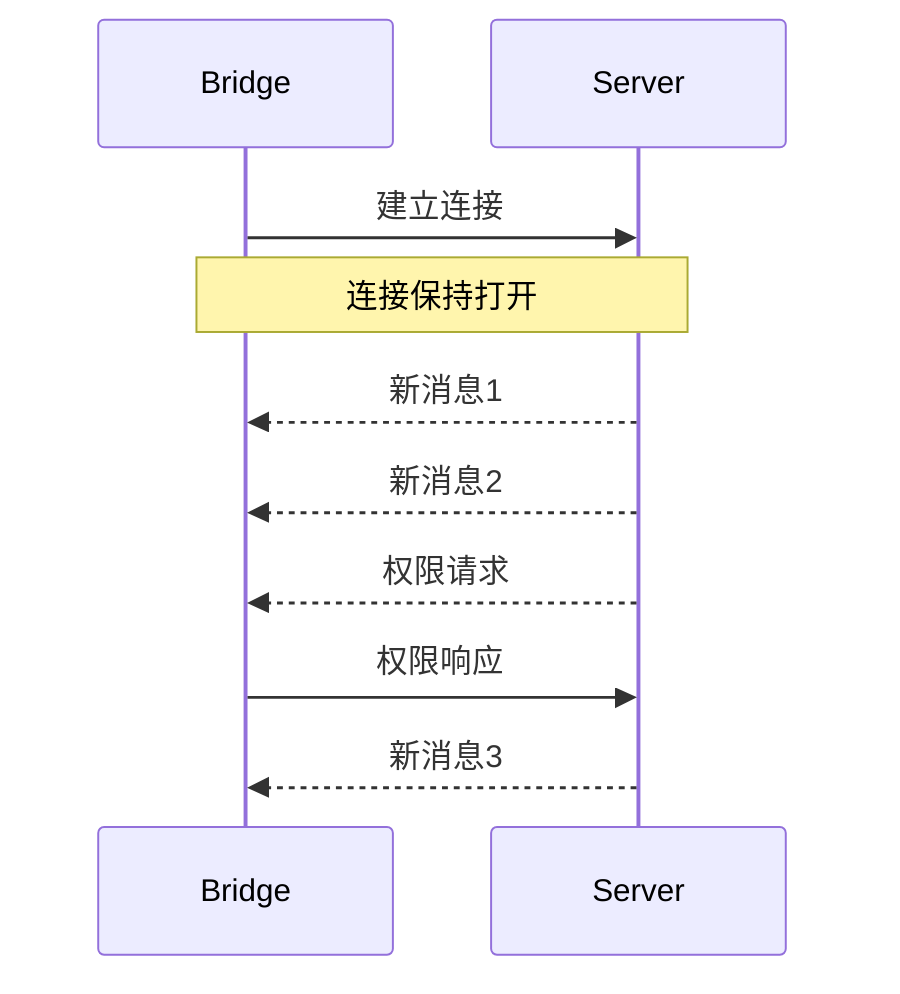
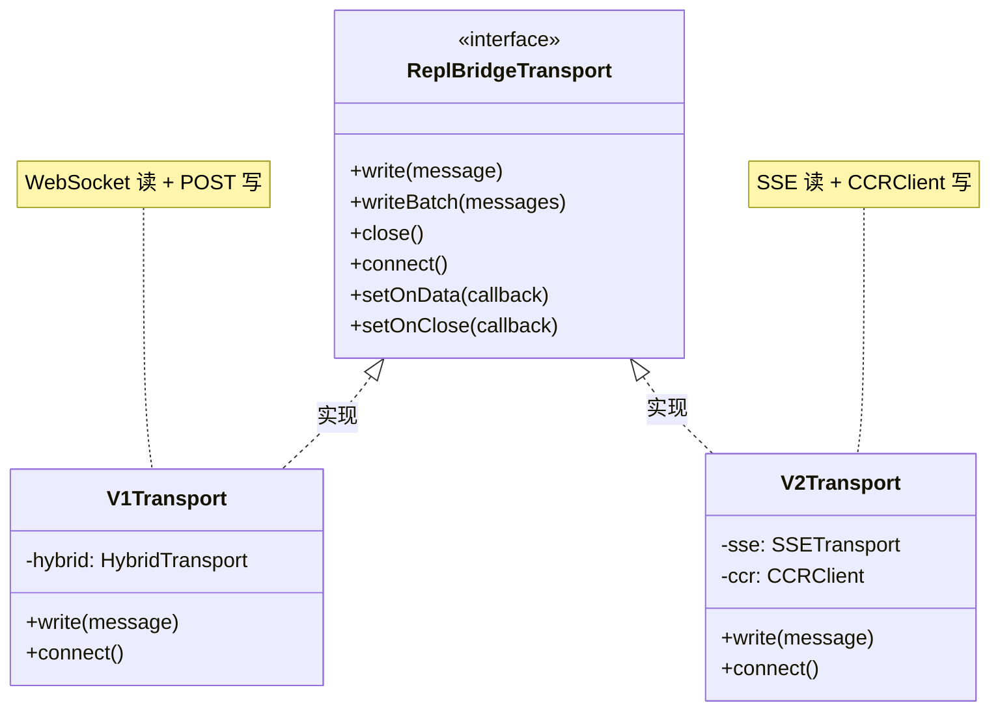

# 第二课：跨进程通信基础——WebSocket / SSE / HTTP

> 🎯 难度：⭐⭐ 基础级 | ⏱ 预计学习时间：25 分钟

## 学习目标

学完本课，你将能够：

1. **理解三种通信协议的区别**——HTTP、WebSocket、SSE 各有什么特点
2. **知道 Bridge 在哪里使用了哪种协议**——对号入座
3. **理解「轮询」和「推送」的区别**——为什么 Bridge 同时使用两种方式
4. **看懂传输层相关的源码**——知道 v1 和 v2 分别是什么

---

## 一、三种通信方式的生活类比

### 1.1 HTTP：写信

HTTP 就像写信：

```
你 ──────── 写一封信 ────────► 邮局 ────────► 对方
你 ◄──────── 回一封信 ──────── 邮局 ◄──────── 对方
```

- **一问一答**：你发一个请求，服务器回一个响应
- **每次都要重新建立连接**：每封信都要重新投递
- **无状态**：邮局不记得你之前寄了什么

### 1.2 WebSocket：打电话

WebSocket 就像打电话：

```
你 ◄─────── 双向实时通话 ──────► 对方
```

- **双向实时**：双方可以随时说话
- **保持连接**：电话接通后一直在线
- **有状态**：双方知道对方的存在

### 1.3 SSE（Server-Sent Events）：听广播

SSE 就像收听广播：

```
你 ◄──────── 单向接收消息 ──────── 广播电台
```

- **单向推送**：服务器主动推送给你
- **保持连接**：一直在收听
- **自动重连**：信号断了会自动恢复

### 1.4 三者对比

| 特性 | HTTP | WebSocket | SSE |
|------|------|-----------|-----|
| 类比 | 写信 | 打电话 | 听广播 |
| 方向 | 请求-响应 | 双向 | 服务器→客户端 |
| 连接 | 短连接 | 长连接 | 长连接 |
| 实时性 | 低 | 高 | 中高 |
| 复杂度 | 简单 | 复杂 | 中等 |

---

## 二、Bridge 中的通信协议

### 2.1 整体通信架构



### 2.2 HTTP 用在哪里？

Bridge 使用 HTTP 做「管理类」操作——注册、轮询、确认。来看 `bridgeApi.ts`：

```typescript
// 来自 bridge/bridgeApi.ts
// 注册 Bridge 环境 —— HTTP POST
async registerBridgeEnvironment(
  config: BridgeConfig,
): Promise<{ environment_id: string; environment_secret: string }> {
  const response = await withOAuthRetry(
    (token: string) =>
      axios.post<{
        environment_id: string
        environment_secret: string
      }>(
        `${deps.baseUrl}/v1/environments/bridge`,
        {
          machine_name: config.machineName,
          directory: config.dir,
          branch: config.branch,
          git_repo_url: config.gitRepoUrl,
          max_sessions: config.maxSessions,
          metadata: { worker_type: config.workerType },
        },
        {
          headers: getHeaders(token),
          timeout: 15_000,
          validateStatus: status => status < 500,
        },
      ),
    'Registration',
  )
  // ...
}
```

```typescript
// 来自 bridge/bridgeApi.ts
// 轮询工作 —— HTTP GET
async pollForWork(
  environmentId: string,
  environmentSecret: string,
  signal?: AbortSignal,
): Promise<WorkResponse | null> {
  const response = await axios.get<WorkResponse | null>(
    `${deps.baseUrl}/v1/environments/${environmentId}/work/poll`,
    {
      headers: getHeaders(environmentSecret),
      timeout: 10_000,
      signal,
      validateStatus: status => status < 500,
    },
  )
  // ...
}
```

### 2.3 WebSocket 用在哪里？

WebSocket 是 **v1 传输层**的核心。它在 Bridge 和 Session Ingress 之间建立双向实时通道：

```typescript
// 来自 bridge/replBridgeTransport.ts
// v1 适配器：基于 HybridTransport（WebSocket 读 + POST 写）
export function createV1ReplTransport(
  hybrid: HybridTransport,
): ReplBridgeTransport {
  return {
    write: msg => hybrid.write(msg),
    writeBatch: msgs => hybrid.writeBatch(msgs),
    close: () => hybrid.close(),
    isConnectedStatus: () => hybrid.isConnectedStatus(),
    getStateLabel: () => hybrid.getStateLabel(),
    setOnData: cb => hybrid.setOnData(cb),
    setOnClose: cb => hybrid.setOnClose(cb),
    setOnConnect: cb => hybrid.setOnConnect(cb),
    connect: () => void hybrid.connect(),
    // v1 不使用 SSE 序列号
    getLastSequenceNum: () => 0,
    // ...
  }
}
```

### 2.4 SSE 用在哪里？

SSE 是 **v2 传输层**的读取通道。服务器通过 SSE 推送事件给 Bridge：

```typescript
// 来自 bridge/replBridgeTransport.ts
// v2 适配器：SSE（读取）+ CCRClient（写入）
export async function createV2ReplTransport(opts: {
  sessionUrl: string
  ingressToken: string
  sessionId: string
  initialSequenceNum?: number   // 上次读到的位置
  epoch?: number                // Worker 纪元号
  outboundOnly?: boolean        // 是否只发不收
  // ...
}): Promise<ReplBridgeTransport> {
  // 构造 SSE 流 URL
  const sseUrl = new URL(sessionUrl)
  sseUrl.pathname = sseUrl.pathname.replace(/\/$/, '') + '/worker/events/stream'

  // 创建 SSE 传输层（读取）
  const sse = new SSETransport(
    sseUrl, {}, sessionId, undefined, initialSequenceNum, getAuthHeaders,
  )

  // 创建 CCR 客户端（写入）
  const ccr = new CCRClient(sse, new URL(sessionUrl), {
    getAuthHeaders,
    // ...
  })
  // ...
}
```

---

## 三、轮询 vs 推送

### 3.1 轮询（Polling）：不停地问

Bridge 的主循环使用轮询来获取新任务：



这就像你每隔几分钟去信箱看一次——效率不高，但简单可靠。

### 3.2 推送（Push）：服务器主动通知

会话进行中的消息传输使用推送模式（WebSocket 或 SSE）：



这就像广播——一旦调好频率，消息自动到达。

### 3.3 为什么同时使用两种？

| 场景 | 方式 | 原因 |
|------|------|------|
| 等待新任务 | 轮询 | 简单可靠，任务不频繁 |
| 会话中的消息 | 推送 | 实时性要求高 |
| 管理操作（注册/注销） | HTTP 单次请求 | 一次性操作 |

---

## 四、传输层抽象：统一接口

### 4.1 为什么需要抽象？

v1 用 WebSocket，v2 用 SSE+HTTP。如果每个调用者都要判断版本，代码会变成一团乱麻。

解决方案：**统一接口**（ReplBridgeTransport）。

```typescript
// 来自 bridge/replBridgeTransport.ts
// 无论 v1 还是 v2，对外暴露相同的接口
export type ReplBridgeTransport = {
  write(message: StdoutMessage): Promise<void>       // 写消息
  writeBatch(messages: StdoutMessage[]): Promise<void> // 批量写
  close(): void                                        // 关闭
  isConnectedStatus(): boolean                         // 是否已连接
  getStateLabel(): string                              // 状态标签
  setOnData(callback: (data: string) => void): void    // 设置数据回调
  setOnClose(callback: (closeCode?: number) => void): void // 关闭回调
  setOnConnect(callback: () => void): void             // 连接回调
  connect(): void                                      // 建立连接
  getLastSequenceNum(): number                         // SSE 序列号
  readonly droppedBatchCount: number                   // 丢弃批次计数
  reportState(state: SessionState): void               // 报告状态
  flush(): Promise<void>                               // 刷新队列
}
```

### 4.2 适配器模式



这种设计叫做**适配器模式**——就像旅行时带的电源转换插头：

- 美国插座（v1 WebSocket）→ 转换插头 → 你的充电器
- 欧洲插座（v2 SSE）→ 转换插头 → 你的充电器

充电器（Bridge 主逻辑）不需要知道插座长什么样。

---

## 五、v1 vs v2 的区别

### 5.1 v1：WebSocket + HTTP POST

```
读取：WebSocket ←── Session Ingress
写入：HTTP POST ──► Session Ingress
```

### 5.2 v2：SSE + CCRClient

```
读取：SSE ←── CCR v2 /worker/events/stream
写入：HTTP POST ──► CCR v2 /worker/events
```

### 5.3 对比表

| 特性 | v1 | v2 |
|------|----|----|
| 读取通道 | WebSocket | SSE |
| 写入通道 | HTTP POST | CCRClient POST |
| 断线重连 | 服务端游标 | SSE 序列号（from_sequence_num） |
| 心跳 | WebSocket 内置 | CCRClient 自定义心跳 |
| 状态报告 | 无 | reportState / reportMetadata |
| 交付确认 | 无 | reportDelivery |

### 5.4 从源码看 v2 的连接过程

```typescript
// 来自 bridge/replBridgeTransport.ts（createV2ReplTransport）
connect() {
  // 1. 启动 SSE 读取流（后台运行，不阻塞）
  if (!opts.outboundOnly) {
    void sse.connect()
  }
  // 2. 初始化 CCR 客户端（写入就绪后通知）
  void ccr.initialize(epoch).then(
    () => {
      ccrInitialized = true
      onConnectCb?.()
    },
    (err: unknown) => {
      ccr.close()
      sse.close()
      onCloseCb?.(4091) // 初始化失败
    },
  )
}
```

关键点：SSE 读和 CCR 写**并行启动**，互不阻塞。

---

## 六、错误处理与重试

### 6.1 HTTP 请求的 401 重试

```typescript
// 来自 bridge/bridgeApi.ts
async function withOAuthRetry<T>(
  fn: (accessToken: string) => Promise<{ status: number; data: T }>,
  context: string,
): Promise<{ status: number; data: T }> {
  const accessToken = resolveAuth()
  const response = await fn(accessToken)

  if (response.status !== 401) {
    return response    // 正常返回
  }

  // 401 = Token 过期，尝试刷新
  if (!deps.onAuth401) {
    return response    // 没有刷新能力，返回错误
  }

  const refreshed = await deps.onAuth401(accessToken)
  if (refreshed) {
    const newToken = resolveAuth()
    return await fn(newToken)  // 用新 Token 重试一次
  }

  return response
}
```

### 6.2 连接退避策略

Bridge 在连接失败时使用**指数退避**：

```typescript
// 来自 bridge/bridgeMain.ts
const DEFAULT_BACKOFF: BackoffConfig = {
  connInitialMs: 2_000,     // 初始等 2 秒
  connCapMs: 120_000,       // 最多等 2 分钟
  connGiveUpMs: 600_000,    // 10 分钟后放弃
  generalInitialMs: 500,    // 一般错误初始 0.5 秒
  generalCapMs: 30_000,     // 最多等 30 秒
  generalGiveUpMs: 600_000, // 10 分钟后放弃
}
```

退避过程像这样：2秒 → 4秒 → 8秒 → 16秒 → ... → 最多 120 秒。

---

## 七、动手练习

### 练习 1：协议选择

对以下场景，你会选择 HTTP、WebSocket 还是 SSE？

1. 用户注册账号 → ____
2. 实时聊天室 → ____
3. 股票行情推送 → ____
4. 文件上传 → ____
5. 服务器日志实时推送 → ____

### 练习 2：阅读源码

打开 `bridge/replBridgeTransport.ts`，找到 `createV1ReplTransport` 和 `createV2ReplTransport` 函数，对比它们的 `connect()` 方法有什么不同。

### 练习 3：思考题

1. 为什么 v1 用 WebSocket 读但用 HTTP POST 写，而不是全部用 WebSocket？
2. SSE 的 `from_sequence_num` 解决了什么问题？
3. 如果网络断了 30 秒又恢复了，v1 和 v2 分别会怎么处理？

---

## 本课小结

| 要点 | 内容 |
|------|------|
| HTTP | 一问一答，用于管理操作（注册、轮询） |
| WebSocket | 双向实时，v1 传输层的读取通道 |
| SSE | 服务器推送，v2 传输层的读取通道 |
| 传输层抽象 | ReplBridgeTransport 统一 v1/v2 |
| 退避策略 | 失败后等待时间指数增长 |

---

## 下节预告

> **第 3 课：bridgeMain.ts 主循环源码解析**
>
> Bridge 的「心脏」是怎么跳动的？主循环怎么调度会话？
> 我们将深入 `runBridgeLoop()` 函数，看它如何协调轮询、会话管理和错误处理。

---

*📖 配套漫画：《三种通信方式的对决——写信 vs 电话 vs 广播》*
