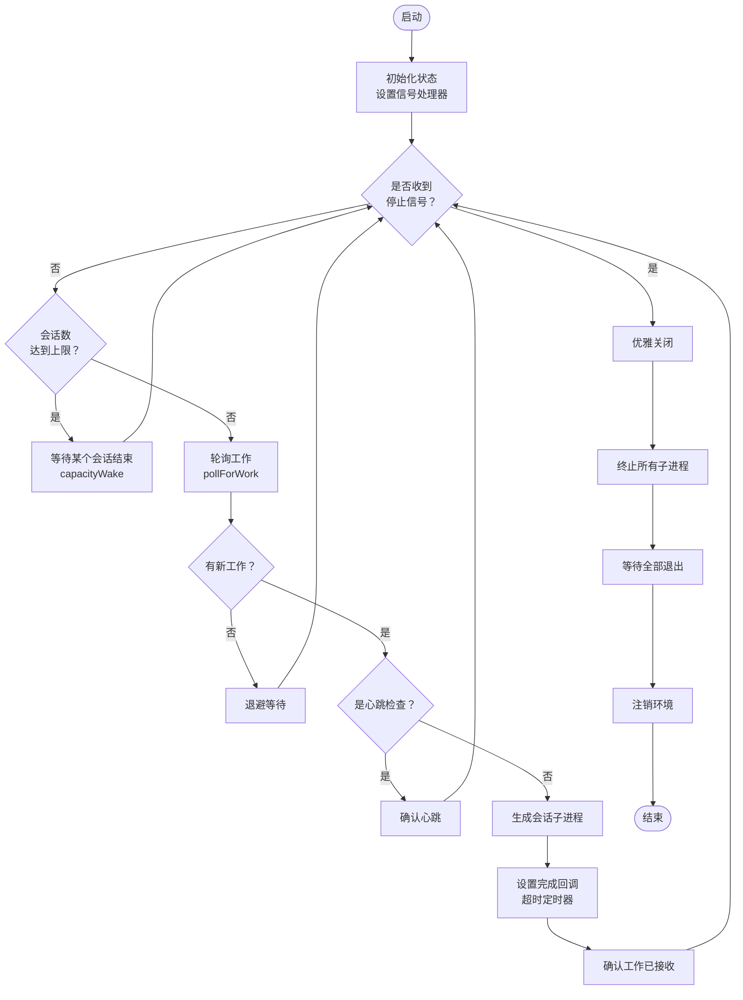
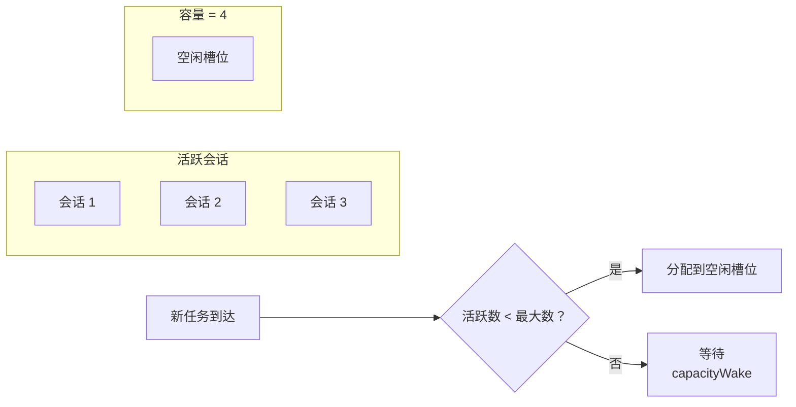
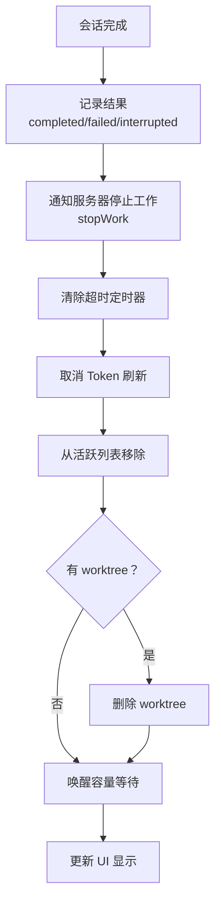

# 第三课：bridgeMain.ts 主循环源码解析

> 🎯 难度：⭐⭐⭐ 进阶级 | ⏱ 预计学习时间：30 分钟

## 学习目标

学完本课，你将能够：

1. **理解 `runBridgeLoop()` 的整体结构**——Bridge 的心脏如何跳动
2. **掌握轮询-处理-清理的循环模式**——每一跳做了什么
3. **理解多会话管理机制**——如何同时处理多个任务
4. **看懂退避策略与错误恢复**——Bridge 如何应对网络故障
5. **理解优雅关闭流程**——Bridge 如何安全停止

---

## 一、主循环的生活类比

### 1.1 Bridge 像一个快递站

想象一个快递站的工作流程：

```
while (快递站还在营业) {
  1. 去仓库看看有没有新包裹（轮询）
  2. 如果有，安排快递员送货（生成子进程）
  3. 快递员送完了，记录结果（清理）
  4. 如果快递员太多了，等一个送完再接新的（容量控制）
}
关门，等所有快递员回来（优雅关闭）
```

这就是 `runBridgeLoop()` 的核心逻辑！

---

## 二、`runBridgeLoop()` 全景图

### 2.1 函数签名

```typescript
// 来自 bridge/bridgeMain.ts
export async function runBridgeLoop(
  config: BridgeConfig,          // Bridge 配置
  environmentId: string,          // 环境 ID（服务器分配的）
  environmentSecret: string,      // 环境密钥
  api: BridgeApiClient,          // API 客户端
  spawner: SessionSpawner,       // 会话生成器
  logger: BridgeLogger,          // 日志/UI 显示
  signal: AbortSignal,           // 外部停止信号
  backoffConfig: BackoffConfig = DEFAULT_BACKOFF,  // 退避配置
  initialSessionId?: string,     // 初始会话（恢复场景）
  getAccessToken?: () => string | undefined | Promise<string | undefined>,
): Promise<void>
```

### 2.2 内部状态管理

```typescript
// 来自 bridge/bridgeMain.ts（runBridgeLoop 内部）
const activeSessions = new Map<string, SessionHandle>()    // 活跃会话
const sessionStartTimes = new Map<string, number>()        // 会话开始时间
const sessionWorkIds = new Map<string, string>()           // 会话对应的工作 ID
const sessionCompatIds = new Map<string, string>()         // 兼容格式的会话 ID
const sessionIngressTokens = new Map<string, string>()     // 入口 JWT
const sessionTimers = new Map<string, ReturnType<typeof setTimeout>>()  // 超时定时器
const completedWorkIds = new Set<string>()                 // 已完成的工作 ID
const timedOutSessions = new Set<string>()                 // 已超时的会话
const titledSessions = new Set<string>()                   // 已有标题的会话
```

这就像快递站的各种登记本——谁在送货、什么时候开始的、谁送完了……

### 2.3 主循环流程图



---

## 三、轮询阶段详解

### 3.1 轮询节奏控制

Bridge 不是疯狂地轮询，而是有节奏的：

```typescript
// 来自 bridge/pollConfig.ts 的默认配置
// Bridge 使用可配置的轮询间隔
// 空闲时间隔较长，有活动时间隔较短
```

```typescript
// 来自 bridge/bridgeMain.ts
const DEFAULT_BACKOFF: BackoffConfig = {
  connInitialMs: 2_000,      // 连接错误：初始 2 秒
  connCapMs: 120_000,        // 最多 2 分钟
  connGiveUpMs: 600_000,     // 10 分钟后放弃
  generalInitialMs: 500,     // 一般错误：初始 0.5 秒
  generalCapMs: 30_000,      // 最多 30 秒
  generalGiveUpMs: 600_000,  // 10 分钟后放弃
}
```

### 3.2 退避过程的可视化


### 3.3 睡眠检测

当电脑合盖睡眠后，定时器会暂停。Bridge 通过检测时间跳跃来判断是否发生了睡眠：

```typescript
// 来自 bridge/bridgeMain.ts
function pollSleepDetectionThresholdMs(backoff: BackoffConfig): number {
  // 阈值 = 最大退避时间 × 2
  // 如果两次轮询之间的时间差超过这个阈值，说明系统睡眠了
  return backoff.connCapMs * 2
}
```

这就像你设了一个 1 分钟的闹钟，结果醒来发现过了 8 小时——显然你睡着了。

---

## 四、会话生成阶段

### 4.1 安全生成

```typescript
// 来自 bridge/bridgeMain.ts
function safeSpawn(
  spawner: SessionSpawner,
  opts: SessionSpawnOpts,
  dir: string,
): SessionHandle | string {
  try {
    return spawner.spawn(opts, dir)
  } catch (err) {
    const errMsg = errorMessage(err)
    logError(new Error(`Session spawn failed: ${errMsg}`))
    return errMsg   // 返回错误消息而不是抛异常
  }
}
```

注意：`safeSpawn` 不会抛出异常，而是返回错误字符串。这确保主循环不会因为一个会话的失败而崩溃——一个快递员出了事故，快递站继续运营。

### 4.2 会话生成的完整流程

```mermaid
sequenceDiagram
    participant Loop as 主循环
    participant API as API 客户端
    participant Secret as WorkSecret
    participant Spawner as SessionSpawner
    participant Child as 子进程

    Loop->>API: pollForWork()
    API-->>Loop: WorkResponse（含 secret）

    Loop->>Secret: decodeWorkSecret(secret)
    Secret-->>Loop: 解码得到 token、URL 等

    Loop->>Spawner: spawn(opts, dir)
    Spawner->>Child: 创建子进程
    Child-->>Spawner: SessionHandle

    Loop->>API: acknowledgeWork()
    Note over Loop: 设置超时定时器<br/>设置完成回调
```

### 4.3 工作密钥解码

```typescript
// 来自 bridge/workSecret.ts
export function decodeWorkSecret(secret: string): WorkSecret {
  const json = Buffer.from(secret, 'base64url').toString('utf-8')
  const parsed: unknown = jsonParse(json)
  if (
    !parsed ||
    typeof parsed !== 'object' ||
    !('version' in parsed) ||
    parsed.version !== 1
  ) {
    throw new Error(`Unsupported work secret version: ...`)
  }
  // 验证必要字段
  if (typeof obj.session_ingress_token !== 'string' ||
      obj.session_ingress_token.length === 0) {
    throw new Error('missing or empty session_ingress_token')
  }
  return parsed as WorkSecret
}
```

工作密钥就像快递包裹上的条形码——扫描后才知道送到哪里、用什么方式送。

---

## 五、多会话管理

### 5.1 容量控制



### 5.2 会话完成回调

当一个会话结束时，需要做很多清理工作：



---

## 六、心跳机制

### 6.1 为什么需要心跳？

心跳就像定期给服务器发短信说"我还活着"。如果服务器长时间收不到心跳，就会认为 Bridge 已经死了，把任务重新分配给别人。

```typescript
// 来自 bridge/bridgeMain.ts
async function heartbeatActiveWorkItems(): Promise<
  'ok' | 'auth_failed' | 'fatal' | 'failed'
> {
  let anySuccess = false
  let anyFatal = false
  const authFailedSessions: string[] = []

  for (const [sessionId] of activeSessions) {
    const workId = sessionWorkIds.get(sessionId)
    const ingressToken = sessionIngressTokens.get(sessionId)
    if (!workId || !ingressToken) continue

    try {
      await api.heartbeatWork(environmentId, workId, ingressToken)
      anySuccess = true
    } catch (err) {
      // 处理认证过期、致命错误等情况
      if (err instanceof BridgeFatalError) {
        if (err.status === 401 || err.status === 403) {
          authFailedSessions.push(sessionId)
        } else {
          anyFatal = true
        }
      }
    }
  }
  // ...
}
```

### 6.2 心跳认证过期后的恢复

```typescript
// 来自 bridge/bridgeMain.ts
// JWT 过期 → 触发服务器重新分发
for (const sessionId of authFailedSessions) {
  logger.logVerbose(
    `Session ${sessionId} token expired — re-queuing via bridge/reconnect`,
  )
  try {
    await api.reconnectSession(environmentId, sessionId)
  } catch (err) {
    logger.logError(
      `Failed to refresh session ${sessionId} token: ${errorMessage(err)}`,
    )
  }
}
```

---

## 七、优雅关闭

### 7.1 关闭流程

```mermaid
sequenceDiagram
    participant User as 用户
    participant Signal as AbortSignal
    participant Loop as 主循环
    participant Sessions as 活跃会话
    participant API as API 客户端

    User->>Signal: Ctrl+C / 断开连接
    Signal->>Loop: abort 事件

    Loop->>Sessions: kill() 发送 SIGTERM
    Loop->>Loop: 等待 30 秒（shutdownGraceMs）

    alt 30 秒内退出
        Sessions-->>Loop: 所有进程退出
    else 超时
        Loop->>Sessions: forceKill() 发送 SIGKILL
    end

    Loop->>API: deregisterEnvironment()
    Loop->>Loop: 等待清理任务完成
    Note over Loop: 退出
```

### 7.2 SIGTERM → SIGKILL 升级

```
第 0 秒：发送 SIGTERM（"请停下来"）
         ↓ 子进程有 30 秒处理收尾工作
第 30 秒：发送 SIGKILL（"强制停止"）
```

这就像餐厅打烊：先告诉客人"我们要关门了"（SIGTERM），等 30 秒后如果还有人不走，就关灯锁门（SIGKILL）。

---

## 八、Token 刷新调度

```typescript
// 来自 bridge/bridgeMain.ts
const tokenRefresh = getAccessToken
  ? createTokenRefreshScheduler({
      getAccessToken,
      onRefresh: (sessionId, oauthToken) => {
        const handle = activeSessions.get(sessionId)
        if (!handle) return

        if (v2Sessions.has(sessionId)) {
          // v2 会话：触发服务器重新分发
          void api.reconnectSession(environmentId, sessionId)
        } else {
          // v1 会话：直接更新子进程的 Token
          handle.updateAccessToken(oauthToken)
        }
      },
      label: 'bridge',
    })
  : null
```

v1 和 v2 的 Token 刷新策略不同——就像两种不同的会员卡续费方式：
- v1：到期前 5 分钟自动续费（直接给子进程新 Token）
- v2：通知总部重新发卡（触发 reconnectSession）

---

## 九、动手练习

### 练习 1：主循环状态机

画出 Bridge 主循环的状态转换图，包括以下状态：
- 空闲（等待工作）
- 处理中（有活跃会话）
- 退避中（遇到错误）
- 关闭中（优雅退出）

### 练习 2：调试场景

假设你看到以下日志：
```
[bridge:work] Starting poll loop spawnMode=worktree maxSessions=4
[bridge:api] GET .../work/poll -> 200 (no work, 1 consecutive empty polls)
[bridge:api] GET .../work/poll -> 200 (no work, 100 consecutive empty polls)
```

这说明什么？你能推算出大约过了多长时间吗？

### 练习 3：思考题

1. 为什么 `safeSpawn` 返回错误字符串而不是抛异常？
2. `completedWorkIds` 这个 Set 的作用是什么？在什么场景下会重复收到同一个 workId？
3. 如果 `maxSessions = 1` 且是 `single-session` 模式，会话结束后 Bridge 会怎么做？

---

## 本课小结

| 要点 | 内容 |
|------|------|
| 主循环模式 | 轮询 → 处理 → 清理，循环往复 |
| 容量控制 | Map 跟踪活跃会话，达到上限时等待 |
| 退避策略 | 指数退避，从 2 秒到最多 120 秒 |
| 心跳机制 | 定期通知服务器"我还活着" |
| 优雅关闭 | SIGTERM → 等待 → SIGKILL → 注销 |
| Token 刷新 | v1 直接更新，v2 触发重新分发 |

---

## 下节预告

> **第 4 课：消息协议设计——SDKMessage / ControlRequest / ControlResponse**
>
> Bridge 传递的消息长什么样？它们有哪些类型？
> 我们将深入 `bridgeMessaging.ts`，解析消息的格式和路由逻辑。

---

*📖 配套漫画：《快递站的一天——Bridge 主循环图解》*
