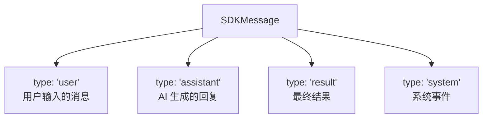
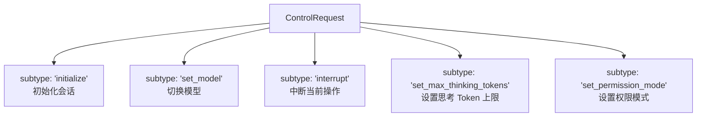
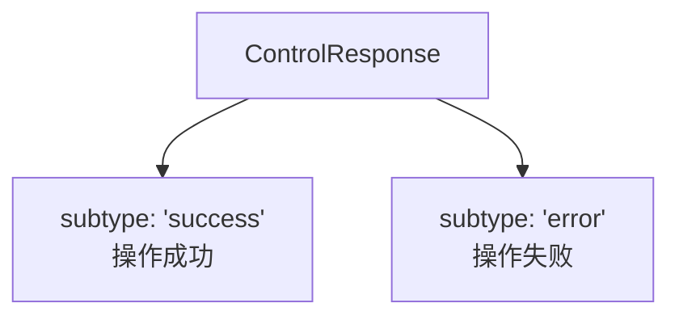
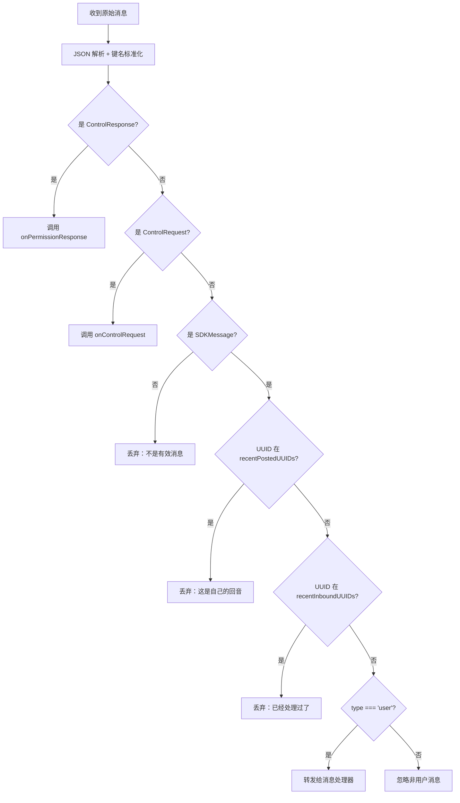
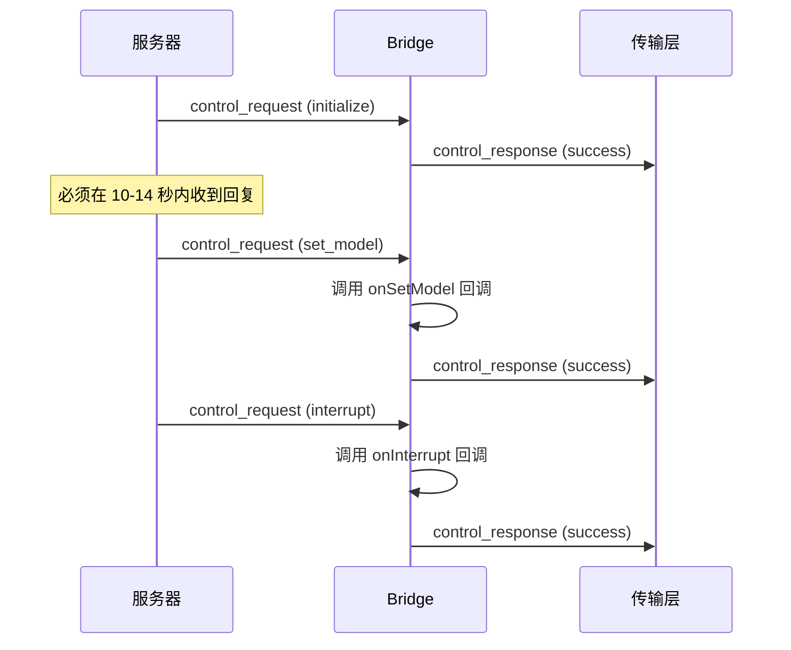
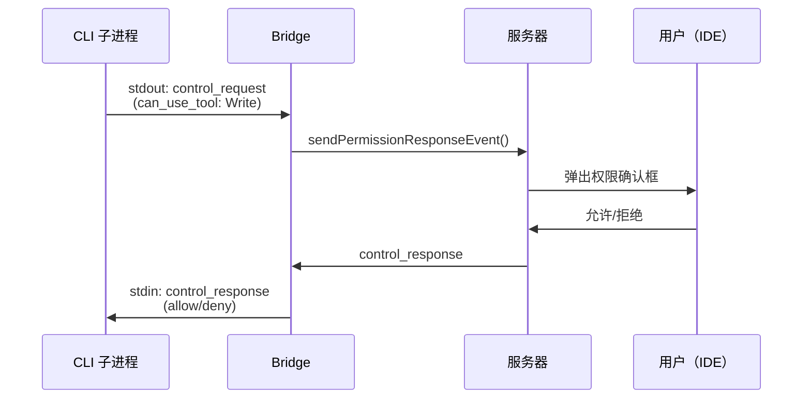
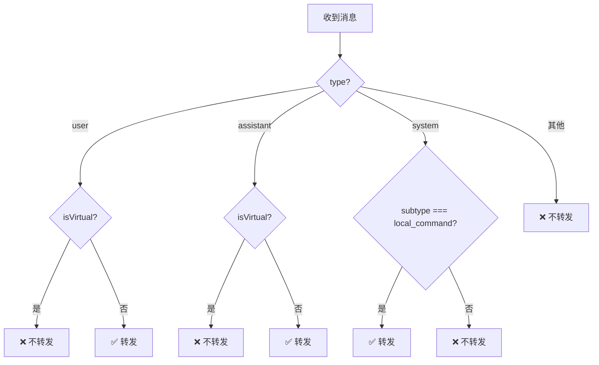

# 第四课：消息协议设计——SDKMessage / ControlRequest / ControlResponse

> 🎯 难度：⭐⭐⭐ 进阶级 | ⏱ 预计学习时间：25 分钟

## 学习目标

学完本课，你将能够：

1. **理解 Bridge 传递的三种消息类型**——SDKMessage、ControlRequest、ControlResponse
2. **掌握消息路由逻辑**——什么消息去哪里
3. **理解 UUID 去重机制**——为什么需要 BoundedUUIDSet
4. **看懂消息的判断与过滤逻辑**——哪些消息该转发，哪些该忽略

---

## 一、消息协议的生活类比

### 1.1 快递分拣中心

想象一个快递分拣中心收到各种各样的包裹：

| 包裹类型 | 对应消息类型 | 处理方式 |
|---------|-------------|---------|
| 普通快递（衣服、书） | **SDKMessage** | 分拣到对应区域 |
| 政府公文（需要签收） | **ControlRequest** | 必须立即回复确认 |
| 签收回执 | **ControlResponse** | 记录并转交给发件人 |

Bridge 就是这个分拣中心——收到消息后，判断类型，分发到正确的处理器。

---

## 二、三种消息类型详解

### 2.1 SDKMessage：普通消息

SDKMessage 是最常见的消息类型，包含用户输入和 AI 输出：

```typescript
// 来自 bridge/bridgeMessaging.ts
// 类型守卫：判断是否为 SDKMessage
export function isSDKMessage(value: unknown): value is SDKMessage {
  return (
    value !== null &&
    typeof value === 'object' &&
    'type' in value &&
    typeof value.type === 'string'
  )
}
```

SDKMessage 是一个**联合类型**，通过 `type` 字段区分不同种类：



### 2.2 ControlRequest：控制请求

服务器发来的「命令」，Bridge 必须回复：

```typescript
// 来自 bridge/bridgeMessaging.ts
export function isSDKControlRequest(
  value: unknown,
): value is SDKControlRequest {
  return (
    value !== null &&
    typeof value === 'object' &&
    'type' in value &&
    value.type === 'control_request' &&
    'request_id' in value &&
    'request' in value
  )
}
```

ControlRequest 的子类型：



### 2.3 ControlResponse：控制响应

对 ControlRequest 的回复，分两种结果：

```typescript
// 来自 bridge/bridgeMessaging.ts
export function isSDKControlResponse(
  value: unknown,
): value is SDKControlResponse {
  return (
    value !== null &&
    typeof value === 'object' &&
    'type' in value &&
    value.type === 'control_response' &&
    'response' in value
  )
}
```



---

## 三、消息路由：handleIngressMessage

### 3.1 核心路由函数

这是 Bridge 消息处理的核心——所有从服务器进来的消息都经过这个函数：

```typescript
// 来自 bridge/bridgeMessaging.ts
export function handleIngressMessage(
  data: string,                              // 原始消息字符串
  recentPostedUUIDs: BoundedUUIDSet,         // 最近发出的消息 UUID
  recentInboundUUIDs: BoundedUUIDSet,        // 最近收到的消息 UUID
  onInboundMessage: ((msg: SDKMessage) => void | Promise<void>) | undefined,
  onPermissionResponse?: ((response: SDKControlResponse) => void) | undefined,
  onControlRequest?: ((request: SDKControlRequest) => void) | undefined,
): void {
  try {
    const parsed: unknown = normalizeControlMessageKeys(jsonParse(data))

    // 1️⃣ 先检查是否是 ControlResponse
    if (isSDKControlResponse(parsed)) {
      onPermissionResponse?.(parsed)
      return
    }

    // 2️⃣ 再检查是否是 ControlRequest
    if (isSDKControlRequest(parsed)) {
      onControlRequest?.(parsed)
      return
    }

    // 3️⃣ 最后检查是否是 SDKMessage
    if (!isSDKMessage(parsed)) return

    // 4️⃣ UUID 去重：过滤掉自己发出的消息（回音）
    const uuid = 'uuid' in parsed && typeof parsed.uuid === 'string'
      ? parsed.uuid : undefined

    if (uuid && recentPostedUUIDs.has(uuid)) {
      return  // 忽略回音
    }

    // 5️⃣ UUID 去重：过滤掉已经处理过的消息（重复投递）
    if (uuid && recentInboundUUIDs.has(uuid)) {
      return  // 忽略重复
    }

    // 6️⃣ 只转发用户消息
    if (parsed.type === 'user') {
      if (uuid) recentInboundUUIDs.add(uuid)
      void onInboundMessage?.(parsed)
    }
  } catch (err) {
    // 解析失败不崩溃，只记日志
  }
}
```

### 3.2 路由流程图



---

## 四、服务器控制请求的处理

### 4.1 handleServerControlRequest 函数

当服务器发来 ControlRequest，Bridge 需要立即回复——否则服务器会在 10-14 秒后杀掉连接：

```typescript
// 来自 bridge/bridgeMessaging.ts
export function handleServerControlRequest(
  request: SDKControlRequest,
  handlers: ServerControlRequestHandlers,
): void {
  const { transport, sessionId, outboundOnly } = handlers

  // 如果是「只发不收」模式，除 initialize 外都拒绝
  if (outboundOnly && request.request.subtype !== 'initialize') {
    response = {
      type: 'control_response',
      response: {
        subtype: 'error',
        request_id: request.request_id,
        error: 'This session is outbound-only...',
      },
    }
    void transport.write(event)
    return
  }

  switch (request.request.subtype) {
    case 'initialize':
      // 返回基本能力信息
      response = {
        type: 'control_response',
        response: {
          subtype: 'success',
          request_id: request.request_id,
          response: {
            commands: [],
            output_style: 'normal',
            models: [],
            account: {},
            pid: process.pid,
          },
        },
      }
      break

    case 'set_model':
      handlers.onSetModel?.(request.request.model)
      // 回复成功
      break

    case 'interrupt':
      handlers.onInterrupt?.()
      // 回复成功
      break

    // ...其他子类型
  }

  void transport.write(event)
}
```

### 4.2 控制请求处理流程



---

## 五、权限请求：从子进程到服务器

### 5.1 子进程发起权限请求

当 CLI 子进程需要执行敏感操作（如写文件），它会通过 stdout 发送权限请求：

```typescript
// 来自 bridge/sessionRunner.ts
export type PermissionRequest = {
  type: 'control_request'
  request_id: string
  request: {
    subtype: 'can_use_tool'     // "我能用这个工具吗？"
    tool_name: string           // 工具名（如 "Write"）
    input: Record<string, unknown>  // 工具输入
    tool_use_id: string         // 工具调用 ID
  }
}
```

### 5.2 权限请求的流转



---

## 六、消息过滤：哪些消息该转发？

### 6.1 eligible 消息判断

```typescript
// 来自 bridge/bridgeMessaging.ts
export function isEligibleBridgeMessage(m: Message): boolean {
  // 虚拟消息（REPL 内部调用）只用于显示，不转发
  if ((m.type === 'user' || m.type === 'assistant') && m.isVirtual) {
    return false
  }
  return (
    m.type === 'user' ||           // 用户消息 ✓
    m.type === 'assistant' ||      // AI 回复 ✓
    (m.type === 'system' && m.subtype === 'local_command')  // 斜杠命令 ✓
  )
}
```

### 6.2 标题提取

```typescript
// 来自 bridge/bridgeMessaging.ts
export function extractTitleText(m: Message): string | undefined {
  // 只从用户消息中提取标题
  if (m.type !== 'user' || m.isMeta || m.toolUseResult || m.isCompactSummary)
    return undefined
  // 只接受人类输入（排除任务通知、频道消息）
  if (m.origin && m.origin.kind !== 'human') return undefined
  // 提取文本内容
  const content = m.message.content
  let raw: string | undefined
  if (typeof content === 'string') {
    raw = content
  } else {
    for (const block of content) {
      if (block.type === 'text') {
        raw = block.text
        break
      }
    }
  }
  // 去除 display tags 后返回
  const clean = stripDisplayTagsAllowEmpty(raw)
  return clean || undefined
}
```

### 6.3 过滤规则总结



---

## 七、结果消息

### 7.1 构建归档消息

当会话结束时，Bridge 发送一个结果消息用于归档：

```typescript
// 来自 bridge/bridgeMessaging.ts
export function makeResultMessage(sessionId: string): SDKResultSuccess {
  return {
    type: 'result',
    subtype: 'success',
    duration_ms: 0,
    duration_api_ms: 0,
    is_error: false,
    num_turns: 0,
    result: '',
    stop_reason: null,
    total_cost_usd: 0,
    usage: { ...EMPTY_USAGE },
    modelUsage: {},
    permission_denials: [],
    session_id: sessionId,
    uuid: randomUUID(),     // 每次生成唯一的 UUID
  }
}
```

这就像快递签收后的回单——记录这次服务的摘要信息。

---

## 八、动手练习

### 练习 1：消息分类

对以下消息，判断它们属于哪种类型：

```json
// 消息 A
{"type": "user", "message": {"content": "帮我重构这个函数"}}

// 消息 B
{"type": "control_request", "request_id": "abc123",
 "request": {"subtype": "initialize"}}

// 消息 C
{"type": "control_response", "response": {"subtype": "success",
 "request_id": "abc123"}}

// 消息 D
{"type": "assistant", "message": {"content": [{"type": "tool_use",
 "name": "Write"}]}}
```

答：A=____, B=____, C=____, D=____

### 练习 2：阅读源码

打开 `bridge/bridgeMessaging.ts`，找到 `handleIngressMessage` 函数。数一数，这个函数有多少个 `return` 语句？每个 `return` 对应什么场景？

### 练习 3：思考题

1. 为什么 `handleServerControlRequest` 对未知的 subtype 也要回复（error），而不是直接忽略？
2. `isEligibleBridgeMessage` 为什么要过滤掉 `isVirtual` 的消息？
3. 如果一条消息没有 `uuid` 字段，去重机制还能工作吗？

---

## 本课小结

| 要点 | 内容 |
|------|------|
| SDKMessage | 普通消息（user/assistant/result/system） |
| ControlRequest | 服务器控制命令（必须回复） |
| ControlResponse | 控制命令的回复（success/error） |
| 消息路由 | handleIngressMessage 分类处理 |
| UUID 去重 | 过滤回音和重复投递 |
| 消息过滤 | 只转发 user/assistant/local_command |

---

## 下节预告

> **第 5 课：BoundedUUIDSet——环形缓冲区去重**
>
> Bridge 是怎么高效去重的？为什么用环形缓冲区而不是普通 Set？
> 我们将深入分析这个精巧的数据结构。

---

*📖 配套漫画：《消息分拣员的故事——三种包裹的不同命运》*
