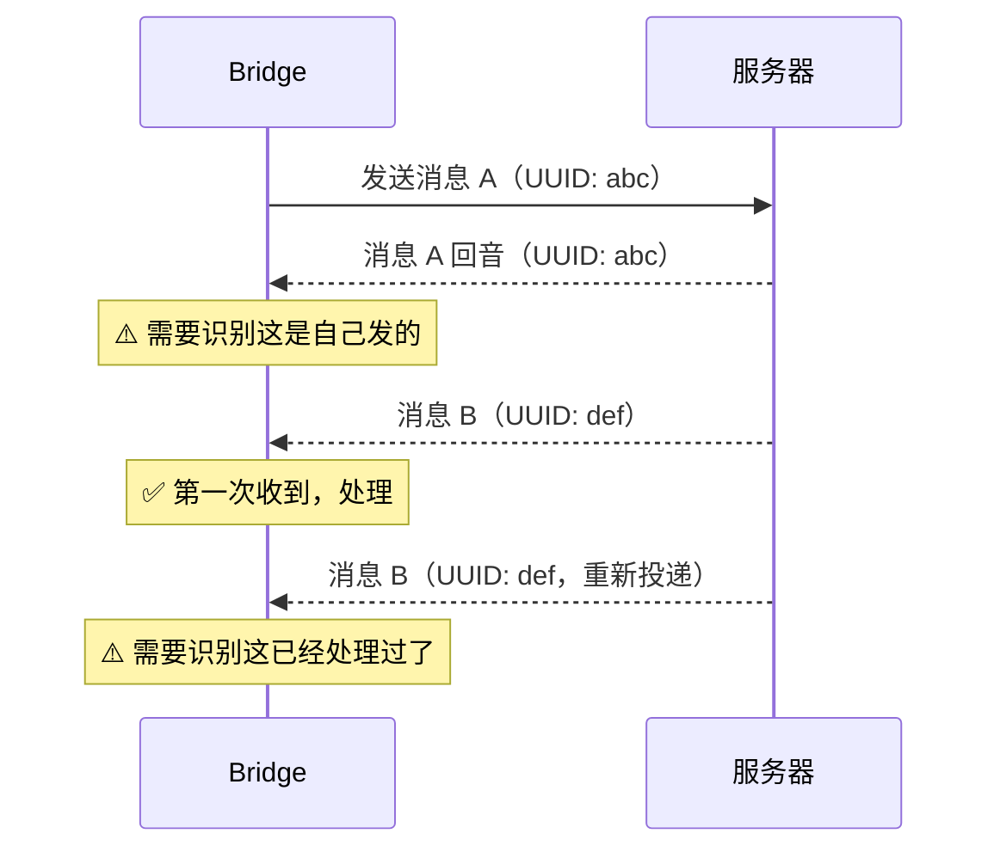
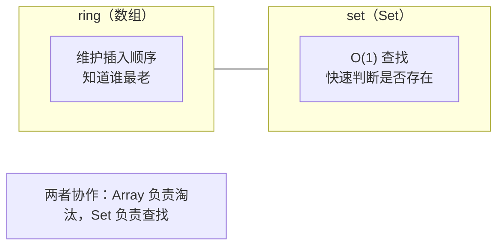
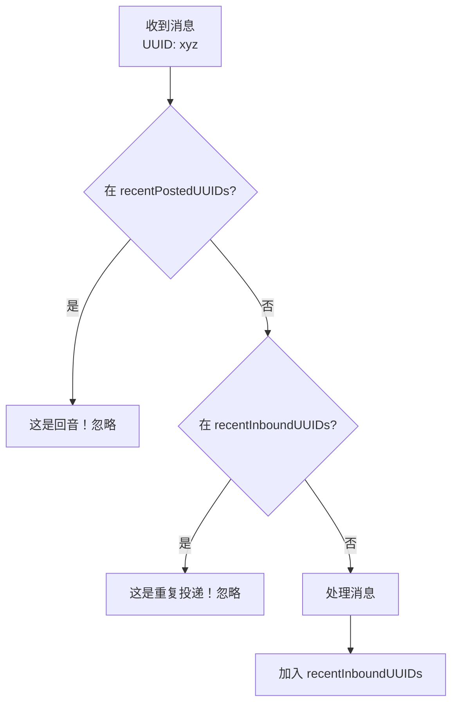

# 第五课：BoundedUUIDSet——环形缓冲区去重

> 🎯 难度：⭐⭐ 基础级 | ⏱ 预计学习时间：20 分钟

## 学习目标

学完本课，你将能够：

1. **理解为什么需要消息去重**——回音和重复投递是什么
2. **掌握环形缓冲区的工作原理**——固定内存的 FIFO 淘汰策略
3. **完全看懂 BoundedUUIDSet 的源码**——每一行都理解
4. **理解 O(1) 查找和固定内存的设计权衡**——为什么不用普通 Set

---

## 一、为什么需要去重？

### 1.1 生活类比：微信群消息

想象你在一个群里发了一条消息："明天开会"。由于网络延迟，你可能会看到：

1. **回音**：你发的消息被服务器转发回来给你自己
2. **重复投递**：网络抖动导致同一条消息被收到两次

如果不去重，你的屏幕上会出现三条"明天开会"。

### 1.2 Bridge 中的去重场景



Bridge 使用两个 BoundedUUIDSet：

| 集合 | 作用 | 类比 |
|------|------|------|
| `recentPostedUUIDs` | 记录自己发出的消息 | 「我发的」清单 |
| `recentInboundUUIDs` | 记录已处理的消息 | 「我看过的」清单 |

---

## 二、为什么不用普通 Set？

### 2.1 普通 Set 的问题

```typescript
// 朴素方案
const processedUUIDs = new Set<string>()

function handleMessage(uuid: string) {
  if (processedUUIDs.has(uuid)) return  // 去重
  processedUUIDs.add(uuid)
  // 处理消息...
}
```

看起来很好？但有一个致命问题：**内存泄漏**。

Bridge 是长时间运行的服务。如果每天处理 10 万条消息，一个月就是 300 万条。每个 UUID 是 36 个字符，300 万个 UUID 就是约 100MB 的内存——而且永远不会释放。

### 2.2 解决方案：环形缓冲区

```
容量 = 5 的环形缓冲区

初始状态（空）:
┌────┬────┬────┬────┬────┐
│    │    │    │    │    │
└────┴────┴────┴────┴────┘
  ↑ writeIdx = 0

添加 A, B, C:
┌────┬────┬────┬────┬────┐
│ A  │ B  │ C  │    │    │
└────┴────┴────┴────┴────┘
                 ↑ writeIdx = 3

添加 D, E:
┌────┬────┬────┬────┬────┐
│ A  │ B  │ C  │ D  │ E  │
└────┴────┴────┴────┴────┘
  ↑ writeIdx = 0（回到开头！）

添加 F（淘汰最老的 A）:
┌────┬────┬────┬────┬────┐
│ F  │ B  │ C  │ D  │ E  │
└────┴────┴────┴────┴────┘
       ↑ writeIdx = 1
```

核心思想：**只记住最近 N 条**，超过容量就淘汰最老的。

---

## 三、源码逐行解析

### 3.1 完整源码

```typescript
// 来自 bridge/bridgeMessaging.ts

/**
 * FIFO-bounded set backed by a circular buffer. Evicts the oldest entry
 * when capacity is reached, keeping memory usage constant at O(capacity).
 */
export class BoundedUUIDSet {
  private readonly capacity: number
  private readonly ring: (string | undefined)[]
  private readonly set = new Set<string>()
  private writeIdx = 0

  constructor(capacity: number) {
    this.capacity = capacity
    this.ring = new Array<string | undefined>(capacity)
  }

  add(uuid: string): void {
    if (this.set.has(uuid)) return
    // Evict the entry at the current write position (if occupied)
    const evicted = this.ring[this.writeIdx]
    if (evicted !== undefined) {
      this.set.delete(evicted)
    }
    this.ring[this.writeIdx] = uuid
    this.set.add(uuid)
    this.writeIdx = (this.writeIdx + 1) % this.capacity
  }

  has(uuid: string): boolean {
    return this.set.has(uuid)
  }

  clear(): void {
    this.set.clear()
    this.ring.fill(undefined)
    this.writeIdx = 0
  }
}
```

### 3.2 逐行解读

#### 数据结构

```typescript
private readonly capacity: number                    // 最大容量
private readonly ring: (string | undefined)[]        // 环形数组
private readonly set = new Set<string>()             // 快速查找集合
private writeIdx = 0                                 // 下一个写入位置
```

**双重数据结构**的设计非常巧妙：
- `ring`（数组）：维护插入顺序，用于淘汰最老的元素
- `set`（Set）：提供 O(1) 的查找性能

#### add 方法

```typescript
add(uuid: string): void {
  // ① 如果已存在，跳过（幂等性）
  if (this.set.has(uuid)) return

  // ② 看当前写入位置是否已有值
  const evicted = this.ring[this.writeIdx]

  // ③ 如果有，从 Set 中删除它（淘汰最老的）
  if (evicted !== undefined) {
    this.set.delete(evicted)
  }

  // ④ 写入新值
  this.ring[this.writeIdx] = uuid
  this.set.add(uuid)

  // ⑤ 移动写入指针（取模实现环形）
  this.writeIdx = (this.writeIdx + 1) % this.capacity
}
```

### 3.3 执行过程动画

让我们用 capacity=3 来模拟：

```
操作: add("aaa")
ring:  ["aaa", undefined, undefined]
set:   {"aaa"}
writeIdx: 1

操作: add("bbb")
ring:  ["aaa", "bbb", undefined]
set:   {"aaa", "bbb"}
writeIdx: 2

操作: add("ccc")
ring:  ["aaa", "bbb", "ccc"]
set:   {"aaa", "bbb", "ccc"}
writeIdx: 0  ← 回到开头！

操作: add("ddd")  ← 淘汰 "aaa"
ring:  ["ddd", "bbb", "ccc"]
set:   {"bbb", "ccc", "ddd"}  ← "aaa" 被删除了
writeIdx: 1

操作: has("aaa") → false  ← 已经被淘汰
操作: has("bbb") → true   ← 还在
操作: has("ddd") → true   ← 刚加的
```

---

## 四、设计分析

### 4.1 时间复杂度

| 操作 | 时间复杂度 | 说明 |
|------|-----------|------|
| `add()` | O(1) | Set 的 add/delete/has 都是 O(1) |
| `has()` | O(1) | 直接查 Set |
| `clear()` | O(n) | 清空 Set + 填充数组 |

### 4.2 空间复杂度

**始终是 O(capacity)**——不会随消息数量增长。

对比：
```
普通 Set：处理 100 万条消息 → 内存 100 万条 UUID
BoundedUUIDSet(1000)：处理 100 万条消息 → 内存始终只有 1000 条 UUID
```

### 4.3 为什么同时用 Array 和 Set？



如果只用 Array：查找需要遍历（O(n)）
如果只用 Set：不知道谁最老（无法按顺序淘汰）

### 4.4 淘汰的合理性

为什么淘汰最老的是安全的？

> 消息的 UUID 是时间有序的。如果一条消息很久以前发出/收到，它再次出现的概率极低。重复投递通常发生在短时间内（秒级），所以只需要记住最近几百条就够了。

---

## 五、在 Bridge 中的使用场景

### 5.1 回音过滤

```typescript
// 来自 bridge/bridgeMessaging.ts（handleIngressMessage）
// 检查是否是自己发出的消息的回音
if (uuid && recentPostedUUIDs.has(uuid)) {
  logForDebugging(
    `[bridge:repl] Ignoring echo: type=${parsed.type} uuid=${uuid}`,
  )
  return  // 丢弃回音
}
```

### 5.2 重复投递过滤

```typescript
// 来自 bridge/bridgeMessaging.ts（handleIngressMessage）
// 检查是否已经处理过（防止重复投递）
if (uuid && recentInboundUUIDs.has(uuid)) {
  logForDebugging(
    `[bridge:repl] Ignoring re-delivered inbound: type=${parsed.type} uuid=${uuid}`,
  )
  return  // 丢弃重复消息
}
```

### 5.3 两个 Set 的协作



---

## 六、环形缓冲区的通用知识

### 6.1 环形缓冲区在哪里常见？

| 场景 | 用法 |
|------|------|
| 操作系统 | 键盘输入缓冲区 |
| 网络 | TCP 接收窗口 |
| 音视频 | 播放缓冲区 |
| 日志系统 | 最近 N 条日志 |
| **Bridge** | **最近 N 个 UUID** |

### 6.2 取模运算的魔力

```
writeIdx = (writeIdx + 1) % capacity
```

这一行实现了「环形」：

```
capacity = 5

0 → 1 → 2 → 3 → 4 → 0 → 1 → 2 → ...
                      ↑
                   回到开头
```

就像钟表的指针：12 点之后不是 13 点，而是回到 1 点。

---

## 七、动手练习

### 练习 1：手动模拟

用 capacity=4 的 BoundedUUIDSet，按顺序执行以下操作，写出每一步的 ring、set、writeIdx：

```
add("a")
add("b")
add("c")
add("d")
add("e")  // 谁被淘汰？
has("a")  // 返回什么？
has("e")  // 返回什么？
add("b")  // 会发生什么？（b 已经存在）
add("f")  // 谁被淘汰？
```

### 练习 2：代码实现

尝试自己用 Python 实现一个 BoundedUUIDSet：

```python
class BoundedUUIDSet:
    def __init__(self, capacity: int):
        # 你的代码

    def add(self, uuid: str) -> None:
        # 你的代码

    def has(self, uuid: str) -> bool:
        # 你的代码

    def clear(self) -> None:
        # 你的代码
```

### 练习 3：思考题

1. 如果 capacity 设得太小（比如 5），会发生什么问题？
2. 如果 capacity 设得太大（比如 100 万），会有什么问题？
3. `add("b")` 当 "b" 已经在 Set 中时直接 return，为什么不需要更新它在 ring 中的位置？
4. 如果消息到达的顺序不是时间有序的（比如消息 C 先到，消息 A 后到），去重还有效吗？

### 练习 4：扩展思考

如果你要设计一个「基于时间淘汰」的去重集合（保留最近 5 分钟的 UUID），你会怎么设计？和 BoundedUUIDSet 相比有什么优劣？

---

## 本课小结

| 要点 | 内容 |
|------|------|
| 去重目的 | 过滤回音 + 防止重复处理 |
| 数据结构 | Array（顺序） + Set（查找） |
| 淘汰策略 | FIFO，最老的先被淘汰 |
| 时间复杂度 | add: O(1)，has: O(1) |
| 空间复杂度 | 始终 O(capacity)，不会增长 |
| 环形原理 | 取模运算 `(i+1) % capacity` |

---

## 下节预告

> **第 6 课：JWT 认证详解——Token 解码与自动刷新**
>
> Bridge 怎么证明自己的身份？JWT Token 长什么样？
> 我们将深入 `jwtUtils.ts`，学习 Token 的解码、过期检测和自动刷新机制。

---

*📖 配套漫画：《旋转寿司与环形缓冲区——吃不完就被端走》*
