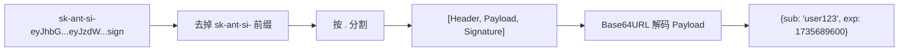
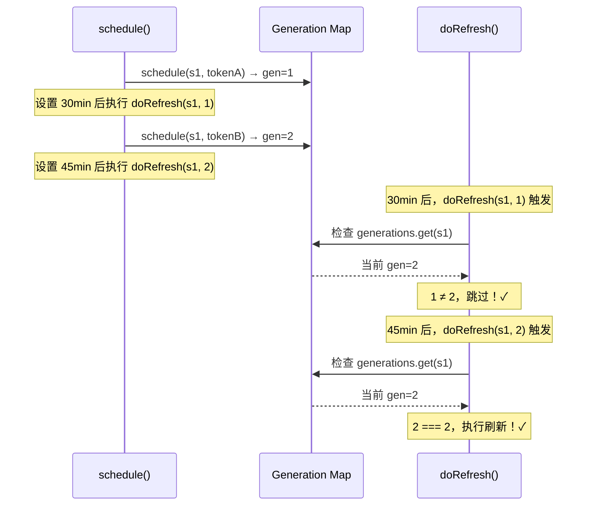
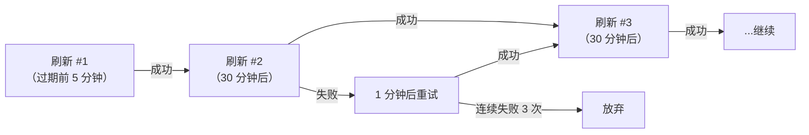

# 第六课：JWT 认证详解——Token 解码与自动刷新

> 🎯 难度：⭐⭐⭐ 进阶级 | ⏱ 预计学习时间：25 分钟

## 学习目标

学完本课，你将能够：

1. **理解 JWT 的结构**——三段式编码（Header.Payload.Signature）
2. **看懂 Token 解码源码**——不验证签名的「偷看」技巧
3. **掌握自动刷新机制**——在 Token 过期前主动续约
4. **理解代际（Generation）防竞态设计**——避免过期的刷新回调破坏状态
5. **区分 OAuth Token 和 Session Ingress Token**——两种 Token 的不同用途

---

## 一、JWT 是什么？

### 1.1 生活类比：电影票

JWT（JSON Web Token）就像一张电影票：

```
┌──────────────────────────────────┐
│ 电影票                            │
│                                  │
│ 影院：万达 IMAX      ← Header    │
│ 座位：A排3号          ← Payload   │
│ 时间：2026-04-01 19:00            │
│ 有效期：至 21:30                   │
│                                  │
│ 防伪码：X7K9M2        ← Signature│
└──────────────────────────────────┘
```

- **Header**（头部）：说明票的类型和加密方式
- **Payload**（载荷）：包含实际信息（谁、什么时候过期）
- **Signature**（签名）：防伪标记，证明不是伪造的

### 1.2 JWT 的编码格式

```
eyJhbGciOiJSUzI1NiJ9.eyJzdWIiOiJ1c2VyMTIzIiwiZXhwIjoxNzM1Njg5NjAwfQ.signature...
         Header              Payload                              Signature
```

三段用 `.` 分隔，每段都是 Base64URL 编码的。

---

## 二、Token 解码源码解析

### 2.1 解码 JWT 载荷

Bridge 只需要**读取** Token 的信息（比如过期时间），不需要**验证**签名。就像你看电影票上写的时间，不需要去柜台验证防伪码。

```typescript
// 来自 bridge/jwtUtils.ts
export function decodeJwtPayload(token: string): unknown | null {
  // ① 去掉可能的前缀
  const jwt = token.startsWith('sk-ant-si-')
    ? token.slice('sk-ant-si-'.length)
    : token

  // ② 按 '.' 分割成三段
  const parts = jwt.split('.')
  if (parts.length !== 3 || !parts[1]) return null

  // ③ 解码中间段（Payload）
  try {
    return jsonParse(Buffer.from(parts[1], 'base64url').toString('utf8'))
  } catch {
    return null
  }
}
```

### 2.2 图解解码过程



### 2.3 获取过期时间

```typescript
// 来自 bridge/jwtUtils.ts
export function decodeJwtExpiry(token: string): number | null {
  const payload = decodeJwtPayload(token)
  if (
    payload !== null &&
    typeof payload === 'object' &&
    'exp' in payload &&
    typeof payload.exp === 'number'
  ) {
    return payload.exp  // Unix 时间戳（秒）
  }
  return null
}
```

`exp` 字段是 JWT 标准的过期时间字段，值是 Unix 时间戳（从 1970 年 1 月 1 日开始的秒数）。

---

## 三、自动刷新机制

### 3.1 为什么需要自动刷新？

Token 是有过期时间的。如果过期了，所有 API 请求都会失败。

```
时间线：
├─ Token 签发 ─────────────────────────── Token 过期 ─►
│                                          │
│  ┌──────── 正常工作 ────────┐   ┌─ 全部请求失败 ─┐
│  │                          │   │                │
│  └──────────────────────────┘   └────────────────┘
│                          ↑
│              在这之前刷新！（提前 5 分钟）
```

### 3.2 刷新调度器的配置

```typescript
// 来自 bridge/jwtUtils.ts

// 提前 5 分钟刷新
const TOKEN_REFRESH_BUFFER_MS = 5 * 60 * 1000

// 如果无法获取新 Token 的过期时间，30 分钟后再试
const FALLBACK_REFRESH_INTERVAL_MS = 30 * 60 * 1000

// 最多连续失败 3 次
const MAX_REFRESH_FAILURES = 3

// 获取 Token 失败时，1 分钟后重试
const REFRESH_RETRY_DELAY_MS = 60_000
```

### 3.3 createTokenRefreshScheduler 函数

```typescript
// 来自 bridge/jwtUtils.ts
export function createTokenRefreshScheduler({
  getAccessToken,    // 获取新 Token 的函数
  onRefresh,         // Token 刷新后的回调
  label,             // 日志标签
  refreshBufferMs = TOKEN_REFRESH_BUFFER_MS,  // 提前多久刷新
}: {
  getAccessToken: () => string | undefined | Promise<string | undefined>
  onRefresh: (sessionId: string, oauthToken: string) => void
  label: string
  refreshBufferMs?: number
}): {
  schedule: (sessionId: string, token: string) => void
  scheduleFromExpiresIn: (sessionId: string, expiresInSeconds: number) => void
  cancel: (sessionId: string) => void
  cancelAll: () => void
}
```

返回四个方法：
- `schedule`：根据 Token 的 exp 字段安排刷新
- `scheduleFromExpiresIn`：根据明确的 TTL 安排刷新
- `cancel`：取消某个会话的刷新
- `cancelAll`：取消所有刷新

### 3.4 schedule 方法详解

```typescript
// 来自 bridge/jwtUtils.ts
function schedule(sessionId: string, token: string): void {
  const expiry = decodeJwtExpiry(token)
  if (!expiry) {
    // 无法解码过期时间，保留现有定时器
    return
  }

  // 清除已有的刷新定时器
  const existing = timers.get(sessionId)
  if (existing) clearTimeout(existing)

  // 递增代际号，使旧的异步回调失效
  const gen = nextGeneration(sessionId)

  // 计算刷新时间 = 过期时间 - 当前时间 - 缓冲时间
  const delayMs = expiry * 1000 - Date.now() - refreshBufferMs

  if (delayMs <= 0) {
    // 已经过期或即将过期，立即刷新
    void doRefresh(sessionId, gen)
    return
  }

  // 设置定时器
  const timer = setTimeout(doRefresh, delayMs, sessionId, gen)
  timers.set(sessionId, timer)
}
```

### 3.5 刷新时间线

```mermaid
gantt
    title Token 生命周期
    dateFormat HH:mm
    axisFormat %H:%M

    section Token 有效期
    Token 有效        :active, t1, 09:00, 4h
    缓冲区（5分钟）    :crit,   t2, 12:55, 5min

    section 刷新行为
    定时器触发刷新     :milestone, m1, 12:55, 0
    获取新 Token      :t3, 12:55, 1min
    安排下次刷新       :t4, 12:56, 1min
```



---

## 四、代际（Generation）防竞态

### 4.1 竞态问题是什么？

想象这个场景：

```
时间 T1: schedule(session1, tokenA)  → 设置定时器 A，gen=1
时间 T2: schedule(session1, tokenB)  → 设置定时器 B，gen=2
时间 T3: 定时器 A 触发 → doRefresh(session1, gen=1)
         ⚠️ 这时候应该用 tokenB，不应该执行 gen=1 的刷新！
```

### 4.2 代际号解决方案

```typescript
// 来自 bridge/jwtUtils.ts
const generations = new Map<string, number>()

function nextGeneration(sessionId: string): number {
  const gen = (generations.get(sessionId) ?? 0) + 1
  generations.set(sessionId, gen)
  return gen
}
```

```typescript
// 来自 bridge/jwtUtils.ts
async function doRefresh(sessionId: string, gen: number): Promise<void> {
  let oauthToken: string | undefined
  try {
    oauthToken = await getAccessToken()
  } catch (err) { /* ... */ }

  // 关键检查：如果代际号变了，说明有新的 schedule 调用覆盖了我
  if (generations.get(sessionId) !== gen) {
    // 过期的回调，跳过
    return
  }

  if (!oauthToken) {
    // 处理失败重试...
    return
  }

  // 执行刷新
  onRefresh(sessionId, oauthToken)

  // 安排后续刷新（保持刷新链不断）
  const timer = setTimeout(doRefresh, FALLBACK_REFRESH_INTERVAL_MS, sessionId, gen)
  timers.set(sessionId, timer)
}
```

### 4.3 代际号的工作流程



---

## 五、失败重试与连锁刷新

### 5.1 失败重试

```typescript
// 来自 bridge/jwtUtils.ts
if (!oauthToken) {
  const failures = (failureCounts.get(sessionId) ?? 0) + 1
  failureCounts.set(sessionId, failures)

  // 最多重试 3 次
  if (failures < MAX_REFRESH_FAILURES) {
    const retryTimer = setTimeout(
      doRefresh, REFRESH_RETRY_DELAY_MS, sessionId, gen
    )
    timers.set(sessionId, retryTimer)
  }
  return
}
```

### 5.2 连锁刷新

一次刷新成功后，安排下一次刷新。这样长时间运行的会话不会因为 Token 过期而中断：



---

## 六、两种 Token 的区别

### 6.1 OAuth Token vs Session Ingress Token

| 特性 | OAuth Token | Session Ingress Token |
|------|-------------|----------------------|
| 用途 | 调用 Bridge API（注册、轮询） | 会话级别的 API 调用 |
| 获取方式 | 用户登录 claude.ai | 服务器分发工作时附带 |
| 有效期 | 较长（小时级） | 较短（需要频繁刷新） |
| 前缀 | 无特殊前缀 | `sk-ant-si-` |
| 使用场景 | HTTP API 的 Authorization 头 | WebSocket/SSE 连接认证 |

### 6.2 从源码看 Token 获取

```typescript
// 来自 bridge/bridgeConfig.ts
export function getBridgeAccessToken(): string | undefined {
  // 优先使用开发覆盖（仅限 ant 内部用户）
  return getBridgeTokenOverride() ?? getClaudeAIOAuthTokens()?.accessToken
}

export function getBridgeBaseUrl(): string {
  return getBridgeBaseUrlOverride() ?? getOauthConfig().BASE_API_URL
}
```

### 6.3 Token 在 API 请求中的使用

```typescript
// 来自 bridge/bridgeApi.ts
function getHeaders(accessToken: string): Record<string, string> {
  const headers: Record<string, string> = {
    Authorization: `Bearer ${accessToken}`,   // 认证头
    'Content-Type': 'application/json',
    'anthropic-version': '2023-06-01',
    'anthropic-beta': BETA_HEADER,
    'x-environment-runner-version': deps.runnerVersion,
  }
  // 可选的设备信任 Token
  const deviceToken = deps.getTrustedDeviceToken?.()
  if (deviceToken) {
    headers['X-Trusted-Device-Token'] = deviceToken
  }
  return headers
}
```

---

## 七、Bridge 中的 Token 刷新实践

```typescript
// 来自 bridge/bridgeMain.ts（runBridgeLoop 内部）
const tokenRefresh = getAccessToken
  ? createTokenRefreshScheduler({
      getAccessToken,
      onRefresh: (sessionId, oauthToken) => {
        const handle = activeSessions.get(sessionId)
        if (!handle) return

        if (v2Sessions.has(sessionId)) {
          // v2 会话：触发服务器重新分发（JWT 不能直接替换）
          void api.reconnectSession(environmentId, sessionId)
        } else {
          // v1 会话：直接把新 Token 注入子进程
          handle.updateAccessToken(oauthToken)
        }
      },
      label: 'bridge',
    })
  : null
```

v1 和 v2 的刷新策略不同，原因在于认证方式不同：
- **v1**：子进程使用 OAuth Token，可以直接替换
- **v2**：CCR 端点验证 JWT 中的 session_id 声明，需要通过服务器重新签发

---

## 八、动手练习

### 练习 1：手动解码 JWT

以下是一个 JWT 的 Payload 部分（Base64URL 编码）：

```
eyJzdWIiOiJ1c2VyMTIzIiwiZXhwIjoxNzQzNDY1NjAwLCJpYXQiOjE3NDM0NjIwMDB9
```

尝试用以下命令解码：
```bash
echo 'eyJzdWIiOiJ1c2VyMTIzIiwiZXhwIjoxNzQzNDY1NjAwLCJpYXQiOjE3NDM0NjIwMDB9' | base64 -d
```

解码后的 JSON 是什么？`exp` 字段对应什么时间？

### 练习 2：刷新时间计算

如果一个 Token 的 `exp = 1743465600`（对应 2025-04-01 12:00:00 UTC），当前时间是 2025-04-01 11:50:00 UTC，`refreshBufferMs = 5 * 60 * 1000`：

1. `delayMs` 等于多少？
2. 定时器会在什么时间触发？
3. 如果当前时间是 11:56:00，`delayMs` 会是多少？Bridge 会怎么做？

### 练习 3：思考题

1. `decodeJwtPayload` 不验证签名，这安全吗？为什么？
2. 为什么需要代际号（Generation）？如果没有这个机制会出什么问题？
3. `MAX_REFRESH_FAILURES = 3` 之后就放弃了——这样的会话会怎样？
4. 为什么 `scheduleFromExpiresIn` 有一个 30 秒的最小等待时间？

---

## 本课小结

| 要点 | 内容 |
|------|------|
| JWT 结构 | Header.Payload.Signature，Base64URL 编码 |
| 解码方法 | 只解码 Payload，不验证签名 |
| 自动刷新 | 过期前 5 分钟触发刷新 |
| 代际防竞态 | 用递增的 gen 号防止过期回调 |
| 失败重试 | 最多 3 次，间隔 1 分钟 |
| v1 vs v2 | v1 直接替换 Token，v2 触发服务器重发 |

---

## 下节预告

> **第 7 课：sessionRunner 会话管理——子进程生命周期**
>
> Bridge 是怎么创建和管理 CLI 子进程的？stdin/stdout 如何传递数据？
> 我们将深入 `sessionRunner.ts`，理解子进程的完整生命周期。

---

*📖 配套漫画：《Token 的一生——从签发到过期的惊心动魄》*
