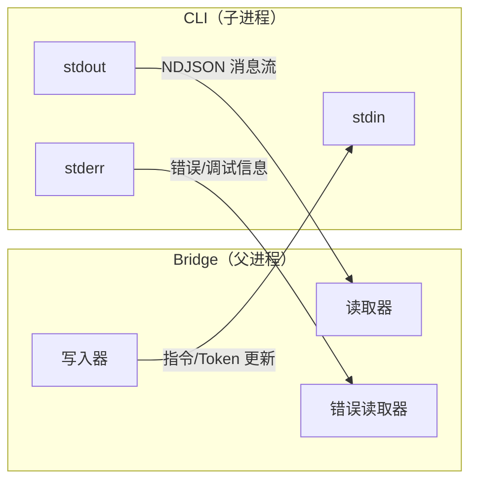
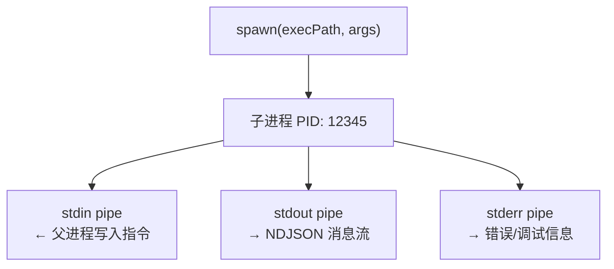
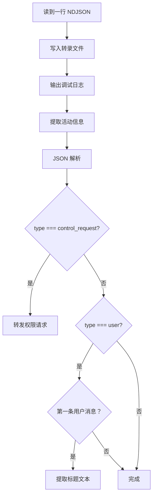
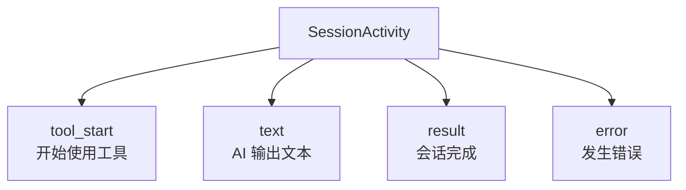
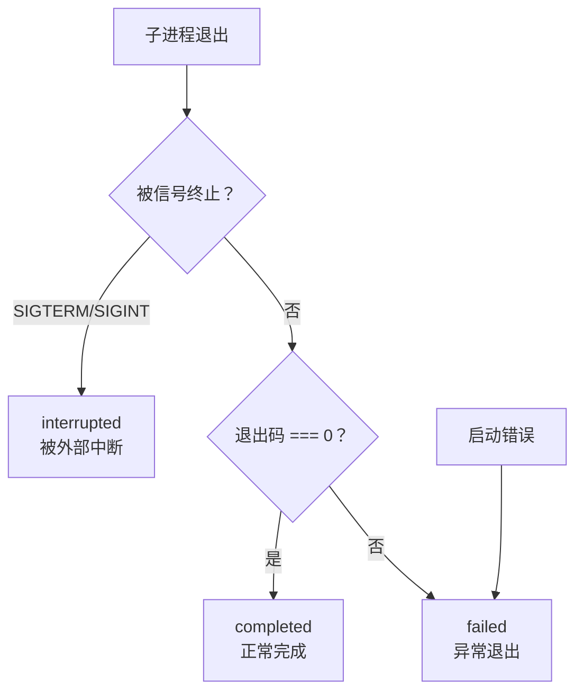

# 第七课：sessionRunner 会话管理——子进程生命周期

> 🎯 难度：⭐⭐⭐ 进阶级 | ⏱ 预计学习时间：30 分钟

## 学习目标

学完本课，你将能够：

1. **理解子进程的概念**——父进程如何创建和管理子进程
2. **掌握 stdin/stdout/stderr 三通道模型**——数据如何在进程间流动
3. **看懂 SessionSpawner 的完整实现**——从生成到退出
4. **理解 NDJSON 协议**——子进程的输出格式
5. **理解活动追踪机制**——Bridge 如何知道子进程在做什么

---

## 一、子进程的生活类比

### 1.1 餐厅模型

想象 Bridge 是一家餐厅的经理，每来一个订单就派一个厨师去做菜：

```
餐厅经理（Bridge）
├── 厨师 A（子进程 1）── 做意大利面 ── 做完了
├── 厨师 B（子进程 2）── 做牛排 ── 做完了
└── 厨师 C（子进程 3）── 做沙拉 ── 正在做...
```

- 经理通过**点菜单**告诉厨师做什么（stdin）
- 厨师通过**传菜窗口**传出做好的菜（stdout）
- 厨师通过**对讲机**报告问题（stderr）
- 做完后厨师交还围裙离开（进程退出）

### 1.2 三个通道



---

## 二、SessionSpawner 核心结构

### 2.1 依赖注入

```typescript
// 来自 bridge/sessionRunner.ts
type SessionSpawnerDeps = {
  execPath: string          // 可执行文件路径
  scriptArgs: string[]      // 脚本参数（npm 安装时需要）
  env: NodeJS.ProcessEnv    // 环境变量
  verbose: boolean          // 是否详细日志
  sandbox: boolean          // 是否沙箱模式
  debugFile?: string        // 调试日志文件路径
  permissionMode?: string   // 权限模式
  onDebug: (msg: string) => void              // 调试日志回调
  onActivity?: (sessionId: string, activity: SessionActivity) => void  // 活动回调
  onPermissionRequest?: (                     // 权限请求回调
    sessionId: string,
    request: PermissionRequest,
    accessToken: string,
  ) => void
}
```

### 2.2 SessionHandle：进程控制手柄

```typescript
// 来自 bridge/types.ts
export type SessionHandle = {
  sessionId: string
  done: Promise<SessionDoneStatus>   // 等待进程完成
  kill(): void                       // 发送 SIGTERM
  forceKill(): void                  // 发送 SIGKILL
  activities: SessionActivity[]      // 活动记录（环形缓冲）
  currentActivity: SessionActivity | null
  accessToken: string                // 当前 Token
  lastStderr: string[]               // 最近 stderr 行
  writeStdin(data: string): void     // 写入 stdin
  updateAccessToken(token: string): void  // 更新 Token
}
```

这个 Handle 就像遥控器——拿着它你可以控制子进程的方方面面。

---

## 三、子进程的创建

### 3.1 构建启动参数

```typescript
// 来自 bridge/sessionRunner.ts（createSessionSpawner → spawn）
const args = [
  ...deps.scriptArgs,
  '--print',                    // 打印模式（非交互式）
  '--sdk-url', opts.sdkUrl,     // SDK 连接地址
  '--session-id', opts.sessionId,
  '--input-format', 'stream-json',   // 输入格式：流式 JSON
  '--output-format', 'stream-json',  // 输出格式：流式 JSON
  '--replay-user-messages',          // 重放历史消息
  ...(deps.verbose ? ['--verbose'] : []),
  ...(debugFile ? ['--debug-file', debugFile] : []),
  ...(deps.permissionMode
    ? ['--permission-mode', deps.permissionMode]
    : []),
]
```

### 3.2 环境变量设置

```typescript
// 来自 bridge/sessionRunner.ts
const env: NodeJS.ProcessEnv = {
  ...deps.env,
  // 清除 Bridge 的 OAuth Token，让子进程用会话 Token
  CLAUDE_CODE_OAUTH_TOKEN: undefined,
  CLAUDE_CODE_ENVIRONMENT_KIND: 'bridge',
  ...(deps.sandbox && { CLAUDE_CODE_FORCE_SANDBOX: '1' }),
  CLAUDE_CODE_SESSION_ACCESS_TOKEN: opts.accessToken,
  // v1: HybridTransport
  CLAUDE_CODE_POST_FOR_SESSION_INGRESS_V2: '1',
  // v2: SSETransport + CCRClient
  ...(opts.useCcrV2 && {
    CLAUDE_CODE_USE_CCR_V2: '1',
    CLAUDE_CODE_WORKER_EPOCH: String(opts.workerEpoch),
  }),
}
```

注意 `CLAUDE_CODE_OAUTH_TOKEN: undefined`——刻意清除父进程的 OAuth Token，让子进程使用自己的会话 Token。这是安全隔离的设计。

### 3.3 实际创建进程

```typescript
// 来自 bridge/sessionRunner.ts
const child: ChildProcess = spawn(deps.execPath, args, {
  cwd: dir,                           // 工作目录
  stdio: ['pipe', 'pipe', 'pipe'],    // 三通道全部用管道
  env,
  windowsHide: true,                  // Windows 下隐藏窗口
})
```

`stdio: ['pipe', 'pipe', 'pipe']` 意味着：
- `stdin`：可以从父进程写入
- `stdout`：可以在父进程读取
- `stderr`：可以在父进程读取



---

## 四、stdout 解析：NDJSON 流

### 4.1 什么是 NDJSON？

NDJSON（Newline Delimited JSON）= 每行一个 JSON 对象：

```
{"type":"user","message":{"content":"请帮我写代码"}}
{"type":"assistant","message":{"content":[{"type":"text","text":"好的"}]}}
{"type":"assistant","message":{"content":[{"type":"tool_use","name":"Write"}]}}
{"type":"result","subtype":"success"}
```

比普通 JSON 更适合流式处理——每读到一个换行符就可以解析一条消息。

### 4.2 stdout 读取逻辑

```typescript
// 来自 bridge/sessionRunner.ts
if (child.stdout) {
  const rl = createInterface({ input: child.stdout })
  rl.on('line', line => {
    // ① 写入转录文件（供事后分析）
    if (transcriptStream) {
      transcriptStream.write(line + '\n')
    }

    // ② 调试日志
    deps.onDebug(
      `[bridge:ws] sessionId=${opts.sessionId} <<< ${debugTruncate(line)}`
    )

    // ③ 提取活动信息（AI 在做什么）
    const extracted = extractActivities(line, opts.sessionId, deps.onDebug)
    for (const activity of extracted) {
      if (activities.length >= MAX_ACTIVITIES) {
        activities.shift()   // 环形缓冲：最多保留 10 条
      }
      activities.push(activity)
      currentActivity = activity
      deps.onActivity?.(opts.sessionId, activity)
    }

    // ④ 检测权限请求和用户消息
    let parsed: unknown
    try { parsed = jsonParse(line) } catch { /* skip */ }
    if (parsed && typeof parsed === 'object') {
      const msg = parsed as Record<string, unknown>

      // 权限请求：子进程需要执行工具
      if (msg.type === 'control_request') {
        const request = msg.request as Record<string, unknown> | undefined
        if (request?.subtype === 'can_use_tool' && deps.onPermissionRequest) {
          deps.onPermissionRequest(opts.sessionId, parsed, opts.accessToken)
        }
      }

      // 用户消息：用于提取会话标题
      if (msg.type === 'user' && !firstUserMessageSeen && opts.onFirstUserMessage) {
        const text = extractUserMessageText(msg)
        if (text) {
          firstUserMessageSeen = true
          opts.onFirstUserMessage(text)
        }
      }
    }
  })
}
```

### 4.3 消息处理流程



---

## 五、活动追踪

### 5.1 工具名称映射

```typescript
// 来自 bridge/sessionRunner.ts
const TOOL_VERBS: Record<string, string> = {
  Read: 'Reading',
  Write: 'Writing',
  Edit: 'Editing',
  MultiEdit: 'Editing',
  Bash: 'Running',
  Glob: 'Searching',
  Grep: 'Searching',
  WebFetch: 'Fetching',
  WebSearch: 'Searching',
  Task: 'Running task',
  NotebookEditTool: 'Editing notebook',
  LSP: 'LSP',
}
```

### 5.2 活动摘要生成

```typescript
// 来自 bridge/sessionRunner.ts
function toolSummary(name: string, input: Record<string, unknown>): string {
  const verb = TOOL_VERBS[name] ?? name
  const target =
    (input.file_path as string) ??
    (input.filePath as string) ??
    (input.pattern as string) ??
    (input.command as string | undefined)?.slice(0, 60) ??
    (input.url as string) ??
    (input.query as string) ??
    ''
  if (target) {
    return `${verb} ${target}`   // 例如："Reading src/app.ts"
  }
  return verb
}
```

这让 Bridge 的 UI 能显示：

```
🔧 Reading src/app.ts
🔧 Writing tests/app.test.ts
🔧 Running npm test
```

### 5.3 活动类型

```typescript
// 来自 bridge/types.ts
export type SessionActivityType = 'tool_start' | 'text' | 'result' | 'error'

export type SessionActivity = {
  type: SessionActivityType
  summary: string         // 例如 "Reading src/app.ts"
  timestamp: number       // 时间戳
}
```



---

## 六、stderr 处理

```typescript
// 来自 bridge/sessionRunner.ts
if (child.stderr) {
  const stderrRl = createInterface({ input: child.stderr })
  stderrRl.on('line', line => {
    // verbose 模式下转发到 Bridge 的 stderr
    if (deps.verbose) {
      process.stderr.write(line + '\n')
    }
    // 环形缓冲区：保留最近 10 行
    if (lastStderr.length >= MAX_STDERR_LINES) {
      lastStderr.shift()
    }
    lastStderr.push(line)
  })
}
```

最近 10 行 stderr 被保存下来，用于：
- 进程异常退出时的错误诊断
- UI 显示错误信息

---

## 七、进程退出处理

### 7.1 退出状态判定

```typescript
// 来自 bridge/sessionRunner.ts
const done = new Promise<SessionDoneStatus>(resolve => {
  child.on('close', (code, signal) => {
    // 关闭转录文件
    if (transcriptStream) {
      transcriptStream.end()
      transcriptStream = null
    }

    if (signal === 'SIGTERM' || signal === 'SIGINT') {
      resolve('interrupted')    // 被中断
    } else if (code === 0) {
      resolve('completed')      // 正常完成
    } else {
      resolve('failed')         // 异常退出
    }
  })

  child.on('error', err => {
    resolve('failed')           // 启动失败
  })
})
```

### 7.2 退出状态流程



---

## 八、kill 与 forceKill

### 8.1 优雅终止（SIGTERM）

```typescript
// 来自 bridge/sessionRunner.ts
kill(): void {
  if (!child.killed) {
    if (process.platform === 'win32') {
      child.kill()           // Windows 不支持指定信号
    } else {
      child.kill('SIGTERM')  // Unix: 请求优雅退出
    }
  }
}
```

### 8.2 强制终止（SIGKILL）

```typescript
// 来自 bridge/sessionRunner.ts
forceKill(): void {
  if (!sigkillSent && child.pid) {
    sigkillSent = true      // 防止重复发送
    if (process.platform === 'win32') {
      child.kill()
    } else {
      child.kill('SIGKILL') // 立即终止，不可忽略
    }
  }
}
```

### 8.3 两阶段终止

```
SIGTERM → "请在 30 秒内收拾好离开"
         │
         ├─ 子进程保存状态、关闭文件 → 正常退出 ✓
         │
         └─ 30 秒后还没退出 → SIGKILL → 立即终止 ✓
```

---

## 九、Token 热更新

```typescript
// 来自 bridge/sessionRunner.ts
updateAccessToken(token: string): void {
  handle.accessToken = token
  // 通过 stdin 发送 Token 更新指令
  handle.writeStdin(
    jsonStringify({
      type: 'update_environment_variables',
      variables: { CLAUDE_CODE_SESSION_ACCESS_TOKEN: token },
    }) + '\n',
  )
}
```

Token 更新不需要重启子进程！Bridge 通过 stdin 管道把新 Token 注入正在运行的子进程——就像外卖员在门口换一个新的门禁卡，不需要回家重新出门。

---

## 十、文件名安全处理

```typescript
// 来自 bridge/sessionRunner.ts
export function safeFilenameId(id: string): string {
  return id.replace(/[^a-zA-Z0-9_-]/g, '_')
}
```

Session ID 可能包含特殊字符（如 `/`、`..`），直接拼文件路径会导致**路径遍历攻击**。`safeFilenameId` 把所有非安全字符替换为 `_`。

```
输入: "session_../../etc/passwd"
输出: "session____etc_passwd"
```

---

## 十一、动手练习

### 练习 1：进程通信模拟

用 Node.js 写一个简单的父子进程通信示例：

```javascript
// parent.js
const { spawn } = require('child_process')
const child = spawn('node', ['child.js'], { stdio: ['pipe', 'pipe', 'pipe'] })

child.stdout.on('data', data => console.log('子进程说:', data.toString()))
child.stdin.write('你好子进程\n')

// child.js
process.stdin.on('data', data => {
  process.stdout.write(`收到: ${data}`)
})
```

### 练习 2：NDJSON 解析

解析以下 NDJSON 输出，提取每条消息的活动类型：

```
{"type":"assistant","message":{"content":[{"type":"tool_use","name":"Read","input":{"file_path":"src/app.ts"}}]}}
{"type":"assistant","message":{"content":[{"type":"text","text":"我来看看这个文件"}]}}
{"type":"result","subtype":"success"}
```

### 练习 3：思考题

1. 为什么用 `createInterface` 逐行读取而不是监听 `data` 事件？
2. `sigkillSent` 标志位为什么要单独维护，而不是用 `child.killed`？
3. 如果子进程在收到 SIGTERM 后 fork 了一个孙进程，然后自己退出了，Bridge 能检测到孙进程吗？

---

## 本课小结

| 要点 | 内容 |
|------|------|
| 三通道 | stdin（输入）、stdout（输出）、stderr（错误） |
| NDJSON | 每行一个 JSON，适合流式解析 |
| 活动追踪 | 从 tool_use 消息提取工具名+目标文件 |
| 环形缓冲 | 活动和 stderr 都用最近 N 条 |
| 两阶段终止 | SIGTERM → 等待 → SIGKILL |
| Token 热更新 | 通过 stdin 注入新 Token |
| 文件名安全 | safeFilenameId 防路径遍历 |

---

## 下节预告

> **第 8 课：传输层抽象——v1/v2 双模式设计**
>
> 我们已经知道有 v1 和 v2 两种传输方式，但它们的内部实现有什么不同？
> 如何做到对上层透明？我们将深入 `replBridgeTransport.ts`。

---

*📖 配套漫画：《厨师与经理——子进程的日常对话》*
