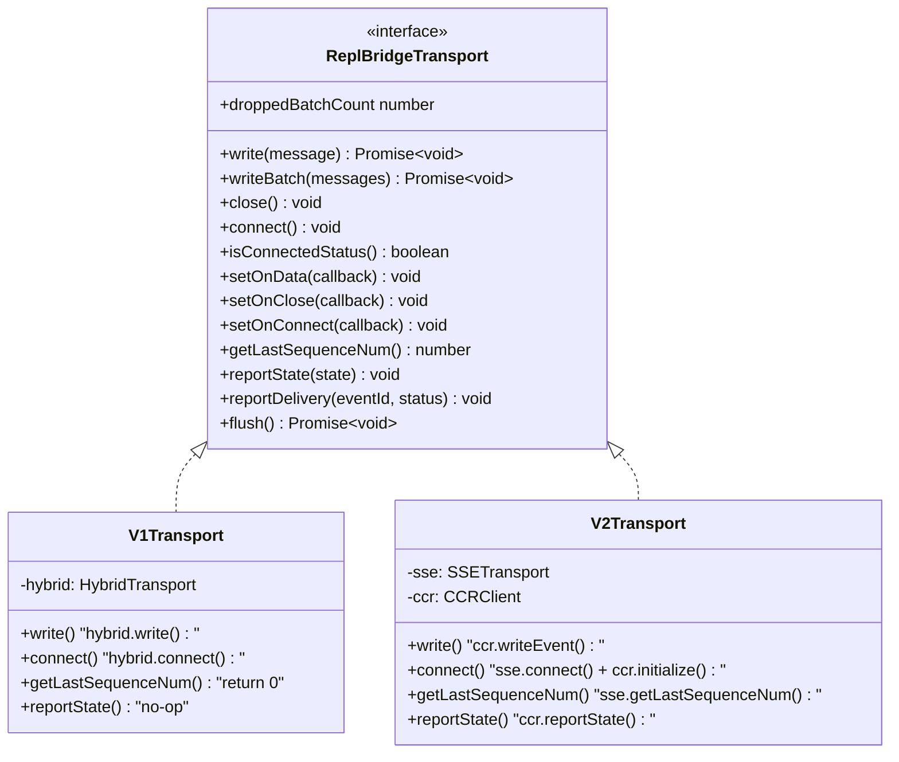
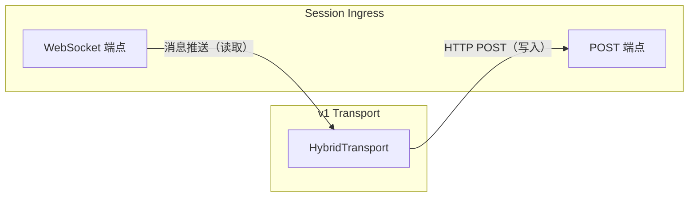
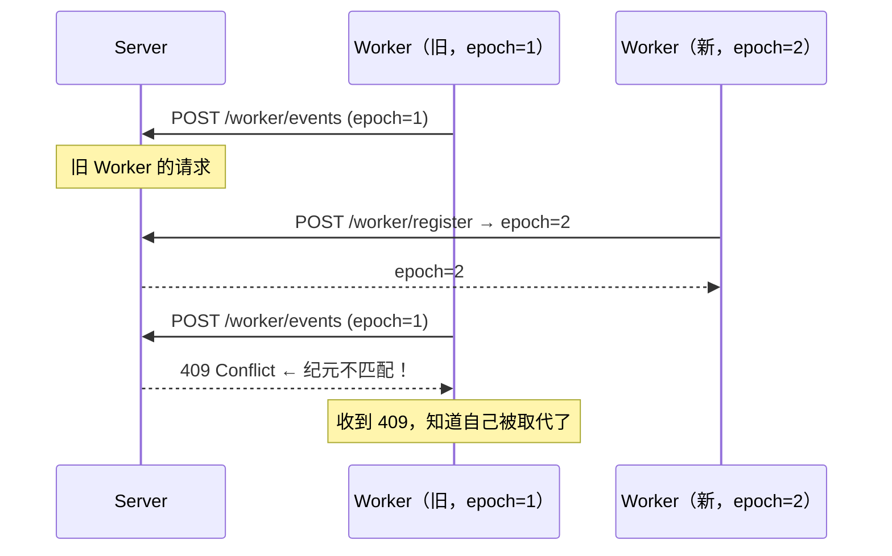
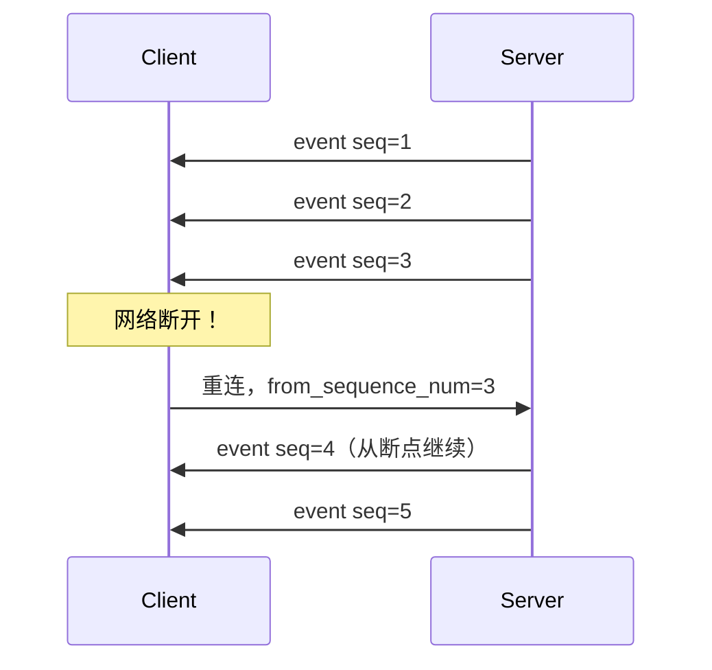
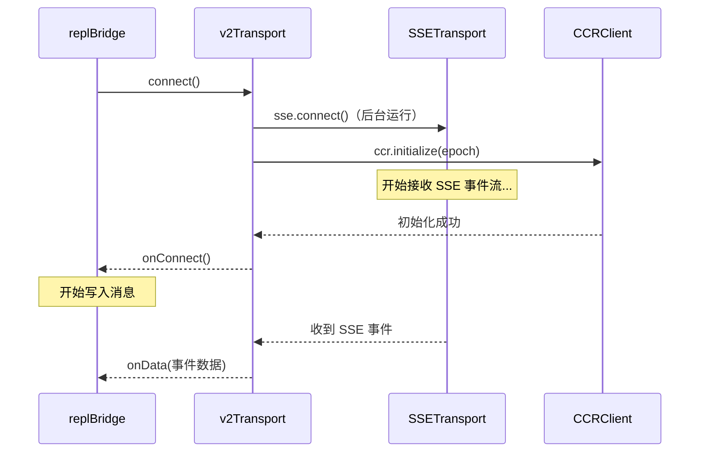
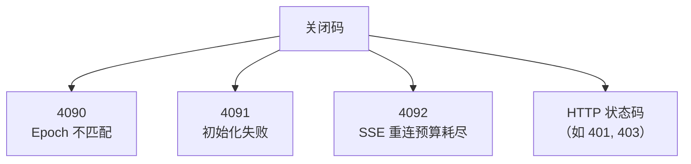

# 第八课：传输层抽象——v1/v2 双模式设计

> 🎯 难度：⭐⭐⭐⭐ 高级 | ⏱ 预计学习时间：30 分钟

## 学习目标

学完本课，你将能够：

1. **理解适配器模式在传输层中的应用**——如何让上层不关心底层协议
2. **深入掌握 v1 和 v2 的内部差异**——读写通道、序列号、心跳
3. **理解 Epoch 机制**——Worker 纪元号如何防止旧实例干扰
4. **看懂 SSE 重连与序列号恢复**——断线后如何不丢消息

---

## 一、为什么需要传输层抽象？

### 1.1 生活类比：USB-C 统一接口

以前充电线五花八门——Lightning、Micro USB、Mini USB……现在 USB-C 统一了所有设备的接口。

Bridge 的传输层面临同样的问题：

```
v1 用 WebSocket 读 + HTTP POST 写（像用 Lightning 充电线）
v2 用 SSE 读 + CCRClient POST 写（像用 Micro USB 充电线）

解决方案：定义一个 ReplBridgeTransport（USB-C 接口）
          两种实现都适配到这个接口
```

### 1.2 对比没有抽象 vs 有抽象

**没有抽象（噩梦）**：
```typescript
if (useV2) {
  sse.setOnData(data => handleMessage(data))
  await ccr.writeEvent(msg)
} else {
  hybrid.setOnData(data => handleMessage(data))
  await hybrid.write(msg)
}
// 到处都是 if-else，改一个漏一个
```

**有抽象（清爽）**：
```typescript
transport.setOnData(data => handleMessage(data))
await transport.write(msg)
// 一套代码搞定！
```

---

## 二、ReplBridgeTransport 接口详解

### 2.1 完整接口定义

```typescript
// 来自 bridge/replBridgeTransport.ts
export type ReplBridgeTransport = {
  // ── 核心读写 ──
  write(message: StdoutMessage): Promise<void>
  writeBatch(messages: StdoutMessage[]): Promise<void>

  // ── 连接管理 ──
  close(): void
  connect(): void
  isConnectedStatus(): boolean
  getStateLabel(): string

  // ── 事件回调 ──
  setOnData(callback: (data: string) => void): void
  setOnClose(callback: (closeCode?: number) => void): void
  setOnConnect(callback: () => void): void

  // ── 序列号 ──
  getLastSequenceNum(): number

  // ── 监控 ──
  readonly droppedBatchCount: number

  // ── v2 特有（v1 为空操作） ──
  reportState(state: SessionState): void
  reportMetadata(metadata: Record<string, unknown>): void
  reportDelivery(eventId: string, status: 'processing' | 'processed'): void
  flush(): Promise<void>
}
```

### 2.2 接口分层图



---

## 三、v1 传输层：WebSocket + POST

### 3.1 v1 架构图



### 3.2 v1 适配器实现

```typescript
// 来自 bridge/replBridgeTransport.ts
export function createV1ReplTransport(
  hybrid: HybridTransport,
): ReplBridgeTransport {
  return {
    write: msg => hybrid.write(msg),
    writeBatch: msgs => hybrid.writeBatch(msgs),
    close: () => hybrid.close(),
    isConnectedStatus: () => hybrid.isConnectedStatus(),
    getStateLabel: () => hybrid.getStateLabel(),
    setOnData: cb => hybrid.setOnData(cb),
    setOnClose: cb => hybrid.setOnClose(cb),
    setOnConnect: cb => hybrid.setOnConnect(cb),
    connect: () => void hybrid.connect(),

    // v1 不使用 SSE 序列号
    getLastSequenceNum: () => 0,

    get droppedBatchCount() {
      return hybrid.droppedBatchCount
    },

    // v1 没有这些概念，全部为空操作
    reportState: () => {},
    reportMetadata: () => {},
    reportDelivery: () => {},
    flush: () => Promise.resolve(),
  }
}
```

v1 的适配器非常薄——几乎就是直接转发调用。v2 特有的方法全部是空操作（no-op）。

---

## 四、v2 传输层：SSE + CCRClient

### 4.1 v2 架构图

```mermaid
graph LR
    subgraph V2 ["v2 Transport"]
        SSE[SSETransport<br/>读取通道]
        CCR[CCRClient<br/>写入通道]
    end

    subgraph Server ["CCR v2 端点"]
        Stream[/worker/events/stream<br/>SSE 流]
        Events[/worker/events<br/>POST 写入]
        State[/worker<br/>PUT 状态]
        HB[/worker/heartbeat<br/>心跳]
    end

    Stream -->|"SSE 事件流"| SSE
    CCR -->|"HTTP POST"| Events
    CCR -->|"HTTP PUT"| State
    CCR -->|"定时 POST"| HB
```

### 4.2 v2 创建过程

```typescript
// 来自 bridge/replBridgeTransport.ts
export async function createV2ReplTransport(opts: {
  sessionUrl: string
  ingressToken: string
  sessionId: string
  initialSequenceNum?: number    // 断线恢复位置
  epoch?: number                 // Worker 纪元号
  outboundOnly?: boolean         // 只发不收模式
  getAuthToken?: () => string | undefined  // Token 源
}): Promise<ReplBridgeTransport> {
  // ...
}
```

### 4.3 认证机制差异

```typescript
// 来自 bridge/replBridgeTransport.ts（createV2ReplTransport）

// 多会话模式：每个实例有自己的 Token 源
let getAuthHeaders: (() => Record<string, string>) | undefined
if (getAuthToken) {
  getAuthHeaders = (): Record<string, string> => {
    const token = getAuthToken()
    if (!token) return {}
    return { Authorization: `Bearer ${token}` }
  }
} else {
  // 单会话模式：写入进程级环境变量
  updateSessionIngressAuthToken(ingressToken)
}
```

多会话场景下必须用闭包隔离 Token——如果所有会话共享一个进程环境变量，后创建的会话会覆盖先创建的会话的 Token。

---

## 五、Epoch 机制

### 5.1 什么是 Epoch？

Epoch（纪元号）就像一个「代际编号」——每次注册 Worker 时递增。它解决了「旧实例干扰新实例」的问题。



### 5.2 Epoch 不匹配的处理

```typescript
// 来自 bridge/replBridgeTransport.ts
onEpochMismatch: () => {
  logForDebugging(
    '[bridge:repl] CCR v2: epoch superseded (409) — closing for poll-loop recovery'
  )
  try {
    ccr.close()
    sse.close()
    onCloseCb?.(4090)   // 自定义关闭码：epoch 不匹配
  } catch (closeErr: unknown) {
    // 即使清理出错也要继续
  }
  // 抛异常让调用者知道
  throw new Error('epoch superseded')
}
```

### 5.3 Worker 注册

```typescript
// 来自 bridge/workSecret.ts
export async function registerWorker(
  sessionUrl: string,
  accessToken: string,
): Promise<number> {
  const response = await axios.post(
    `${sessionUrl}/worker/register`,
    {},
    {
      headers: {
        Authorization: `Bearer ${accessToken}`,
        'Content-Type': 'application/json',
        'anthropic-version': '2023-06-01',
      },
      timeout: 10_000,
    },
  )
  // protojson 可能把 int64 序列化为字符串
  const raw = response.data?.worker_epoch
  const epoch = typeof raw === 'string' ? Number(raw) : raw
  if (typeof epoch !== 'number' || !Number.isFinite(epoch) || !Number.isSafeInteger(epoch)) {
    throw new Error(`registerWorker: invalid worker_epoch`)
  }
  return epoch
}
```

---

## 六、SSE 序列号与断线恢复

### 6.1 序列号的作用

SSE 流中的每个事件都有一个递增的序列号。断线重连时，客户端告诉服务器「我上次收到了第 N 个事件」，服务器就从第 N+1 个开始重发。



### 6.2 传输层交换时的序列号传递

```typescript
// 来自 bridge/replBridgeTransport.ts
// v2 transport 暴露序列号
getLastSequenceNum() {
  return sse.getLastSequenceNum()
}
```

当需要更换传输层时（比如 Token 刷新后），旧传输的序列号会传给新传输：

```
旧 Transport（即将关闭）
  → getLastSequenceNum() = 42

新 Transport（初始化中）
  → initialSequenceNum = 42
  → 连接时发送 from_sequence_num=42
  → 服务器从 seq=43 开始推送
```

### 6.3 v1 vs v2 断线恢复对比

| 特性 | v1 | v2 |
|------|----|----|
| 恢复机制 | 服务端消息游标 | SSE 序列号 |
| `getLastSequenceNum()` | 返回 0 | 返回实际值 |
| 重连行为 | 服务器自动重发 | 客户端告知起点 |

---

## 七、v2 的连接初始化

### 7.1 SSE 和 CCR 并行启动

```typescript
// 来自 bridge/replBridgeTransport.ts
connect() {
  // SSE 读取流：后台启动，永不 resolve
  if (!opts.outboundOnly) {
    void sse.connect()
  }

  // CCR 客户端：初始化后通知
  void ccr.initialize(epoch).then(
    () => {
      ccrInitialized = true
      onConnectCb?.()      // 通知上层可以开始写了
    },
    (err: unknown) => {
      ccr.close()
      sse.close()
      onCloseCb?.(4091)    // 初始化失败
    },
  )
}
```

### 7.2 连接时序图



### 7.3 outboundOnly 模式

```typescript
// 只发不收模式：跳过 SSE 读取
if (!opts.outboundOnly) {
  void sse.connect()
}
```

这用于**镜像模式**——只转发事件到服务器，不接收入站消息。就像一个只上传的监控摄像头。

---

## 八、事件交付确认

### 8.1 交付状态

v2 支持事件交付确认，让服务器知道消息的处理进度：

```
received → processing → processed
```

### 8.2 自动双重确认

```typescript
// 来自 bridge/replBridgeTransport.ts
// 收到 SSE 事件时，同时报告 received 和 processed
sse.setOnEvent(event => {
  ccr.reportDelivery(event.event_id, 'received')
  ccr.reportDelivery(event.event_id, 'processed')
})
```

为什么同时报两个？因为在 Bridge 场景中，「收到」和「处理」之间的窗口很短，分开报告反而导致服务器误认为事件未处理完，在 Bridge 重启时重复投递。

---

## 九、自定义关闭码



这些自定义码让 replBridge 能区分不同的关闭原因，采取对应的恢复策略。

---

## 十、动手练习

### 练习 1：设计思考

如果你要添加 v3 传输层（基于 gRPC 双向流），你需要：
1. 实现 `ReplBridgeTransport` 接口的哪些方法？
2. `getLastSequenceNum()` 应该返回什么？
3. `reportState()` 在 gRPC 中如何实现？

### 练习 2：阅读源码

打开 `bridge/replBridgeTransport.ts`，找到 `createV2ReplTransport` 的 `writeBatch` 方法：

```typescript
async writeBatch(msgs) {
  for (const m of msgs) {
    if (closed) break
    await ccr.writeEvent(m)
  }
}
```

为什么要在每次写入前检查 `closed`？如果去掉这个检查会怎样？

### 练习 3：Epoch 模拟

画出以下场景的时序图：
1. Worker A 注册，得到 epoch=1
2. Worker A 处理消息中
3. Worker B 注册（A 崩溃后恢复），得到 epoch=2
4. Worker A 尝试发送消息，得到 409
5. Worker A 检测到 epoch 不匹配并关闭

### 练习 4：思考题

1. 为什么 v1 的 `flush()` 直接返回 `Promise.resolve()`？
2. 如果 SSE 连接断了但 CCR 写入还正常，上层会感知到吗？
3. `outboundOnly` 模式下跳过 SSE，那入站的 control_request（如 initialize）怎么处理？

---

## 本课小结

| 要点 | 内容 |
|------|------|
| 适配器模式 | ReplBridgeTransport 统一 v1/v2 |
| v1 | WebSocket 读 + HTTP POST 写 |
| v2 | SSE 读 + CCRClient 写 |
| Epoch | 纪元号防止旧 Worker 干扰 |
| 序列号 | SSE 断线恢复的关键 |
| 交付确认 | received + processed 双确认 |
| 自定义关闭码 | 4090/4091/4092 区分原因 |

---

## 下节预告

> **第 9 课：VS Code / JetBrains 集成实践**
>
> Bridge 怎么和 IDE 配合工作？功能开关是怎么控制的？
> 我们将从 `bridgeEnabled.ts` 出发，了解 IDE 集成的完整链路。

---

*📖 配套漫画：《USB-C 统一接口——传输层的进化之路》*
