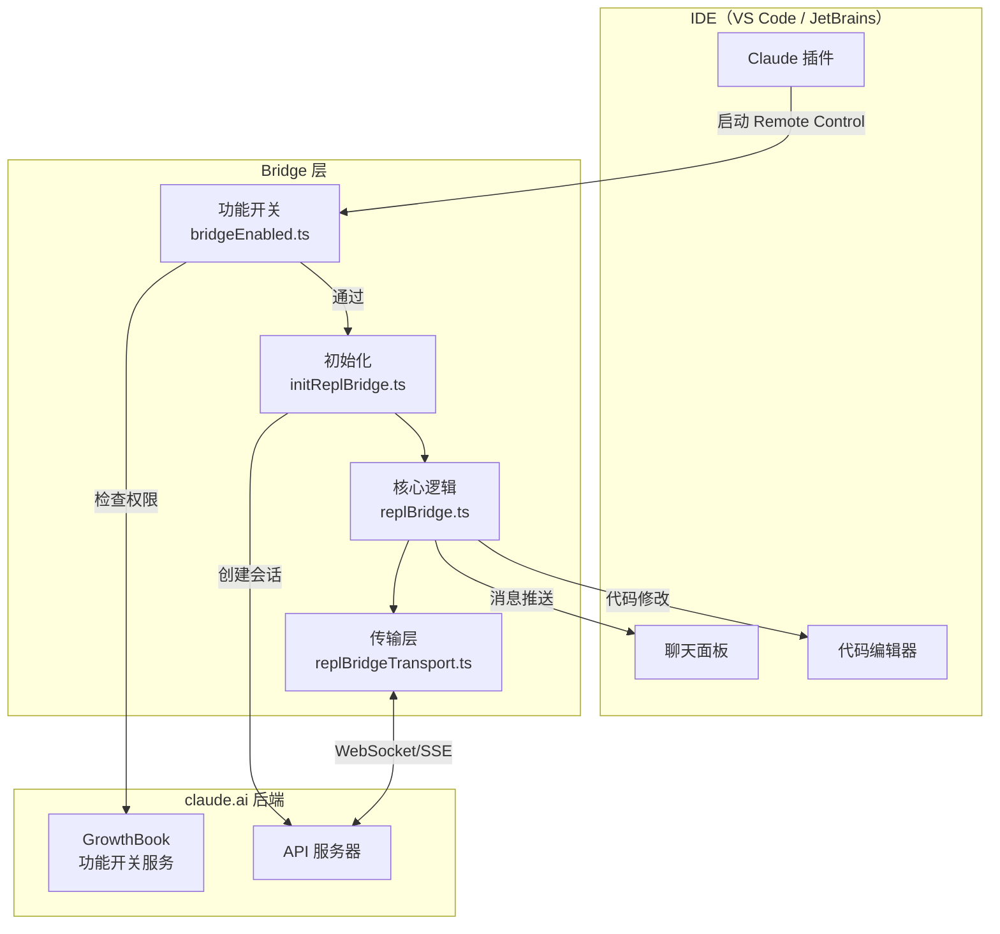
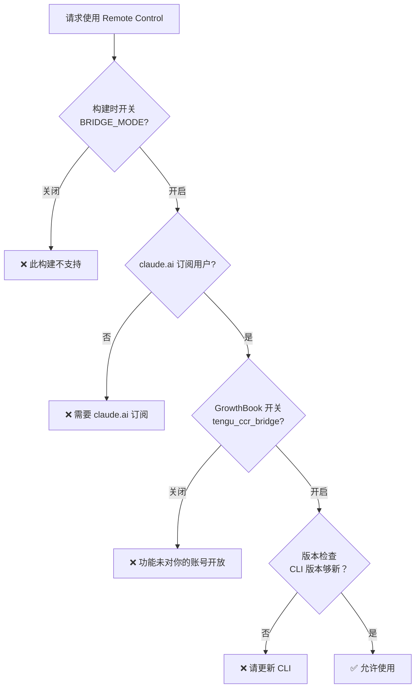
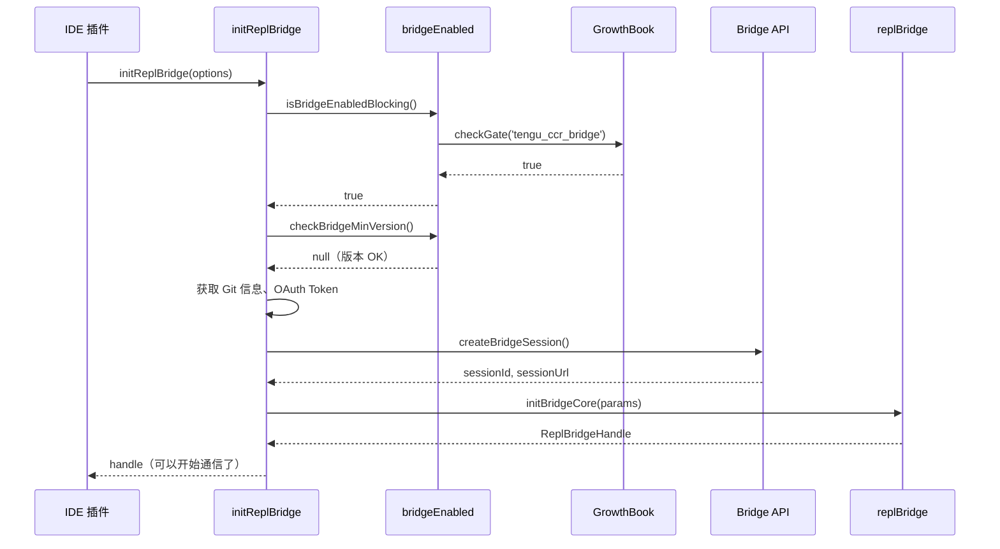
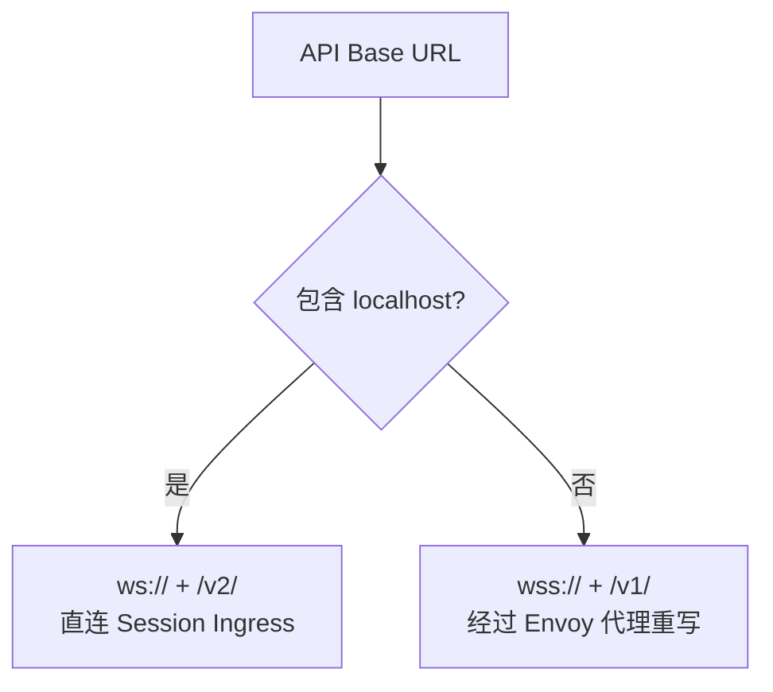

# 第九课：VS Code / JetBrains 集成实践

> 🎯 难度：⭐⭐⭐ 进阶级 | ⏱ 预计学习时间：25 分钟

## 学习目标

学完本课，你将能够：

1. **理解 Bridge 功能开关的设计**——如何控制功能的启用/禁用
2. **掌握 REPL Bridge 的初始化流程**——从 IDE 到 Bridge 的完整链路
3. **理解 Remote Control 的工作原理**——IDE 如何远程控制 CLI
4. **了解 IDE SDK URL 的构建方式**——WebSocket/SSE 地址是怎么来的
5. **理解版本兼容性检查**——如何确保 CLI 版本支持 Bridge

---

## 一、IDE 集成的全景图

### 1.1 生活类比：手机遥控空调

```
手机 App ──── WiFi ────► 路由器 ────► 空调
 (IDE)      (网络)      (Bridge)     (CLI)
```

你在手机上点「制冷 26°」，指令通过 WiFi 到达路由器，路由器转发给空调。空调调好温度后，通过路由器把状态反馈到手机上。

IDE 集成就是这个过程：
- **VS Code / JetBrains** = 手机 App
- **网络协议** = WiFi
- **Bridge** = 路由器
- **CLI** = 空调

### 1.2 完整集成架构



---

## 二、功能开关：谁能用 Bridge？

### 2.1 多层门禁

Bridge 的功能不是对所有人开放的——它有多层门禁检查：



### 2.2 基础开关：isBridgeEnabled

```typescript
// 来自 bridge/bridgeEnabled.ts
export function isBridgeEnabled(): boolean {
  return feature('BRIDGE_MODE')
    ? isClaudeAISubscriber() &&
        getFeatureValue_CACHED_MAY_BE_STALE('tengu_ccr_bridge', false)
    : false
}
```

三个条件缺一不可：
1. **构建时开关**：`feature('BRIDGE_MODE')` 必须为 true
2. **订阅检查**：`isClaudeAISubscriber()` 用户必须有 claude.ai 订阅
3. **灰度开关**：GrowthBook 的 `tengu_ccr_bridge` 必须为 true

### 2.3 阻塞式开关：isBridgeEnabledBlocking

```typescript
// 来自 bridge/bridgeEnabled.ts
export async function isBridgeEnabledBlocking(): Promise<boolean> {
  return feature('BRIDGE_MODE')
    ? isClaudeAISubscriber() &&
        (await checkGate_CACHED_OR_BLOCKING('tengu_ccr_bridge'))
    : false
}
```

和 `isBridgeEnabled` 的区别：
- `isBridgeEnabled`：使用缓存值，可能过期（快，但可能不准）
- `isBridgeEnabledBlocking`：如果缓存是 false，会等待服务器响应（慢，但准确）

### 2.4 诊断信息：getBridgeDisabledReason

```typescript
// 来自 bridge/bridgeEnabled.ts
export async function getBridgeDisabledReason(): Promise<string | null> {
  if (feature('BRIDGE_MODE')) {
    if (!isClaudeAISubscriber()) {
      return '需要 claude.ai 订阅...'
    }
    if (!hasProfileScope()) {
      return '需要完整权限的登录 Token...'
    }
    if (!getOauthAccountInfo()?.organizationUuid) {
      return '无法确定你的组织信息...'
    }
    if (!(await checkGate_CACHED_OR_BLOCKING('tengu_ccr_bridge'))) {
      return '功能未对你的账号开放'
    }
    return null   // 一切正常！
  }
  return '此构建不支持 Remote Control'
}
```

这个函数不仅告诉你「不行」，还告诉你**为什么不行**以及**怎么解决**。

---

## 三、版本兼容性检查

### 3.1 最低版本要求

```typescript
// 来自 bridge/bridgeEnabled.ts
export function checkBridgeMinVersion(): string | null {
  if (feature('BRIDGE_MODE')) {
    const config = getDynamicConfig_CACHED_MAY_BE_STALE<{
      minVersion: string
    }>('tengu_bridge_min_version', { minVersion: '0.0.0' })

    if (config.minVersion && lt(MACRO.VERSION, config.minVersion)) {
      return `版本 ${MACRO.VERSION} 太旧，需要 ${config.minVersion} 以上。`
    }
  }
  return null
}
```

服务器端可以随时调整最低版本要求——如果发现旧版本有 Bug，只需在 GrowthBook 中提高 `minVersion`，所有旧版本的用户就会收到升级提示。

---

## 四、REPL Bridge 初始化

### 4.1 初始化选项

```typescript
// 来自 bridge/initReplBridge.ts
export type InitBridgeOptions = {
  onInboundMessage?: (msg: SDKMessage) => void | Promise<void>  // 收到消息
  onPermissionResponse?: (response: SDKControlResponse) => void  // 权限响应
  onInterrupt?: () => void                     // 中断回调
  onSetModel?: (model: string | undefined) => void  // 模型切换
  onSetMaxThinkingTokens?: (maxTokens: number | null) => void
  onSetPermissionMode?: (mode: PermissionMode) => { ok: true } | { ok: false; error: string }
  onStateChange?: (state: BridgeState, detail?: string) => void  // 状态变化
  initialMessages?: Message[]                   // 历史消息
  initialName?: string                          // 初始名称
  getMessages?: () => Message[]                  // 获取当前消息
  previouslyFlushedUUIDs?: Set<string>          // 避免重复刷新
  perpetual?: boolean                           // 持久模式
}
```

### 4.2 初始化流程



### 4.3 信息收集

初始化时会收集大量上下文信息：

```typescript
// 来自 bridge/initReplBridge.ts
// 获取 Git 信息
const cwd = getOriginalCwd()
const branch = await getBranch(cwd)
const gitRepoUrl = await getRemoteUrl(cwd)

// 获取认证信息
const accessToken = getBridgeAccessToken()
const baseUrl = getBridgeBaseUrl()

// 获取会话信息
const sessionId = getSessionId()
const machineName = hostname()
```

---

## 五、SDK URL 构建

### 5.1 v1 WebSocket URL

```typescript
// 来自 bridge/workSecret.ts
export function buildSdkUrl(apiBaseUrl: string, sessionId: string): string {
  const isLocalhost =
    apiBaseUrl.includes('localhost') || apiBaseUrl.includes('127.0.0.1')
  const protocol = isLocalhost ? 'ws' : 'wss'
  const version = isLocalhost ? 'v2' : 'v1'
  const host = apiBaseUrl.replace(/^https?:\/\//, '').replace(/\/+$/, '')
  return `${protocol}://${host}/${version}/session_ingress/ws/${sessionId}`
}
```

示例：
```
输入: apiBaseUrl = "https://api.claude.ai"
      sessionId = "session_abc123"
输出: "wss://api.claude.ai/v1/session_ingress/ws/session_abc123"

输入: apiBaseUrl = "http://localhost:3000"
      sessionId = "session_abc123"
输出: "ws://localhost:3000/v2/session_ingress/ws/session_abc123"
```

### 5.2 v2 HTTP URL

```typescript
// 来自 bridge/workSecret.ts
export function buildCCRv2SdkUrl(apiBaseUrl: string, sessionId: string): string {
  const base = apiBaseUrl.replace(/\/+$/, '')
  return `${base}/v1/code/sessions/${sessionId}`
}
```

示例：
```
输入: apiBaseUrl = "https://api.claude.ai"
      sessionId = "cse_abc123"
输出: "https://api.claude.ai/v1/code/sessions/cse_abc123"
```

### 5.3 本地 vs 生产环境



为什么本地用 `/v2/` 而生产用 `/v1/`？因为生产环境有 Envoy 代理服务器，它会把 `/v1/` 路径自动重写为 `/v2/`。本地没有 Envoy，所以直接用 `/v2/`。

---

## 六、v1 vs v2 桥接路径

### 6.1 环境选择

```typescript
// 来自 bridge/bridgeEnabled.ts
export function isEnvLessBridgeEnabled(): boolean {
  return feature('BRIDGE_MODE')
    ? getFeatureValue_CACHED_MAY_BE_STALE('tengu_bridge_repl_v2', false)
    : false
}
```

| 开关 | 路径 | 说明 |
|------|------|------|
| `tengu_bridge_repl_v2 = false` | v1（环境变量路径） | 传统模式 |
| `tengu_bridge_repl_v2 = true` | v2（无环境路径） | 新模式，更轻量 |

### 6.2 会话 ID 兼容性

```typescript
// 来自 bridge/bridgeEnabled.ts
export function isCseShimEnabled(): boolean {
  return feature('BRIDGE_MODE')
    ? getFeatureValue_CACHED_MAY_BE_STALE(
        'tengu_bridge_repl_v2_cse_shim_enabled', true)
    : true
}
```

```typescript
// 来自 bridge/workSecret.ts
export function sameSessionId(a: string, b: string): boolean {
  if (a === b) return true
  // 比较去掉前缀后的部分
  const aBody = a.slice(a.lastIndexOf('_') + 1)
  const bBody = b.slice(b.lastIndexOf('_') + 1)
  return aBody.length >= 4 && aBody === bBody
}
```

为什么需要这个？因为 v2 的 CCR 返回 `cse_` 前缀的 ID，而 v1 的 API 返回 `session_` 前缀。它们可能指向同一个会话：

```
session_abc123def456  ← v1 格式
cse_abc123def456      ← v2 格式
```

`sameSessionId` 通过比较最后一个 `_` 后面的部分来判断是否相同。

---

## 七、IDE 中的用户体验

### 7.1 Worker 类型标识

```typescript
// 来自 bridge/types.ts
export type BridgeWorkerType = 'claude_code' | 'claude_code_assistant'
```

IDE 可以根据 Worker 类型过滤环境。比如：
- **claude_code**：普通代码任务
- **claude_code_assistant**：助手面板任务

### 7.2 自动连接

```typescript
// 来自 bridge/bridgeEnabled.ts
export function getCcrAutoConnectDefault(): boolean {
  return feature('CCR_AUTO_CONNECT')
    ? getFeatureValue_CACHED_MAY_BE_STALE('tengu_cobalt_harbor', false)
    : false
}
```

开启后，每次启动 CLI 都会自动连接 Remote Control——不需要手动执行 `/remote-control`。

### 7.3 镜像模式

```typescript
// 来自 bridge/bridgeEnabled.ts
export function isCcrMirrorEnabled(): boolean {
  return feature('CCR_MIRROR')
    ? isEnvTruthy(process.env.CLAUDE_CODE_CCR_MIRROR) ||
        getFeatureValue_CACHED_MAY_BE_STALE('tengu_ccr_mirror', false)
    : false
}
```

镜像模式让本地会话的事件被转发到服务器——你在终端里使用 Claude，IDE 面板上也能看到实时更新。

---

## 八、安全考虑

### 8.1 Token 隔离

```typescript
// 来自 bridge/bridgeConfig.ts
export function getBridgeAccessToken(): string | undefined {
  return getBridgeTokenOverride() ?? getClaudeAIOAuthTokens()?.accessToken
}
```

Bridge 使用 OAuth Token 调用管理 API，但子进程使用独立的 Session Ingress Token。这样即使子进程被攻击，攻击者也无法获取用户的 OAuth Token。

### 8.2 路径安全

```typescript
// 来自 bridge/bridgeApi.ts
const SAFE_ID_PATTERN = /^[a-zA-Z0-9_-]+$/

export function validateBridgeId(id: string, label: string): string {
  if (!id || !SAFE_ID_PATTERN.test(id)) {
    throw new Error(`Invalid ${label}: contains unsafe characters`)
  }
  return id
}
```

所有服务器返回的 ID 在拼接到 URL 之前都要经过验证——防止路径遍历攻击（如 `../../admin`）。

### 8.3 设备信任

```typescript
// 来自 bridge/bridgeApi.ts
const deviceToken = deps.getTrustedDeviceToken?.()
if (deviceToken) {
  headers['X-Trusted-Device-Token'] = deviceToken
}
```

Bridge 支持设备信任 Token，增加了一层安全认证。

---

## 九、动手练习

### 练习 1：功能开关模拟

设计一个简单的功能开关系统。实现以下接口：

```typescript
class FeatureGate {
  constructor(defaultValue: boolean) { }
  isEnabled(): boolean { }
  setRemoteValue(value: boolean): void { }
}
```

### 练习 2：URL 构建测试

根据 `buildSdkUrl` 的逻辑，计算以下输入的输出：

1. `apiBaseUrl = "https://api.claude.ai/"`，`sessionId = "session_xyz"`
2. `apiBaseUrl = "http://localhost:8080"`，`sessionId = "cse_abc"`
3. `apiBaseUrl = "https://staging.claude.ai"`，`sessionId = "session_test"`

### 练习 3：思考题

1. 为什么 `isBridgeEnabled()` 用缓存值，而 `isBridgeEnabledBlocking()` 用阻塞检查？各自适合什么场景？
2. `getCcrAutoConnectDefault()` 为什么需要一个单独的 GrowthBook 开关（`tengu_cobalt_harbor`），而不是复用 `tengu_ccr_bridge`？
3. 如果用户的 OAuth Token 缺少 `user:profile` 权限范围，GrowthBook 的组织 UUID 定向规则会怎样？

---

## 本课小结

| 要点 | 内容 |
|------|------|
| 多层门禁 | 构建开关 + 订阅检查 + GrowthBook 灰度 |
| 两种检查 | 缓存快速检查 vs 阻塞精确检查 |
| URL 构建 | 本地 ws://+/v2/，生产 wss://+/v1/ |
| 会话 ID 兼容 | session_* 和 cse_* 的互相识别 |
| 安全机制 | Token 隔离 + 路径验证 + 设备信任 |
| 自动连接 | GrowthBook 控制的渐进式灰度 |

---

## 下节预告

> **第 10 课：Bridge 架构总结与扩展思路**
>
> 最终课！我们将回顾整个 Bridge 系统的设计，总结核心设计模式，
> 并探讨未来可能的扩展方向。

---

*📖 配套漫画：《从手机到空调——IDE 遥控的幕后故事》*
