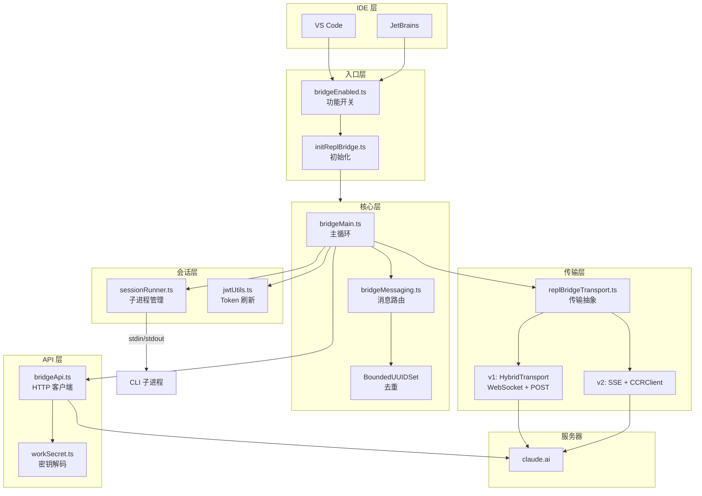
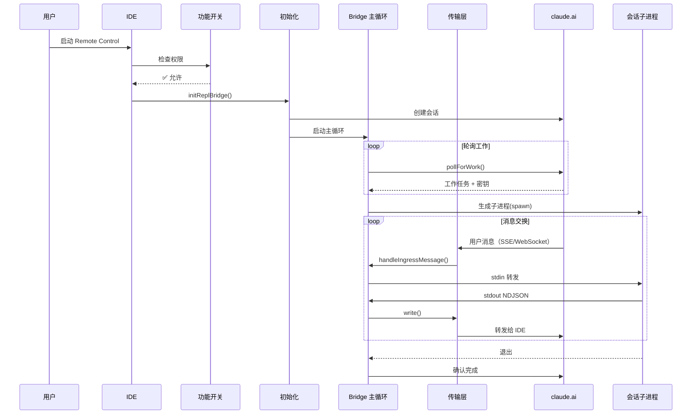
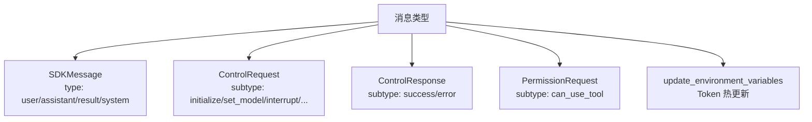
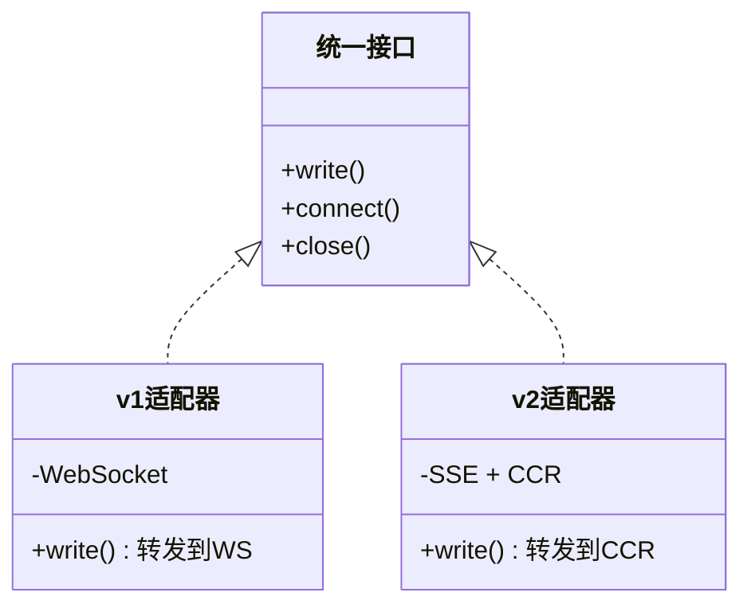
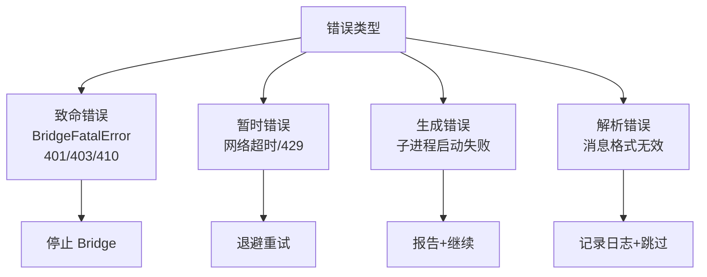
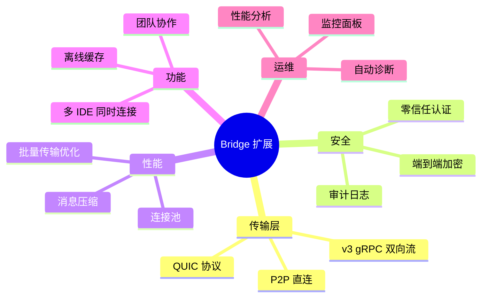
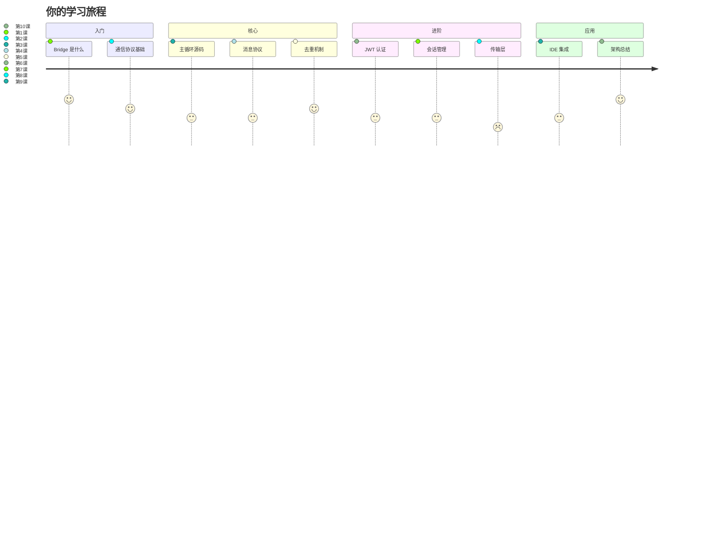

# 第十课：Bridge 架构总结与扩展思路

> 🎯 难度：⭐⭐⭐ 进阶级 | ⏱ 预计学习时间：25 分钟

## 学习目标

学完本课，你将能够：

1. **串联整个 Bridge 系统**——从全局视角回顾 10 节课的知识
2. **总结核心设计模式**——适配器、观察者、环形缓冲等
3. **理解设计权衡**——每个选择背后的 trade-off
4. **思考扩展方向**——如何改进和扩展 Bridge
5. **建立系统设计思维**——从 Bridge 学到的通用工程经验

---

## 一、Bridge 全景回顾

### 1.1 完整架构图



### 1.2 数据流全景



---

## 二、核心知识速查表

### 2.1 按课程汇总

| 课次 | 主题 | 核心概念 | 关键文件 |
|------|------|---------|---------|
| 1 | Bridge 是什么 | CLI-IDE 通信桥梁 | types.ts |
| 2 | 跨进程通信 | HTTP/WebSocket/SSE | bridgeApi.ts |
| 3 | 主循环 | 轮询-处理-清理循环 | bridgeMain.ts |
| 4 | 消息协议 | SDKMessage/Control* | bridgeMessaging.ts |
| 5 | 去重 | 环形缓冲区 | bridgeMessaging.ts |
| 6 | JWT 认证 | Token 解码+自动刷新 | jwtUtils.ts |
| 7 | 会话管理 | 子进程生命周期 | sessionRunner.ts |
| 8 | 传输层 | v1/v2 适配器 | replBridgeTransport.ts |
| 9 | IDE 集成 | 功能开关+URL构建 | bridgeEnabled.ts |
| 10 | 总结 | 全景回顾+扩展 | — |

### 2.2 消息类型速查



---

## 三、设计模式总结

### 3.1 适配器模式（Adapter）

**哪里用了**：`replBridgeTransport.ts`



**收益**：上层代码不需要关心底层是 WebSocket 还是 SSE，添加 v3 只需新增一个适配器。

### 3.2 观察者模式（Observer）

**哪里用了**：`SessionHandle` 的回调机制

```typescript
// 事件回调模式
setOnData(callback: (data: string) => void): void
setOnClose(callback: (closeCode?: number) => void): void
setOnConnect(callback: () => void): void
```

**收益**：事件驱动，松耦合。传输层不需要知道谁在监听。

### 3.3 环形缓冲区（Ring Buffer）

**哪里用了**：`BoundedUUIDSet`、活动记录、stderr 缓冲

```
特点：固定内存，FIFO 淘汰，O(1) 操作
用途：去重、最近记录、错误诊断
```

### 3.4 依赖注入（Dependency Injection）

**哪里用了**：`createSessionSpawner(deps)`、`createBridgeApiClient(deps)`

```typescript
// 不直接依赖全局状态，而是注入依赖
function createBridgeApiClient(deps: BridgeApiDeps): BridgeApiClient
function createSessionSpawner(deps: SessionSpawnerDeps): SessionSpawner
```

**收益**：可测试性——测试时注入 Mock 依赖即可。

### 3.5 代际号防竞态（Generation Counter）

**哪里用了**：`jwtUtils.ts` 的 Token 刷新调度器

```
schedule() → 递增 gen → 旧的 doRefresh 检测到 gen 变化 → 自动失效
```

**收益**：避免异步回调的竞态条件，不需要加锁。

### 3.6 两阶段终止（Two-Phase Shutdown）

**哪里用了**：子进程终止、Bridge 关闭

```
SIGTERM（请求退出）→ 等待宽限期 → SIGKILL（强制终止）
```

**收益**：给进程收尾的机会，同时保证最终能停下来。

---

## 四、设计权衡分析

### 4.1 轮询 vs 推送

| 决策 | 选择 | 原因 |
|------|------|------|
| 等待新任务 | 轮询 | 简单可靠，任务频率低 |
| 会话消息 | WebSocket/SSE 推送 | 实时性要求高 |

**权衡**：如果全部用推送，服务器需要维护大量空闲连接。如果全部用轮询，消息延迟太高。混合方案兼顾了效率和资源。

### 4.2 v1 vs v2

| 维度 | v1 | v2 |
|------|----|----|
| 复杂度 | 低 | 高 |
| 可观测性 | 差 | 好（交付确认） |
| 断线恢复 | 粗粒度 | 精确（序列号） |
| 扩展性 | 有限 | 好（状态报告） |

**权衡**：v2 功能更强但实现更复杂。两个版本并存是为了渐进式迁移。

### 4.3 内存 vs 准确性

`BoundedUUIDSet` 的容量选择：
- **太小**（如 10）：可能漏掉有效的去重
- **太大**（如 100万）：浪费内存
- **实际选择**（如 500-1000）：覆盖绝大多数重复场景

### 4.4 安全 vs 便利

```
Token 隔离：子进程用独立 Token，更安全但更复杂
路径验证：每个 ID 都验证，防注入但增加代码量
功能开关多层检查：安全但增加了初始化时间
```

---

## 五、错误处理总结

### 5.1 错误分类



### 5.2 错误恢复策略

| 错误 | 策略 | 实现 |
|------|------|------|
| 网络断连 | 指数退避重连 | DEFAULT_BACKOFF |
| Token 过期 | 自动刷新 | createTokenRefreshScheduler |
| 401 | 刷新 OAuth Token | withOAuthRetry |
| 子进程崩溃 | 报告+接新任务 | safeSpawn |
| Epoch 不匹配 | 关闭+重新连接 | onEpochMismatch |
| 消息解析失败 | 记录日志+跳过 | try-catch |

---

## 六、可扩展性分析

### 6.1 当前架构的优势

1. **模块化**：每个文件职责清晰，可独立修改
2. **可测试**：依赖注入让 Mock 变得简单
3. **灰度发布**：GrowthBook 开关控制新功能的渐进上线
4. **版本兼容**：v1/v2 并存，平滑迁移

### 6.2 潜在扩展方向



---

## 七、从 Bridge 学到的通用工程经验

### 7.1 接口优于实现

> 定义清晰的接口（`ReplBridgeTransport`），让实现可以自由替换。

### 7.2 防御性编程

> 每个外部输入都要验证（`validateBridgeId`）、每个异步操作都要有超时。

### 7.3 优雅降级

> 错误不应该让系统崩溃——`safeSpawn` 返回错误字符串而不是抛异常。

### 7.4 可观测性

> 详细的日志（`[bridge:api]`、`[bridge:ws]`、`[bridge:session]`）让排查问题成为可能。

### 7.5 渐进式发布

> 功能开关 + 版本检查 + 灰度控制 = 安全地发布新功能。

### 7.6 内存安全

> 长时间运行的服务必须关注内存——`BoundedUUIDSet` 就是一个典范。

---

## 八、综合练习

### 练习 1：架构设计

如果你要设计一个类似 Bridge 的系统，用于连接手机 App 和智能家居设备，你需要：

1. 定义哪些类型的消息？
2. 选择什么通信协议？
3. 如何处理设备离线？
4. 如何保证安全性？

### 练习 2：代码审查

回到任意一个源码文件，尝试：
1. 找到一个你认为写得特别好的设计决策，说明为什么好
2. 找到一个你认为可以改进的地方，提出改进方案
3. 找到一个你之前不理解、但现在理解了的代码段

### 练习 3：思考题

1. 如果 Bridge 需要同时服务 1000 个并发会话，当前架构能支持吗？瓶颈在哪里？
2. 如果要支持离线模式（服务器不可用时继续工作），需要做哪些修改？
3. Bridge 的「轮询 + 推送」混合模式，在其他系统中（如即时通讯、在线游戏）也适用吗？

### 练习 4：项目实践

选择以下任一项目实践：

**A. 简化版 Bridge**
用 Node.js 实现一个简化版 Bridge，支持：
- WebSocket 连接
- JSON 消息路由
- UUID 去重（用 BoundedUUIDSet）

**B. 监控面板**
为 Bridge 设计一个 Web 监控面板，显示：
- 活跃会话数
- 消息吞吐量
- 错误率
- Token 刷新状态

**C. 测试套件**
为 `BoundedUUIDSet` 和 `decodeJwtPayload` 编写完整的单元测试。

---

## 九、文件与概念速查索引

### 按文件名查

| 文件 | 关键导出 | 课次 |
|------|---------|------|
| `types.ts` | `BridgeConfig`, `SessionHandle`, `SpawnMode` | 1, 4 |
| `bridgeApi.ts` | `createBridgeApiClient`, `BridgeFatalError` | 2, 3 |
| `bridgeMain.ts` | `runBridgeLoop`, `BackoffConfig` | 3 |
| `bridgeMessaging.ts` | `handleIngressMessage`, `BoundedUUIDSet` | 4, 5 |
| `jwtUtils.ts` | `decodeJwtPayload`, `createTokenRefreshScheduler` | 6 |
| `sessionRunner.ts` | `createSessionSpawner`, `PermissionRequest` | 7 |
| `replBridgeTransport.ts` | `ReplBridgeTransport`, `createV1/V2ReplTransport` | 8 |
| `bridgeEnabled.ts` | `isBridgeEnabled`, `getBridgeDisabledReason` | 9 |
| `bridgeConfig.ts` | `getBridgeAccessToken`, `getBridgeBaseUrl` | 6, 9 |
| `workSecret.ts` | `decodeWorkSecret`, `buildSdkUrl`, `registerWorker` | 3, 8 |

### 按概念查

| 概念 | 说明 | 所在文件 |
|------|------|---------|
| 环形缓冲区 | FIFO 有界集合 | bridgeMessaging.ts |
| 代际号 | 异步竞态防护 | jwtUtils.ts |
| 适配器模式 | 统一 v1/v2 接口 | replBridgeTransport.ts |
| Epoch | Worker 纪元号 | workSecret.ts |
| 两阶段终止 | SIGTERM → SIGKILL | sessionRunner.ts |
| 指数退避 | 错误重试策略 | bridgeMain.ts |
| 功能开关 | 灰度发布控制 | bridgeEnabled.ts |
| OAuth 刷新 | 401 自动重试 | bridgeApi.ts |

---

## 十、课程完结语

经过 10 节课的学习，你已经从零开始理解了 Claude Code Bridge 系统的方方面面：



### 你学到了什么

✅ **系统设计**：如何设计一个跨进程通信系统
✅ **协议选择**：HTTP / WebSocket / SSE 各自的适用场景
✅ **数据结构**：环形缓冲区的实现和应用
✅ **安全认证**：JWT 解码、Token 刷新、防竞态
✅ **进程管理**：子进程生命周期、信号处理、优雅关闭
✅ **软件工程**：适配器模式、依赖注入、功能开关

### 下一步

1. **阅读完整源码**：带着理解重读每个文件
2. **动手实践**：实现一个简化版 Bridge
3. **深入探索**：`replBridge.ts`（本系列未完全覆盖的核心文件）
4. **参与社区**：Claude Code 是开源项目，欢迎贡献

---

*📖 配套漫画：《Bridge 毕业典礼——从小白到架构师的蜕变》*

---

> 🎉 恭喜你完成了 Claude Code Bridge 系统的全部 10 节课程！
>
> 记住：**每一个复杂系统，都是由简单的部分组合而成的。**
> 只要你理解了每个部分，就能理解整个系统。
