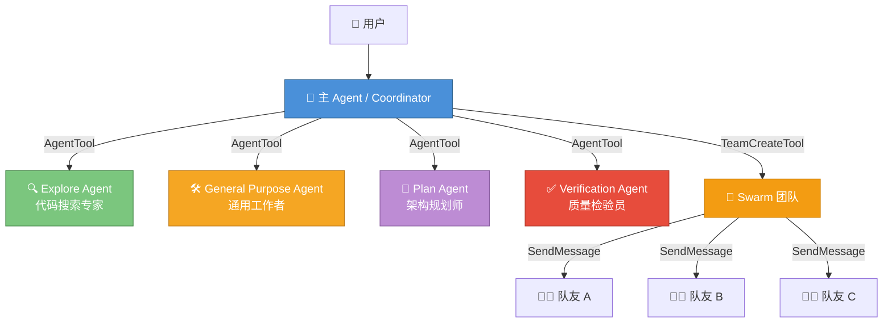
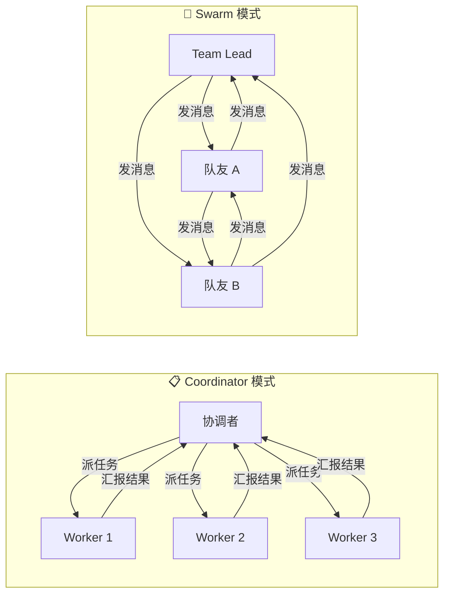

# 第1课：什么是多 Agent 系统？

> 🎯 从零开始理解 Claude Code 中的"多智能体协作"概念

---

## 📋 学习目标

学完本课，你将能够：

1. 用自己的话解释什么是"Agent"和"多 Agent 系统"
2. 理解为什么需要多个 Agent 协作，而不是一个 Agent 包办一切
3. 了解 Claude Code 多 Agent 系统的整体架构全貌
4. 区分 Coordinator 模式和 Swarm 模式的基本差异
5. 建立后续 9 节课的知识框架

---

## 🌟 通俗讲解：从生活类比说起

### 一个人 vs 一个团队

想象你要**装修一套房子**：

- **一个人干所有活**：你一个人既要设计图纸、又要砸墙、又要布线、又要刷漆……效率极低，而且每件事都只能串行做。
- **组建一个装修队**：设计师画图、水电工布线、油漆工刷墙、监理检查质量——每个人是某个领域的专家，大家**并行工作**，监理协调进度。

在 AI 编程助手中，这就是：

| 生活类比 | Claude Code 概念 |
|---------|-----------------|
| 装修工人 | Agent（智能体） |
| 工种（水电/油漆） | Agent Type（类型） |
| 监理/项目经理 | Coordinator（协调者） |
| 施工对讲机 | SendMessage（消息通信） |
| 装修合同/任务单 | Task List（任务列表） |
| 装修队 | Team / Swarm（团队/蜂群） |

### 什么是 Agent？

**Agent = 一个拥有特定能力的独立 AI 工作者。**

它有自己的：
- **系统提示词**（决定它的"性格"和"职责"）
- **工具集**（决定它能做什么，比如能读文件但不能写）
- **上下文**（它的对话记忆）
- **生命周期**（从创建到完成或被终止）

### 什么是多 Agent 系统？

**多 Agent 系统 = 多个 Agent 协同工作，共同完成一个复杂任务。**

关键特征：
- 每个 Agent 有**独立的对话上下文**
- Agent 之间通过**消息通信**协作
- 需要某种**编排机制**来协调工作

---

## 🏗️ Claude Code 的多 Agent 架构全貌

下面这张图展示了 Claude Code 中多 Agent 系统的核心组件：



### 核心组件一览

| 组件 | 源码位置 | 作用 |
|------|---------|------|
| **AgentTool** | `tools/AgentTool/` | 创建和管理子 Agent |
| **TeamCreateTool** | `tools/TeamCreateTool/` | 组建 Swarm 团队 |
| **TeamDeleteTool** | `tools/TeamDeleteTool/` | 解散团队、清理资源 |
| **SendMessageTool** | `tools/SendMessageTool/` | Agent 之间发送消息 |
| **coordinatorMode** | `coordinator/` | Coordinator 编排模式的逻辑 |

---

## 🔬 初探源码：Agent 的"出生证明"

让我们先来看看一个 Agent 是如何被定义的。在 Claude Code 中，每个 Agent 都有一个"定义"结构：

```typescript
// 来自 tools/AgentTool/loadAgentsDir.ts

// 所有 Agent 共有的基础属性
type BaseAgentDefinition = {
  agentType: string          // 类型名称，如 "Explore"、"Plan"
  whenToUse: string          // 什么时候该用这个 Agent
  tools?: string[]           // 可用工具列表
  disallowedTools?: string[] // 禁用工具列表
  model?: string             // 使用的 AI 模型
  maxTurns?: number          // 最大对话轮数
  permissionMode?: string    // 权限模式
  // ... 更多属性
}
```

你可以把它想象成一个**员工档案**：

- `agentType`：职位名称（"设计师"、"水电工"）
- `whenToUse`：岗位职责描述（"需要画图纸时找我"）
- `tools`：工具箱（设计师有画板，水电工有扳手）
- `disallowedTools`：不能碰的东西（实习生不能动电闸）
- `maxTurns`：最长工作时间

### Agent 的三种来源

```typescript
// 三种 Agent 定义类型
type AgentDefinition =
  | BuiltInAgentDefinition    // 内置 Agent（系统自带）
  | CustomAgentDefinition     // 自定义 Agent（用户创建）
  | PluginAgentDefinition     // 插件 Agent（第三方提供）
```

就像公司里有：
- **正式员工**（内置 Agent）—— 系统自带，如 Explore、Plan
- **外包人员**（自定义 Agent）—— 用户在 `.claude/agents/` 目录下自己定义的
- **合作伙伴**（插件 Agent）—— 第三方插件提供的

---

## 🔄 两种协作模式：Coordinator vs Swarm

Claude Code 提供了两种截然不同的多 Agent 协作模式：



### Coordinator 模式（指挥官模式）

就像**军队指挥官**：
- 指挥官（Coordinator）接收任务，分解后下达给各个 Worker
- Worker 独立执行，完成后向指挥官汇报
- Worker 之间**不直接对话**，都通过指挥官中转
- 指挥官综合所有 Worker 的结果，向用户汇报

对应源码中的关键判断：

```typescript
// 来自 coordinator/coordinatorMode.ts
export function isCoordinatorMode(): boolean {
  if (feature('COORDINATOR_MODE')) {
    return isEnvTruthy(process.env.CLAUDE_CODE_COORDINATOR_MODE)
  }
  return false
}
```

### Swarm 模式（蜂群模式）

就像**创业小团队**：
- Team Lead 组建团队（TeamCreateTool）
- 每个队友是一个独立的 Claude Code 进程
- 队友之间可以**直接通信**（SendMessageTool）
- 共享任务列表，自主认领和完成任务
- 更灵活，但需要更好的协调

---

## 📊 为什么需要多 Agent？

### 单 Agent 的局限

| 局限 | 说明 |
|------|------|
| **上下文窗口有限** | 一个 Agent 能记住的内容有限，复杂任务容易"记不住前面的" |
| **串行执行** | 只能一步一步做，不能同时调查多个方向 |
| **职责混乱** | 既要搜代码又要写代码又要测试，容易搞混 |
| **安全风险** | 给它所有权限，万一操作失误后果更大 |

### 多 Agent 的优势

| 优势 | 说明 |
|------|------|
| **并行执行** | 多个 Agent 同时工作，效率翻倍 |
| **职责分离** | 每个 Agent 专注一个方面，做得更好 |
| **最小权限** | Explore Agent 只能读不能写，更安全 |
| **独立上下文** | 每个 Agent 有自己的记忆空间 |
| **容错性** | 一个 Agent 失败不影响其他 Agent |

---

## 🧪 动手练习

### 练习 1：画出你自己的"装修团队"

想象你要用 AI 完成以下任务："给一个 React 项目添加暗黑模式"。

画一张图（纸上或脑中），回答：
1. 你会安排几个 Agent？
2. 每个 Agent 负责什么？
3. 它们需要什么工具？
4. 它们之间需要怎样通信？

### 练习 2：判断题

1. ✅ / ❌ — 在 Claude Code 中，每个子 Agent 都能看到主 Agent 的完整对话历史
2. ✅ / ❌ — Explore Agent 可以创建新文件
3. ✅ / ❌ — Coordinator 模式中，Worker 之间可以直接对话
4. ✅ / ❌ — 多 Agent 系统的一个核心优势是可以并行执行任务

<details>
<summary>💡 点击查看答案</summary>

1. ❌ — 子 Agent 有独立的上下文，不能看到主 Agent 的对话历史（除非是 fork 模式）
2. ❌ — Explore Agent 是只读的，`disallowedTools` 中包含 `FileWrite` 和 `FileEdit`
3. ❌ — Coordinator 模式中，Worker 只与 Coordinator 通信
4. ✅ — 正确！并行是多 Agent 的核心优势之一

</details>

### 思考题

> 你觉得一个 AI 编程助手，什么情况下用单 Agent 就够了，什么情况下必须用多 Agent？试着列出 3 个"必须多 Agent"的场景。

---

## 📝 本课小结

| 概念 | 一句话解释 |
|------|-----------|
| Agent | 拥有特定能力的独立 AI 工作者 |
| 多 Agent 系统 | 多个 Agent 协同工作完成复杂任务 |
| AgentTool | 创建子 Agent 的工具 |
| Coordinator 模式 | 指挥官式编排，Worker 不互相对话 |
| Swarm 模式 | 蜂群式协作，队友可直接通信 |
| Agent 类型 | Explore / GeneralPurpose / Plan / Verification 等 |

**核心要记住的三件事：**

1. Agent 有独立的上下文、工具集和权限
2. 多 Agent 的核心价值：并行 + 专业化 + 安全隔离
3. Claude Code 有两种模式：Coordinator（中心化）和 Swarm（去中心化）

---

## 🔮 下节预告

**第2课：AgentTool 源码解析 —— 子 Agent 是如何被创建的？**

我们将深入 `tools/AgentTool/` 目录，看看：
- 一个子 Agent 从"出生"到"完成工作"的完整生命周期
- `runAgent` 函数中那些精妙的设计
- 同步 Agent 和异步 Agent 的区别
- 为什么子 Agent 需要自己的 AbortController

准备好了吗？让我们一起"拆开引擎盖"看看里面的零件！
