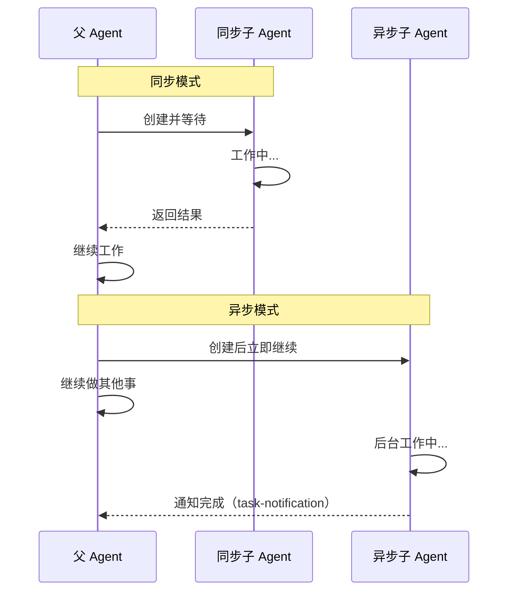

# 第2课：AgentTool 源码解析 —— 子 Agent 的创建

> 🎯 深入 `tools/AgentTool/` 目录，理解子 Agent 从"出生"到"退休"的完整生命周期

---

## 📋 学习目标

学完本课，你将能够：

1. 说出 AgentTool 目录下每个关键文件的职责
2. 理解 `runAgent` 函数中子 Agent 的完整创建流程
3. 区分同步 Agent 和异步 Agent 的关键差异
4. 解释为什么子 Agent 需要独立的 AbortController、SystemPrompt 和 ToolSet
5. 理解 Fork 子 Agent 的特殊机制

---

## 🌟 通俗讲解：招聘流程类比

创建一个子 Agent，就像公司**招聘一个新员工**：

```
1. 📋 确定岗位需求 → 选择 Agent 类型（agentType）
2. 📝 撰写岗位描述 → 构建系统提示词（systemPrompt）
3. 🔧 分配办公工具 → 确定工具集（tools）
4. 🔑 设定权限范围 → 配置权限模式（permissionMode）
5. 📧 交代第一项工作 → 发送初始消息（promptMessages）
6. 🏢 安排工位 → 创建独立上下文（toolUseContext）
7. 💼 正式入职干活 → 进入查询循环（query loop）
8. 📊 汇报并离职 → 返回结果、清理资源
```

---

## 📂 AgentTool 目录结构

```
tools/AgentTool/
├── AgentTool.tsx          # 主入口：处理 Agent 工具的调用
├── runAgent.ts            # 核心：实际运行子 Agent 的逻辑
├── prompt.ts              # Agent 工具的提示词描述
├── constants.ts           # 常量定义（工具名称等）
├── builtInAgents.ts       # 内置 Agent 的注册表
├── loadAgentsDir.ts       # 从文件系统加载自定义 Agent
├── agentToolUtils.ts      # 工具解析、过滤等辅助函数
├── forkSubagent.ts        # Fork 模式（上下文继承）逻辑
├── resumeAgent.ts         # 恢复已暂停的 Agent
├── agentMemory.ts         # Agent 持久化记忆
├── agentColorManager.ts   # Agent UI 颜色管理
├── agentDisplay.ts        # Agent 显示相关
├── UI.tsx                 # React 渲染组件
└── built-in/              # 内置 Agent 定义
    ├── exploreAgent.ts    # Explore Agent
    ├── generalPurposeAgent.ts # 通用 Agent
    ├── planAgent.ts       # Plan Agent
    └── verificationAgent.ts   # 验证 Agent
```

---

## 🔬 核心源码解析：runAgent 函数

`runAgent` 是整个 AgentTool 的心脏。我们一步步拆解它：

### 第一步：确定模型和身份

```typescript
// 来自 tools/AgentTool/runAgent.ts

export async function* runAgent({
  agentDefinition,    // Agent 的定义（类型、提示词、工具等）
  promptMessages,     // 要发送给 Agent 的初始消息
  toolUseContext,     // 父 Agent 的上下文
  canUseTool,         // 工具权限检查函数
  isAsync,            // 是否异步运行
  model,              // 使用的模型
  // ... 更多参数
}) {
  // 1. 解析实际要用的模型
  const resolvedAgentModel = getAgentModel(
    agentDefinition.model,   // Agent 定义中指定的模型
    toolUseContext.options.mainLoopModel, // 父 Agent 的模型
    model,                   // 调用时指定的模型
    permissionMode,
  )

  // 2. 生成唯一的 Agent ID —— 相当于员工工号
  const agentId = override?.agentId
    ? override.agentId
    : createAgentId()
```

**类比**：就像新员工入职第一天，先分配工号（`agentId`），确定薪资等级（`model`）。

### 第二步：准备上下文（布置工位）

```typescript
  // 3. 处理消息上下文
  // Fork 模式：继承父 Agent 的对话历史
  // 普通模式：从空白开始
  const contextMessages = forkContextMessages
    ? filterIncompleteToolCalls(forkContextMessages)
    : []
  const initialMessages = [...contextMessages, ...promptMessages]

  // 4. 创建独立的文件状态缓存
  const agentReadFileState = forkContextMessages !== undefined
    ? cloneFileStateCache(toolUseContext.readFileState)  // Fork：复制父的缓存
    : createFileStateCacheWithSizeLimit(READ_FILE_STATE_CACHE_SIZE) // 新建空缓存
```

**类比**：
- Fork 模式 = 老员工带新人，新人能看到之前的项目资料
- 普通模式 = 完全新招的人，从零开始

### 第三步：构建系统提示词（写岗位手册）

```typescript
  // 5. 获取用户上下文和系统上下文
  const [baseUserContext, baseSystemContext] = await Promise.all([
    getUserContext(),
    getSystemContext(),
  ])

  // 6. 只读 Agent（Explore/Plan）不需要 CLAUDE.md 中的规则
  // 节省了大量 token！
  const shouldOmitClaudeMd = agentDefinition.omitClaudeMd
    && !override?.userContext
  const resolvedUserContext = shouldOmitClaudeMd
    ? userContextNoClaudeMd
    : baseUserContext

  // 7. Explore/Plan 也不需要 gitStatus
  // 因为它们可以自己运行 git status 获取最新信息
  const resolvedSystemContext =
    agentDefinition.agentType === 'Explore' ||
    agentDefinition.agentType === 'Plan'
      ? systemContextNoGit
      : baseSystemContext
```

**关键设计**：Claude Code 非常注重**token 效率**。只读 Agent 不需要"怎么提交代码"的规则，所以直接省略，每周能节省数十亿 token！

### 第四步：配置权限（发门禁卡）

```typescript
  // 8. 设置 Agent 权限
  const agentGetAppState = () => {
    const state = toolUseContext.getAppState()
    let toolPermissionContext = state.toolPermissionContext

    // 如果 Agent 定义了自己的权限模式，使用它
    // 但如果父 Agent 已经是最高权限，不降级
    if (
      agentPermissionMode &&
      state.toolPermissionContext.mode !== 'bypassPermissions' &&
      state.toolPermissionContext.mode !== 'acceptEdits'
    ) {
      toolPermissionContext = {
        ...toolPermissionContext,
        mode: agentPermissionMode,
      }
    }

    // 异步 Agent 不能弹出权限确认对话框
    // （因为它在后台运行，没有用户界面）
    if (shouldAvoidPrompts) {
      toolPermissionContext = {
        ...toolPermissionContext,
        shouldAvoidPermissionPrompts: true,
      }
    }

    return { ...state, toolPermissionContext }
  }
```

**类比**：
- 正式员工 → 有门禁卡，可以进很多房间
- 临时工 → 只能进指定区域
- 远程员工（异步 Agent）→ 不能直接问保安开门（无法弹权限提示）

### 第五步：解析可用工具（打开工具箱）

```typescript
  // 9. 根据 Agent 定义解析实际可用的工具
  const resolvedTools = useExactTools
    ? availableTools                    // Fork模式：完全继承父的工具
    : resolveAgentTools(               // 普通模式：按定义过滤
        agentDefinition,
        availableTools,
        isAsync
      ).resolvedTools
```

工具解析的核心逻辑在 `agentToolUtils.ts` 中：

```typescript
// 来自 tools/AgentTool/agentToolUtils.ts

export function filterToolsForAgent({
  tools, isBuiltIn, isAsync, permissionMode
}) {
  return tools.filter(tool => {
    // MCP 工具（第三方扩展）总是允许
    if (tool.name.startsWith('mcp__')) return true

    // 所有 Agent 都不能用的工具（如 TodoWrite）
    if (ALL_AGENT_DISALLOWED_TOOLS.has(tool.name)) return false

    // 自定义 Agent 额外不能用的工具
    if (!isBuiltIn && CUSTOM_AGENT_DISALLOWED_TOOLS.has(tool.name))
      return false

    // 异步 Agent 只能用白名单中的工具
    if (isAsync && !ASYNC_AGENT_ALLOWED_TOOLS.has(tool.name))
      return false

    return true
  })
}
```

### 第六步：进入工作循环（正式干活）

```typescript
  // 10. 创建子 Agent 的上下文
  const agentToolUseContext = createSubagentContext(toolUseContext, {
    options: agentOptions,
    agentId,
    agentType: agentDefinition.agentType,
    messages: initialMessages,
    readFileState: agentReadFileState,
    abortController: agentAbortController,
    getAppState: agentGetAppState,
    shareSetAppState: !isAsync,  // 同步 Agent 与父共享状态更新
  })

  // 11. 进入查询循环 —— Agent 开始自主工作
  try {
    for await (const message of query({
      messages: initialMessages,
      systemPrompt: agentSystemPrompt,
      userContext: resolvedUserContext,
      systemContext: resolvedSystemContext,
      canUseTool,
      toolUseContext: agentToolUseContext,
      querySource,
      maxTurns: maxTurns ?? agentDefinition.maxTurns,
    })) {
      // 记录每一条消息
      if (isRecordableMessage(message)) {
        await recordSidechainTranscript([message], agentId)
        yield message  // 将消息传递给父 Agent
      }
    }
  }
```

**类比**：`query` 函数就像一个工作循环 —— Agent 持续地"思考 → 使用工具 → 思考 → 使用工具"，直到完成任务或达到最大轮数。

### 第七步：清理资源（办理离职）

```typescript
  // 12. 无论成功还是失败，都要清理资源
  finally {
    await mcpCleanup()                           // 关闭 MCP 连接
    clearSessionHooks(rootSetAppState, agentId)   // 清除钩子
    cleanupAgentTracking(agentId)                 // 清除追踪
    agentToolUseContext.readFileState.clear()      // 释放文件缓存
    initialMessages.length = 0                     // 释放消息内存
    unregisterPerfettoAgent(agentId)              // 注销性能追踪
    
    // 清除 Agent 的 todo 条目，防止内存泄漏
    rootSetAppState(prev => {
      if (!(agentId in prev.todos)) return prev
      const { [agentId]: _removed, ...todos } = prev.todos
      return { ...prev, todos }
    })
    
    // 终止 Agent 创建的后台 Shell 任务
    killShellTasksForAgent(agentId, ...)
  }
```

**关键设计**：`finally` 块确保无论 Agent 是成功完成、被取消还是出错，所有资源都会被正确释放。这就像员工离职时必须归还门禁卡、清空工位一样。

---

## 🔄 同步 vs 异步 Agent



| 特性 | 同步 Agent | 异步 Agent |
|------|-----------|-----------|
| 父 Agent 是否等待 | ✅ 等待完成 | ❌ 立即继续 |
| AbortController | 共享父的 | 独立新建的 |
| 权限弹窗 | 可以弹出 | 不能弹出 |
| 状态共享 | 共享 setAppState | 独立 |
| 结果返回方式 | 直接返回 | task-notification |

对应源码中的关键区别：

```typescript
// AbortController 的选择
const agentAbortController = override?.abortController
  ? override.abortController
  : isAsync
    ? new AbortController()   // 异步 Agent：独立的控制器
    : toolUseContext.abortController  // 同步 Agent：共享父的
```

---

## 🍴 特殊机制：Fork 子 Agent

Fork 是一种特殊的 Agent 创建方式——它**继承父 Agent 的完整对话上下文**。

```typescript
// 来自 tools/AgentTool/forkSubagent.ts

export const FORK_AGENT = {
  agentType: 'fork',
  tools: ['*'],           // 继承所有工具
  maxTurns: 200,
  model: 'inherit',        // 继承父的模型
  permissionMode: 'bubble', // 权限提示冒泡到父
  source: 'built-in',
  getSystemPrompt: () => '',  // 不需要系统提示词（用父的）
}
```

**类比**：Fork 就像"克隆自己"——新的 Agent 知道你之前做过的所有事情，但独立工作，不会把中间过程塞回你的上下文。

### 为什么要 Fork？

```typescript
// Fork 的使用场景（来自 prompt.ts）

// 1. 研究问题：不想让搜索过程污染自己的上下文
// "Forking this — it's a survey question.
//  I want the punch list, not the git output in my context."

// 2. 实现工作：不想让大量编辑记录占用自己的上下文
// 先做研究，再 fork 出去实现
```

### 防止递归 Fork

```typescript
// 检查是否已经在 Fork 子进程中
export function isInForkChild(messages: MessageType[]): boolean {
  return messages.some(m => {
    if (m.type !== 'user') return false
    const content = m.message.content
    if (!Array.isArray(content)) return false
    return content.some(
      block =>
        block.type === 'text' &&
        block.text.includes(`<${FORK_BOILERPLATE_TAG}>`),
    )
  })
}
```

**设计哲学**：Fork 的孩子不能再 Fork——就像克隆体不能再克隆，否则会无限递归。

---

## 🧪 动手练习

### 练习 1：追踪生命周期

打开 `runAgent.ts` 源码，回答以下问题：

1. 子 Agent 的 `agentId` 是在什么时候生成的？
2. `initialMessages` 由哪两部分组成？
3. `finally` 块中清理了哪些资源？（列出至少 5 个）

### 练习 2：工具过滤模拟

假设有这些工具：`[Read, Write, Edit, Bash, Glob, Grep, Agent, mcp__slack]`

根据 `filterToolsForAgent` 的逻辑，回答：

1. 一个内置的同步 Agent，且 `disallowedTools = ['Write', 'Edit']`，最终能用哪些工具？
2. 一个自定义的异步 Agent，能用哪些工具？

### 思考题

> 为什么 Explore Agent 和 Plan Agent 要省略 CLAUDE.md 和 gitStatus？这对系统性能有什么影响？

---

## 📝 本课小结

| 概念 | 一句话解释 |
|------|-----------|
| `runAgent` | 子 Agent 的完整生命周期管理函数 |
| `agentId` | Agent 的唯一标识符（员工工号） |
| `resolveAgentTools` | 根据定义过滤出 Agent 实际可用的工具 |
| 同步 Agent | 父 Agent 等待其完成，共享资源 |
| 异步 Agent | 后台运行，独立资源，通过通知返回结果 |
| Fork Agent | 继承父的完整上下文的特殊 Agent |
| `finally` 块 | 确保资源必定清理，防止泄漏 |

**核心要记住的三件事：**

1. 子 Agent 有完全独立的上下文、工具集、权限和 AbortController
2. 异步 Agent 和同步 Agent 在资源共享策略上有本质区别
3. 资源清理（`finally` 块）是系统稳定性的关键保障

---

## 🔮 下节预告

**第3课：Agent 类型详解 —— Explore / GeneralPurpose / Plan / Verification**

我们将逐一深入四种内置 Agent，看看：
- 每种 Agent 的系统提示词是如何设计的
- 为什么 Explore 用 Haiku 模型而 Plan 用 Inherit
- Verification Agent 的"对抗性检验"哲学
- 如何选择正确的 Agent 类型来匹配任务

从"招聘流程"走向"岗位说明书"！
