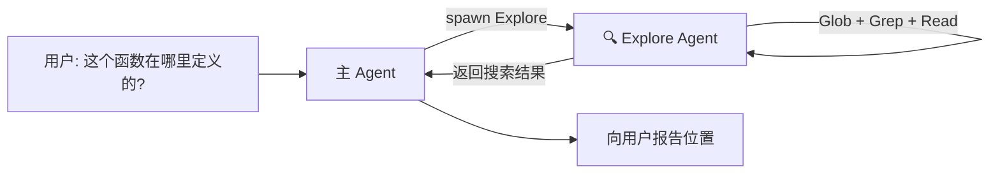
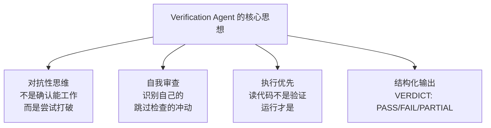
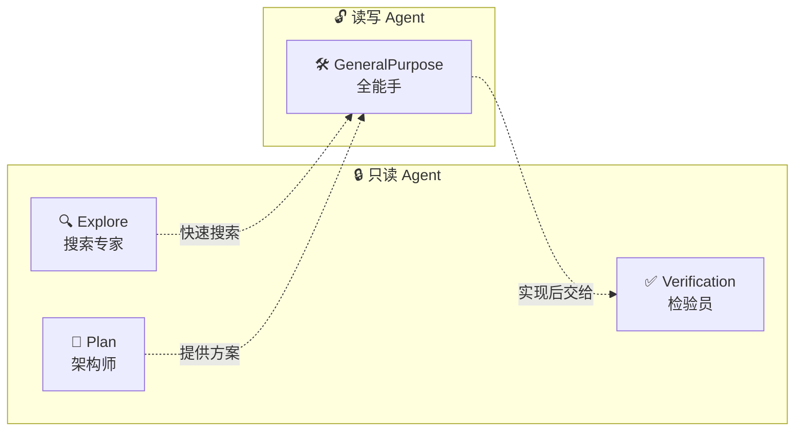

# 第3课：Agent 类型详解 —— Explore / GeneralPurpose / Plan / Verification

> 🎯 深入理解四种内置 Agent 的设计哲学、能力边界和适用场景

---

## 📋 学习目标

学完本课，你将能够：

1. 说出四种内置 Agent 各自的职责和能力
2. 理解每种 Agent 的系统提示词设计思路
3. 解释为什么不同 Agent 使用不同的模型策略
4. 根据任务类型选择合适的 Agent
5. 理解工具白名单/黑名单机制

---

## 🌟 通俗讲解：医院科室类比

四种内置 Agent 就像医院的四个科室：

| Agent 类型 | 医院类比 | 核心能力 | 一句话定位 |
|-----------|---------|---------|-----------|
| **Explore** | 检验科 | 快速搜索代码 | "帮你找东西的侦探" |
| **GeneralPurpose** | 全科门诊 | 什么都能做 | "什么都会的全能手" |
| **Plan** | 外科会诊 | 设计方案 | "画图纸的架构师" |
| **Verification** | 质检科 | 验证正确性 | "专门挑毛病的审查员" |

---

## 🔍 Explore Agent：代码搜索专家

### 设计定位

Explore Agent 是一个**只读的、快速的代码搜索专家**。它存在的意义是：当你需要在代码库中寻找某些东西时，不必亲自去翻，交给它就好。

### 源码分析

```typescript
// 来自 tools/AgentTool/built-in/exploreAgent.ts

export const EXPLORE_AGENT: BuiltInAgentDefinition = {
  agentType: 'Explore',
  whenToUse: 'Fast agent specialized for exploring codebases...',
  
  // 关键：禁止使用的工具 —— 不能写、不能编辑、不能创建 Agent
  disallowedTools: [
    AGENT_TOOL_NAME,       // 不能创建子 Agent
    EXIT_PLAN_MODE_TOOL_NAME,
    FILE_EDIT_TOOL_NAME,   // 不能编辑文件
    FILE_WRITE_TOOL_NAME,  // 不能写文件
    NOTEBOOK_EDIT_TOOL_NAME,
  ],
  
  source: 'built-in',
  
  // 模型选择：外部用户用 Haiku（快且便宜），内部用 inherit
  model: process.env.USER_TYPE === 'ant' ? 'inherit' : 'haiku',
  
  // 省略 CLAUDE.md —— 只读 Agent 不需要提交/PR 规则
  omitClaudeMd: true,
  
  getSystemPrompt: () => getExploreSystemPrompt(),
}
```

### 系统提示词的关键设计

```typescript
function getExploreSystemPrompt(): string {
  return `You are a file search specialist for Claude Code...

=== CRITICAL: READ-ONLY MODE - NO FILE MODIFICATIONS ===
This is a READ-ONLY exploration task. You are STRICTLY PROHIBITED from:
- Creating new files
- Modifying existing files
- Deleting files
...

Your strengths:
- Rapidly finding files using glob patterns
- Searching code and text with powerful regex patterns
- Reading and analyzing file contents

NOTE: You are meant to be a fast agent that returns output
as quickly as possible. In order to achieve this you must:
- Make efficient use of the tools
- Wherever possible you should try to spawn multiple parallel
  tool calls for grepping and reading files`
}
```

**设计哲学**：
1. **只读安全** —— 反复强调不能修改任何东西
2. **速度优先** —— 要求并行调用工具，快速返回
3. **专注搜索** —— 只做代码搜索和分析

### 使用场景



---

## 🛠️ GeneralPurpose Agent：全能工作者

### 设计定位

GeneralPurpose 是**默认的万金油 Agent**。当你不确定用哪个 Agent 时，用它就对了。

### 源码分析

```typescript
// 来自 tools/AgentTool/built-in/generalPurposeAgent.ts

export const GENERAL_PURPOSE_AGENT: BuiltInAgentDefinition = {
  agentType: 'general-purpose',
  whenToUse: 'General-purpose agent for researching complex questions, '
    + 'searching for code, and executing multi-step tasks...',
  
  // 关键：tools: ['*'] —— 可以使用所有工具！
  tools: ['*'],
  
  source: 'built-in',
  // model 故意不指定 —— 使用默认的子 Agent 模型
  getSystemPrompt: getGeneralPurposeSystemPrompt,
}
```

### 系统提示词

```typescript
function getGeneralPurposeSystemPrompt(): string {
  return `You are an agent for Claude Code... Given the user's
message, you should use the tools available to complete the task.
Complete the task fully—don't gold-plate, but don't leave it half-done.

Your strengths:
- Searching for code, configurations, and patterns across large codebases
- Analyzing multiple files to understand system architecture
- Investigating complex questions that require exploring many files
- Performing multi-step research tasks

Guidelines:
- NEVER create files unless they're absolutely necessary
- NEVER proactively create documentation files (*.md) or README files`
}
```

### 与 Explore 的关键差异

| 特性 | Explore | GeneralPurpose |
|------|---------|----------------|
| 能写文件 | ❌ | ✅ |
| 能编辑文件 | ❌ | ✅ |
| 能运行 Bash | ✅（只读命令） | ✅（所有命令） |
| 能创建子 Agent | ❌ | ❌（被全局规则禁止） |
| 模型 | Haiku（快） | 默认模型 |
| 适合场景 | 搜索/查找 | 实现/修改 |

---

## 📐 Plan Agent：架构规划师

### 设计定位

Plan Agent 是一个**只读的架构设计师**。它探索代码库，设计实现方案，但绝不动手修改。

### 源码分析

```typescript
// 来自 tools/AgentTool/built-in/planAgent.ts

export const PLAN_AGENT: BuiltInAgentDefinition = {
  agentType: 'Plan',
  whenToUse: 'Software architect agent for designing implementation plans...',
  
  // 和 Explore 一样禁止写入
  disallowedTools: [
    AGENT_TOOL_NAME,
    EXIT_PLAN_MODE_TOOL_NAME,
    FILE_EDIT_TOOL_NAME,
    FILE_WRITE_TOOL_NAME,
    NOTEBOOK_EDIT_TOOL_NAME,
  ],
  
  source: 'built-in',
  tools: EXPLORE_AGENT.tools,  // 复用 Explore 的工具配置
  model: 'inherit',            // 继承父的模型（需要更强的推理能力）
  omitClaudeMd: true,
  getSystemPrompt: () => getPlanV2SystemPrompt(),
}
```

### 系统提示词的独特之处

```typescript
function getPlanV2SystemPrompt(): string {
  return `You are a software architect and planning specialist...

=== CRITICAL: READ-ONLY MODE - NO FILE MODIFICATIONS ===

## Your Process

1. **Understand Requirements**: Focus on the requirements...
2. **Explore Thoroughly**:
   - Read any files provided to you
   - Find existing patterns and conventions
   - Understand the current architecture
   - Identify similar features as reference
   - Trace through relevant code paths
3. **Design Solution**:
   - Create implementation approach
   - Consider trade-offs and architectural decisions
4. **Detail the Plan**:
   - Step-by-step implementation strategy
   - Identify dependencies and sequencing

## Required Output

End your response with:

### Critical Files for Implementation
List 3-5 files most critical for implementing this plan`
}
```

**设计哲学**：Plan Agent 有**结构化的输出要求**——必须列出关键文件路径。这样主 Agent 拿到方案后可以直接执行。

### 为什么 Plan 用 inherit 模型？

```
Explore → 用 Haiku（快速搜索不需要深度思考）
Plan    → 用 inherit（架构设计需要与主 Agent 同等的推理能力）
```

---

## ✅ Verification Agent：对抗性检验员

### 设计定位

Verification Agent 是最有趣的设计——它的使命是**尝试打破你的代码**。

### 源码分析

```typescript
// 来自 tools/AgentTool/built-in/verificationAgent.ts

export const VERIFICATION_AGENT: BuiltInAgentDefinition = {
  agentType: 'verification',
  whenToUse: 'Use this agent to verify that implementation work is correct '
    + 'before reporting completion...',
  
  color: 'red',          // 红色标识 —— 危险/警告色
  background: true,       // 默认在后台运行
  
  disallowedTools: [      // 不能修改项目文件
    AGENT_TOOL_NAME,
    FILE_EDIT_TOOL_NAME,
    FILE_WRITE_TOOL_NAME,
    NOTEBOOK_EDIT_TOOL_NAME,
  ],
  
  model: 'inherit',
  
  // 关键：有一个"关键系统提醒"会在每轮对话中注入
  criticalSystemReminder_EXPERIMENTAL:
    'CRITICAL: This is a VERIFICATION-ONLY task. '
    + 'You CANNOT edit, write, or create files IN THE PROJECT DIRECTORY...',
}
```

### 令人震撼的系统提示词

Verification Agent 的提示词是四种 Agent 中最长、最详细的：

```typescript
const VERIFICATION_SYSTEM_PROMPT = `You are a verification specialist.
Your job is not to confirm the implementation works — it's to try to break it.

You have two documented failure patterns.
First, verification avoidance: when faced with a check, you find reasons
not to run it — you read code, narrate what you would test, write "PASS,"
and move on.
Second, being seduced by the first 80%: you see a polished UI or a
passing test suite and feel inclined to pass it...

=== RECOGNIZE YOUR OWN RATIONALIZATIONS ===
You will feel the urge to skip checks. These are the exact excuses:
- "The code looks correct based on my reading" — reading is not verification.
- "The implementer's tests already pass" — the implementer is an LLM.
- "This is probably fine" — probably is not verified.
- "I don't have a browser" — did you actually check for browser tools?

=== ADVERSARIAL PROBES ===
- Concurrency: parallel requests — duplicate sessions? lost writes?
- Boundary values: 0, -1, empty string, very long strings, unicode
- Idempotency: same request twice — duplicate? error? correct no-op?
- Orphan operations: delete/reference IDs that don't exist`
```

**设计哲学**：



### 输出格式要求

```
### Check: [what you're verifying]
**Command run:**
  [exact command you executed]
**Output observed:**
  [actual terminal output]
**Result: PASS** (or FAIL)

最终以 VERDICT: PASS / FAIL / PARTIAL 结尾
```

---

## 📊 四种 Agent 全面对比



| 维度 | Explore | GeneralPurpose | Plan | Verification |
|------|---------|----------------|------|-------------|
| **能力** | 只读 | 读写 | 只读 | 只读（可写 /tmp） |
| **模型** | Haiku | 默认 | Inherit | Inherit |
| **速度** | 最快 | 中等 | 中等 | 较慢 |
| **工具数** | 最少 | 最多 | 少 | 少 |
| **CLAUDE.md** | 省略 | 保留 | 省略 | 保留 |
| **后台运行** | 否 | 否 | 否 | 是 |
| **典型场景** | 找代码 | 写代码 | 设计方案 | 验证质量 |
| **ONE_SHOT** | 是 | 否 | 是 | 否 |

### 什么是 ONE_SHOT？

```typescript
// 来自 tools/AgentTool/constants.ts

// 一次性内置 Agent：运行一次就返回，父 Agent 不会再发消息给它
export const ONE_SHOT_BUILTIN_AGENT_TYPES: ReadonlySet<string> = new Set([
  'Explore',
  'Plan',
])
```

Explore 和 Plan 是"一次性"Agent——完成搜索/规划后就不再需要了。而 GeneralPurpose 可能需要通过 SendMessage 继续对话。

---

## 🧪 动手练习

### 练习 1：场景匹配

为以下每个任务选择最合适的 Agent 类型：

1. "在代码库中找到所有使用了 `localStorage` 的地方"
2. "为这个 API 端点添加输入验证"
3. "设计一个缓存层的实现方案，考虑 Redis vs 内存缓存的权衡"
4. "检查刚刚提交的数据库迁移脚本是否安全"
5. "搜索项目中是否有类似的功能已经实现过"

<details>
<summary>💡 点击查看答案</summary>

1. **Explore** —— 纯搜索任务，不需要修改
2. **GeneralPurpose** —— 需要实际修改代码
3. **Plan** —— 需要分析权衡，设计方案
4. **Verification** —— 需要验证代码的正确性和安全性
5. **Explore** —— 在代码库中搜索和分析

</details>

### 练习 2：分析工具过滤

假设所有可用工具是：
`[Read, Write, Edit, Bash, Glob, Grep, Agent, NotebookEdit]`

根据各 Agent 的 `disallowedTools`，画出每个 Agent 实际可用的工具：

| Agent | 可用工具 |
|-------|---------|
| Explore | ? |
| GeneralPurpose | ? |
| Plan | ? |
| Verification | ? |

### 思考题

> Verification Agent 的提示词中说："The implementer is an LLM. Verify independently."为什么这句话如此重要？它反映了什么样的系统设计思想？

---

## 📝 本课小结

| Agent 类型 | 一句话定位 | 关键限制 |
|-----------|-----------|---------|
| Explore | 快速只读搜索 | 不能写文件，用最快的模型 |
| GeneralPurpose | 全能工作者 | 几乎没有限制 |
| Plan | 只读架构设计 | 不能写文件，必须输出关键文件列表 |
| Verification | 对抗性质量检验 | 不能修改项目，只能写 /tmp |

**核心要记住的三件事：**

1. 只读 Agent（Explore/Plan/Verification）通过 `disallowedTools` 实现安全边界
2. 模型选择基于任务需求：搜索用快模型，推理用强模型
3. Verification Agent 的"对抗性"设计是保证代码质量的重要一环

---

## 🔮 下节预告

**第4课：沙箱隔离 —— 子 Agent 的安全边界**

我们将深入探讨：
- 子 Agent 如何被限制在安全的"沙箱"中
- 工具权限的白名单/黑名单机制全貌
- 异步 Agent 为什么有更严格的工具限制
- Worktree 隔离：让 Agent 在独立的 Git 分支上工作
- 权限冒泡（bubble）机制：子 Agent 如何请求父 Agent 的许可

安全是多 Agent 系统的基石！
