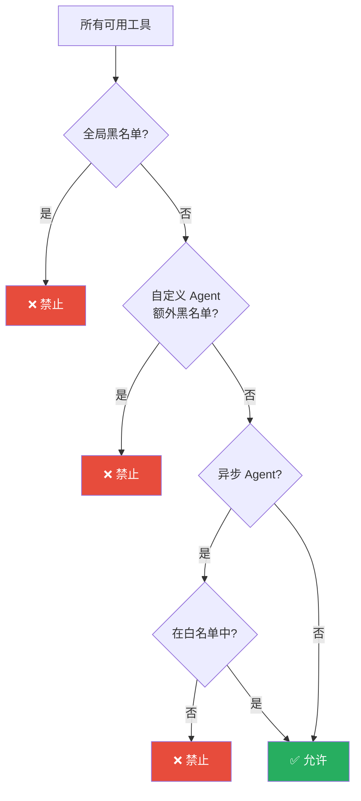
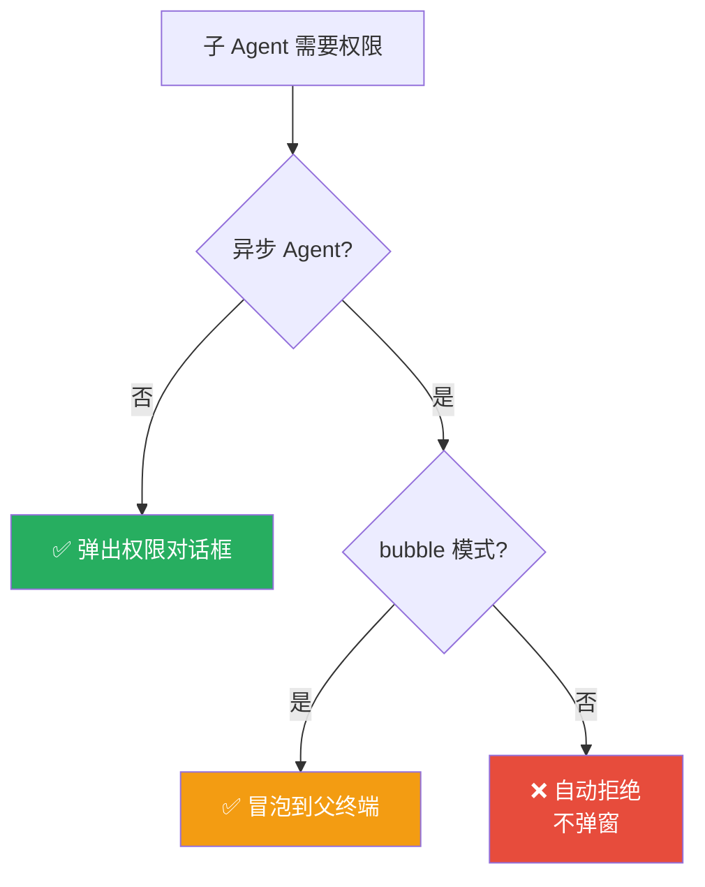
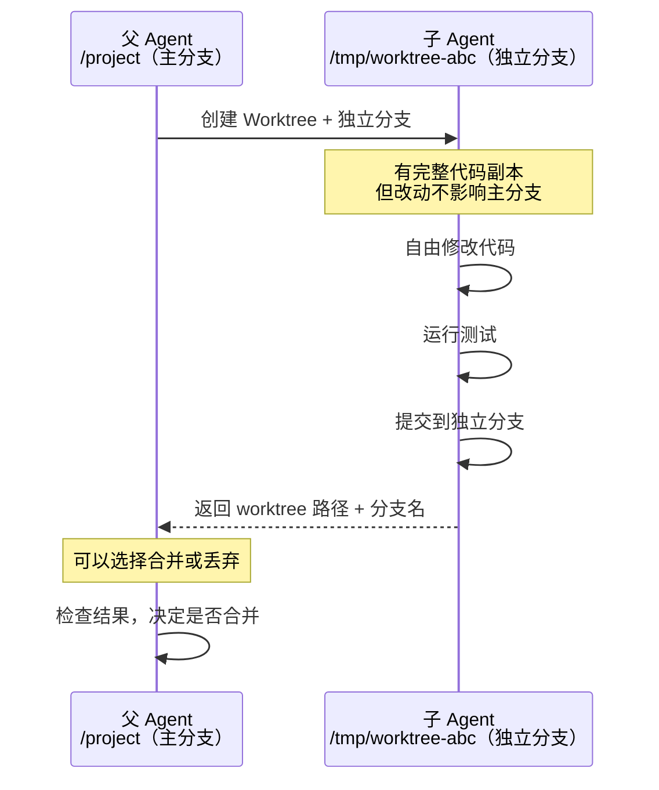
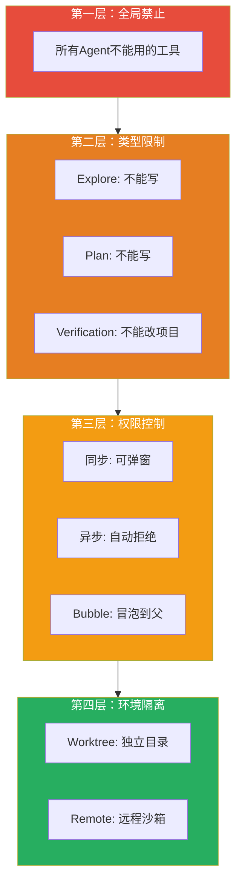

# 第4课：沙箱隔离 —— 子 Agent 的安全边界

> 🎯 理解 Claude Code 如何通过多层机制将子 Agent 限制在安全的"沙箱"中

---

## 📋 学习目标

学完本课，你将能够：

1. 解释什么是"沙箱隔离"及其在多 Agent 系统中的重要性
2. 说出 Claude Code 的四层安全隔离机制
3. 理解工具白名单/黑名单/全局禁用的具体实现
4. 解释异步 Agent 为什么有更严格的限制
5. 理解 Worktree 隔离和权限冒泡机制

---

## 🌟 通俗讲解：办公大楼门禁类比

想象一座公司大厦：

```
🏢 办公大楼（Claude Code 主进程）
│
├── 🔑 前台门禁（全局工具禁用列表）
│   └── 所有人都不能带危险物品进入
│
├── 🚪 楼层门禁（Agent 类型工具限制）
│   ├── 5楼-只读区：只能看资料，不能改任何东西
│   └── 8楼-开发区：可以改代码、运行命令
│
├── 🪪 个人工牌（Agent 权限模式）
│   ├── 正式员工：全权限
│   ├── 实习生：只读 + 需要审批
│   └── 远程员工：不能弹对话框
│
└── 🏗️ 独立工位（Worktree 隔离）
    └── 有些人在完全隔离的工位上工作
        改坏了也不影响主办公区
```

---

## 🔒 第一层：全局工具禁用

有些工具对**所有子 Agent** 都是禁止的，就像大楼禁止所有人携带的物品。

```typescript
// 来自 constants/tools.ts（被 agentToolUtils.ts 引用）

// 所有 Agent 都不能用的工具
export const ALL_AGENT_DISALLOWED_TOOLS = new Set([
  // 子 Agent 不应该管理 todo 列表、切换模式等
  // 这些是"主 Agent 专属"的管理类工具
])

// 自定义 Agent 额外不能用的工具
export const CUSTOM_AGENT_DISALLOWED_TOOLS = new Set([
  // 出于安全考虑，用户自定义的 Agent 比内置 Agent 限制更多
])
```

对应的过滤逻辑：

```typescript
// 来自 tools/AgentTool/agentToolUtils.ts

export function filterToolsForAgent({
  tools, isBuiltIn, isAsync, permissionMode
}) {
  return tools.filter(tool => {
    // ✅ MCP 工具始终允许（第三方扩展不受限制）
    if (tool.name.startsWith('mcp__')) return true
    
    // ❌ 全局黑名单 —— 所有 Agent 都不能用
    if (ALL_AGENT_DISALLOWED_TOOLS.has(tool.name)) return false
    
    // ❌ 自定义 Agent 的额外限制
    if (!isBuiltIn && CUSTOM_AGENT_DISALLOWED_TOOLS.has(tool.name))
      return false
    
    // ❌ 异步 Agent 的严格白名单
    if (isAsync && !ASYNC_AGENT_ALLOWED_TOOLS.has(tool.name))
      return false
    
    return true
  })
}
```



---

## 🔒 第二层：Agent 类型工具限制

每种 Agent 通过 `tools` 和 `disallowedTools` 定义自己的工具边界。

### 白名单模式（Allowlist）

```typescript
// GeneralPurpose Agent 用白名单 ['*'] —— 允许所有工具
export const GENERAL_PURPOSE_AGENT = {
  tools: ['*'],  // 通配符，代表所有工具
  // ...
}
```

### 黑名单模式（Denylist）

```typescript
// Explore Agent 用黑名单 —— 明确禁止某些工具
export const EXPLORE_AGENT = {
  disallowedTools: [
    AGENT_TOOL_NAME,        // 不能创建子 Agent
    FILE_EDIT_TOOL_NAME,    // 不能编辑文件
    FILE_WRITE_TOOL_NAME,   // 不能写入文件
    NOTEBOOK_EDIT_TOOL_NAME, // 不能编辑笔记本
  ],
  // ...
}
```

### 工具解析流程

```typescript
// 来自 tools/AgentTool/agentToolUtils.ts

export function resolveAgentTools(
  agentDefinition, availableTools, isAsync
) {
  // 第一步：应用全局过滤
  const filteredAvailableTools = filterToolsForAgent({
    tools: availableTools,
    isBuiltIn: source === 'built-in',
    isAsync,
  })

  // 第二步：应用 Agent 的黑名单
  const disallowedToolSet = new Set(disallowedTools ?? [])
  const allowedAvailableTools = filteredAvailableTools.filter(
    tool => !disallowedToolSet.has(tool.name),
  )

  // 第三步：如果有通配符，直接返回所有允许的工具
  if (hasWildcard) {
    return {
      hasWildcard: true,
      resolvedTools: allowedAvailableTools,
    }
  }

  // 第四步：否则只返回明确列出的工具
  // （验证每个工具名是否真的存在）
  for (const toolSpec of agentTools) {
    const tool = availableToolMap.get(toolName)
    if (tool) {
      resolved.push(tool)
    } else {
      invalidTools.push(toolSpec)  // 记录无效的工具名
    }
  }

  return { resolvedTools: resolved }
}
```

---

## 🔒 第三层：权限模式与弹窗控制

### 权限模式继承

```typescript
// 来自 tools/AgentTool/runAgent.ts

const agentGetAppState = () => {
  const state = toolUseContext.getAppState()
  let toolPermissionContext = state.toolPermissionContext

  // Agent 可以定义自己的权限模式
  if (agentPermissionMode &&
      // 但如果父已经是最高权限，不能降级
      state.toolPermissionContext.mode !== 'bypassPermissions' &&
      state.toolPermissionContext.mode !== 'acceptEdits') {
    toolPermissionContext = {
      ...toolPermissionContext,
      mode: agentPermissionMode,
    }
  }

  return { ...state, toolPermissionContext }
}
```

**类比**：就像公司里——如果老板（父 Agent）已经授权"全部放行"，那子 Agent 的权限不能低于这个级别。

### 异步 Agent 的特殊限制

```typescript
  // 异步 Agent 不能弹出权限确认对话框
  const shouldAvoidPrompts =
    canShowPermissionPrompts !== undefined
      ? !canShowPermissionPrompts
      : agentPermissionMode === 'bubble'
        ? false       // bubble 模式：可以冒泡到父的终端
        : isAsync     // 默认：异步不能弹窗

  if (shouldAvoidPrompts) {
    toolPermissionContext = {
      ...toolPermissionContext,
      shouldAvoidPermissionPrompts: true,
    }
  }
```



### 工具权限作用域

```typescript
  // 当指定了 allowedTools 时，子 Agent 只有这些权限
  // 父 Agent 的权限不会"泄漏"给子 Agent
  if (allowedTools !== undefined) {
    toolPermissionContext = {
      ...toolPermissionContext,
      alwaysAllowRules: {
        // 保留 SDK 级别的权限（命令行参数指定的）
        cliArg: state.toolPermissionContext.alwaysAllowRules.cliArg,
        // 子 Agent 自己的权限列表
        session: [...allowedTools],
      },
    }
  }
```

---

## 🔒 第四层：Worktree 隔离

Worktree 是最强的隔离机制——子 Agent 在一个**完全独立的 Git 工作目录**中操作。

```typescript
// 来自 loadAgentsDir.ts — Agent 定义中的 isolation 字段
type BaseAgentDefinition = {
  // ...
  isolation?: 'worktree' | 'remote'
  // worktree: 本地独立的 Git 工作目录
  // remote: 远程沙箱环境（内部使用）
}
```

### Worktree 的工作原理



### Fork Agent 中的 Worktree 通知

```typescript
// 来自 tools/AgentTool/forkSubagent.ts

export function buildWorktreeNotice(
  parentCwd: string,
  worktreeCwd: string,
): string {
  return `You've inherited the conversation context above from a parent
agent working in ${parentCwd}. You are operating in an isolated git
worktree at ${worktreeCwd} — same repository, same relative file
structure, separate working copy. Paths in the inherited context refer
to the parent's working directory; translate them to your worktree root.
Re-read files before editing if the parent may have modified them since
they appear in the context. Your changes stay in this worktree and will
not affect the parent's files.`
}
```

**关键点**：Worktree 中的 Agent 被明确告知——你的改动不会影响主项目。这既是安全保障，也是操作指南。

---

## 🛡️ 安全设计的多层防御

整体来看，Claude Code 的安全隔离是**深度防御**（Defense in Depth）的典范：



| 防御层 | 机制 | 保护什么 |
|--------|------|---------|
| 第一层 | 全局禁用 + 自定义额外禁用 | 防止危险操作 |
| 第二层 | Agent 类型的工具白/黑名单 | 限制能力范围 |
| 第三层 | 权限模式 + 弹窗控制 | 控制敏感操作的审批 |
| 第四层 | Worktree / Remote 隔离 | 防止改动污染主项目 |

---

## 🧹 资源清理：安全退出

隔离不仅是"进入时限制"，还包括"退出时清理"：

```typescript
// 来自 tools/AgentTool/runAgent.ts — finally 块

finally {
  // 关闭 Agent 专属的 MCP 服务器
  await mcpCleanup()
  
  // 清除注册的钩子
  clearSessionHooks(rootSetAppState, agentId)
  
  // 释放文件缓存内存
  agentToolUseContext.readFileState.clear()
  
  // 清空消息数组，释放内存
  initialMessages.length = 0
  
  // 清除 Agent 的 todo 条目（防止内存泄漏）
  rootSetAppState(prev => {
    const { [agentId]: _removed, ...todos } = prev.todos
    return { ...prev, todos }
  })
  
  // 终止 Agent 创建的后台 Shell 任务
  killShellTasksForAgent(agentId, ...)
}
```

**关键设计**：即使 Agent 崩溃或被取消，`finally` 块也确保所有资源被清理。就像员工离职，不管是主动辞职、被解雇还是合同到期，门禁卡都要收回。

---

## 🧪 动手练习

### 练习 1：安全审计

假设你是安全工程师，审计以下 Agent 配置是否安全：

```yaml
name: "code-deployer"
description: "部署代码到生产环境"
tools: ["*"]
permissionMode: "bypassPermissions"
isolation: null
```

列出你发现的安全问题（至少 3 个）。

<details>
<summary>💡 点击查看参考答案</summary>

1. `tools: ["*"]` —— 可以使用所有工具，权限过大
2. `permissionMode: "bypassPermissions"` —— 跳过所有权限检查，极其危险
3. `isolation: null` —— 没有隔离，直接操作主项目目录
4. 部署类操作应该有额外的审批流程
5. 应该至少使用 worktree 隔离，在独立分支上验证后再合并

</details>

### 练习 2：设计工具白名单

为以下场景设计合理的 Agent 工具配置：

1. 一个"文档生成器"Agent——只需要读代码、写 Markdown
2. 一个"代码格式化器"Agent——需要读取和编辑代码文件
3. 一个"安全扫描器"Agent——只需要读代码和运行检查命令

### 思考题

> 为什么异步 Agent 的工具白名单比同步 Agent 更严格？这与"用户控制感"有什么关系？

---

## 📝 本课小结

| 隔离层 | 一句话解释 |
|--------|-----------|
| 全局禁用 | 所有 Agent 都不能用的危险工具 |
| 类型限制 | 每种 Agent 有自己的工具能力边界 |
| 权限模式 | 控制敏感操作是否需要用户审批 |
| Worktree | 在独立的 Git 目录中工作，不污染主项目 |
| 资源清理 | finally 确保退出时释放所有资源 |

**核心要记住的三件事：**

1. 安全是多层防御——任何单层被突破，还有其他层保护
2. 异步 Agent 因为不能与用户交互，所以限制更严格
3. 资源清理（finally）是系统稳定性和安全性的最后防线

---

## 🔮 下节预告

**第5课：TeamCreateTool —— 团队组建机制**

我们将进入 Swarm 模式的世界：
- TeamCreateTool 如何创建一个团队
- 团队配置文件的结构
- Team Lead 和 Teammate 的角色划分
- 任务列表如何与团队关联
- 为什么"一个领导只能管一个团队"

从单兵作战走向团队协作！
