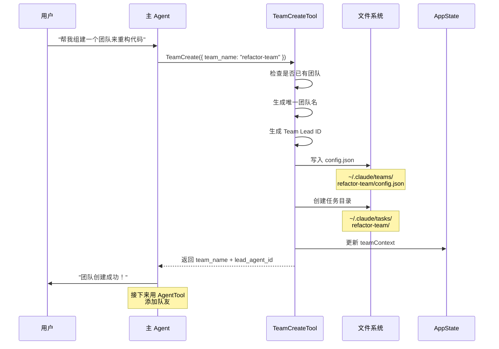
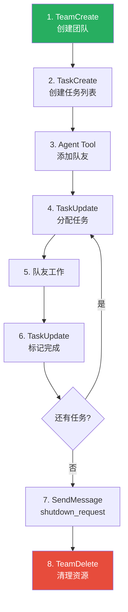

# 第5课：TeamCreateTool —— 团队组建机制

> 🎯 理解 Swarm 模式的起点：如何创建一个多 Agent 协作团队

---

## 📋 学习目标

学完本课，你将能够：

1. 说出 TeamCreateTool 创建团队的完整流程
2. 理解团队配置文件（TeamFile）的结构
3. 解释 Team Lead 和 Teammate 的角色区别
4. 理解任务列表与团队的 1:1 对应关系
5. 知道团队生命周期的完整管理机制

---

## 🌟 通俗讲解：创业公司类比

创建一个 Swarm 团队，就像**注册一个创业公司**：

```
1. 📝 注册公司名 → 创建团队（team_name）
2. 👨‍💼 CEO 入职 → Team Lead 就位
3. 📁 建立档案室 → 创建团队配置文件（config.json）
4. 📋 设立项目看板 → 创建任务列表目录（tasks/）
5. 🎨 分配工牌颜色 → 分配 UI 颜色
6. 🏢 开始招人 → 通过 Agent Tool 添加队友
```

---

## 📂 TeamCreateTool 源码全貌

### 输入参数

```typescript
// 来自 tools/TeamCreateTool/TeamCreateTool.ts

const inputSchema = z.strictObject({
  team_name: z.string()
    .describe('Name for the new team to create.'),
  description: z.string().optional()
    .describe('Team description/purpose.'),
  agent_type: z.string().optional()
    .describe('Type/role of the team lead'),
})
```

就这三个参数：
- `team_name`：团队名称（必填）
- `description`：团队描述（选填）
- `agent_type`：Team Lead 的类型（选填）

### 核心创建流程

```typescript
// 来自 tools/TeamCreateTool/TeamCreateTool.ts — call 函数

async call(input, context) {
  const { setAppState, getAppState } = context
  const { team_name, description, agent_type } = input

  // 🔒 检查 1：一个领导只能管一个团队
  const existingTeam = appState.teamContext?.teamName
  if (existingTeam) {
    throw new Error(
      `Already leading team "${existingTeam}".
       A leader can only manage one team at a time.
       Use TeamDelete to end the current team before creating a new one.`
    )
  }

  // 🔤 检查 2：如果名称已存在，自动生成唯一名称
  const finalTeamName = generateUniqueTeamName(team_name)

  // 🆔 生成 Team Lead 的 Agent ID
  const leadAgentId = formatAgentId(TEAM_LEAD_NAME, finalTeamName)
  const leadAgentType = agent_type || TEAM_LEAD_NAME

  // 📄 获取 Team Lead 的模型信息
  const leadModel = parseUserSpecifiedModel(
    appState.mainLoopModelForSession ??
    appState.mainLoopModel ??
    getDefaultMainLoopModel()
  )

  // ...
}
```

### 创建团队配置文件

```typescript
  // 📁 构建团队配置
  const teamFile: TeamFile = {
    name: finalTeamName,
    description: description,
    createdAt: Date.now(),
    leadAgentId,
    leadSessionId: getSessionId(),
    members: [
      {
        agentId: leadAgentId,
        name: TEAM_LEAD_NAME,        // "team-lead"
        agentType: leadAgentType,
        model: leadModel,
        joinedAt: Date.now(),
        tmuxPaneId: '',
        cwd: getCwd(),
        subscriptions: [],
      },
    ],
  }

  // 写入磁盘：~/.claude/teams/{team-name}/config.json
  await writeTeamFileAsync(finalTeamName, teamFile)
  
  // 注册到会话清理——确保会话结束时清除
  registerTeamForSessionCleanup(finalTeamName)
```

### 创建关联的任务列表

```typescript
  // 📋 创建任务列表目录
  // 团队 = 项目 = 任务列表（1:1 对应）
  const taskListId = sanitizeName(finalTeamName)
  await resetTaskList(taskListId)
  await ensureTasksDir(taskListId)

  // 注册团队名，让 getTaskListId() 能找到正确的任务目录
  setLeaderTeamName(sanitizeName(finalTeamName))
```

### 更新应用状态

```typescript
  // 🔄 更新全局状态
  setAppState(prev => ({
    ...prev,
    teamContext: {
      teamName: finalTeamName,
      teamFilePath,
      leadAgentId,
      teammates: {
        [leadAgentId]: {
          name: TEAM_LEAD_NAME,
          agentType: leadAgentType,
          color: assignTeammateColor(leadAgentId),
          tmuxSessionName: '',
          tmuxPaneId: '',
          cwd: getCwd(),
          spawnedAt: Date.now(),
        },
      },
    },
  }))
```

---

## 📊 团队创建的完整流程



---

## 📁 文件系统中的团队

创建团队后，文件系统中会出现以下结构：

```
~/.claude/
├── teams/
│   └── refactor-team/
│       └── config.json       # 团队配置
│           ├── name
│           ├── description
│           ├── leadAgentId
│           ├── members[]
│           │   ├── [0] team-lead
│           │   ├── [1] researcher（后续加入）
│           │   └── [2] implementer（后续加入）
│           └── createdAt
│
├── tasks/
│   └── refactor-team/        # 团队的任务列表
│       ├── task-1.json
│       ├── task-2.json
│       └── task-3.json
│
└── mailboxes/                # 消息邮箱（后续课程详解）
    └── refactor-team/
        ├── team-lead/
        ├── researcher/
        └── implementer/
```

---

## 👥 Team Lead vs Teammate

### Team Lead（队长）

Team Lead 就是**创建团队的那个主 Agent**。它的特殊之处：

```typescript
// Team Lead 的 ID 是确定性的，不是随机的
const leadAgentId = formatAgentId(TEAM_LEAD_NAME, finalTeamName)
// 例如：team-lead@refactor-team

// Team Lead 不设置 CLAUDE_CODE_AGENT_ID 环境变量
// 原因：isTeammate() 对它应该返回 false
// 它是"领导"，不是"队友"
```

### Teammate（队友）

队友通过 AgentTool 创建，加入团队：

```
// 主 Agent 使用 AgentTool 创建队友
Agent({
  name: "researcher",
  team_name: "refactor-team",
  subagent_type: "general-purpose",
  prompt: "搜索所有需要重构的文件..."
})
```

### 角色对比

| 维度 | Team Lead | Teammate |
|------|-----------|----------|
| 身份 | 创建团队的主 Agent | 被 AgentTool 创建的子 Agent |
| ID 生成 | 确定性（`team-lead@teamName`） | 随机生成 |
| `isTeammate()` | `false` | `true` |
| 能否创建团队 | ✅ | ❌ |
| 能否发消息 | ✅ | ✅ |
| 消息接收 | 自动投递 | 自动投递 |
| 生命周期 | 与会话一致 | 可被关闭和重启 |

---

## 🎨 团队工作流程

TeamCreateTool 的提示词定义了完整的团队工作流：

```typescript
// 来自 tools/TeamCreateTool/prompt.ts

// 标准团队工作流
// 1. 创建团队（TeamCreate）
// 2. 创建任务（TaskCreate）
// 3. 添加队友（Agent tool + team_name + name）
// 4. 分配任务（TaskUpdate + owner）
// 5. 队友工作并完成任务（TaskUpdate）
// 6. 队友空闲时自动通知
// 7. 任务完成后关闭团队（SendMessage + shutdown_request）
```



---

## 🧹 TeamDeleteTool：优雅解散

创建团队有 TeamCreate，解散团队有 TeamDelete：

```typescript
// 来自 tools/TeamDeleteTool/TeamDeleteTool.ts

async call(_input, context) {
  const teamName = appState.teamContext?.teamName

  if (teamName) {
    const teamFile = readTeamFile(teamName)
    if (teamFile) {
      // 检查是否还有活跃的队友
      const activeMembers = nonLeadMembers.filter(
        m => m.isActive !== false
      )
      
      // 如果还有人在工作，不能解散
      if (activeMembers.length > 0) {
        return {
          data: {
            success: false,
            message: `Cannot cleanup team with ${activeMembers.length}
              active member(s): ${memberNames}.
              Use requestShutdown to gracefully terminate first.`,
          },
        }
      }
    }

    // 清理文件系统
    await cleanupTeamDirectories(teamName)
    
    // 清除颜色分配
    clearTeammateColors()
    
    // 清除团队名称注册
    clearLeaderTeamName()
  }

  // 清除 AppState 中的团队上下文
  setAppState(prev => ({
    ...prev,
    teamContext: undefined,
    inbox: { messages: [] },
  }))
}
```

**关键设计**：不能在队友还在工作时强行解散团队。必须先发 `shutdown_request` 让每个队友确认后才能解散。这就像公司解散前必须先妥善处理所有员工的离职手续。

---

## 🔑 设计要点解析

### 为什么一个领导只能管一个团队？

```typescript
if (existingTeam) {
  throw new Error(
    `Already leading team "${existingTeam}".
     A leader can only manage one team at a time.`
  )
}
```

**原因**：
1. **状态简单性** —— 每个会话只有一个 `teamContext`
2. **避免混乱** —— 多个团队会导致消息路由变得复杂
3. **资源管理** —— 一个团队的生命周期更容易追踪和清理

### 为什么需要 registerTeamForSessionCleanup？

```typescript
registerTeamForSessionCleanup(finalTeamName)
```

这确保了：即使用户直接关闭终端（没有显式调用 TeamDelete），团队的配置文件也会在会话结束时被自动清理，不留下垃圾文件。

### 唯一名称生成

```typescript
function generateUniqueTeamName(providedName: string): string {
  if (!readTeamFile(providedName)) {
    return providedName  // 名称不存在，直接用
  }
  return generateWordSlug()  // 名称已存在，生成随机名
}
```

不是报错——而是优雅地生成一个新名称。对用户友好！

---

## 🧪 动手练习

### 练习 1：追踪文件创建

根据 TeamCreateTool 的代码，回答：

1. `config.json` 文件存储在什么路径？
2. 任务列表目录在什么路径？
3. Team Lead 的 `agentId` 格式是什么？

<details>
<summary>💡 点击查看答案</summary>

1. `~/.claude/teams/{team-name}/config.json`
2. `~/.claude/tasks/{team-name}/`
3. `team-lead@{team-name}` （由 `formatAgentId(TEAM_LEAD_NAME, finalTeamName)` 生成）

</details>

### 练习 2：画出 TeamFile 结构

根据源码中的 `teamFile` 对象，画出完整的 JSON 结构（包括一个 Team Lead 和两个队友 researcher、implementer）。

### 练习 3：错误处理

以下哪些操作会导致 TeamCreate 失败？

1. 团队名称为空字符串
2. 提供了一个已存在的团队名称
3. 当前会话已经有一个团队
4. 不提供 description 参数

<details>
<summary>💡 点击查看答案</summary>

1. ✅ 会失败——`validateInput` 检查 `team_name.trim().length === 0`
2. ❌ 不会失败——会自动生成唯一名称
3. ✅ 会失败——一个领导只能管一个团队
4. ❌ 不会失败——`description` 是可选参数

</details>

### 思考题

> 为什么 TeamDeleteTool 要求先关闭所有活跃的队友才能解散团队？如果允许直接解散会有什么后果？

---

## 📝 本课小结

| 概念 | 一句话解释 |
|------|-----------|
| TeamCreateTool | 创建 Swarm 团队的入口 |
| TeamFile | 存储在磁盘上的团队配置（config.json） |
| Team Lead | 创建团队的主 Agent，非 Teammate 身份 |
| Teammate | 通过 AgentTool 创建并加入团队的成员 |
| 任务列表 | 与团队 1:1 对应的共享任务管理 |
| TeamDeleteTool | 优雅解散团队并清理资源 |

**核心要记住的三件事：**

1. 团队创建会在文件系统中创建 config.json 和 tasks 目录
2. 一个领导一次只能管一个团队，确保状态简单性
3. 团队解散必须先关闭所有队友——优雅退出而非强制关闭

---

## 🔮 下节预告

**第6课：SendMessageTool —— Agent 间通信详解**

团队创建好了，队友也到齐了，那他们怎么"说话"呢？下一课我们将深入：
- SendMessage 的六种消息路由方式
- 邮箱机制：消息如何投递和接收
- 结构化消息：shutdown_request 和 plan_approval
- 广播机制：一条消息发给所有人
- 消息与 Agent 恢复（resume）的关联

从"组队"走向"协作"！
