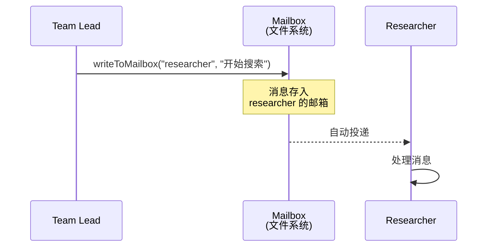
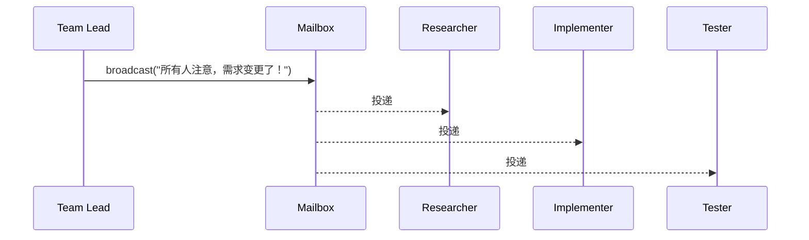
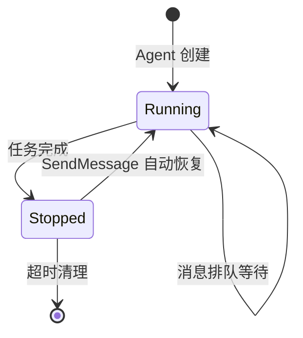
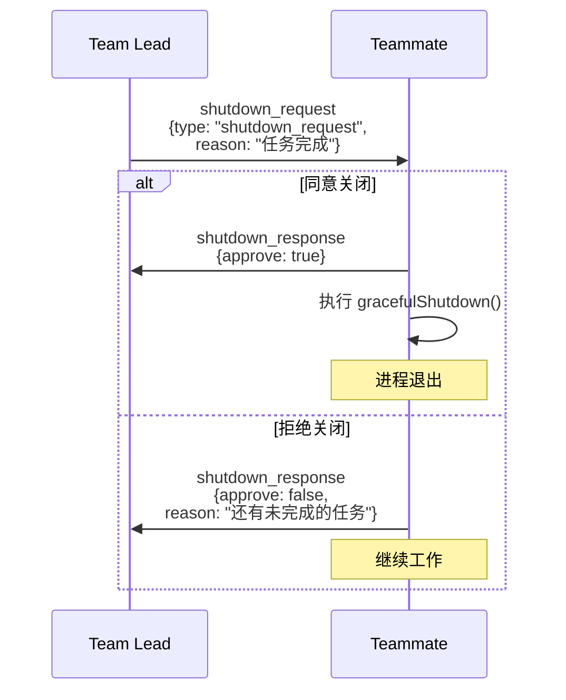
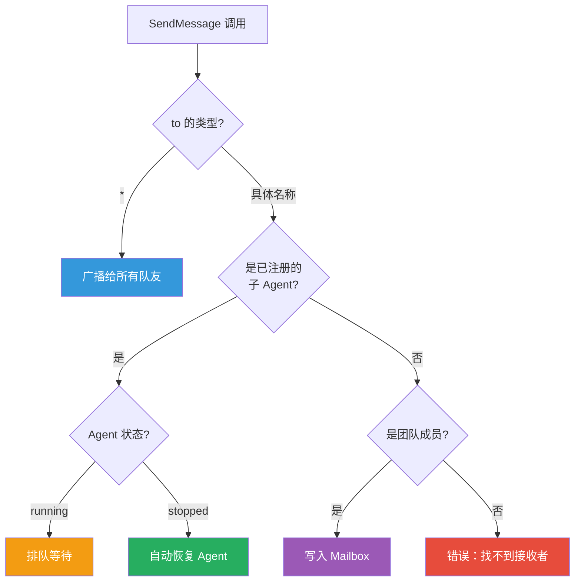

# 第6课：SendMessageTool —— Agent 间通信详解

> 🎯 理解多 Agent 系统的"神经系统"——消息如何在 Agent 之间流动

---

## 📋 学习目标

学完本课，你将能够：

1. 说出 SendMessageTool 支持的所有消息类型
2. 理解邮箱（Mailbox）机制的工作原理
3. 区分普通消息、广播消息和结构化消息
4. 理解消息发送如何触发 Agent 的恢复（resume）
5. 掌握 shutdown 协议的完整握手流程

---

## 🌟 通俗讲解：公司内部通信类比

Agent 间通信就像公司的**内部通信系统**：

| 通信方式 | 对应的 SendMessage 功能 |
|---------|----------------------|
| 发微信给同事 | `to: "researcher"` —— 点对点消息 |
| 群发公告 | `to: "*"` —— 广播消息 |
| 发关停通知 | `shutdown_request` —— 结构化消息 |
| 审批工作流 | `plan_approval_response` —— 审批响应 |
| 公司内网信箱 | Mailbox 机制 —— 消息存储和投递 |

---

## 📂 SendMessageTool 输入结构

```typescript
// 来自 tools/SendMessageTool/SendMessageTool.ts

const inputSchema = z.object({
  to: z.string().describe(
    'Recipient: teammate name, or "*" for broadcast'
  ),
  summary: z.string().optional().describe(
    'A 5-10 word summary shown as a preview in the UI'
  ),
  message: z.union([
    z.string().describe('Plain text message content'),
    StructuredMessage(),  // 结构化消息
  ]),
})
```

### 三种消息类型

```mermaid
graph TB
    SM[SendMessage] --> Plain[纯文本消息<br/>message: "请开始任务1"]
    SM --> Structured[结构化消息]
    Structured --> Shutdown[shutdown_request<br/>请求关闭]
    Structured --> ShutdownResp[shutdown_response<br/>回复关闭请求]
    Structured --> PlanApproval[plan_approval_response<br/>方案审批]
```

### 结构化消息的定义

```typescript
const StructuredMessage = z.discriminatedUnion('type', [
  z.object({
    type: z.literal('shutdown_request'),
    reason: z.string().optional(),
  }),
  z.object({
    type: z.literal('shutdown_response'),
    request_id: z.string(),
    approve: z.boolean(),
    reason: z.string().optional(),
  }),
  z.object({
    type: z.literal('plan_approval_response'),
    request_id: z.string(),
    approve: z.boolean(),
    feedback: z.string().optional(),
  }),
])
```

---

## 📬 消息路由：谁发给谁？

### 路由 1：点对点消息

```typescript
// 来自 SendMessageTool.ts — handleMessage 函数

async function handleMessage(
  recipientName, content, summary, context
) {
  const senderName = getAgentName() || TEAM_LEAD_NAME
  const senderColor = getTeammateColor()

  // 将消息写入接收者的邮箱
  await writeToMailbox(
    recipientName,
    {
      from: senderName,
      text: content,
      summary,
      timestamp: new Date().toISOString(),
      color: senderColor,
    },
    teamName,
  )

  return {
    data: {
      success: true,
      message: `Message sent to ${recipientName}'s inbox`,
      routing: {
        sender: senderName,
        target: `@${recipientName}`,
        summary,
        content,
      },
    },
  }
}
```



### 路由 2：广播消息

```typescript
// 来自 SendMessageTool.ts — handleBroadcast 函数

async function handleBroadcast(content, summary, context) {
  const teamFile = await readTeamFileAsync(teamName)
  
  // 获取所有队友（排除自己）
  const recipients = []
  for (const member of teamFile.members) {
    if (member.name.toLowerCase() === senderName.toLowerCase()) {
      continue  // 不给自己发
    }
    recipients.push(member.name)
  }

  // 给每个人写入邮箱
  for (const recipientName of recipients) {
    await writeToMailbox(
      recipientName,
      { from: senderName, text: content, summary, ... },
      teamName,
    )
  }

  return {
    data: {
      success: true,
      message: `Message broadcast to ${recipients.length} teammate(s)`,
      recipients,
    },
  }
}
```



### 路由 3：发送给已注册的子 Agent（自动恢复）

这是一个特别精妙的设计——发消息给一个已经完成工作的子 Agent 会**自动恢复**它：

```typescript
// 来自 SendMessageTool.ts — call 函数中的路由逻辑

if (typeof input.message === 'string' && input.to !== '*') {
  const appState = context.getAppState()
  const registered = appState.agentNameRegistry.get(input.to)
  const agentId = registered ?? toAgentId(input.to)
  
  if (agentId) {
    const task = appState.tasks[agentId]
    
    if (isLocalAgentTask(task) && !isMainSessionTask(task)) {
      if (task.status === 'running') {
        // Agent 正在运行 → 消息排队等待
        queuePendingMessage(agentId, input.message, ...)
        return { data: {
          success: true,
          message: `Message queued for delivery to ${input.to}`
        }}
      }
      
      // Agent 已停止 → 自动恢复！
      const result = await resumeAgentBackground({
        agentId,
        prompt: input.message,
        toolUseContext: context,
        canUseTool,
      })
      return { data: {
        success: true,
        message: `Agent "${input.to}" was stopped;
          resumed it in the background with your message.`
      }}
    }
  }
}
```



---

## 🤝 Shutdown 协议：优雅关闭

Shutdown 是一个**两阶段握手协议**，确保 Agent 不会在工作进行中被强制关闭。

### 阶段 1：发送关闭请求

```typescript
async function handleShutdownRequest(targetName, reason, context) {
  const requestId = generateRequestId('shutdown', targetName)

  const shutdownMessage = createShutdownRequestMessage({
    requestId,
    from: senderName,
    reason,
  })

  await writeToMailbox(targetName, {
    from: senderName,
    text: JSON.stringify(shutdownMessage),
    timestamp: new Date().toISOString(),
  }, teamName)

  return {
    data: {
      success: true,
      message: `Shutdown request sent to ${targetName}`,
      request_id: requestId,
      target: targetName,
    },
  }
}
```

### 阶段 2：处理关闭确认

```typescript
async function handleShutdownApproval(requestId, context) {
  const agentName = getAgentName() || 'teammate'

  // 告知 Team Lead："我同意关闭"
  const approvedMessage = createShutdownApprovedMessage({
    requestId,
    from: agentName,
    paneId: ownPaneId,
  })

  await writeToMailbox(TEAM_LEAD_NAME, {
    from: agentName,
    text: JSON.stringify(approvedMessage),
    timestamp: new Date().toISOString(),
  }, teamName)

  // 对于进程内队友：发送中止信号
  if (ownBackendType === 'in-process') {
    const task = findTeammateTaskByAgentId(agentId, appState.tasks)
    if (task?.abortController) {
      task.abortController.abort()
    }
  } else {
    // 对于独立进程队友：优雅退出
    setImmediate(async () => {
      await gracefulShutdown(0, 'other')
    })
  }
}
```

### Shutdown 也可以被拒绝

```typescript
async function handleShutdownRejection(requestId, reason) {
  // 告知 Team Lead："我不同意关闭，因为..."
  const rejectedMessage = createShutdownRejectedMessage({
    requestId,
    from: agentName,
    reason,
  })

  await writeToMailbox(TEAM_LEAD_NAME, {
    from: agentName,
    text: JSON.stringify(rejectedMessage),
  }, teamName)

  return {
    data: {
      message: `Shutdown rejected. Reason: "${reason}". Continuing.`,
    },
  }
}
```

### 完整的 Shutdown 流程



---

## ✅ 方案审批机制

除了 Shutdown，还有**方案审批**流程：

```typescript
async function handlePlanApproval(recipientName, requestId, context) {
  // 只有 Team Lead 才能审批
  if (!isTeamLead(appState.teamContext)) {
    throw new Error(
      'Only the team lead can approve plans.'
    )
  }

  // 审批通过时，还会传递权限模式
  const leaderMode = appState.toolPermissionContext.mode
  const modeToInherit = leaderMode === 'plan' ? 'default' : leaderMode

  const approvalResponse = {
    type: 'plan_approval_response',
    requestId,
    approved: true,
    permissionMode: modeToInherit,  // 传递权限
  }

  await writeToMailbox(recipientName, {
    from: TEAM_LEAD_NAME,
    text: JSON.stringify(approvalResponse),
  }, teamName)
}
```

---

## 🔐 输入验证：安全守卫

SendMessageTool 有严格的输入验证：

```typescript
async validateInput(input, _context) {
  // 1. to 不能为空
  if (input.to.trim().length === 0) {
    return { result: false, message: 'to must not be empty' }
  }

  // 2. 不能包含 @ 符号（每个会话只有一个团队）
  if (input.to.includes('@')) {
    return { result: false,
      message: 'to must be a bare teammate name or "*"' }
  }

  // 3. 纯文本消息必须有 summary
  if (typeof input.message === 'string') {
    if (!input.summary || input.summary.trim().length === 0) {
      return { result: false,
        message: 'summary is required when message is a string' }
    }
  }

  // 4. 结构化消息不能广播
  if (input.to === '*' && typeof input.message !== 'string') {
    return { result: false,
      message: 'structured messages cannot be broadcast' }
  }

  // 5. shutdown_response 只能发给 team-lead
  if (input.message.type === 'shutdown_response'
      && input.to !== TEAM_LEAD_NAME) {
    return { result: false,
      message: `shutdown_response must be sent to "team-lead"` }
  }

  // 6. 拒绝 shutdown 时必须给出理由
  if (input.message.type === 'shutdown_response'
      && !input.message.approve
      && !input.message.reason) {
    return { result: false,
      message: 'reason is required when rejecting shutdown' }
  }
}
```

---

## 📊 消息路由总览



---

## 🧪 动手练习

### 练习 1：消息路由判断

对以下每个 SendMessage 调用，判断会走哪条路由：

```json
// A
{"to": "*", "summary": "新需求", "message": "需求变更了"}

// B  
{"to": "researcher", "summary": "开始", "message": "开始任务1"}

// C
{"to": "team-lead", "message": {"type": "shutdown_response", "request_id": "xxx", "approve": true}}

// D
{"to": "agent-abc123", "summary": "继续", "message": "修复刚才的bug"}
```

<details>
<summary>💡 点击查看答案</summary>

- A → **广播路由**（to 是 "*"）
- B → **点对点 Mailbox 路由**（纯文本消息给队友）
- C → **Shutdown 确认处理**（结构化消息，approve=true）
- D → **子 Agent 路由**（可能触发自动恢复）

</details>

### 练习 2：Shutdown 协议模拟

画出以下场景的完整消息流：

> Team Lead 想关闭 researcher。researcher 说"还有一个文件没分析完"并拒绝。Team Lead 等它完成后再次请求关闭，这次 researcher 同意了。

### 思考题

> SendMessage 要求纯文本消息必须有 `summary`，但结构化消息不需要。为什么？提示：想想 UI 中消息预览的显示需求。

---

## 📝 本课小结

| 概念 | 一句话解释 |
|------|-----------|
| 点对点消息 | 发送到指定队友的 Mailbox |
| 广播消息 | 发送给所有队友（排除自己） |
| 结构化消息 | shutdown/plan_approval 等协议消息 |
| 自动恢复 | 给已停止的 Agent 发消息会唤醒它 |
| Shutdown 握手 | 两阶段协议：请求 → 确认/拒绝 |
| Mailbox | 基于文件系统的消息队列 |

**核心要记住的三件事：**

1. SendMessage 是多 Agent 通信的唯一通道——"你的纯文本输出对其他 Agent 不可见"
2. 消息路由优先匹配已注册子 Agent（支持自动恢复），然后才走 Mailbox
3. Shutdown 是两阶段握手，队友可以拒绝——这保证了工作不会被中途强制打断

---

## 🔮 下节预告

**第7课：四种消息路由模式深入**

我们将更深入地探索消息路由的细节：
- Coordinator 模式中的 task-notification 机制
- Swarm 模式中的 Mailbox 轮询机制
- 跨会话消息（UDS 和 Bridge）
- 消息的优先级和排队策略

从"发消息"走向"理解消息网络"！
