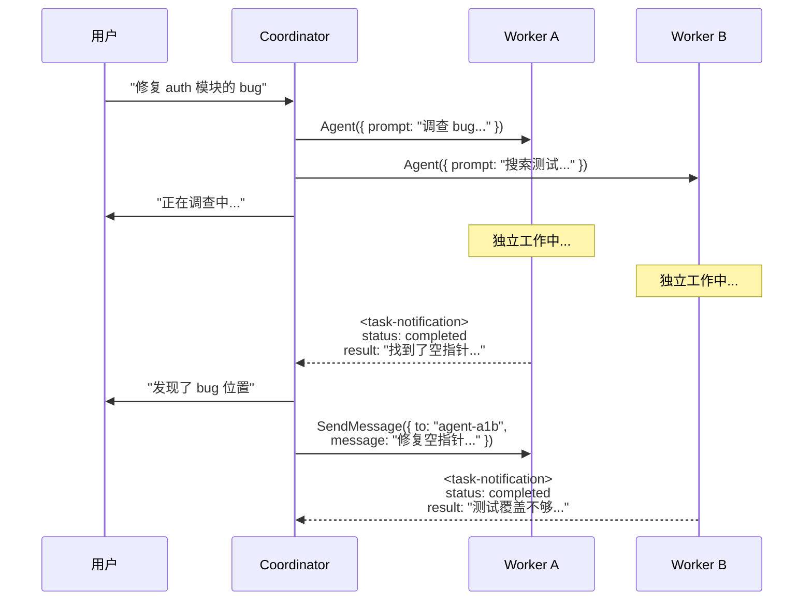
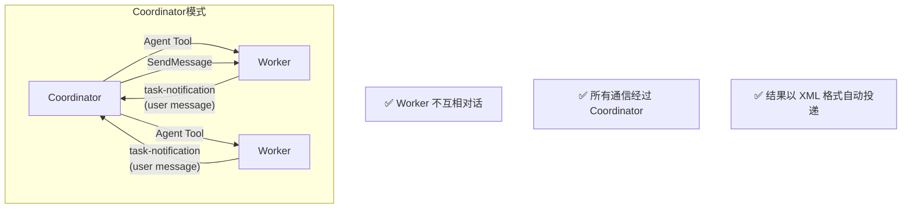
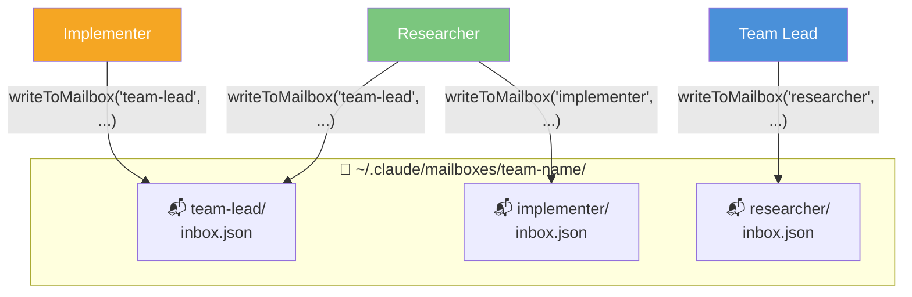
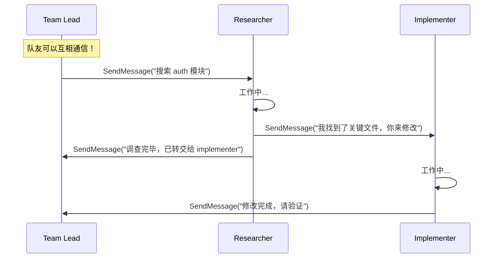
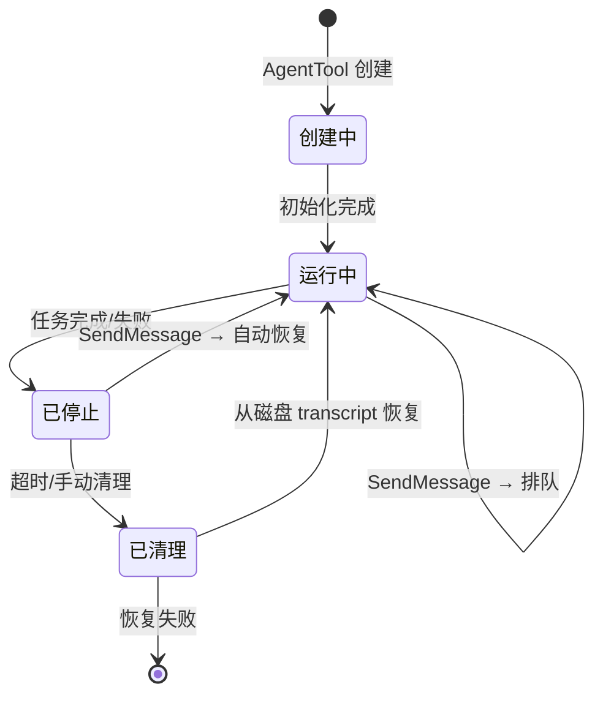
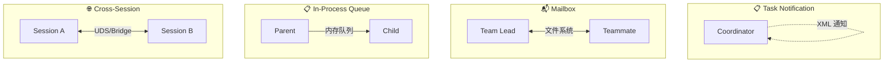

# 第7课：四种消息路由模式深入

> 🎯 全面理解 Claude Code 中消息的流转方式和底层机制

---

## 📋 学习目标

学完本课，你将能够：

1. 详细区分四种消息路由模式的工作原理
2. 理解 Coordinator 模式中的 task-notification 机制
3. 理解 Swarm 模式中的 Mailbox 轮询机制
4. 了解跨会话消息的 UDS 和 Bridge 机制
5. 理解子 Agent 的消息排队和自动恢复策略

---

## 🌟 通俗讲解：快递配送类比

四种消息路由就像四种不同的"快递配送方式"：

| 路由模式 | 快递类比 | 适用场景 |
|---------|---------|---------|
| **task-notification** | 快递柜自提通知 | Coordinator 模式 |
| **Mailbox** | 公司内部信箱 | Swarm 模式 |
| **In-process Queue** | 工位上递纸条 | 进程内子 Agent |
| **Cross-session** | 跨公司快递 | 不同 Claude 会话间 |

---

## 📮 模式一：Task Notification（Coordinator 模式）

在 Coordinator 模式中，Worker 完成工作后，结果通过 **task-notification** 以"用户消息"的形式自动投递给 Coordinator。

### 通知的 XML 格式

```typescript
// 来自 coordinator/coordinatorMode.ts 中描述的格式

// Worker 完成后，通知会变成这样的 XML：
`<task-notification>
<task-id>{agentId}</task-id>
<status>completed|failed|killed</status>
<summary>{human-readable status summary}</summary>
<result>{agent's final text response}</result>
<usage>
  <total_tokens>N</total_tokens>
  <tool_uses>N</tool_uses>
  <duration_ms>N</duration_ms>
</usage>
</task-notification>`
```

### 工作流程



### 关键特点



| 特点 | 说明 |
|------|------|
| 通信方向 | 星形——都经过 Coordinator |
| 结果格式 | XML `<task-notification>` |
| 投递方式 | 自动注入为 user message |
| Worker 间通信 | ❌ 不支持 |
| 继续 Worker | 用 `SendMessage({ to: agentId })` |

---

## 📬 模式二：Mailbox（Swarm 模式）

在 Swarm 模式中，消息通过**基于文件系统的邮箱**传递。每个队友有自己的邮箱目录。

### Mailbox 的工作原理



### 消息投递的核心代码

```typescript
// 来自 SendMessageTool.ts — handleMessage

await writeToMailbox(
  recipientName,
  {
    from: senderName,       // 发送者名称
    text: content,           // 消息内容
    summary,                 // 摘要（UI 预览用）
    timestamp: new Date().toISOString(),
    color: senderColor,      // 发送者的 UI 颜色
  },
  teamName,
)
```

### Swarm 模式的消息流



### 与 Coordinator 模式的关键区别

| 维度 | Coordinator 通知 | Swarm Mailbox |
|------|-----------------|---------------|
| 通信拓扑 | 星形（只过 Coordinator） | 网状（任意对任意） |
| 投递机制 | 自动注入 user message | 写入文件系统邮箱 |
| 消息格式 | XML task-notification | JSON 邮箱条目 |
| 接收方式 | 被动接收 | 轮询检查 |
| 队友间直接通信 | ❌ | ✅ |

---

## 📋 模式三：进程内消息队列

对于在同一进程中运行的子 Agent（in-process），有一个更高效的消息传递方式——直接操作内存中的消息队列。

### 消息排队

```typescript
// 来自 SendMessageTool.ts — call 函数

if (isLocalAgentTask(task) && !isMainSessionTask(task)) {
  if (task.status === 'running') {
    // Agent 正在运行 → 消息直接排队
    // 不经过文件系统，直接放入内存队列
    queuePendingMessage(
      agentId,
      input.message,
      context.setAppStateForTasks ?? context.setAppState,
    )
    return {
      data: {
        success: true,
        message: `Message queued for delivery to ${input.to}
          at its next tool round.`,
      },
    }
  }
}
```

### 自动恢复机制

```typescript
  // Agent 已停止 → 自动恢复它
  try {
    const result = await resumeAgentBackground({
      agentId,
      prompt: input.message,
      toolUseContext: context,
      canUseTool,
      invokingRequestId: assistantMessage?.requestId,
    })
    return {
      data: {
        success: true,
        message: `Agent "${input.to}" was stopped (${task.status});
          resumed it in the background with your message.`,
      },
    }
  } catch (e) {
    return {
      data: {
        success: false,
        message: `Agent "${input.to}" is stopped and could not
          be resumed: ${errorMessage(e)}`,
      },
    }
  }
```

### 状态机



---

## 🌐 模式四：跨会话消息

Claude Code 还支持跨越不同会话的消息传递，这对应更高级的使用场景。

### UDS（Unix Domain Socket）模式

```typescript
// 来自 SendMessageTool/prompt.ts

// UDS 通过本地 Unix Socket 通信
// 适用于同一台机器上的不同 Claude Code 会话
`{"to": "uds:/tmp/cc-socks/1234.sock",
  "message": "check if tests pass over there"}`
```

### Bridge 模式

```typescript
// Bridge 通过 Anthropic 服务器中转
// 适用于不同机器上的 Claude Code 会话
`{"to": "bridge:session_01AbCd...",
  "message": "what branch are you on?"}`
```

### 跨会话消息的安全检查

```typescript
// 来自 SendMessageTool.ts — checkPermissions

async checkPermissions(input, _context) {
  if (parseAddress(input.to).scheme === 'bridge') {
    return {
      behavior: 'ask',
      message: `Send a message to Remote Control session ${input.to}?
        It arrives as a user prompt on the receiving Claude
        (possibly another machine) via Anthropic's servers.`,
      decisionReason: {
        type: 'safetyCheck',
        reason: 'Cross-machine bridge message requires explicit consent',
        classifierApprovable: false,  // 不能被自动审批
      },
    }
  }
  return { behavior: 'allow', updatedInput: input }
}
```

**关键安全设计**：跨机器的消息**必须用户明确同意**，而且不能被自动分类器审批。这防止了跨机器的提示注入攻击。

---

## 📊 四种路由模式全面对比



| 维度 | Task Notification | Mailbox | In-Process | Cross-Session |
|------|------------------|---------|------------|--------------|
| **适用模式** | Coordinator | Swarm | 两者皆可 | 高级场景 |
| **通信介质** | 内存（user msg） | 文件系统 | 内存队列 | Socket/HTTP |
| **延迟** | 低 | 中 | 最低 | 高 |
| **持久性** | 否 | 是 | 否 | 是 |
| **安全审查** | 否 | 否 | 否 | 需用户同意 |
| **支持恢复** | 是 | 是 | 是 | 否 |
| **拓扑** | 星形 | 网状 | 父→子 | 点对点 |

---

## 🔄 消息的投递保障

### 自动投递 vs 手动检查

```typescript
// 来自 TeamCreateTool/prompt.ts — 关于消息投递的说明

// IMPORTANT: 消息从队友那里自动投递给你。
// 你不需要手动检查你的收件箱。
//
// 当你创建队友时：
// - 他们完成任务或需要帮助时会自动给你发消息
// - 这些消息会作为新的对话轮次自动出现
// - 如果你正在忙（mid-turn），消息会排队等你这轮结束后投递
// - UI 会显示等待消息的发送者名称
```

### 空闲状态说明

```typescript
// 来自 TeamCreateTool/prompt.ts

// 队友在每轮结束后都会变成空闲状态——完全正常！
// 空闲只是意味着他们在等待输入。
//
// ✅ 空闲队友可以接收消息
// ✅ 给空闲队友发消息会唤醒他们
// ❌ 不要把空闲当作错误
// ❌ 不要因为队友空闲就过早干预
```

---

## 🧪 动手练习

### 练习 1：路由模式匹配

为以下场景选择最合适的消息路由模式：

1. Coordinator 派一个 Worker 去搜索代码，等待结果
2. Swarm 团队中 researcher 告诉 implementer 一个发现
3. 一个子 Agent 已经完成工作，主 Agent 想让它继续做另一件事
4. 在另一台机器上运行的 Claude Code 需要知道当前分支名

<details>
<summary>💡 点击查看答案</summary>

1. **Task Notification** —— Coordinator 模式的标准流程
2. **Mailbox** —— Swarm 模式的队友间通信
3. **In-Process Queue（自动恢复）** —— SendMessage 到停止的 Agent
4. **Cross-Session（Bridge）** —— 跨机器通信

</details>

### 练习 2：消息流设计

设计一个场景：三个 Agent 协作完成"代码审查 + 修复 + 验证"任务。画出完整的消息流程图，标注每条消息使用的路由模式。

### 练习 3：安全分析

为什么 Cross-Session 消息需要用户明确同意，而同一团队内的 Mailbox 消息不需要？列出至少两个安全原因。

<details>
<summary>💡 点击查看答案</summary>

1. **信任边界**：同一团队的队友是同一用户创建的，在同一个信任域内；跨会话可能涉及不同用户或不同机器
2. **提示注入风险**：跨会话消息可能被用于向另一个 Claude 会话注入恶意指令
3. **数据泄露**：跨会话消息经过 Anthropic 服务器，可能暴露敏感信息
4. **不可逆性**：跨机器操作的影响难以撤销

</details>

### 思考题

> 如果 Mailbox 基于文件系统，那在高并发场景下（比如 10 个队友同时给 Team Lead 发消息），会有什么问题？你能想到什么解决方案？

---

## 📝 本课小结

| 路由模式 | 一句话解释 |
|---------|-----------|
| Task Notification | Coordinator 模式：Worker 结果以 XML 自动注入 |
| Mailbox | Swarm 模式：基于文件系统的邮箱，支持网状通信 |
| In-Process Queue | 进程内直接排队，最低延迟，支持自动恢复 |
| Cross-Session | 跨会话（UDS/Bridge），需要安全审批 |

**核心要记住的三件事：**

1. 不同模式适合不同场景——Coordinator 用通知，Swarm 用邮箱
2. 给已停止的 Agent 发消息会**自动恢复**它——这是强大的上下文保留机制
3. 跨会话消息有严格的安全检查——防止提示注入和数据泄露

---

## 🔮 下节预告

**第8课：Coordinator 编排全流程**

我们将完整走一遍 Coordinator 模式的工作流：
- Coordinator 的系统提示词深度解析
- 任务分解的四个阶段：Research → Synthesis → Implementation → Verification
- Worker 的生命周期管理
- 如何写出好的 Worker 提示词
- "永远不要委托理解"的设计原则

从通信机制走向编排策略！
