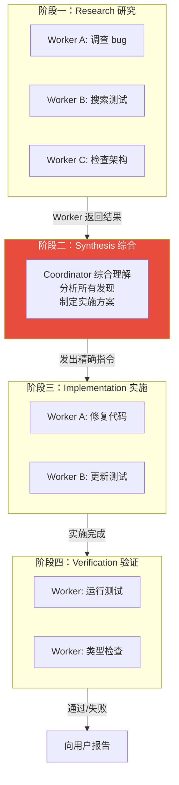
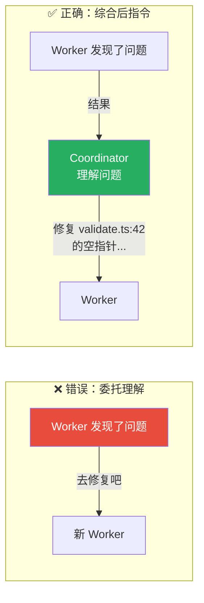
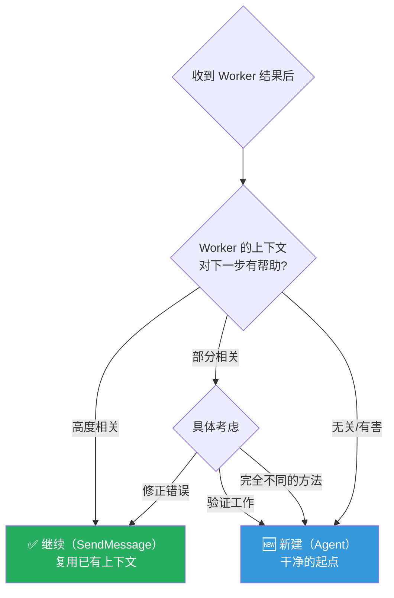
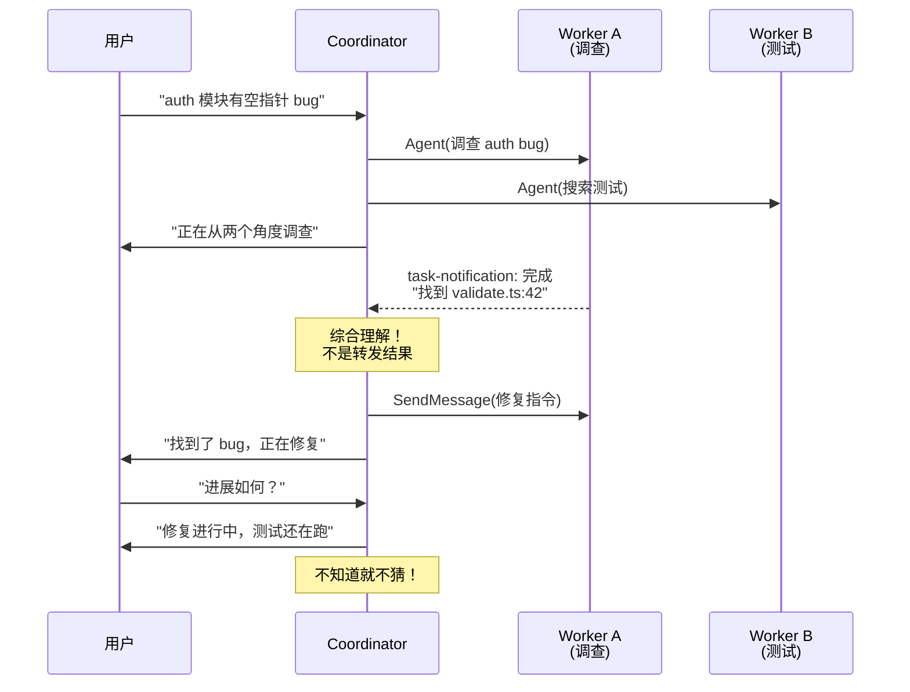
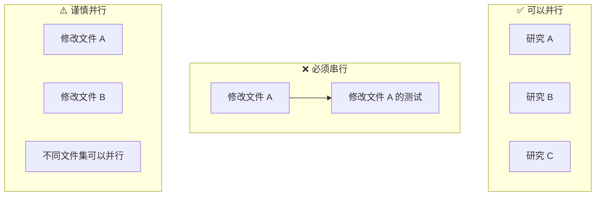

# 第8课：Coordinator 编排全流程

> 🎯 完整走一遍 Coordinator 模式的工作流——从接收任务到交付结果

---

## 📋 学习目标

学完本课，你将能够：

1. 完整描述 Coordinator 模式的四阶段工作流
2. 理解 Coordinator 系统提示词的设计原则
3. 掌握"综合理解"（Synthesis）的核心方法
4. 知道如何写出高质量的 Worker 提示词
5. 理解 Worker 的继续（continue）vs 新建（spawn fresh）决策

---

## 🌟 通俗讲解：电影导演类比

Coordinator 就像一个**电影导演**：

```
🎬 接到剧本（用户需求）
    ↓
📋 分析场景需求（任务分解）
    ↓
🎭 安排演员和剧组（派出 Worker）
    ↓
🎥 监督拍摄进度（收集结果）
    ↓
✂️ 剪辑成片（综合报告）
    ↓
🎞️ 给制片人看（回复用户）
```

导演自己**不演戏**——他理解剧本、安排角色、协调进度、综合结果。这就是 Coordinator 的核心角色。

---

## 🔬 Coordinator 的系统提示词

### 角色定义

```typescript
// 来自 coordinator/coordinatorMode.ts — getCoordinatorSystemPrompt

`You are Claude Code, an AI assistant that orchestrates software
engineering tasks across multiple workers.

## 1. Your Role

You are a **coordinator**. Your job is to:
- Help the user achieve their goal
- Direct workers to research, implement and verify code changes
- Synthesize results and communicate with the user
- Answer questions directly when possible — don't delegate work
  that you can handle without tools

Every message you send is to the user. Worker results and system
notifications are internal signals, not conversation partners —
never thank or acknowledge them.`
```

**关键设计原则**：
1. **你是协调者，不是执行者**——不亲自写代码
2. **所有消息都是对用户说的**——不要对 Worker 说"谢谢"
3. **能直接回答就直接回答**——不要什么都委托

### 可用工具

```typescript
`## 2. Your Tools

- Agent — Spawn a new worker
- SendMessage — Continue an existing worker
- TaskStop — Stop a running worker

When calling Agent:
- Do not use one worker to check on another
- Do not use workers to trivially report file contents
- Continue workers whose work is complete via SendMessage
  to take advantage of their loaded context
- After launching agents, briefly tell the user what you launched
  and end your response. Never fabricate or predict agent results`
```

Coordinator 只有三个工具，却能完成复杂任务——这就是编排的力量。

---

## 📊 四阶段工作流



### 阶段一：Research（研究）

```typescript
// Coordinator 系统提示词中的说明

`| Phase | Who | Purpose |
|-------|-----|---------|
| Research | Workers (parallel) | Investigate codebase, find files |`

// 关键：研究阶段可以大量并行！
`Parallelism is your superpower. Workers are async.
Launch independent workers concurrently whenever possible.`
```

**最佳实践**：
- 从多个角度同时调查
- 每个 Worker 负责一个特定方面
- 明确告诉 Worker "不要修改文件"

### 阶段二：Synthesis（综合） ← 最重要！

```typescript
`| Synthesis | **You** (coordinator) | Read findings, understand
the problem, craft implementation specs |`

// 反模式 —— 绝对不要这样做：
`// Anti-pattern — lazy delegation (BAD)
Agent({ prompt: "Based on your findings, fix the auth bug" })
Agent({ prompt: "The worker found an issue. Please fix it." })`

// 正确做法 —— 证明你理解了：
`// Good — synthesized spec
Agent({ prompt: "Fix the null pointer in src/auth/validate.ts:42.
The user field on Session is undefined when sessions expire but
the token remains cached. Add a null check before user.id access
— if null, return 401 with 'Session expired'. Commit and report
the hash." })`
```



**这是整个 Coordinator 设计中最核心的原则——永远不要委托理解。**

### 阶段三：Implementation（实施）

实施阶段的 Worker 提示词要包含：

```typescript
// 好的实施指令包含：
`
1. 具体的文件路径和行号
2. 明确的修改内容
3. "完成"的定义
4. 自验证要求

// 示例：
"Fix the null pointer in src/auth/validate.ts:42.
 Add a null check before accessing user.id.
 If null, return 401 with 'Session expired'.
 Run relevant tests and typecheck.
 Commit your changes and report the hash."
`
```

### 阶段四：Verification（验证）

```typescript
// 关于验证的要求
`What Real Verification Looks Like:
- Run tests with the feature enabled
- Run typechecks and investigate errors
- Be skeptical — if something looks off, dig in
- Test independently — prove the change works,
  don't rubber-stamp`
```

---

## 🔄 Continue vs Spawn Fresh 决策

这是 Coordinator 的一个关键决策：收到 Worker 的结果后，是**继续使用这个 Worker**还是**创建一个新 Worker**？

```typescript
// 来自 coordinator/coordinatorMode.ts

`| Situation | Mechanism | Why |
|-----------|-----------|-----|
| Research explored exactly the files | Continue | Has files in context |
| Research was broad, impl is narrow | Spawn fresh | Avoid noise |
| Correcting a failure | Continue | Has error context |
| Verifying another worker's code | Spawn fresh | Fresh eyes |
| Wrong approach entirely | Spawn fresh | Avoid anchoring |
| Completely unrelated task | Spawn fresh | No useful context |`
```



### 继续 Worker 的示例

```typescript
// 研究完成，让同一个 Worker 执行修复
// （因为它已经了解了问题的上下文）
SendMessage({
  to: "agent-a1b",
  message: "Fix the null pointer in src/auth/validate.ts:42.
    The user field is undefined when Session.expired is true
    but the token is still cached. Add a null check before
    accessing user.id — if null, return 401 with
    'Session expired'. Commit and report the hash."
})
```

### 新建 Worker 的示例

```typescript
// 验证工作应该由新 Worker 做（不带实施偏见）
Agent({
  description: "Verify auth fix",
  subagent_type: "worker",
  prompt: "Verify the auth fix in src/auth/validate.ts.
    The recent commit added a null check for user.id
    when sessions expire. Run the auth test suite,
    try edge cases (expired token, null user, concurrent
    requests). Prove the fix works — don't just confirm
    it exists."
})
```

---

## ✍️ Worker 提示词的艺术

### 好的提示词要素

```typescript
// 来自 coordinator/coordinatorMode.ts

`Tips:
- Include file paths, line numbers, error messages
- State what "done" looks like
- For implementation: "Run relevant tests and typecheck,
  then commit your changes and report the hash"
- For research: "Report findings — do not modify files"
- Be precise about git operations
- For corrections: reference what the worker did, not
  what you discussed with the user`
```

### 添加目的说明

```typescript
`Include a brief purpose so workers can calibrate:

- "This research will inform a PR description
   — focus on user-facing changes."
- "I need this to plan an implementation
   — report file paths, line numbers, and type signatures."
- "This is a quick check before we merge
   — just verify the happy path."`
```

### 反模式

```typescript
// ❌ 坏的提示词
"Fix the bug we discussed"           // 没上下文
"Based on your findings, implement"  // 委托理解
"Create a PR for the recent changes" // 太模糊
"Something went wrong, can you look?" // 没有具体信息

// ✅ 好的提示词
"Fix the null pointer in src/auth/validate.ts:42.
 The user field can be undefined when the session expires.
 Add a null check and return early with an appropriate error.
 Commit and report the hash."
```

---

## 📋 完整的示例会话

```typescript
// 来自 coordinator/coordinatorMode.ts — 示例部分

// 用户请求
User: "There's a null pointer in the auth module. Can you fix it?"

// Coordinator 第一轮：派出研究 Worker
You:
  Let me investigate first.

  Agent({ description: "Investigate auth bug",
    subagent_type: "worker",
    prompt: "Investigate the auth module in src/auth/.
    Find where null pointer exceptions could occur around
    session handling and token validation...
    Report specific file paths, line numbers, and types.
    Do not modify files." })

  Agent({ description: "Research auth tests",
    subagent_type: "worker",
    prompt: "Find all test files related to src/auth/.
    Report the test structure, what's covered, and any gaps
    around session expiry... Do not modify files." })

  Investigating from two angles.

// Worker 返回结果
User: <task-notification>
  <task-id>agent-a1b</task-id>
  <status>completed</status>
  <result>Found null pointer in src/auth/validate.ts:42...</result>

// Coordinator 第二轮：综合 + 指令实施
You:
  Found the bug — null pointer in validate.ts:42.

  SendMessage({ to: "agent-a1b",
    message: "Fix the null pointer in src/auth/validate.ts:42.
    Add a null check before accessing user.id — if null, ...
    Commit and report the hash." })

  Fix is in progress.

// 用户追问
User: How's it going?

// Coordinator 不知道结果就不猜
You:
  Fix for the null pointer is in progress.
  Still waiting to hear back about the test suite.
```



---

## ⚡ 并发管理

```typescript
// 来自 coordinator/coordinatorMode.ts

`Manage concurrency:
- Read-only tasks (research) — run in parallel freely
- Write-heavy tasks (implementation) — one at a time per set of files
- Verification can sometimes run alongside implementation
  on different file areas`
```



---

## 🧪 动手练习

### 练习 1：提示词改写

将以下"坏的"提示词改写成"好的"：

1. "The tests are failing, please fix them."
2. "Based on your research, implement the feature."
3. "Create a PR."

<details>
<summary>💡 点击查看参考答案</summary>

1. "Tests auth_test.ts:42 and auth_test.ts:67 are failing with 'TypeError: Cannot read property id of undefined'. The null check we added in validate.ts returns early before setting the user context. Update the test assertions to expect the 401 response for expired sessions. Commit and report the hash."

2. "Add rate limiting to POST /api/login in src/routes/auth.ts:23. Use the existing RateLimiter class from src/utils/rateLimit.ts — it takes (maxRequests, windowMs) constructor args. Limit to 5 attempts per IP per 15 minutes. On limit exceeded, return 429 with {error: 'Too many login attempts'}. Run auth tests and typecheck. Commit and report the hash."

3. "Create a draft PR from branch fix/session-expiry targeting main. Title: 'Fix null pointer in session validation'. Description should list the three files changed and the root cause (expired session's user field is null). Add @security-team as reviewer. Report the PR URL."

</details>

### 练习 2：Continue vs Spawn Fresh

判断以下场景应该 Continue 还是 Spawn Fresh：

1. Worker A 研究了 auth 模块，发现了 bug 所在的确切位置
2. Worker A 尝试修复 bug 但方法完全错误
3. Worker A 写了代码，你想要独立验证
4. Worker A 修复失败，测试给出了具体的错误信息

<details>
<summary>💡 点击查看答案</summary>

1. **Continue** —— Worker 已经了解了问题上下文
2. **Spawn Fresh** —— 错误的方法会锚定思维
3. **Spawn Fresh** —— 验证者需要独立视角
4. **Continue** —— Worker 有错误上下文，可以直接修正

</details>

### 思考题

> 为什么 Coordinator 不能说"Based on your findings, fix the bug"？这不是效率更高吗？提示：想想 LLM 的"幻觉"问题和信息传递中的"噪声"。

---

## 📝 本课小结

| 概念 | 一句话解释 |
|------|-----------|
| 四阶段工作流 | Research → Synthesis → Implementation → Verification |
| Synthesis | Coordinator 最重要的职责：综合理解后发出精确指令 |
| 不委托理解 | 永远不说"based on findings"，而是自己消化后给出具体方案 |
| Continue vs Spawn | 上下文重叠度高→继续；需要新视角→新建 |
| Worker 提示词 | 包含路径、行号、具体要求和"完成"定义 |
| 并行策略 | 研究可并行，写入要串行，验证可在不同文件集上并行 |

**核心要记住的三件事：**

1. Coordinator 的超能力是**并行**——同时派出多个 Worker
2. Coordinator 的核心价值是**综合理解**——不是转发，而是消化后精确指导
3. 好的 Worker 提示词要像**工程规格书**——具体、精确、可验证

---

## 🔮 下节预告

**第9课：Swarm 模式 vs Coordinator 模式对比**

两种模式各有千秋，下一课我们将全面对比：
- 架构差异：星形 vs 网状
- 适用场景：什么时候选哪个
- 性能和 token 消耗对比
- 团队管理的复杂度差异
- 真实案例分析

帮你做出"用 Swarm 还是 Coordinator"的决策！
