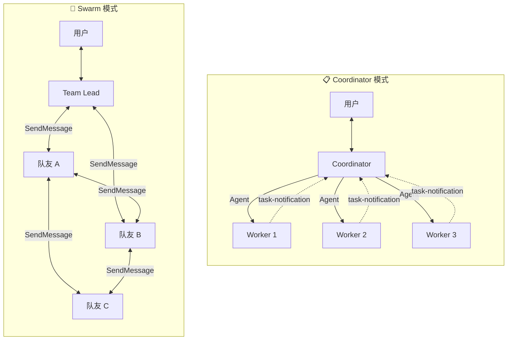
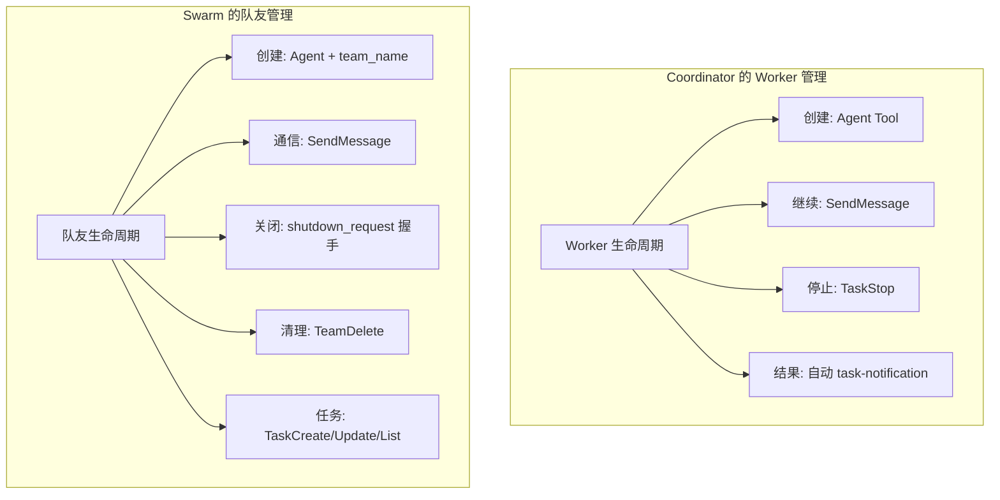
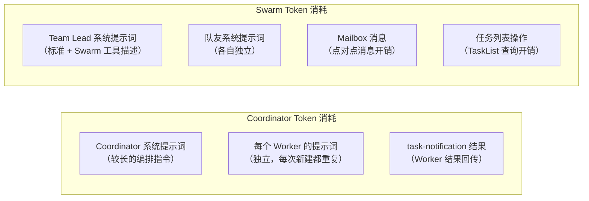
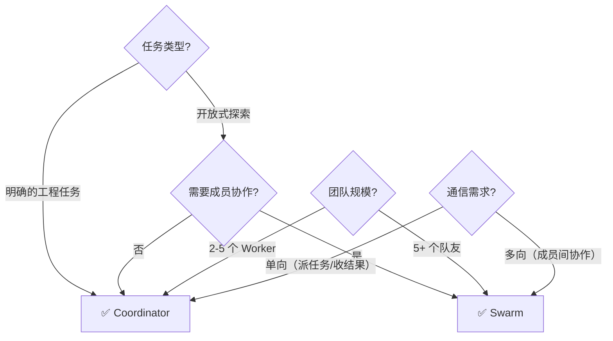
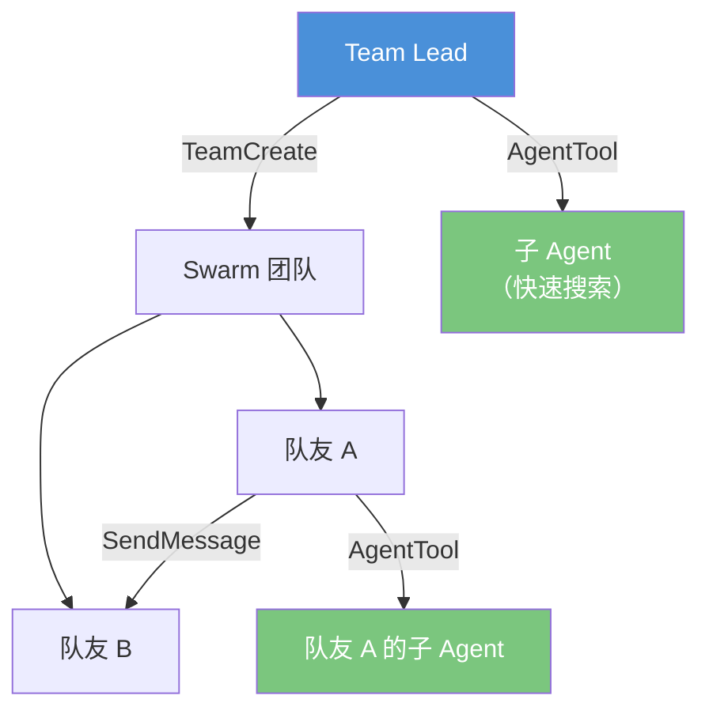

# 第9课：Swarm 模式 vs Coordinator 模式对比

> 🎯 全面对比两种多 Agent 协作模式，帮助你做出正确的选择

---

## 📋 学习目标

学完本课，你将能够：

1. 从架构、通信、管理等多维度对比两种模式
2. 根据具体场景选择合适的模式
3. 理解每种模式的优势和局限性
4. 了解两种模式在源码层面的启用方式
5. 设想混合使用两种模式的可能性

---

## 🌟 通俗讲解：两种管理风格

### Coordinator 模式 = 军队指挥

```
🎖️ 指挥官（Coordinator）
├── 📋 制定作战计划
├── 📡 下达命令给每个士兵
├── 📊 收集战报
├── 🧠 综合判断局势
└── 📢 向上级汇报（用户）

士兵之间不互相联络，一切通过指挥官。
```

### Swarm 模式 = 创业团队

```
🤝 创业小组（Swarm）
├── 👨‍💼 Team Lead（发起人）
├── 🧑‍💻 成员 A（可以直接跟 B 说话）
├── 🧑‍💻 成员 B（可以直接跟 A 和 C 说话）
├── 🧑‍💻 成员 C（可以直接跟 A 说话）
└── 📋 共享看板（任务列表）

成员之间自由沟通，共享任务看板。
```

---

## 🏗️ 架构差异



| 维度 | Coordinator | Swarm |
|------|------------|-------|
| **拓扑** | 星形 | 网状 |
| **通信路径** | 全部经过 Coordinator | 任意成员间直接通信 |
| **瓶颈** | Coordinator（单点） | 无单点瓶颈 |
| **复杂度** | 低（中心化管理） | 高（需要协调协议） |

---

## 🔧 启用方式

### Coordinator 模式

```typescript
// 来自 coordinator/coordinatorMode.ts

export function isCoordinatorMode(): boolean {
  if (feature('COORDINATOR_MODE')) {
    // 通过环境变量启用
    return isEnvTruthy(process.env.CLAUDE_CODE_COORDINATOR_MODE)
  }
  return false
}
```

启用方式：设置环境变量 `CLAUDE_CODE_COORDINATOR_MODE=1`

### Swarm 模式

```typescript
// 来自 tools/TeamCreateTool/TeamCreateTool.ts

isEnabled() {
  return isAgentSwarmsEnabled()  // 检查 Swarm 功能是否开启
}
```

Swarm 模式通过 TeamCreateTool 自然触发——当用户要求组建团队时自动进入。

### 互斥关系

```typescript
// 来自 tools/AgentTool/forkSubagent.ts

export function isForkSubagentEnabled(): boolean {
  if (feature('FORK_SUBAGENT')) {
    // Fork 和 Coordinator 互斥
    if (isCoordinatorMode()) return false
    if (getIsNonInteractiveSession()) return false
    return true
  }
  return false
}
```

Fork 模式和 Coordinator 模式是**互斥的**——Coordinator 有自己的编排模型，不需要 Fork 机制。

---

## 📊 多维度对比

### 1. 工具可用性

```typescript
// Coordinator 模式下的工具
// 来自 coordinator/coordinatorMode.ts

`## 2. Your Tools
- Agent — Spawn a new worker
- SendMessage — Continue an existing worker
- TaskStop — Stop a running worker`

// Coordinator 只有 3 个工具！但 Worker 有完整工具集：
const workerTools = Array.from(ASYNC_AGENT_ALLOWED_TOOLS)
  .filter(name => !INTERNAL_WORKER_TOOLS.has(name))
  .sort()
  .join(', ')
```

```typescript
// Swarm 模式下的工具
// Team Lead 有所有标准工具 + Swarm 工具：
// - TeamCreate, TeamDelete
// - SendMessage
// - TaskCreate, TaskUpdate, TaskList
// - Agent（用于创建队友）
// 队友也有大部分工具（除了 TeamCreate/TeamDelete）
```

| 角色 | Coordinator 模式 | Swarm 模式 |
|------|-----------------|-----------|
| 主 Agent 工具数 | 3 个 | 全部 |
| Worker/队友工具 | 完整工具集 | 完整工具集 |
| 主 Agent 能否写代码 | ❌ | ✅ |
| 主 Agent 能否搜索 | ❌ | ✅ |

### 2. 通信机制

| 维度 | Coordinator | Swarm |
|------|------------|-------|
| **消息投递** | 自动（task-notification） | 邮箱系统 |
| **消息格式** | XML 包装 | JSON 邮箱条目 |
| **接收方式** | 被动接收（变成 user msg） | 自动轮询投递 |
| **成员间通信** | ❌ 不支持 | ✅ 直接对话 |
| **广播** | ❌ 无意义 | ✅ 支持 |

### 3. Worker/队友管理



### 4. 任务管理

| 维度 | Coordinator | Swarm |
|------|------------|-------|
| **任务分配** | Coordinator 直接写进 prompt | 共享任务列表（TaskCreate/Update） |
| **任务跟踪** | Coordinator 脑中记忆 | 持久化的任务文件 |
| **任务认领** | 不适用 | 队友自主认领 |
| **进度可见性** | 只有 Coordinator 知道 | 所有成员可查看 |

### 5. Token 消耗



---

## 🎯 场景选择指南

### 什么时候用 Coordinator？



**适合 Coordinator 的场景：**

1. **修 bug** — 调查 → 理解 → 修复 → 验证，线性流程
2. **代码审查** — 多角度并行审查，结果汇总到 Coordinator
3. **功能实现** — Coordinator 理解需求后精确指导 Worker
4. **快速迭代** — Worker 失败后 Coordinator 立即调整策略

### 什么时候用 Swarm？

**适合 Swarm 的场景：**

1. **大型重构** — 多个文件/模块需要不同专家同时处理
2. **全栈开发** — 前端、后端、数据库队友各自负责
3. **持续集成** — 队友自主认领任务，像敏捷团队一样工作
4. **需要成员间直接协作** — 研究者发现问题直接告诉实现者

---

## 📊 综合对比表

| 维度 | Coordinator 模式 | Swarm 模式 |
|------|-----------------|-----------|
| **架构** | 星形（中心化） | 网状（去中心化） |
| **通信** | 单向（指令→结果） | 多向（自由通信） |
| **管理复杂度** | 低 | 高 |
| **可扩展性** | 受 Coordinator 瓶颈限制 | 更好的横向扩展 |
| **容错性** | Worker 失败可替换 | 队友可拒绝关闭 |
| **持久性** | Worker 上下文临时 | 团队配置持久化 |
| **任务管理** | 隐式（在 prompt 中） | 显式（任务列表） |
| **启用方式** | 环境变量 | 调用 TeamCreate |
| **Team Lead 能力** | 只能编排 | 全能 |
| **成员间通信** | ❌ | ✅ |
| **优雅关闭** | TaskStop 直接停 | 两阶段 shutdown 握手 |
| **适合场景** | 明确的工程任务 | 复杂的协作任务 |
| **Token 效率** | 较高（精确控制） | 中等（通信开销） |

---

## 🔄 融合使用的可能性

虽然 Fork 和 Coordinator 互斥，但 Swarm 和子 Agent 机制可以混合使用：



Team Lead 可以同时：
- 管理 Swarm 团队（队友间协作）
- 使用 AgentTool 创建临时子 Agent（快速搜索）
- 队友自己也可以创建子 Agent

---

## 🧪 动手练习

### 练习 1：模式选择

为以下每个场景选择最合适的模式，并说明理由：

1. 用户要求："帮我修复这个 API 端点返回 500 的 bug"
2. 用户要求："帮我把整个项目从 JavaScript 迁移到 TypeScript"
3. 用户要求："帮我搜索代码库中所有潜在的安全漏洞"
4. 用户要求："帮我开发一个完整的功能：前端表单 + 后端 API + 数据库迁移"

<details>
<summary>💡 点击查看参考答案</summary>

1. **Coordinator** — 明确的线性流程：调查 → 定位 → 修复 → 验证
2. **Swarm** — 大型重构需要多个专家并行工作，且需要互相协调（例如修改了一个接口后要通知使用该接口的其他队友）
3. **Coordinator** — 多个 Worker 并行搜索不同类型的漏洞，结果汇总给 Coordinator
4. **Swarm** — 全栈开发的不同层需要专家分工，前端和后端需要协商 API 接口

</details>

### 练习 2：架构设计

使用 Coordinator 模式设计一个 "代码审查" 的工作流：

1. 列出你会创建几个 Worker
2. 每个 Worker 负责什么
3. 是否有 Worker 需要并行？
4. Continue 还是 Spawn Fresh？

### 练习 3：对比分析

| 场景 | Coordinator 的做法 | Swarm 的做法 |
|------|------------------|-------------|
| 任务分配 | ? | ? |
| 发现新问题 | ? | ? |
| 成员间共享发现 | ? | ? |
| 终止某个成员 | ? | ? |

填写上表，对比两种模式在各场景下的具体操作方式。

### 思考题

> 如果你要设计一个"第三种模式"——同时具备 Coordinator 的精确控制和 Swarm 的灵活通信，你会怎么设计？

---

## 📝 本课小结

| 概念 | 一句话解释 |
|------|-----------|
| Coordinator 模式 | 中心化编排，Worker 只与 Coordinator 通信 |
| Swarm 模式 | 去中心化协作，队友可自由通信 |
| 星形拓扑 | 所有通信经过中心节点 |
| 网状拓扑 | 任意节点间可直接通信 |
| 互斥关系 | Fork 和 Coordinator 不能同时使用 |
| 选择策略 | 明确任务→Coordinator，复杂协作→Swarm |

**核心要记住的三件事：**

1. Coordinator 适合**有明确目标的工程任务**——调查→理解→实施→验证
2. Swarm 适合**需要灵活协作的复杂项目**——成员间需要直接沟通
3. 选择的关键问题：**成员之间是否需要直接对话？**是→Swarm，否→Coordinator

---

## 🔮 下节预告

**第10课：实战——如何设计你自己的多 Agent 系统**

最后一课，我们将把前 9 课的知识融会贯通：
- 从零设计一个多 Agent 系统
- 自定义 Agent 的创建方法
- 编写高效的系统提示词
- 工具配置的最佳实践
- 安全性审查清单
- 性能优化策略

用你学到的一切，创造你自己的 Agent 军团！
