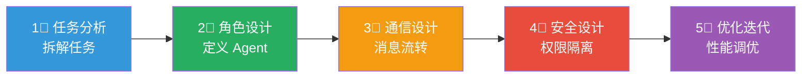
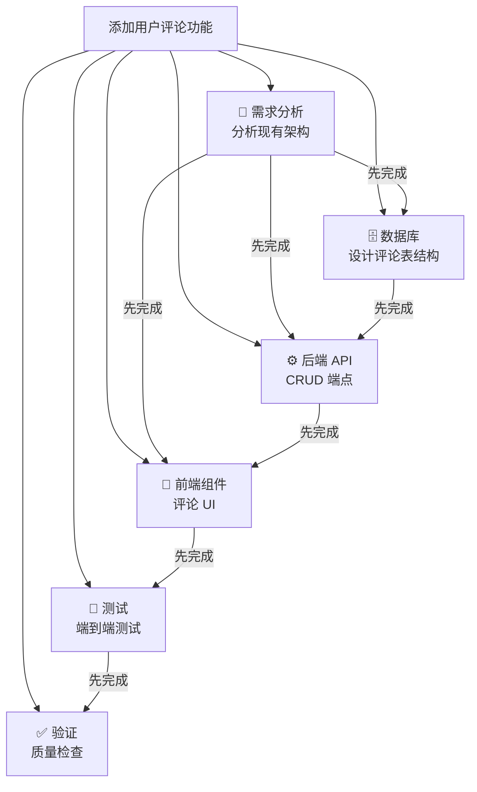
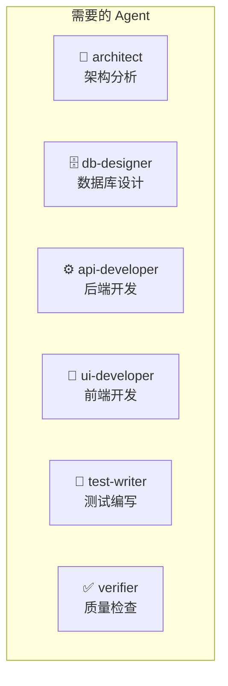
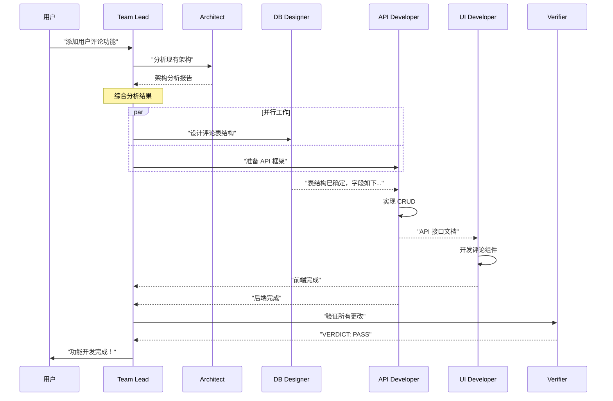
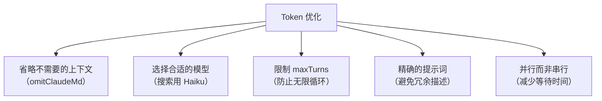
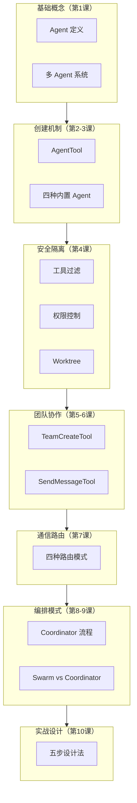

# 第10课：实战——如何设计你自己的多 Agent 系统

> 🎯 融会贯通前 9 课知识，从零设计一个多 Agent 协作系统

---

## 📋 学习目标

学完本课，你将能够：

1. 从需求分析到系统设计，完整规划一个多 Agent 系统
2. 掌握自定义 Agent 的创建方法（Markdown 定义文件）
3. 编写高效的系统提示词
4. 合理配置工具权限和安全策略
5. 具备独立设计多 Agent 系统的能力

---

## 🌟 设计方法论：五步法



---

## 📝 第一步：任务分析

### 提出正确的问题

在设计多 Agent 系统之前，先问自己：

```
1. 这个任务真的需要多 Agent 吗？
   - 简单任务 → 单 Agent 就够了
   - 复杂任务 → 考虑多 Agent

2. 任务可以分解成哪些独立的子任务？
   - 可并行的子任务 → 多 Agent 价值最大
   - 必须串行的 → 多 Agent 意义不大

3. 不同子任务需要不同的能力吗？
   - 需要 → 设计专门的 Agent 类型
   - 不需要 → 用通用 Agent

4. 子任务之间需要通信吗？
   - 不需要 → Coordinator 模式
   - 需要 → Swarm 模式
```

### 实战案例：设计一个"全栈功能开发"系统

**需求**：为一个 Web 应用添加"用户评论"功能

任务分解：



---

## 🎭 第二步：角色设计

### 自定义 Agent 定义文件

在 Claude Code 中，你可以在 `.claude/agents/` 目录下创建 Markdown 文件来定义自定义 Agent：

```markdown
<!-- .claude/agents/db-designer.md -->
---
name: db-designer
description: "数据库设计专家，负责设计表结构和编写迁移脚本"
tools:
  - Read
  - Write
  - Edit
  - Bash
  - Glob
  - Grep
model: inherit
permissionMode: default
maxTurns: 50
---

你是一个数据库设计专家。你的职责是：

1. 分析现有的数据库结构
2. 设计新的表和关系
3. 编写迁移脚本
4. 确保数据完整性和性能

规则：
- 始终遵循项目的数据库命名约定
- 迁移脚本必须可逆（包含 up 和 down）
- 添加适当的索引
- 考虑并发读写的性能
```

### Agent 定义的完整属性

回顾源码中 Agent 定义的所有可用属性：

```typescript
// 来自 tools/AgentTool/loadAgentsDir.ts

type BaseAgentDefinition = {
  agentType: string           // 名称（必填）
  whenToUse: string          // 使用场景描述（必填）
  tools?: string[]           // 可用工具白名单
  disallowedTools?: string[] // 禁用工具黑名单
  model?: string             // AI 模型（'inherit' 继承父的）
  effort?: EffortValue       // 推理努力程度
  permissionMode?: string    // 权限模式
  maxTurns?: number          // 最大对话轮数
  skills?: string[]          // 预加载的技能
  background?: boolean       // 是否在后台运行
  memory?: 'user' | 'project' | 'local' // 持久化记忆
  isolation?: 'worktree'     // 隔离模式
  color?: AgentColorName     // UI 颜色
  hooks?: HooksSettings      // 生命周期钩子
  mcpServers?: AgentMcpServerSpec[] // MCP 服务器
}
```

### 为"评论功能"设计 Agent



#### Agent 1：架构分析师

```markdown
<!-- .claude/agents/architect.md -->
---
name: architect
description: "架构分析专家，探索代码库并设计实现方案"
tools:
  - Read
  - Glob
  - Grep
  - Bash
model: inherit
maxTurns: 30
---

你是一个软件架构分析师。你的任务是：

1. 探索现有代码库的架构
2. 找到相关的模式和约定
3. 设计新功能的实现方案
4. 标注关键文件和接口

你是只读的——绝不修改任何文件。
你的输出必须包含：
- 现有架构分析
- 建议的实现方案
- 关键文件路径列表（3-5 个）
- 潜在风险和注意事项
```

#### Agent 2：前端开发者

```markdown
<!-- .claude/agents/ui-developer.md -->
---
name: ui-developer
description: "前端开发专家，负责 React 组件和样式"
tools:
  - Read
  - Write
  - Edit
  - Bash
  - Glob
  - Grep
model: inherit
maxTurns: 80
---

你是一个前端开发专家，专注于 React 和 TypeScript。

规则：
- 遵循项目现有的组件结构和样式约定
- 使用项目已有的 UI 库，不引入新依赖
- 组件必须有 TypeScript 类型定义
- 编写完代码后运行 TypeScript 编译检查
- 提交前确保没有 lint 错误
```

---

## 📡 第三步：通信设计

### 选择模式

对于"评论功能"这个案例，分析通信需求：

```
- 架构分析师的结果需要传递给所有后续 Agent ✅
- 数据库设计需要在后端 API 之前完成 ✅
- 前端和后端需要就 API 接口达成一致 ✅
  → 成员间需要直接通信 → Swarm 模式

如果不需要前后端协商接口：
  → 全部通过主 Agent 中转即可 → Coordinator 模式
```

### 消息流设计



---

## 🔒 第四步：安全设计

### 安全审查清单

设计完 Agent 后，用这个清单逐一审查：

```
□ 每个 Agent 是否只有完成任务所需的最小工具集？
  - 只读 Agent 是否禁用了 Write/Edit？
  - 不需要 Bash 的 Agent 是否禁用了它？

□ 权限模式是否合理？
  - 修改关键文件的 Agent 是否需要用户确认？
  - 后台运行的 Agent 权限是否足够受限？

□ 是否需要 Worktree 隔离？
  - 大规模修改是否应该在独立分支上进行？
  - 实验性修改是否需要隔离？

□ maxTurns 是否设置合理？
  - 防止 Agent 陷入无限循环
  - 研究类 Agent 可以少一些（20-30）
  - 实现类 Agent 需要多一些（50-100）

□ 是否有适当的清理机制？
  - 团队解散时是否清理了所有资源？
  - Agent 失败时是否有降级策略？
```

### 为不同角色配置安全策略

```typescript
// 安全配置示例

const AGENT_SECURITY_PROFILES = {
  // 只读角色
  researcher: {
    tools: ['Read', 'Glob', 'Grep', 'Bash'],
    disallowedTools: ['Write', 'Edit', 'NotebookEdit'],
    maxTurns: 30,
    permissionMode: 'default',
  },
  
  // 开发角色
  developer: {
    tools: ['*'],
    disallowedTools: ['Agent'],  // 不能创建子 Agent
    maxTurns: 80,
    permissionMode: 'default',
  },
  
  // 验证角色
  verifier: {
    tools: ['Read', 'Glob', 'Grep', 'Bash'],
    disallowedTools: ['Write', 'Edit', 'Agent'],
    maxTurns: 40,
    permissionMode: 'default',
    color: 'red',  // 红色标识
  },
  
  // 高风险操作角色
  deployer: {
    tools: ['Read', 'Bash'],
    maxTurns: 20,
    permissionMode: 'default',  // 需要用户确认
    isolation: 'worktree',       // 隔离环境
  },
}
```

---

## ⚡ 第五步：优化迭代

### Token 优化策略



### 源码中的优化启发

```typescript
// 从 Claude Code 源码学到的优化技巧

// 1. 只读 Agent 省略 CLAUDE.md（节省 token）
omitClaudeMd: true  // Explore, Plan

// 2. 只读 Agent 省略 gitStatus（它们可以自己查）
const resolvedSystemContext =
  agentDefinition.agentType === 'Explore' ||
  agentDefinition.agentType === 'Plan'
    ? systemContextNoGit
    : baseSystemContext

// 3. ONE_SHOT Agent 省略 agentId/SendMessage 提示
// （节省 ~135 chars × 34M Explore runs/week）
export const ONE_SHOT_BUILTIN_AGENT_TYPES = new Set([
  'Explore', 'Plan',
])

// 4. Fork 共享 prompt cache（同一前缀不重复计费）
// Fork 不设置 model 参数——不同模型无法共享缓存
```

### 错误处理最佳实践

```
1. Agent 失败时的降级策略
   - 继续同一个 Worker 修正错误
   - 换一个方法重新创建 Worker
   - 向用户报告并请求指导

2. 超时处理
   - 设置合理的 maxTurns
   - 使用 TaskStop 停止长时间运行的 Agent
   - 提取部分结果（extractPartialResult）

3. 资源泄漏防护
   - 始终在 finally 块中清理资源
   - 注册 session cleanup
   - 终止后台 Shell 任务
```

---

## 🏗️ 完整设计模板

### 模板：多 Agent 系统设计文档

```markdown
# 多 Agent 系统设计：[系统名称]

## 1. 需求分析
- 核心目标：[一句话描述]
- 子任务列表：
  - [ ] 子任务 1
  - [ ] 子任务 2
  - [ ] 子任务 3
- 并行机会：[哪些任务可以并行]

## 2. 模式选择
- 选择：[Coordinator / Swarm]
- 理由：[为什么选这个模式]

## 3. Agent 设计
| Agent 名称 | 职责 | 工具 | 模型 | maxTurns |
|-----------|------|------|------|----------|
| agent-1   | ...  | ...  | ...  | ...      |
| agent-2   | ...  | ...  | ...  | ...      |

## 4. 通信流程
[Mermaid 流程图]

## 5. 安全审查
- [ ] 最小权限原则
- [ ] 隔离策略
- [ ] 清理机制

## 6. 优化策略
- Token 优化：...
- 并行策略：...
- 错误处理：...
```

---

## 🧪 实战练习

### 练习 1：设计"代码审查"系统

设计一个多 Agent 系统来执行代码审查，需要检查：
- 代码风格和命名规范
- 潜在的 bug 和安全漏洞
- 性能问题
- 测试覆盖率

要求：
1. 选择 Coordinator 还是 Swarm，并说明理由
2. 设计每个 Agent 的配置
3. 画出通信流程图
4. 列出安全检查点

### 练习 2：设计"文档生成"系统

设计一个从代码自动生成 API 文档的系统：
- 扫描所有 API 端点
- 分析请求/响应格式
- 生成 Markdown 文档
- 验证文档的准确性

### 练习 3：从源码学设计

回顾 Claude Code 的四种内置 Agent，回答：

1. 为什么 Explore 用 Haiku 而 Plan 用 Inherit？
2. 为什么 Verification 有 `criticalSystemReminder_EXPERIMENTAL`？
3. 为什么 GeneralPurpose 的 `tools` 是 `['*']` 而不是列出具体工具？
4. 如果你要添加第五种内置 Agent，你会设计什么？

<details>
<summary>💡 点击查看参考答案</summary>

1. Explore 主要做文件搜索，不需要深度推理，Haiku 又快又便宜；Plan 需要做架构分析和设计方案，需要与主 Agent 同等的推理能力。

2. `criticalSystemReminder` 在每一轮对话中都会被注入，反复提醒 Verification Agent "你不能修改文件"。因为 LLM 有"遗忘"倾向，关键约束需要反复强调。

3. `['*']` 通配符意味着"所有可用工具"。如果列出具体工具名，当新工具被添加到系统时，GeneralPurpose 就需要同步更新。通配符让它自动获得所有新工具。

4. 答案开放。例如可以设计一个 "Documentation Agent"——只读 + Write（仅 .md 文件），专门生成和更新文档。

</details>

---

## 📊 知识体系回顾



---

## 🎓 课程总结：十个核心原则

经过 10 节课的学习，以下是多 Agent 系统设计的核心原则：

### 1. 最小权限原则
每个 Agent 只拥有完成任务所需的最少工具和权限。

### 2. 职责单一原则
每个 Agent 专注做一件事，并把它做好。

### 3. 永远不要委托理解
Coordinator 必须自己消化 Worker 的结果，然后给出精确指令。

### 4. 并行是超能力
能并行的就并行——这是多 Agent 系统最大的优势。

### 5. 安全是多层的
全局禁用 → 类型限制 → 权限控制 → 环境隔离，层层防护。

### 6. 清理必须可靠
`finally` 块确保所有资源都被释放，无论成功还是失败。

### 7. 通信要精确
消息中包含文件路径、行号、具体要求——模糊的指令产生模糊的结果。

### 8. 优雅退出优于强制关闭
Shutdown 握手确保 Agent 不会在工作进行中被强制终止。

### 9. Token 效率很重要
省略不需要的上下文、选择合适的模型、限制轮数。

### 10. 从简单开始
先用最少的 Agent 解决问题，必要时再增加复杂度。

---

## 🚀 你的下一步

恭喜你完成了全部 10 节课的学习！接下来你可以：

1. **实践**：在你的项目中尝试使用多 Agent 功能
2. **自定义**：在 `.claude/agents/` 目录下创建你自己的 Agent
3. **深入源码**：带着问题重新阅读 `claude-code-cli-master` 的源码
4. **分享**：把你学到的知识分享给其他人

**记住：最好的学习方式是动手实践。去创建你的第一个多 Agent 系统吧！**

---

> "The best way to understand a system is to build one yourself."
> 
> —— 理解系统的最好方式是亲手构建一个。
