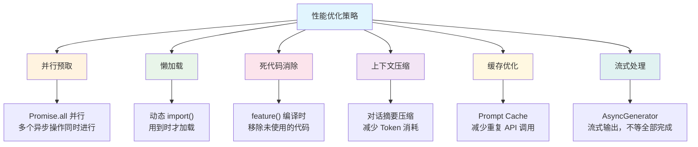
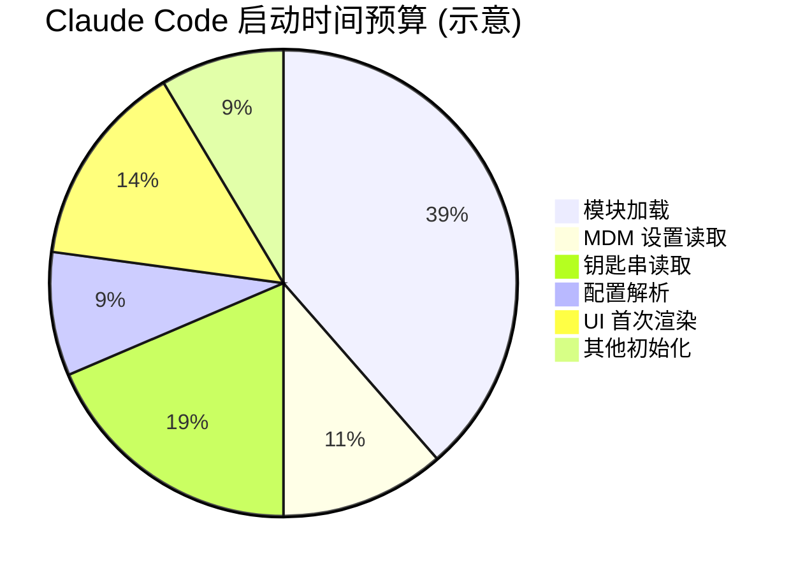

# 第1课：为什么性能优化很重要？

> 🎯 从 Claude Code CLI 的真实源码出发，理解性能优化的核心价值

---

## 📋 学习目标

1. 理解性能优化对用户体验和成本的双重影响
2. 认识 Claude Code 启动流程中的性能瓶颈
3. 学会用「时间线分析」的思维看待程序启动过程
4. 了解性能优化的六大核心策略概览
5. 建立「性能预算」的基本概念

---

## 🌍 生活类比：开一家早餐店

想象你开了一家早餐店。每天早上，你需要做很多准备工作：

- 烧开水、磨豆浆、蒸包子、切菜、摆桌椅……

如果你**一件一件按顺序做**，可能要花 2 小时才能开门。但如果你：

- **并行处理**：一边烧水一边切菜 ✅
- **按需准备**：牛排这种冷门菜等有人点了再做 ✅
- **提前备料**：昨晚就把面团发好 ✅
- **去掉多余**：不再准备从没人点过的菜品 ✅

这样可能 30 分钟就能开门！

**Claude Code 的性能优化逻辑完全一样。** 让我们看看它是怎么做的。

---

## 🔍 真实源码解析：Claude Code 的启动流程

### 启动时间是怎么被"吃掉"的？

Claude Code 在 `main.tsx` 文件的最开始，就在"争分夺秒"——甚至在 import 语句之前就开始了性能追踪：

```typescript
// main.tsx 第1-20行
// 这些副作用必须在所有其他 import 之前运行：
// 1. profileCheckpoint 在繁重的模块评估开始之前标记入口点
// 2. startMdmRawRead 启动 MDM 子进程，使其与后续约 135ms 的 import 并行运行
// 3. startKeychainPrefetch 并行启动 macOS 钥匙串读取
import { profileCheckpoint, profileReport } from './utils/startupProfiler.js';

profileCheckpoint('main_tsx_entry');
import { startMdmRawRead } from './utils/settings/mdm/rawRead.js';

startMdmRawRead();
import { startKeychainPrefetch } from './utils/secureStorage/keychainPrefetch.js';

startKeychainPrefetch();
```

看到了吗？代码注释告诉我们：

| 操作 | 耗时 | 优化策略 |
|------|------|----------|
| MDM 子进程启动 | ~135ms | 与 import 并行 |
| 钥匙串读取 | ~65ms | 两次读取并行化 |
| 模块 import | ~135ms | 边导入边执行 |

### 性能检查点（Performance Checkpoint）

Claude Code 在关键节点都设置了「性能检查点」，就像赛跑时的计时器：

```typescript
// 各个关键节点的计时标记
profileCheckpoint('main_tsx_entry');           // 入口
profileCheckpoint('main_tsx_imports_loaded');   // 模块加载完成
profileCheckpoint('main_function_start');       // main 函数开始
profileCheckpoint('eagerLoadSettings_start');   // 设置加载开始
profileCheckpoint('eagerLoadSettings_end');     // 设置加载结束
```

这就像在马拉松赛道上设置多个计时点，帮助你找出"跑得最慢"的那一段。

---

## 📊 Claude Code 的六大优化策略

通过分析源码，我们可以归纳出 Claude Code 使用的六大核心优化策略：



### 策略一览表

| 策略 | 解决什么问题 | 类比 | 对应课程 |
|------|-------------|------|----------|
| 并行预取 | 等待时间太长 | 一边烧水一边切菜 | 第2课 |
| 懒加载 | 初始加载太重 | 需要时才取工具 | 第3课 |
| 死代码消除 | 包体积太大 | 丢掉没用的厨具 | 第4课 |
| 上下文压缩 | 对话越来越长 | 把长信摘要成要点 | 第6课 |
| 缓存优化 | 重复计算太多 | 记住常客的口味 | 第7课 |
| 流式处理 | 要等全部完成 | 做好一道菜先端一道 | 第9课 |

---

## 🎯 性能的两个维度：速度与成本

### 维度一：启动速度

Claude Code 大量使用了**延迟预取（Deferred Prefetch）** 模式——先让用户看到界面，再在后台悄悄加载：

```typescript
// main.tsx 中的延迟预取
export function startDeferredPrefetches(): void {
  // 这个函数在首次渲染之后运行，不阻塞初始绘制。
  if (isEnvTruthy(process.env.CLAUDE_CODE_EXIT_AFTER_FIRST_RENDER) ||
      isBareMode()) {
    return;
  }

  // 进程启动的预取（用户还在打字时消费）
  void initUser();
  void getUserContext();
  prefetchSystemContextIfSafe();
  void getRelevantTips();

  // 分析和 feature flag 初始化
  void initializeAnalyticsGates();
  void prefetchOfficialMcpUrls();
  void refreshModelCapabilities();

  // 文件变更检测器从 init() 延迟到这里，不阻塞首次渲染
  void settingsChangeDetector.initialize();
}
```

注意 `void` 关键字——它表示"我启动了这个异步操作，但不等它完成"。就像往锅里下了面条，先去做别的事。

### 维度二：API 成本

对于 AI 应用来说，每次 API 调用都要花钱。Claude Code 的自动压缩功能就是为了控制成本：

```typescript
// services/compact/autoCompact.ts
// 为摘要输出预留的 token 数
const MAX_OUTPUT_TOKENS_FOR_SUMMARY = 20_000

export function getAutoCompactThreshold(model: string): number {
  const effectiveContextWindow = getEffectiveContextWindowSize(model)
  const autocompactThreshold =
    effectiveContextWindow - AUTOCOMPACT_BUFFER_TOKENS
  return autocompactThreshold
}
```

当对话 token 数接近模型的上下文窗口限制时，系统会自动压缩对话——把几十条消息变成一段精炼的摘要，大幅降低后续 API 调用的成本。

---

## 📐 性能预算思维

什么是「性能预算」？就像你每月的生活预算一样——给每个环节设定一个"不能超过"的限额：



Claude Code 的源码中随处可见这种思维：

```typescript
// 超时控制：文件计数限制在 3 秒内
void countFilesRoundedRg(getCwd(), AbortSignal.timeout(3000), []);

// Token 预算：压缩后文件恢复的 token 上限
export const POST_COMPACT_TOKEN_BUDGET = 50_000
export const POST_COMPACT_MAX_TOKENS_PER_FILE = 5_000
```

---

## ✏️ 动手练习

### 练习1：找出瓶颈

假设你的 Node.js 应用启动时执行以下操作，每个操作的耗时如下：

```
A. 读取配置文件    30ms
B. 连接数据库     200ms
C. 加载模板引擎    50ms
D. 读取用户信息   150ms（依赖数据库连接）
E. 初始化缓存      80ms
```

**问题：**
1. 如果所有操作按顺序执行，总耗时是多少？
2. 哪些操作可以并行执行？
3. 最优并行策略下，理论最小耗时是多少？

### 练习2：思考题

看下面这段伪代码，找出 3 个性能问题：

```javascript
// 应用启动
import heavyChart from './charts.js'     // 200KB，但只在报告页用
import allIcons from './icons.js'        // 500个图标全部加载
import devTools from './devtools.js'     // 生产环境不需要

async function start() {
  const config = await loadConfig()      // 等配置加载
  const db = await connectDB()           // 再等数据库
  const cache = await initCache()        // 再等缓存
  // 三个异步操作串行执行...

  render(config, db, cache)
}
```

---

## 📝 本课小结

| 要点 | 说明 |
|------|------|
| 性能影响体验 | 启动速度直接影响用户留存 |
| 性能影响成本 | AI 应用中，token 使用量 = 真金白银 |
| 六大策略 | 并行、懒加载、死代码消除、压缩、缓存、流式 |
| 性能检查点 | 在关键位置打点，找到真正的瓶颈 |
| 性能预算 | 给每个环节设定时间/资源上限 |

---

## 👉 下节预告

**第2课：并行预取详解 —— Promise.all 实战**

我们将深入 Claude Code 的并行预取代码，学习：
- `Promise.all` 的正确使用姿势
- 如何设计「先渲染、后加载」的启动架构
- 错误处理：并行任务中一个失败了怎么办？
- 实战：把串行代码改写成并行代码

---

> 💡 **学习提示**：建议打开源码文件 `main.tsx`，对照本课内容阅读前 50 行代码，感受"每一毫秒都在被精心安排"的优化思维。
