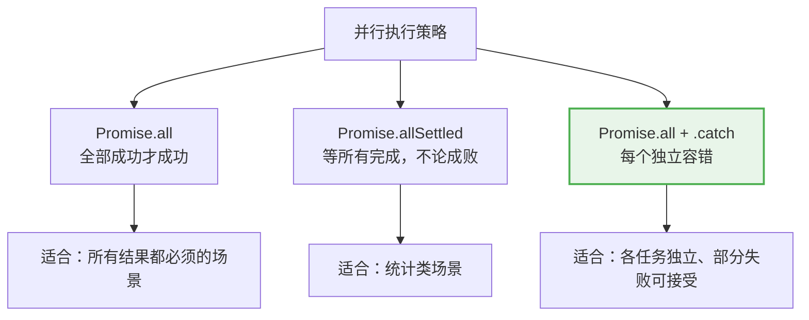
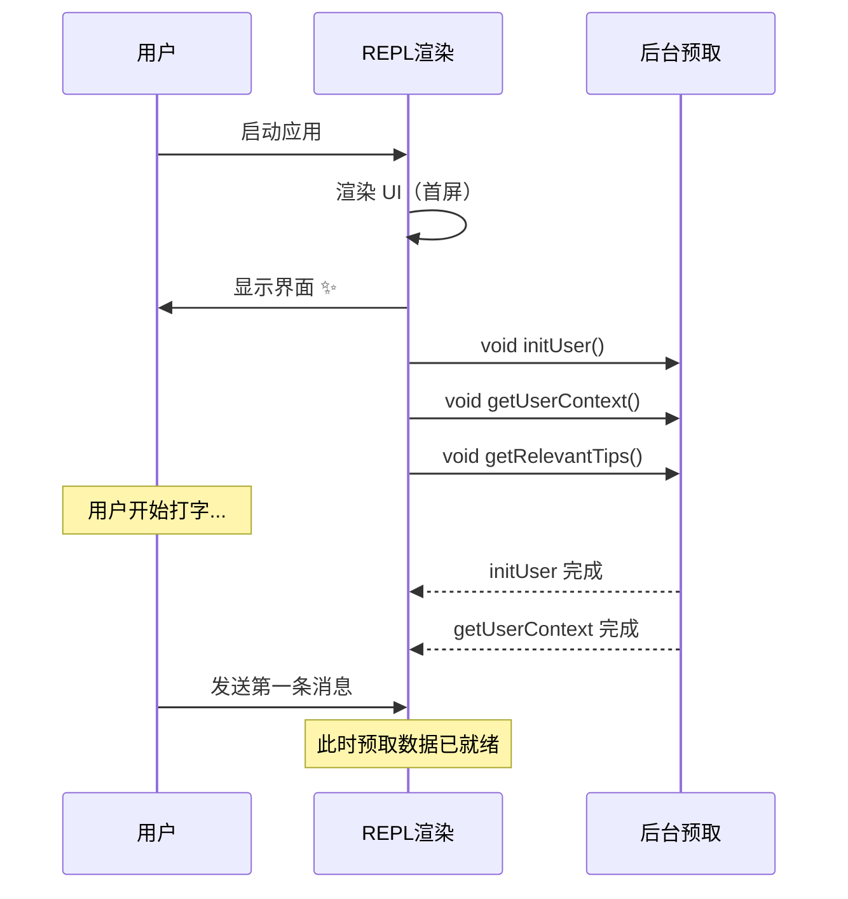
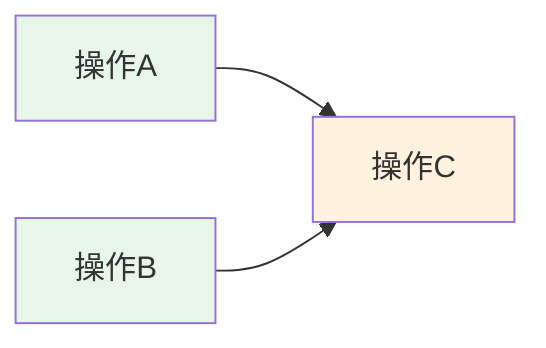

# 第2课：并行预取详解 —— Promise.all 实战

> 🎯 深入 Claude Code 的并行预取机制，掌握 Promise.all 的高级用法

---

## 📋 学习目标

1. 理解串行 vs 并行执行的本质区别
2. 掌握 `Promise.all` 在真实项目中的使用模式
3. 学会并行任务的错误处理策略
4. 理解 Claude Code 的「先渲染后加载」架构
5. 能够将串行异步代码重构为并行

---

## 🌍 生活类比：网购取快递

**串行模式**：你要取 3 个快递，每次走到快递柜、取出来、走回家，再去取下一个。
- 取快递A：10分钟 → 取快递B：10分钟 → 取快递C：10分钟 = **30分钟**

**并行模式**：你让室友帮忙，三个人同时去不同的快递柜取。
- 三人同时出发 → 最慢的那个人 10 分钟回来 = **10分钟**

**附带容错**：如果其中一个快递柜坏了（失败），其他两个快递不受影响。

这就是 `Promise.all` 的核心思想！

---

## 🔍 真实源码解析

### 模式一：启动时的并行预取

Claude Code 在 `main.tsx` 中的 `logStartupTelemetry` 函数展示了经典的并行预取：

```typescript
// main.tsx 中的启动遥测并行预取
async function logStartupTelemetry(): Promise<void> {
  if (isAnalyticsDisabled()) return;

  // 三个独立的异步操作同时启动
  const [isGit, worktreeCount, ghAuthStatus] = await Promise.all([
    getIsGit(),         // 检查是否在 git 仓库中
    getWorktreeCount(), // 获取 worktree 数量
    getGhAuthStatus()   // 获取 GitHub 认证状态
  ]);

  logEvent('tengu_startup_telemetry', {
    is_git: isGit,
    worktree_count: worktreeCount,
    gh_auth_status: ghAuthStatus,
    // ...其他字段
  });
}
```

为什么这样好？因为这三个操作互相不依赖，串行执行纯粹是浪费时间：

```mermaid
gantt
    title 串行 vs 并行执行时间对比
    dateFormat X
    axisFormat %L ms

    section 串行执行
    getIsGit()        :a1, 0, 50
    getWorktreeCount() :a2, after a1, 80
    getGhAuthStatus()  :a3, after a2, 100

    section 并行执行
    getIsGit()        :b1, 0, 50
    getWorktreeCount() :b2, 0, 80
    getGhAuthStatus()  :b3, 0, 100
```



串行总耗时 = 50 + 80 + 100 = **230ms**
并行总耗时 = max(50, 80, 100) = **100ms** ✨ 节省了 56%！

### 模式二：技能和插件的并行加载

在 `commands.ts` 中，Claude Code 同样用 `Promise.all` 并行加载多个数据源：

```typescript
// commands.ts - 并行加载所有命令源
const loadAllCommands = memoize(async (cwd: string): Promise<Command[]> => {
  const [
    { skillDirCommands, pluginSkills, bundledSkills, builtinPluginSkills },
    pluginCommands,
    workflowCommands,
  ] = await Promise.all([
    getSkills(cwd),           // 加载技能目录命令
    getPluginCommands(),      // 加载插件命令
    getWorkflowCommands       // 加载工作流命令
      ? getWorkflowCommands(cwd)
      : Promise.resolve([]),
  ])

  return [
    ...bundledSkills,
    ...builtinPluginSkills,
    ...skillDirCommands,
    ...workflowCommands,
    ...pluginCommands,
    ...pluginSkills,
    ...COMMANDS(),
  ]
})
```

注意最后一个参数——如果 `getWorkflowCommands` 不存在（feature flag 未启用），就用 `Promise.resolve([])` 返回空数组，保持 `Promise.all` 的参数列表一致。

### 模式三：带容错的并行加载

再看 `getSkills` 函数，注意它如何处理每个并行任务的错误：

```typescript
// commands.ts - 带容错的并行加载
async function getSkills(cwd: string): Promise<{
  skillDirCommands: Command[]
  pluginSkills: Command[]
  bundledSkills: Command[]
  builtinPluginSkills: Command[]
}> {
  try {
    const [skillDirCommands, pluginSkills] = await Promise.all([
      // 每个异步操作都有独立的 .catch()
      getSkillDirCommands(cwd).catch(err => {
        logError(toError(err))
        logForDebugging(
          'Skill directory commands failed to load, continuing without them',
        )
        return []  // 失败了返回空数组，不影响其他
      }),
      getPluginSkills().catch(err => {
        logError(toError(err))
        logForDebugging('Plugin skills failed to load, continuing without them')
        return []  // 同样，失败了也返回空数组
      }),
    ])

    const bundledSkills = getBundledSkills()         // 同步操作
    const builtinPluginSkills = getBuiltinPluginSkillCommands()  // 同步操作

    return { skillDirCommands, pluginSkills, bundledSkills, builtinPluginSkills }
  } catch (err) {
    // 最外层兜底，永远不崩溃
    logError(toError(err))
    return {
      skillDirCommands: [],
      pluginSkills: [],
      bundledSkills: [],
      builtinPluginSkills: [],
    }
  }
}
```

---

## 📊 三种并行模式对比



Claude Code 最常使用的是**第三种模式**——`Promise.all` + 每个 Promise 独立 `.catch()`：

| 模式 | 一个任务失败的后果 | Claude Code 中的使用 |
|------|-------------------|---------------------|
| `Promise.all` | 整体失败 | 少用 |
| `Promise.allSettled` | 不影响，但需手动检查 | 偶尔用 |
| `Promise.all` + `.catch` | 不影响，自动降级为默认值 | **最常用** ✅ |

---

## 🎯 模式四：Fire-and-Forget（发射后不管）

有些预取操作不需要等待结果——只需要"启动就好"。Claude Code 用 `void` 表达这个意图：

```typescript
// main.tsx - 延迟预取，不等待结果
export function startDeferredPrefetches(): void {
  void initUser();                    // 不等待
  void getUserContext();              // 不等待
  prefetchSystemContextIfSafe();      // 不等待
  void getRelevantTips();             // 不等待

  void initializeAnalyticsGates();    // 不等待
  void prefetchOfficialMcpUrls();     // 不等待
  void refreshModelCapabilities();    // 不等待

  void settingsChangeDetector.initialize();  // 不等待
}
```

`void` 在这里的意思是："我知道这返回一个 Promise，但我故意不 await 它"。这些操作在后台悄悄执行，等到真正需要结果时，大概率已经完成了。



---

## 🎓 模式五：压缩后的并行恢复

`compact.ts` 中，对话压缩后需要恢复文件附件和异步 Agent 信息，也使用了并行：

```typescript
// services/compact/compact.ts - 并行生成附件
const [fileAttachments, asyncAgentAttachments] = await Promise.all([
  createPostCompactFileAttachments(
    preCompactReadFileState,
    context,
    POST_COMPACT_MAX_FILES_TO_RESTORE,
  ),
  createAsyncAgentAttachmentsIfNeeded(context),
])
```

这两个操作没有依赖关系：文件附件的生成和异步 Agent 状态的检查可以同时进行。

---

## 🔧 并行预取的设计原则

### 原则一：识别依赖关系



A 和 B 没有互相依赖 → **可以并行**
C 依赖 A 和 B 的结果 → **必须等 A、B 都完成后再执行**

### 原则二：降级策略

每个并行任务都要问自己：**如果它失败了，程序能继续运行吗？**

- ✅ 能 → 用 `.catch()` 返回默认值
- ❌ 不能 → 让错误冒泡，外层统一处理

### 原则三：预取时机

```
太早预取 → 浪费资源（可能用不到）
太晚预取 → 来不及完成（等于没预取）
刚好预取 → 用户不会注意到等待 ✨
```

Claude Code 的策略：**在 UI 首次渲染后、用户开始打字前**，是预取的黄金窗口。

---

## ✏️ 动手练习

### 练习1：改写串行代码

把以下串行代码改写为并行版本：

```javascript
async function loadDashboard() {
  const user = await fetchUser()
  const orders = await fetchOrders()
  const notifications = await fetchNotifications()
  const recommendations = await fetchRecommendations()

  return { user, orders, notifications, recommendations }
}
```

### 练习2：添加容错机制

在练习1的基础上，假设 `fetchRecommendations` 经常失败，但不影响核心功能。如何修改代码让推荐失败时返回空数组而不是让整个函数崩溃？

### 练习3：思考题

以下代码有什么问题？

```javascript
const results = await Promise.all([
  fetchUserProfile(),
  fetchUserPosts(userId),  // userId 从 fetchUserProfile 返回
])
```

**提示**：考虑 `userId` 的来源。

---

## 📝 本课小结

| 要点 | 说明 |
|------|------|
| `Promise.all` | 等待所有 Promise 完成，任一失败则整体失败 |
| 独立 `.catch()` | 每个 Promise 独立容错，失败时返回默认值 |
| Fire-and-Forget | 用 `void` 启动后台任务，不阻塞主流程 |
| 依赖分析 | 没有依赖关系的操作才能并行 |
| 预取时机 | 在用户无感的时间窗口内完成后台加载 |

---

## 👉 下节预告

**第3课：懒加载策略 —— 动态 import() 的艺术**

我们将学习：
- `import()` 动态导入 vs `import` 静态导入的区别
- Claude Code 如何用懒加载推迟加载 113KB 的 insights 模块
- 懒加载的封装模式：shim 代理
- 何时该懒加载、何时不该

---

> 💡 **学习提示**：打开 `commands.ts` 的 `getSkills` 函数，尝试画出其异步操作的依赖图。哪些是并行的？哪些有先后关系？
