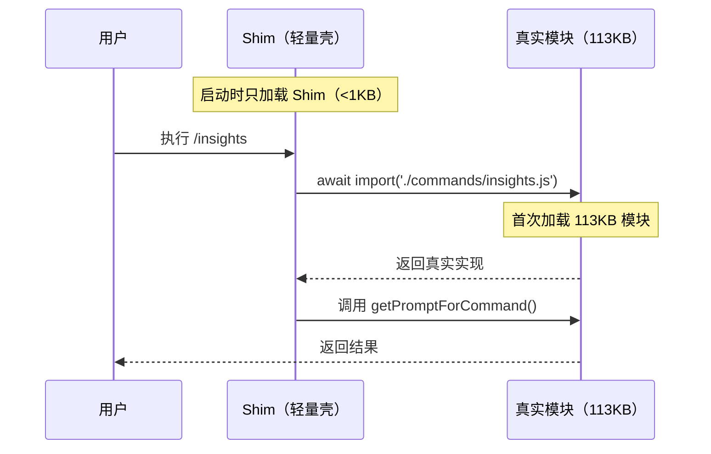
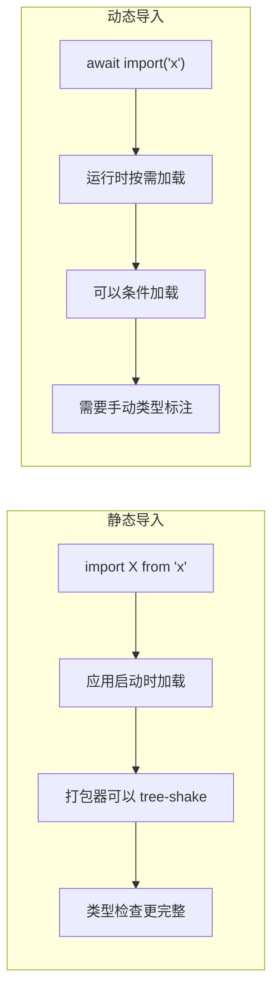
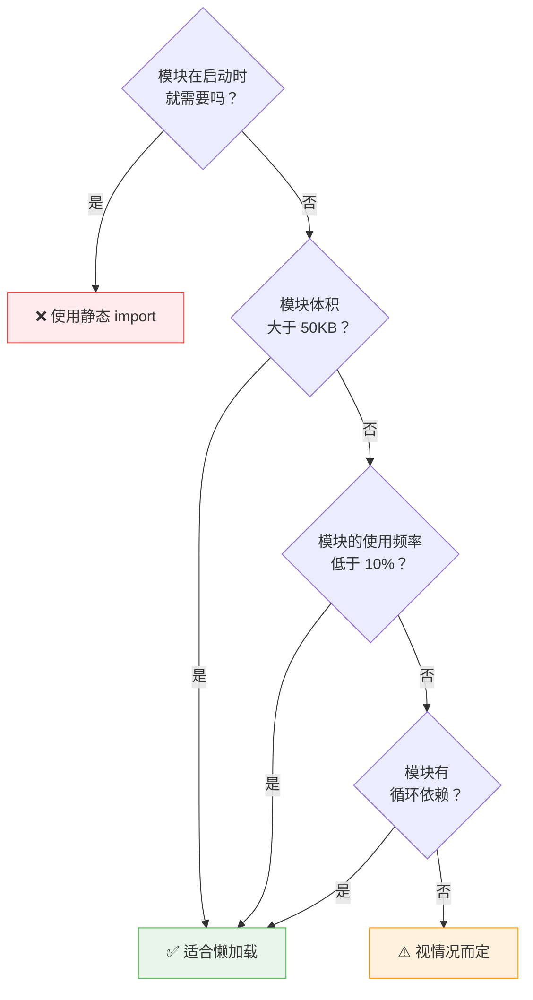

# 第3课：懒加载策略 —— 动态 import() 的艺术

> 🎯 学习 Claude Code 如何通过动态导入推迟非核心模块的加载

---

## 📋 学习目标

1. 区分静态 `import` 和动态 `import()` 的工作方式
2. 理解懒加载对应用启动速度的影响
3. 掌握"Shim 代理"懒加载封装模式
4. 学会判断哪些模块适合懒加载
5. 了解动态 `import()` 的常见陷阱

---

## 🌍 生活类比：自助餐厅 vs 点餐厅

**静态导入（`import`）** 就像自助餐厅——开门之前，所有菜品都要全部摆出来。哪怕 90% 的客人不会吃刺身，你也得提前准备。

**动态导入（`import()`）** 就像点餐厅——菜单上列着所有菜品，但只有客人点了才开始做。没人点的菜不浪费食材和时间。

在 Claude Code 中，有些模块体积很大但使用频率很低，把它们从"自助餐"改成"点餐"，能显著加快启动速度。

---

## 🔍 真实源码解析

### 案例一：113KB 的 insights 模块

Claude Code 的 `/insights` 命令用于生成使用报告，但 99% 的用户在普通对话中不会用到。这个模块有 3200 行、113KB 大小。看看源码怎么处理的：

```typescript
// commands.ts 第188-202行
// insights.ts 是 113KB（3200行，包含 diffLines/html 渲染）。
// 懒加载 shim 将重模块推迟到 /insights 真正被调用时。
const usageReport: Command = {
  type: 'prompt',
  name: 'insights',
  description: 'Generate a report analyzing your Claude Code sessions',
  contentLength: 0,
  progressMessage: 'analyzing your sessions',
  source: 'builtin',
  async getPromptForCommand(args, context) {
    // 只有在用户真正执行 /insights 时，才动态加载这个大模块
    const real = (await import('./commands/insights.js')).default
    if (real.type !== 'prompt') throw new Error('unreachable')
    return real.getPromptForCommand(args, context)
  },
}
```

这就是**Shim 代理模式**——创建一个轻量的"壳"，它拥有和真实模块一样的接口，但内部在首次调用时才加载真正的实现。



### 案例二：循环依赖的懒加载

有时候用懒加载不是为了性能，而是为了**解决循环依赖**问题：

```typescript
// main.tsx 第69-73行
// 懒加载 require 以避免循环依赖：teammate.ts -> AppState.tsx -> ... -> main.tsx
const getTeammateUtils = () =>
  require('./utils/teammate.js') as typeof import('./utils/teammate.js');
const getTeammatePromptAddendum = () =>
  require('./utils/swarm/teammatePromptAddendum.js') as typeof import('./utils/swarm/teammatePromptAddendum.js');
const getTeammateModeSnapshot = () =>
  require('./utils/swarm/backends/teammateModeSnapshot.js') as typeof import('./utils/swarm/backends/teammateModeSnapshot.js');
```

这里用函数包装 `require()`，只有在真正调用 `getTeammateUtils()` 时才执行加载，避免了模块初始化阶段的循环引用。

### 案例三：事件循环停顿检测器

只在内部构建版本中、且在渲染完成后才加载的模块：

```typescript
// main.tsx 第428-430行
// 事件循环停顿检测器
if ("external" === 'ant') {
  void import('./utils/eventLoopStallDetector.js')
    .then(m => m.startEventLoopStallDetector());
}
```

这里的 `void import(...)` 是一个经典的**Fire-and-Forget 懒加载**——在后台加载模块并启动，不阻塞任何东西。

### 案例四：微压缩模块的懒初始化

```typescript
// services/compact/microCompact.ts 第62-69行
// 懒初始化的缓存微压缩模块，避免在外部构建中导入
let cachedMCModule: typeof import('./cachedMicrocompact.js') | null = null

async function getCachedMCModule(): Promise<
  typeof import('./cachedMicrocompact.js')
> {
  if (!cachedMCModule) {
    cachedMCModule = await import('./cachedMicrocompact.js')
  }
  return cachedMCModule
}
```

这是一个**单例懒加载模式**——第一次调用时加载并缓存，后续调用直接返回缓存结果。

---

## 📊 静态导入 vs 动态导入对比



| 特性 | 静态 `import` | 动态 `import()` |
|------|--------------|----------------|
| 加载时机 | 应用启动 | 首次调用时 |
| 是否阻塞启动 | ✅ 是 | ❌ 否 |
| Tree-shaking | ✅ 支持 | ❌ 不支持 |
| 条件加载 | ❌ 不支持 | ✅ 支持 |
| 类型推断 | ✅ 自动 | ⚠️ 需要手动 |
| 返回值 | 模块导出 | `Promise<模块>` |

---

## 🎯 懒加载的四种封装模式

### 模式1：Shim 代理（Claude Code 最常用）

```typescript
const command: Command = {
  name: 'heavy-command',
  async execute() {
    const real = (await import('./heavy-module.js')).default
    return real.execute()
  }
}
```

### 模式2：单例缓存

```typescript
let _module: HeavyModule | null = null

async function getHeavyModule(): Promise<HeavyModule> {
  if (!_module) {
    _module = await import('./heavy-module.js')
  }
  return _module
}
```

### 模式3：函数包装 require

```typescript
const getModule = () =>
  require('./module.js') as typeof import('./module.js')

// 使用时
const utils = getModule()
utils.doSomething()
```

### 模式4：Fire-and-Forget

```typescript
void import('./background-module.js')
  .then(m => m.start())
```

---

## 🔧 判断是否适合懒加载的决策树



Claude Code 的懒加载决策标准：

1. **体积大**：insights.ts 有 113KB → 懒加载 ✅
2. **使用率低**：大多数用户不用 /insights → 懒加载 ✅
3. **有循环依赖**：teammate.ts 的循环引用 → 懒加载 ✅
4. **仅特定构建**：eventLoopStallDetector 仅内部版 → 懒加载 ✅

---

## ⚠️ 懒加载的注意事项

### 陷阱1：首次调用的延迟

```typescript
// 用户第一次执行 /insights 时会有明显的加载延迟
async getPromptForCommand(args, context) {
  const real = (await import('./commands/insights.js')).default
  // ☝️ 第一次调用时，用户需要等待 113KB 模块的解析和执行
}
```

**解决方案**：Claude Code 用 `progressMessage` 给用户反馈：

```typescript
progressMessage: 'analyzing your sessions',
```

### 陷阱2：类型安全

动态导入丢失了静态类型检查，需要手动断言：

```typescript
// 使用 typeof import() 确保类型安全
const getTeammateUtils = () =>
  require('./utils/teammate.js') as typeof import('./utils/teammate.js')
//                                ^^^^^^^^^^^^^^^^^^^^^^^^^^^^^^^^^^^^^^^^
//                                手动类型标注，确保类型正确
```

### 陷阱3：错误处理

动态导入可能失败（文件不存在、网络错误等），需要合适的兜底：

```typescript
try {
  const module = await import('./optional-module.js')
  module.init()
} catch (err) {
  console.warn('Optional module not available, continuing without it')
}
```

---

## ✏️ 动手练习

### 练习1：实现 Shim 代理

假设你有一个 `ChartRenderer` 模块（200KB），仅在用户点击"查看报表"时才需要。请实现一个 Shim 代理：

```typescript
// 原始代码
import { ChartRenderer } from './chart-renderer.js'

export function showReport(data) {
  const chart = new ChartRenderer()
  chart.render(data)
}

// 请改写为懒加载版本 👇
```

### 练习2：单例缓存模式

将以下代码改写为单例缓存的懒加载模式：

```typescript
import { HeavyParser } from './heavy-parser.js'

export function parseDocument(doc) {
  const parser = new HeavyParser()
  return parser.parse(doc)
}
```

### 练习3：思考题

下面的懒加载实现有什么问题？

```typescript
let module = null

async function getModule() {
  module = await import('./module.js')
  return module
}

// 并发调用
const [a, b] = await Promise.all([
  getModule(),
  getModule(),
])
```

**提示**：考虑两次 `import()` 同时触发的情况。

---

## 📝 本课小结

| 要点 | 说明 |
|------|------|
| 动态 `import()` | 运行时按需加载，返回 Promise |
| Shim 代理模式 | 轻量壳 + 首次调用时加载真实实现 |
| 单例缓存 | 第一次加载后缓存，避免重复加载 |
| 适用场景 | 大模块、低频使用、循环依赖、条件构建 |
| 注意事项 | 首次延迟、类型安全、错误处理 |

---

## 👉 下节预告

**第4课：死代码消除 —— Bun feature() 编译时优化**

我们将学习：
- 什么是死代码消除（Dead Code Elimination）
- Bun 的 `feature()` 函数如何在编译时移除整块代码
- 条件编译 vs 运行时判断的区别
- feature flag 驱动的模块化架构

---

> 💡 **学习提示**：在 `commands.ts` 中搜索 `await import(`，统计有多少处使用了动态导入。想想为什么这些地方选择了懒加载而不是静态导入？
