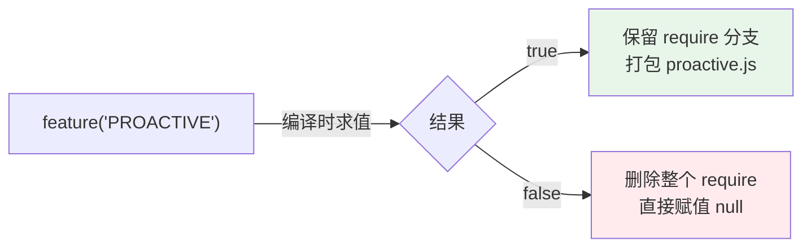
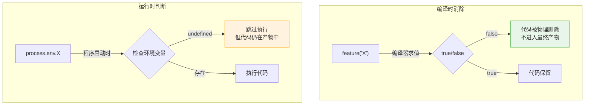
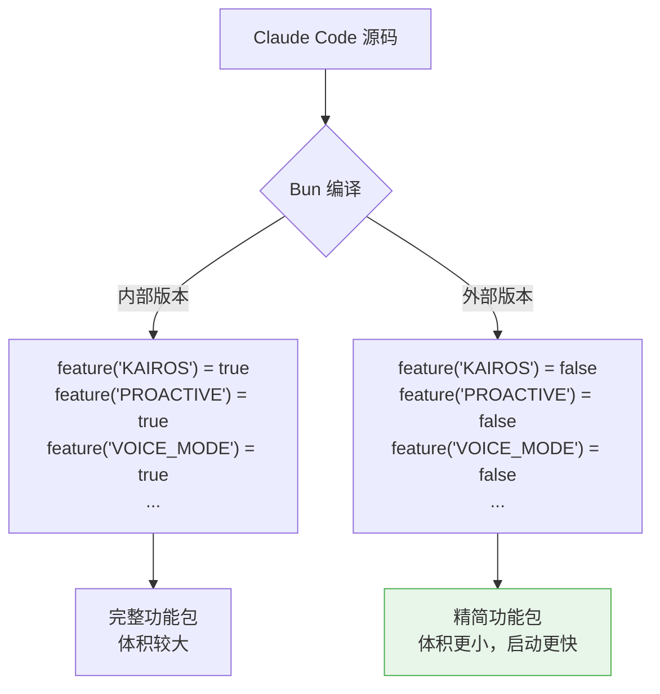
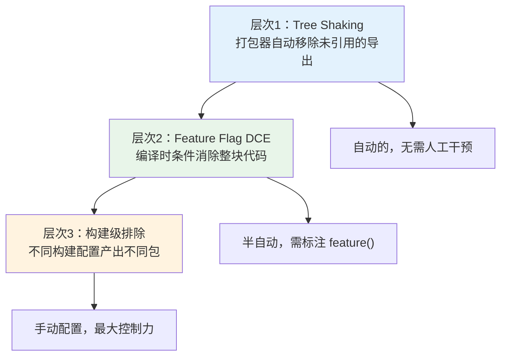

# 第4课：死代码消除 —— Bun feature() 编译时优化

> 🎯 理解 Claude Code 如何用 feature() 在编译时移除不需要的代码

---

## 📋 学习目标

1. 理解死代码消除（DCE）的概念和价值
2. 掌握 Bun `feature()` 函数的编译时行为
3. 区分编译时消除 vs 运行时条件判断
4. 了解 feature flag 在大型项目中的架构设计
5. 学会识别可以被消除的"死代码"模式

---

## 🌍 生活类比：精装房 vs 毛坯房

假设你买了一套精装房，开发商预装了：
- 中央空调系统 ✅ (你需要)
- 地暖系统 ✅ (你需要)
- 智能家居中控 ❌ (你不需要，但占了一面墙)
- 太阳能热水器 ❌ (你住低楼层，根本用不上)

如果开发商能在**交房之前**就把你不需要的东西拆掉，你的房子会更宽敞、装修成本更低。

**死代码消除就是在"交房"（编译打包）之前，把用不到的代码从最终产物中移除。**

---

## 🔍 真实源码解析

### Bun 的 `feature()` 函数

Claude Code 使用 Bun 打包器的 `feature()` 函数，这是一个**编译时求值**的特殊函数：

```typescript
// commands.ts 第59行
import { feature } from 'bun:bundle'
```

`feature()` 在**编译时**（不是运行时！）被替换为 `true` 或 `false`。打包器看到 `false` 的分支后，会直接删除整个分支的代码。

### 案例一：PROACTIVE 功能的条件编译

```typescript
// commands.ts 第62-65行
const proactive =
  feature('PROACTIVE') || feature('KAIROS')
    ? require('./commands/proactive.js').default
    : null
```

**编译时处理过程：**



如果 `PROACTIVE` 和 `KAIROS` 在外部版本中都是 `false`，编译后代码变成：

```javascript
// 编译后（外部版本）
const proactive = null
// proactive.js 的整个模块都不会被打包！
```

### 案例二：大量 feature flag 守护的命令

```typescript
// commands.ts 第62-122行
const proactive = feature('PROACTIVE') || feature('KAIROS')
  ? require('./commands/proactive.js').default : null

const briefCommand = feature('KAIROS') || feature('KAIROS_BRIEF')
  ? require('./commands/brief.js').default : null

const assistantCommand = feature('KAIROS')
  ? require('./commands/assistant/index.js').default : null

const bridge = feature('BRIDGE_MODE')
  ? require('./commands/bridge/index.js').default : null

const voiceCommand = feature('VOICE_MODE')
  ? require('./commands/voice/index.js').default : null

const forceSnip = feature('HISTORY_SNIP')
  ? require('./commands/force-snip.js').default : null

const workflowsCmd = feature('WORKFLOW_SCRIPTS')
  ? (require('./commands/workflows/index.js')).default : null

const webCmd = feature('CCR_REMOTE_SETUP')
  ? (require('./commands/remote-setup/index.js')).default : null

// ... 还有很多
```

每一个 `feature()` 守护的 `require()` 在编译时都会被评估。对于外部发布版本，大量内部功能（KAIROS、BRIDGE_MODE、VOICE_MODE 等）的代码会被完全移除。

### 案例三：query.ts 中的编译时优化

```typescript
// query.ts 第15-21行
const reactiveCompact = feature('REACTIVE_COMPACT')
  ? (require('./services/compact/reactiveCompact.js'))
  : null

const contextCollapse = feature('CONTEXT_COLLAPSE')
  ? (require('./services/contextCollapse/index.js'))
  : null
```

```typescript
// query.ts 第401-410行
if (feature('HISTORY_SNIP')) {
  queryCheckpoint('query_snip_start')
  const snipResult = snipModule!.snipCompactIfNeeded(messagesForQuery)
  messagesForQuery = snipResult.messages
  snipTokensFreed = snipResult.tokensFreed
  if (snipResult.boundaryMessage) {
    yield snipResult.boundaryMessage
  }
  queryCheckpoint('query_snip_end')
}
```

注意 `if (feature('HISTORY_SNIP'))` ——如果这个 feature 是 `false`，整个 `if` 块在编译后就消失了，不会产生任何运行时开销。

### 案例四：compact.ts 中的条件逻辑

```typescript
// services/compact/compact.ts 第698行
if (feature('PROMPT_CACHE_BREAK_DETECTION')) {
  notifyCompaction(
    context.options.querySource ?? 'compact',
    context.agentId,
  )
}
```

```typescript
// services/compact/compact.ts 第715-717行
if (feature('KAIROS')) {
  void sessionTranscriptModule?.writeSessionTranscriptSegment(messages)
}
```

---

## 📊 编译时消除 vs 运行时判断



| 特性 | 编译时消除 (`feature()`) | 运行时判断 (`process.env`) |
|------|------------------------|--------------------------|
| 代码在产物中 | ❌ 不存在 | ✅ 存在 |
| 依赖的模块 | 不被打包 | 仍被打包 |
| 包体积影响 | ✅ 减小 | ❌ 不变 |
| 灵活性 | 编译时固定 | 运行时可变 |
| 性能开销 | 零 | 极小（一次判断） |

**重点**：运行时判断虽然可以跳过执行，但 `require()` 引入的模块仍然会被打包进最终产物。编译时消除则是从根本上移除代码和依赖。

---

## 🎯 Claude Code 的 Feature Flag 架构

Claude Code 使用 feature flag 来管理内部版本和外部版本的差异：



外部版本通过编译时消除，可能减少几十个模块的打包，显著减小最终产物体积。

### Feature Flag 的命名规范

从源码中可以看到 Claude Code 的 feature flag 命名清晰有意义：

| Feature Flag | 功能描述 |
|-------------|---------|
| `PROACTIVE` | 主动式建议功能 |
| `KAIROS` | 助手模式 |
| `VOICE_MODE` | 语音模式 |
| `BRIDGE_MODE` | 桥接远程模式 |
| `HISTORY_SNIP` | 历史裁剪 |
| `REACTIVE_COMPACT` | 响应式压缩 |
| `CACHED_MICROCOMPACT` | 缓存微压缩 |
| `EXPERIMENTAL_SKILL_SEARCH` | 实验性技能搜索 |
| `TOKEN_BUDGET` | Token 预算控制 |

---

## 🔧 与传统环境变量判断的混合使用

Claude Code 同时使用 feature flag（编译时）和环境变量（运行时）：

```typescript
// main.tsx 第48-52行 —— 运行时环境变量判断
const agentsPlatform =
  process.env.USER_TYPE === 'ant'
    ? require('./commands/agents-platform/index.js').default
    : null
```

这里用 `process.env.USER_TYPE` 而不是 `feature()`，因为用户类型是运行时才知道的信息。

**选择原则：**
- 编译前就确定的 → 用 `feature()`（更彻底）
- 运行时才知道的 → 用环境变量（更灵活）

---

## 📐 死代码消除的三个层次



Claude Code 主要使用**层次2**——通过 `feature()` 标注来指导编译器消除代码。

---

## ✏️ 动手练习

### 练习1：识别可消除代码

以下代码中，哪些可以用 feature flag 做编译时消除？

```typescript
import DevTools from './devtools'
import Analytics from './analytics'
import BetaFeature from './beta-feature'

function init() {
  if (process.env.NODE_ENV === 'development') {
    DevTools.enable()
  }

  if (process.env.ENABLE_ANALYTICS === 'true') {
    Analytics.init()
  }

  if (process.env.BETA_USERS?.includes(userId)) {
    BetaFeature.activate()
  }
}
```

### 练习2：改写为 feature() 模式

把以下代码改写成 Claude Code 的 feature flag 风格：

```typescript
import debugModule from './debug'

if (process.env.NODE_ENV !== 'production') {
  debugModule.enableVerboseLogging()
}
```

### 练习3：思考题

为什么 Claude Code 在 feature flag 为 `false` 时使用 `null` 而不是 `undefined`？

```typescript
const voiceCommand = feature('VOICE_MODE')
  ? require('./commands/voice/index.js').default
  : null  // 为什么用 null 而不是 undefined？
```

**提示**：看看后面代码中如何使用这些变量的——`...(voiceCommand ? [voiceCommand] : [])`

---

## 📝 本课小结

| 要点 | 说明 |
|------|------|
| 死代码消除 | 编译时移除不可能执行到的代码 |
| `feature()` | Bun 编译时求值函数，返回 true/false |
| 编译时 vs 运行时 | feature() 从产物中物理删除；env 只是跳过执行 |
| 包体积影响 | feature(false) 的分支及其依赖都不会被打包 |
| 设计原则 | 编译前确定的用 feature()，运行时才知的用 env |

---

## 👉 下节预告

**第5课：条件 Require —— 运行时按需加载**

我们将学习：
- `require()` 和 `import()` 在运行时的区别
- 条件 require 模式在 Claude Code 中的广泛应用
- 如何安全地在 TypeScript 中使用条件 require
- Feature flag + 条件 require 的组合拳

---

> 💡 **学习提示**：在 `commands.ts` 中数一下有多少个 `feature()` 调用。想象一下，如果所有 feature 都是 `false`，外部版本能删掉多少代码？
