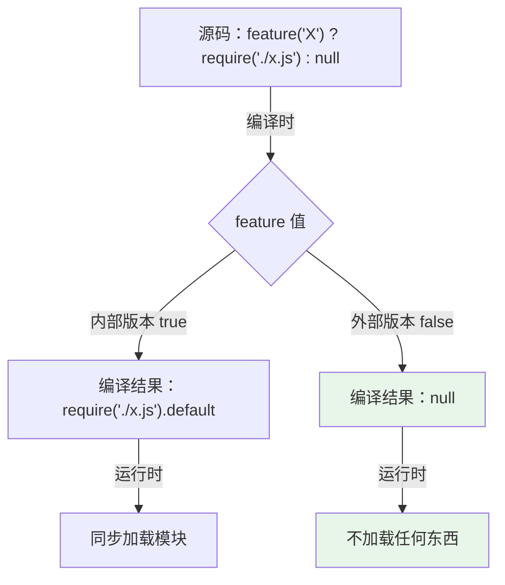
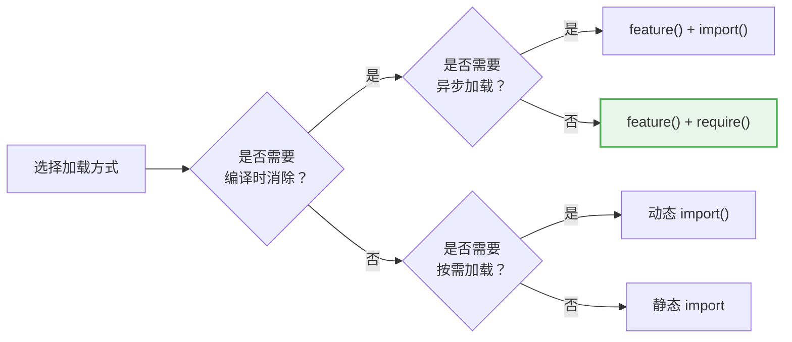

# 第5课：条件 Require —— 运行时按需加载

> 🎯 学习 Claude Code 如何结合 feature flag 和条件 require 实现精细控制的按需加载

---

## 📋 学习目标

1. 理解 `require()` 在条件语句中的行为特征
2. 掌握 feature flag + 条件 require 的组合模式
3. 学会在 TypeScript 中安全使用条件 require
4. 区分条件 require、动态 import 和静态 import 的适用场景
5. 理解 Claude Code 中 `eslint-disable` 注释的意义

---

## 🌍 生活类比：按需购买 vs 囤货

**静态 import** = 每周固定采购清单，不管用不用都买回来堆在冰箱里。

**条件 require** = 做菜前看食谱，需要什么调料再从柜子里拿。如果今天不做这道菜，那个调料就不用打开。

**关键区别**：静态 import 是"编译期决定"，条件 require 是"运行期决定"。当需要根据运行时条件（比如用户类型、环境变量）来决定是否加载某个模块时，条件 require 是最佳选择。

---

## 🔍 真实源码解析

### 模式一：feature() + require() 组合拳

这是 Claude Code 中最常见的模式——feature flag 在编译时决定是否保留 require 语句：

```typescript
// commands.ts 第62-122行
/* eslint-disable @typescript-eslint/no-require-imports */
const proactive =
  feature('PROACTIVE') || feature('KAIROS')
    ? require('./commands/proactive.js').default
    : null

const briefCommand =
  feature('KAIROS') || feature('KAIROS_BRIEF')
    ? require('./commands/brief.js').default
    : null

const assistantCommand = feature('KAIROS')
  ? require('./commands/assistant/index.js').default
  : null

const bridge = feature('BRIDGE_MODE')
  ? require('./commands/bridge/index.js').default
  : null
/* eslint-enable @typescript-eslint/no-require-imports */
```

注意 `eslint-disable` 和 `eslint-enable` 的成对使用——TypeScript 的 ESLint 默认不允许使用 `require()`，但 Claude Code 特意在这些地方关闭检查，因为这是深思熟虑的设计选择。

### 工作原理



这里有两层优化：
1. **编译时**：`feature()` 为 false 时，整个 require 语句被删除
2. **运行时**（feature 为 true 时）：require 只在此处执行一次，结果被变量缓存

### 模式二：环境变量 + require()

当判断条件是运行时才知道的值时，不能用 feature()，要用环境变量：

```typescript
// commands.ts 第48-52行
/* eslint-disable @typescript-eslint/no-require-imports */
const agentsPlatform =
  process.env.USER_TYPE === 'ant'
    ? require('./commands/agents-platform/index.js').default
    : null
/* eslint-enable @typescript-eslint/no-require-imports */
```

`process.env.USER_TYPE` 是运行时值，不能在编译时确定。但 require 仍然只在条件为 true 时执行。

### 模式三：延迟函数包装

有时候不是在模块顶层决定，而是在需要时才去加载：

```typescript
// main.tsx 第69-73行
// 懒加载 require 以避免循环依赖
const getTeammateUtils = () =>
  require('./utils/teammate.js') as typeof import('./utils/teammate.js')
const getTeammatePromptAddendum = () =>
  require('./utils/swarm/teammatePromptAddendum.js')
    as typeof import('./utils/swarm/teammatePromptAddendum.js')
```

这个模式的巧妙之处在于：
- **函数不执行，require 就不执行**——真正的按需加载
- **`as typeof import(...)`**——保持完整的类型安全
- **解决循环依赖**——延迟加载打破了模块初始化的循环

### 模式四：编译时守护的运行时模块

query.ts 中展示了一种双层保护模式：

```typescript
// query.ts 第14-21行
const reactiveCompact = feature('REACTIVE_COMPACT')
  ? (require('./services/compact/reactiveCompact.js')
     as typeof import('./services/compact/reactiveCompact.js'))
  : null

const contextCollapse = feature('CONTEXT_COLLAPSE')
  ? (require('./services/contextCollapse/index.js')
     as typeof import('./services/contextCollapse/index.js'))
  : null
```

后面使用时再加一层检查：

```typescript
// query.ts 第440-447行
if (feature('CONTEXT_COLLAPSE') && contextCollapse) {
  const collapseResult = await contextCollapse.applyCollapsesIfNeeded(
    messagesForQuery,
    toolUseContext,
    querySource,
  )
  messagesForQuery = collapseResult.messages
}
```

注意 `feature('CONTEXT_COLLAPSE') && contextCollapse`——既有编译时 feature 检查，又有运行时 null 检查。这种**双重守护**模式非常安全。

### 模式五：条件 require 在 compact prompt 中

```typescript
// services/compact/prompt.ts 第4-10行
const proactiveModule =
  feature('PROACTIVE') || feature('KAIROS')
    ? (require('../../proactive/index.js')
       as typeof import('../../proactive/index.js'))
    : null
```

---

## 📊 三种加载方式全面对比

| 特性 | 静态 import | 动态 import() | 条件 require |
|------|------------|--------------|-------------|
| 语法 | `import X from 'x'` | `await import('x')` | `require('x')` |
| 执行时机 | 模块初始化时 | 调用时（异步） | 调用时（同步） |
| 是否阻塞 | 是 | 否（返回 Promise） | 是（同步执行） |
| Tree-shaking | ✅ | ❌ | ❌ |
| 与 feature() 配合 | ❌ | ✅ | ✅ |
| 类型安全 | 自动 | 需手动标注 | 需 `as typeof import()` |
| 循环依赖 | ❌ 可能出问题 | ✅ 可以解决 | ✅ 可以解决 |



---

## 🎯 为什么 Claude Code 更偏爱 require() 而非 import()？

在 feature flag 场景中，Claude Code 大量使用 `require()` 而非 `import()`。原因：

### 1. 同步执行

```typescript
// require：立即可用，无需 await
const module = feature('X') ? require('./x.js') : null
// module 已经加载完成，可以直接使用

// import()：需要 await，必须在 async 函数中
const module = feature('X') ? await import('./x.js') : null
// 不能在模块顶层使用（除非 top-level await）
```

### 2. 模块顶层可用

```typescript
// 这些变量在模块加载时就有值了
const proactive = feature('PROACTIVE')
  ? require('./commands/proactive.js').default
  : null

// 后续代码可以立即使用
const COMMANDS = memoize((): Command[] => [
  ...(proactive ? [proactive] : []),
  // ...
])
```

### 3. 配合 feature() 的编译时消除

在外部版本中，当 `feature('X')` 为 false：
- **整个三元表达式** 被替换为 `null`
- `require('./x.js')` 被删除
- 模块 `x.js` 不会被打包

效果等同于这个模块从未存在过。

---

## 🔧 TypeScript 中安全使用条件 require 的模式

### 类型标注技巧

```typescript
// 使用 as typeof import() 获得完整类型推断
const module = feature('X')
  ? (require('./module.js') as typeof import('./module.js'))
  : null

// 现在 module 的类型是 typeof import('./module.js') | null
// TypeScript 知道它的所有方法和属性
```

### ESLint 配合

```typescript
// 成对使用 eslint-disable/enable
/* eslint-disable @typescript-eslint/no-require-imports */
const mod = feature('X') ? require('./x.js') : null
/* eslint-enable @typescript-eslint/no-require-imports */
```

Claude Code 源码中严格遵循这个模式——每个 `require()` 区块都用 eslint 注释包裹，表明这是经过审查的有意为之。

---

## ⚠️ 常见陷阱

### 陷阱1：在循环中 require

```typescript
// ❌ 不好：每次循环都执行 require
for (const item of items) {
  const module = require('./processor.js')
  module.process(item)
}

// ✅ 好：提前加载，循环中使用
const module = require('./processor.js')
for (const item of items) {
  module.process(item)
}
```

### 陷阱2：忘记 null 检查

```typescript
// ❌ 危险：如果 feature 为 false，调用 null 的方法
const mod = feature('X') ? require('./x.js') : null
mod.doSomething()  // TypeError: Cannot read properties of null

// ✅ 安全：先检查
if (feature('X') && mod) {
  mod.doSomething()
}
```

### 陷阱3：混淆编译时和运行时

```typescript
// ❌ 错误：把运行时值当编译时值用
const mod = feature(process.env.MY_FLAG)  // feature() 不接受运行时值！
  ? require('./x.js')
  : null

// ✅ 正确：feature() 只接受编译时常量字符串
const mod = feature('MY_FLAG')
  ? require('./x.js')
  : null
```

---

## ✏️ 动手练习

### 练习1：重构为条件 require

将以下代码重构为 feature flag + 条件 require 模式：

```typescript
import DebugPanel from './debug-panel'
import PerformanceMonitor from './perf-monitor'
import ExperimentalEditor from './experimental-editor'

function initApp() {
  if (isDev) DebugPanel.mount()
  if (isDev) PerformanceMonitor.start()
  if (isExperiment) ExperimentalEditor.enable()
}
```

### 练习2：双重守护模式

为以下代码添加编译时 + 运行时的双重守护：

```typescript
const analyticsModule = feature('ANALYTICS')
  ? require('./analytics.js')
  : null

function trackEvent(name: string) {
  // 请补充安全的调用代码
}
```

### 练习3：思考题

为什么 Claude Code 在 `commands.ts` 的命令列表中使用展开运算符？

```typescript
const COMMANDS = memoize((): Command[] => [
  addDir,
  advisor,
  // ... 固定命令 ...
  ...(proactive ? [proactive] : []),
  ...(briefCommand ? [briefCommand] : []),
  ...(bridge ? [bridge] : []),
])
```

如果 `proactive` 是 `null`，`[null]` 和 `[]` 有什么区别？

---

## 📝 本课小结

| 要点 | 说明 |
|------|------|
| 条件 require | 运行时按条件同步加载模块 |
| feature() + require() | 编译时消除 + 运行时同步加载的组合 |
| 类型安全 | 使用 `as typeof import()` 保持类型推断 |
| 双重守护 | `feature('X') && module` 编译时+运行时双保险 |
| ESLint 标注 | 成对使用 disable/enable 标注有意的 require |

---

## 👉 下节预告

**第6课：上下文压缩算法深入解析**

我们将学习：
- AI 对话中"上下文窗口"的概念
- Claude Code 的自动压缩（autoCompact）触发机制
- 对话摘要生成的 prompt 设计
- 压缩后如何恢复关键文件上下文

---

> 💡 **学习提示**：在 `query.ts` 文件开头，找到所有用 `feature()` 守护的条件 require。画一张图，标出哪些模块在外部版本中会被移除。
