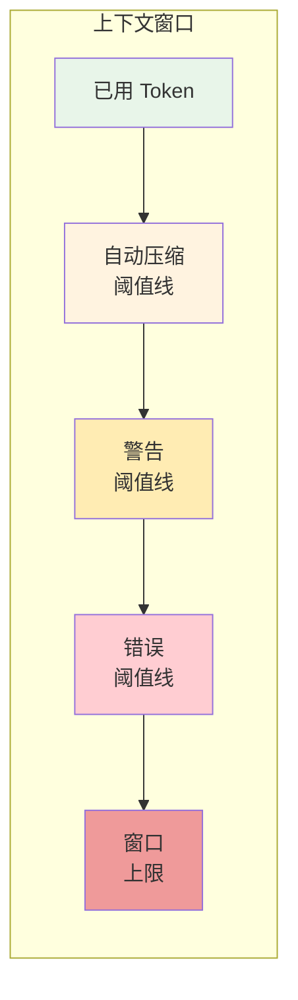
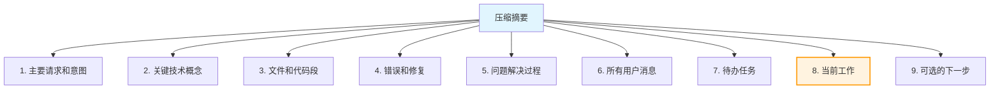
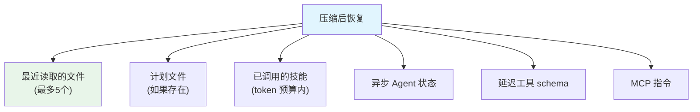
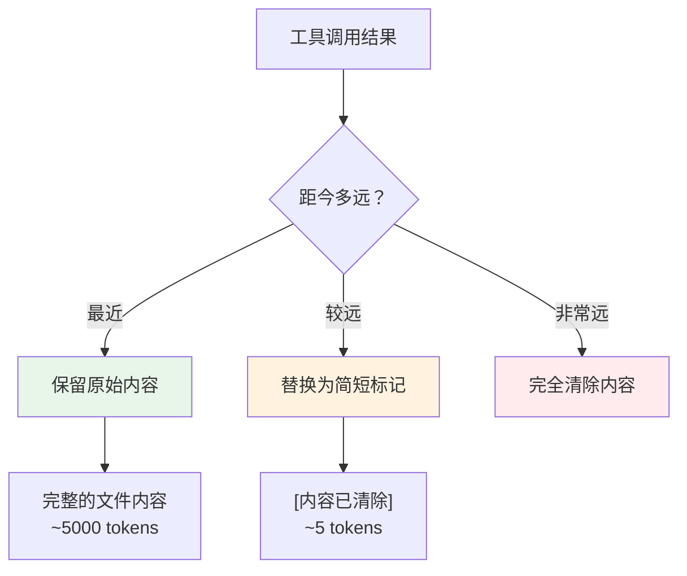
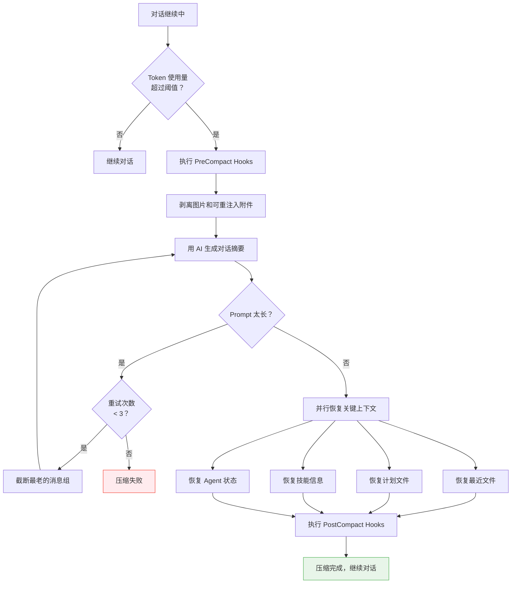

# 第6课：上下文压缩算法深入解析

> 🎯 深入理解 Claude Code 如何通过上下文压缩控制 Token 成本和对话质量

---

## 📋 学习目标

1. 理解 AI 对话中"上下文窗口"的限制
2. 掌握 Claude Code 自动压缩的触发机制
3. 了解压缩 prompt 的设计思路
4. 学会压缩后上下文恢复的策略
5. 理解微压缩（MicroCompact）的工作原理

---

## 🌍 生活类比：笔记本写满了

想象你在用一个笔记本记录老师的课堂讲解：

- 刚开始，笔记本空白页很多，你逐字记录 📝
- 慢慢地，写了大半本了，空间开始紧张 ⚠️
- 快写满时，你怎么办？

**方法一（暴力）**：撕掉前面几页 → 丢失重要信息 ❌
**方法二（摘要）**：在新的一页上写前面所有内容的摘要，然后把旧页取出 ✅

Claude Code 的上下文压缩就是**方法二**——把长长的对话历史浓缩成一段精练的摘要，为新的对话腾出空间。

---

## 🔍 真实源码解析

### 1. 自动压缩的触发机制

Claude Code 通过 Token 使用量来决定何时触发自动压缩：

```typescript
// services/compact/autoCompact.ts
// 为摘要输出预留的 token 数
const MAX_OUTPUT_TOKENS_FOR_SUMMARY = 20_000

export function getEffectiveContextWindowSize(model: string): number {
  const reservedTokensForSummary = Math.min(
    getMaxOutputTokensForModel(model),
    MAX_OUTPUT_TOKENS_FOR_SUMMARY,
  )
  let contextWindow = getContextWindowForModel(model, getSdkBetas())
  return contextWindow - reservedTokensForSummary
}
```

```typescript
// 关键阈值常量
export const AUTOCOMPACT_BUFFER_TOKENS = 13_000
export const WARNING_THRESHOLD_BUFFER_TOKENS = 20_000
export const ERROR_THRESHOLD_BUFFER_TOKENS = 20_000

// 连续失败的断路器
const MAX_CONSECUTIVE_AUTOCOMPACT_FAILURES = 3

export function getAutoCompactThreshold(model: string): number {
  const effectiveContextWindow = getEffectiveContextWindowSize(model)
  return effectiveContextWindow - AUTOCOMPACT_BUFFER_TOKENS
}
```

用一张图来理解这些阈值的关系：



| 阈值 | 计算方式 | 触发行为 |
|------|---------|---------|
| 自动压缩阈值 | 上下文窗口 - 13,000 | 自动触发压缩 |
| 警告阈值 | 上下文窗口 - 20,000 | 显示黄色警告 |
| 错误阈值 | 上下文窗口 - 20,000 | 显示红色警告 |

### 2. 压缩 Prompt 的设计

Claude Code 使用精心设计的 prompt 来指导 AI 生成高质量的摘要：

```typescript
// services/compact/prompt.ts
const BASE_COMPACT_PROMPT = `Your task is to create a detailed summary of
the conversation so far, paying close attention to the user's explicit
requests and your previous actions.

This summary should be thorough in capturing technical details, code
patterns, and architectural decisions that would be essential for
continuing development work without losing context.`
```

摘要需要包含 **9 个关键部分**：



特别注意第 8 项"当前工作"——这是保证压缩后 AI 能继续之前工作的关键：

```
8. Current Work: Describe in detail precisely what was being worked on
   immediately before this summary request, paying special attention to
   the most recent messages from both user and assistant. Include file
   names and code snippets where applicable.
```

### 3. 分析-摘要两阶段生成

压缩使用了一个巧妙的"先分析、再摘要"的两阶段 prompt：

```typescript
// services/compact/prompt.ts
const DETAILED_ANALYSIS_INSTRUCTION_BASE = `Before providing your final
summary, wrap your analysis in <analysis> tags to organize your thoughts
and ensure you've covered all necessary points. In your analysis process:

1. Chronologically analyze each message and section of the conversation.
   For each section thoroughly identify:
   - The user's explicit requests and intents
   - Your approach to addressing the user's requests
   - Key decisions, technical concepts and code patterns
   - Specific details like:
     - file names
     - full code snippets
     - function signatures
     - file edits
   - Errors that you ran into and how you fixed them
2. Double-check for technical accuracy and completeness.`
```

`<analysis>` 标签中的内容是"草稿"，最终会被格式化函数剥离——模型先用分析来组织思路，然后生成结构化的 `<summary>` 输出。

### 4. 压缩后的上下文恢复

压缩不是简单地丢弃旧消息。Claude Code 会在压缩后恢复关键上下文：

```typescript
// services/compact/compact.ts
export const POST_COMPACT_MAX_FILES_TO_RESTORE = 5
export const POST_COMPACT_TOKEN_BUDGET = 50_000
export const POST_COMPACT_MAX_TOKENS_PER_FILE = 5_000
export const POST_COMPACT_MAX_TOKENS_PER_SKILL = 5_000
export const POST_COMPACT_SKILLS_TOKEN_BUDGET = 25_000
```

压缩后的恢复操作也是**并行**执行的：

```typescript
// services/compact/compact.ts 第532-539行
// 并行生成文件附件和异步 Agent 附件
const [fileAttachments, asyncAgentAttachments] = await Promise.all([
  createPostCompactFileAttachments(
    preCompactReadFileState,
    context,
    POST_COMPACT_MAX_FILES_TO_RESTORE,
  ),
  createAsyncAgentAttachmentsIfNeeded(context),
])
```

恢复的内容包括：



### 5. 图片剥离优化

压缩前还有一个重要优化——剥离图片数据：

```typescript
// services/compact/compact.ts 第145-200行
export function stripImagesFromMessages(messages: Message[]): Message[] {
  return messages.map(message => {
    if (message.type !== 'user') return message

    const content = message.message.content
    if (!Array.isArray(content)) return message

    let hasMediaBlock = false
    const newContent = content.flatMap(block => {
      if (block.type === 'image') {
        hasMediaBlock = true
        return [{ type: 'text' as const, text: '[image]' }]
      }
      if (block.type === 'document') {
        hasMediaBlock = true
        return [{ type: 'text' as const, text: '[document]' }]
      }
      return [block]
    })

    if (!hasMediaBlock) return message

    return {
      ...message,
      message: { ...message.message, content: newContent },
    } as typeof message
  })
}
```

图片不需要用于生成摘要，但会占用大量 token。用 `[image]` 文本标记替代，摘要中仍然能注明"用户分享了一张图片"。

---

## 📊 微压缩（MicroCompact）

除了整体压缩，Claude Code 还有一个更轻量的**微压缩**机制——不是压缩整段对话，而是压缩单个工具调用的结果：

```typescript
// services/compact/microCompact.ts
// 只压缩这些工具的输出
const COMPACTABLE_TOOLS = new Set<string>([
  FILE_READ_TOOL_NAME,     // 文件读取
  ...SHELL_TOOL_NAMES,     // Shell 命令
  GREP_TOOL_NAME,          // 代码搜索
  GLOB_TOOL_NAME,          // 文件匹配
  WEB_SEARCH_TOOL_NAME,    // 网页搜索
  WEB_FETCH_TOOL_NAME,     // 网页获取
  FILE_EDIT_TOOL_NAME,     // 文件编辑
  FILE_WRITE_TOOL_NAME,    // 文件写入
])
```

微压缩的目标是：**把旧的、已经不重要的工具输出替换成更简短的表示**，比如把一个完整的文件读取结果替换成 `[Old tool result content cleared]`。



---

## 🎯 压缩的容错机制

### Prompt-too-long 重试

如果压缩请求本身的上下文太长，Claude Code 有一个"从头部截断"的重试机制：

```typescript
// services/compact/compact.ts 第243-291行
export function truncateHeadForPTLRetry(
  messages: Message[],
  ptlResponse: AssistantMessage,
): Message[] | null {
  const groups = groupMessagesByApiRound(input)
  if (groups.length < 2) return null

  const tokenGap = getPromptTooLongTokenGap(ptlResponse)
  let dropCount: number
  if (tokenGap !== undefined) {
    // 精确计算需要丢弃多少组
    let acc = 0
    dropCount = 0
    for (const g of groups) {
      acc += roughTokenCountEstimationForMessages(g)
      dropCount++
      if (acc >= tokenGap) break
    }
  } else {
    // 兜底：丢弃 20% 的最老消息组
    dropCount = Math.max(1, Math.floor(groups.length * 0.2))
  }

  // 至少保留一组消息用于摘要
  dropCount = Math.min(dropCount, groups.length - 1)
  return groups.slice(dropCount).flat()
}
```

### 断路器机制

连续失败超过 3 次，停止自动压缩以避免浪费 API 调用：

```typescript
// 连续自动压缩失败的断路器
const MAX_CONSECUTIVE_AUTOCOMPACT_FAILURES = 3
```

---

## 📐 完整的压缩流程



---

## ✏️ 动手练习

### 练习1：设计摘要 Prompt

假设你在开发一个客服聊天系统，需要在对话过长时压缩历史。请设计一个摘要 prompt，要求包含：
- 客户的主要问题
- 已尝试的解决方案
- 当前状态

### 练习2：计算压缩阈值

已知条件：
- 模型上下文窗口：200,000 tokens
- 摘要输出预留：20,000 tokens
- 自动压缩缓冲：13,000 tokens

请计算：
1. 有效上下文窗口大小 = ？
2. 自动压缩阈值 = ？
3. 如果当前对话使用了 170,000 tokens，会触发自动压缩吗？

### 练习3：思考题

为什么 Claude Code 要在压缩后恢复最近读取的文件内容？不恢复会有什么问题？

**提示**：想象 AI 在编辑一个文件的过程中触发了压缩……

---

## 📝 本课小结

| 要点 | 说明 |
|------|------|
| 上下文窗口 | AI 模型一次能处理的最大 token 数 |
| 自动压缩 | Token 使用超过阈值时自动触发 |
| 摘要设计 | 9 个关键部分，分析+摘要两阶段 |
| 上下文恢复 | 压缩后并行恢复文件、计划、技能等 |
| 微压缩 | 单个工具结果的轻量压缩 |
| 容错机制 | PTL 重试 + 断路器 |

---

## 👉 下节预告

**第7课：Prompt 缓存优化 —— 减少 API 调用成本**

我们将学习：
- Anthropic Prompt Cache 的工作原理
- Claude Code 如何检测和避免缓存中断
- 缓存友好的系统 prompt 设计
- 缓存共享策略的成本分析

---

> 💡 **学习提示**：打开 `services/compact/prompt.ts`，完整阅读压缩 prompt 的设计。思考为什么需要那么多指导信息？如果 prompt 太简短会怎样？
