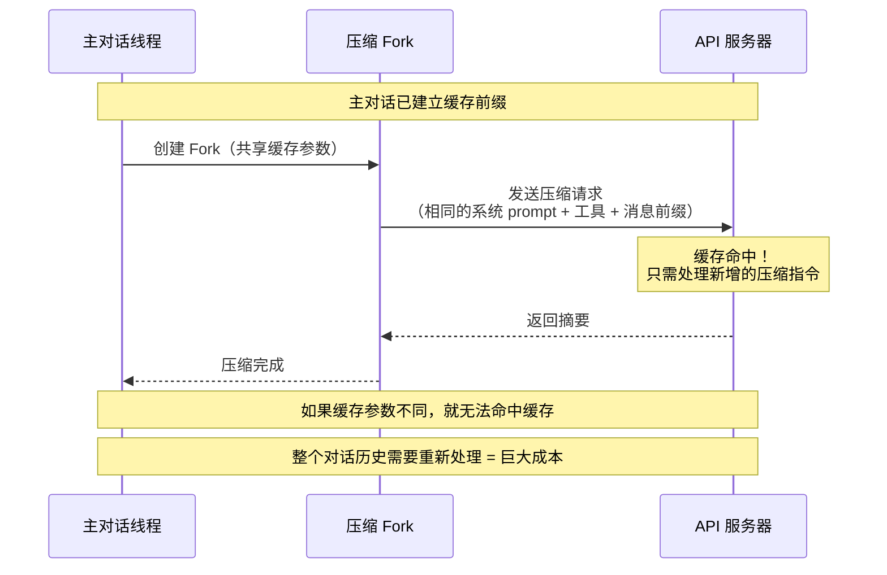
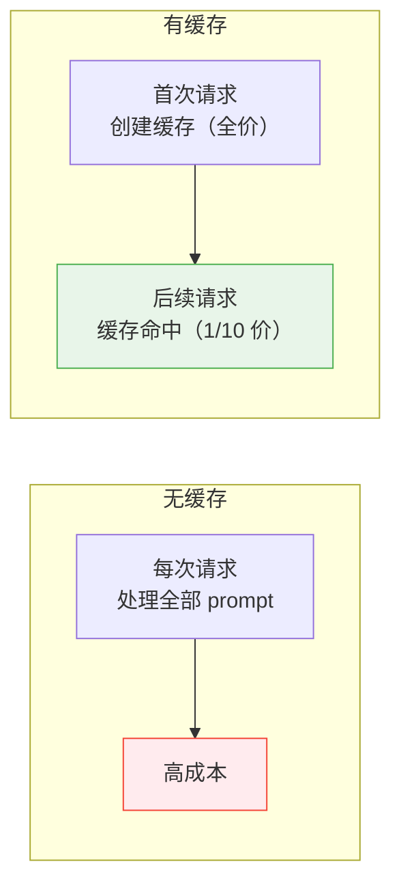
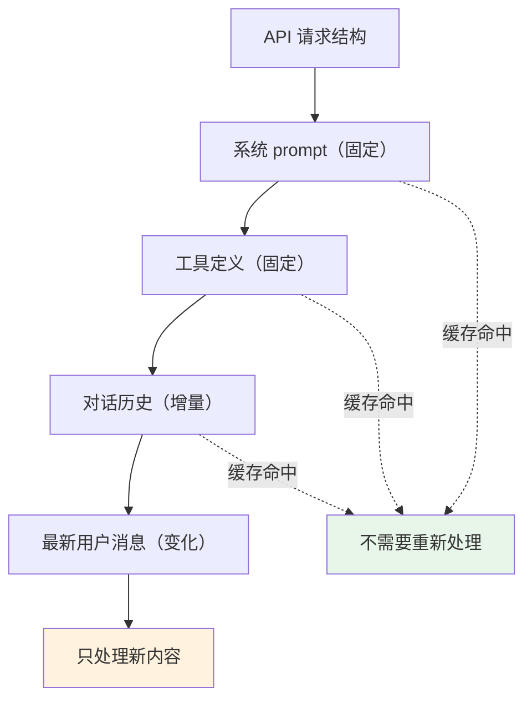

# 第7课：Prompt 缓存优化 —— 减少 API 调用成本

> 🎯 理解 Claude Code 如何利用 Prompt Cache 大幅降低 API 调用成本

---

## 📋 学习目标

1. 理解 Anthropic Prompt Cache 的基本原理
2. 学会什么是"缓存友好"的 API 调用模式
3. 掌握 Claude Code 的缓存中断检测机制
4. 了解压缩与缓存的冲突及解决方案
5. 认识缓存共享策略的成本分析方法

---

## 🌍 生活类比：续讲故事

想象你每天晚上给孩子讲故事，故事越来越长。

**没有缓存**：每次都要从第一页开始讲，即使孩子已经听过前面的部分。讲到第 100 集时，每晚要花 3 小时从头讲起，只是为了讲最新的 10 分钟。

**有缓存**：你们约定一个"书签"——孩子记住了书签之前的内容，你只需要从书签位置开始讲。每晚只花 10 分钟讲新内容！

**缓存中断**：如果你改了故事前面的某段话（比如主角换了个名字），书签就失效了——你得从改动的地方重新讲起。

Prompt Cache 的工作原理完全一样：API 服务器记住了之前处理过的 prompt 前缀，下次只要前缀相同，就不需要重新处理。

---

## 🔍 真实源码解析

### 1. 缓存中断检测系统

Claude Code 有一个完整的缓存中断检测系统，追踪可能导致缓存失效的所有变化：

```typescript
// services/api/promptCacheBreakDetection.ts
type PreviousState = {
  systemHash: number          // 系统 prompt 的 hash
  toolsHash: number           // 工具 schema 的 hash
  cacheControlHash: number    // 缓存控制参数的 hash
  toolNames: string[]         // 工具名称列表
  perToolHashes: Record<string, number>  // 每个工具的 schema hash
  systemCharCount: number     // 系统 prompt 字符数
  model: string               // 模型名称
  fastMode: boolean           // 快速模式
  globalCacheStrategy: string // 全局缓存策略
  betas: string[]             // beta 头列表
  effortValue: string         // 努力值
  extraBodyHash: number       // 额外参数 hash
  callCount: number           // API 调用计数
  prevCacheReadTokens: number | null  // 上次缓存读取的 token 数
  cacheDeletionsPending: boolean      // 是否有待处理的缓存删除
}
```

这些字段中任何一个发生变化，都可能导致缓存失效。系统会记录具体是哪个字段变了：

```typescript
type PendingChanges = {
  systemPromptChanged: boolean    // 系统 prompt 是否变了
  toolSchemasChanged: boolean     // 工具 schema 是否变了
  modelChanged: boolean           // 模型是否变了
  fastModeChanged: boolean        // 快速模式是否变了
  cacheControlChanged: boolean    // 缓存控制是否变了
  globalCacheStrategyChanged: boolean  // 缓存策略是否变了
  betasChanged: boolean           // beta 头是否变了
  addedToolCount: number          // 新增了多少工具
  removedToolCount: number        // 移除了多少工具
  changedToolSchemas: string[]    // 哪些工具的 schema 变了
  // ...
}
```

### 2. 缓存感知的设计决策

Claude Code 的很多设计决策都是为了**避免意外中断缓存**：

```typescript
// main.tsx 第446-457行 —— 设置文件路径影响缓存
// 使用基于内容 hash 的路径，而非随机 UUID
// 设置路径出现在 Bash 工具的沙盒拒绝列表中，属于发送给 API 的
// 工具描述的一部分。每个子进程使用随机 UUID 会改变工具描述，
// 导致缓存前缀失效，造成 12 倍的输入 token 成本惩罚。
// 内容 hash 确保相同设置在不同进程间产生相同路径。
settingsPath = generateTempFilePath('claude-settings', '.json', {
  contentHash: trimmedSettings
});
```

这段注释揭示了一个惊人的事实：一个看似无关的**文件路径**就能导致 **12 倍的成本增长**！

### 3. 压缩后的缓存保护

每次对话压缩后，缓存都会被中断。Claude Code 通过通知机制来正确处理这种预期内的中断：

```typescript
// services/compact/compact.ts 第698-703行
// 重置缓存读取基线，使压缩后的缓存下降不被标记为中断
if (feature('PROMPT_CACHE_BREAK_DETECTION')) {
  notifyCompaction(
    context.options.querySource ?? 'compact',
    context.agentId,
  )
}
```

这就像告诉监控系统："嘿，我刚做了压缩，缓存下降是预期行为，不要报警！"

### 4. 压缩时的缓存前缀共享

Claude Code 在压缩时尝试**复用主对话的缓存前缀**，避免压缩操作本身产生额外的缓存成本：

```typescript
// services/compact/compact.ts 第1178-1199行
if (promptCacheSharingEnabled) {
  try {
    // 不要在这里设置 maxOutputTokens。fork 借用主线程的
    // prompt 缓存，需要发送相同的缓存键参数（system、tools、
    // model、messages 前缀、thinking 配置）。设置 maxOutputTokens
    // 会修改 thinking 配置，造成缓存键不匹配而失效。
    const result = await runForkedAgent({
      promptMessages: [summaryRequest],
      cacheSafeParams,
      canUseTool: createCompactCanUseTool(),
      querySource: 'compact',
      forkLabel: 'compact',
      maxTurns: 1,
      skipCacheWrite: true,
    })
    // ...
  }
}
```



### 5. 缓存共享成功率追踪

```typescript
// services/compact/compact.ts
logEvent('tengu_compact_cache_sharing_success', {
  preCompactTokenCount,
  outputTokens: result.totalUsage.output_tokens,
  cacheReadInputTokens: result.totalUsage.cache_read_input_tokens,
  cacheCreationInputTokens: result.totalUsage.cache_creation_input_tokens,
  cacheHitRate:
    result.totalUsage.cache_read_input_tokens > 0
      ? result.totalUsage.cache_read_input_tokens /
        (result.totalUsage.cache_read_input_tokens +
         result.totalUsage.cache_creation_input_tokens +
         result.totalUsage.input_tokens)
      : 0,
})
```

注意 `cacheHitRate` 的计算——缓存读取 token / (缓存读取 + 缓存创建 + 直接输入)。这个比率越高，成本越低。

---

## 📊 缓存的成本影响



以一个典型场景为例：

| 指标 | 无缓存 | 有缓存 | 节省 |
|------|--------|--------|------|
| 系统 prompt (10K tokens) | 每次全价处理 | 首次创建后，后续 1/10 价 | ~90% |
| 工具 schema (5K tokens) | 每次全价处理 | 首次创建后，后续 1/10 价 | ~90% |
| 对话历史前缀 | 每次全价处理 | 变化前的部分免费 | 可观 |

---

## 🎯 缓存友好的设计原则

### 原则1：保持前缀稳定



只要系统 prompt 和工具定义不变，之前的对话历史也保持不变，就能获得最大的缓存命中率。

### 原则2：避免不必要的变更

Claude Code 为此做了很多努力：

```typescript
// 使用内容 hash 而非随机 UUID 生成临时文件路径
settingsPath = generateTempFilePath('claude-settings', '.json', {
  contentHash: trimmedSettings  // 相同内容 → 相同路径 → 缓存不中断
});
```

### 原则3：预期内的中断要通知

```typescript
// 压缩是预期内的缓存中断，通知监控系统不要报警
if (feature('PROMPT_CACHE_BREAK_DETECTION')) {
  notifyCompaction(context.options.querySource ?? 'compact', context.agentId)
}
```

### 原则4：不要为了缓存牺牲正确性

```typescript
// 一些状态变化（beta 头、effort 值等）必须改变缓存键
// 即使知道会中断缓存，正确性优先
effortValue: string           // 改变会导致缓存中断
autoModeActive: boolean       // 改变会导致缓存中断
```

---

## 🔧 Token 估算

为了判断是否需要压缩，Claude Code 使用了轻量级的 token 估算而非精确计数：

```typescript
// services/tokenEstimation.ts
// 最小的 token 计数预算值
const TOKEN_COUNT_THINKING_BUDGET = 1024
const TOKEN_COUNT_MAX_TOKENS = 2048

// 粗略估算：约 4 字符 = 1 token
function roughTokenCountEstimation(text: string): number {
  return Math.ceil(text.length / 4)
}
```

精确的 token 计数需要 API 调用（或加载 tokenizer 库），而 Claude Code 在很多场景下只需要一个"大概值"就够了。`text.length / 4` 虽然不精确，但零成本、零延迟。

---

## ✏️ 动手练习

### 练习1：缓存命中率计算

假设一个对话有以下 token 使用情况：

| 轮次 | cache_read | cache_creation | input | output |
|------|-----------|---------------|-------|--------|
| 1 | 0 | 15,000 | 500 | 1,000 |
| 2 | 14,800 | 200 | 1,200 | 800 |
| 3 | 15,500 | 100 | 1,500 | 1,200 |
| 4 | 0 | 17,000 | 500 | 900 |

问题：
1. 每轮的缓存命中率是多少？
2. 第 4 轮发生了什么？可能的原因是？

### 练习2：设计缓存友好的 API 调用

以下 API 调用方式哪个更缓存友好？

```javascript
// 方式 A：每次生成新的 requestId
const response = await api.chat({
  system: `You are helpful. RequestID: ${uuid()}`,
  messages: conversationHistory
})

// 方式 B：requestId 放在 metadata 中
const response = await api.chat({
  system: "You are helpful.",
  messages: conversationHistory,
  metadata: { requestId: uuid() }
})
```

### 练习3：思考题

为什么 Claude Code 在压缩的 fork 路径中特意**不设置** `maxOutputTokens`？

```typescript
// 不要在这里设置 maxOutputTokens。fork 借用主线程的
// prompt 缓存，需要发送相同的缓存键参数
```

如果设置了会怎样？

---

## 📝 本课小结

| 要点 | 说明 |
|------|------|
| Prompt Cache | API 服务器缓存已处理的 prompt 前缀 |
| 缓存命中 | 前缀不变时，缓存命中，处理成本降至 1/10 |
| 缓存中断 | 任何前缀变化都导致缓存失效 |
| 中断检测 | 跟踪 hash、工具名、模型等所有可能变化的因素 |
| 缓存共享 | 压缩 fork 复用主线程缓存前缀 |
| 设计原则 | 保持前缀稳定、避免不必要变更、预期中断要通知 |

---

## 👉 下节预告

**第8课：React 渲染优化 —— 虚拟滚动与 Memo**

我们将学习：
- Claude Code 的虚拟消息列表实现
- React.memo 和 useMemo 的性能优化
- GC 压力优化：减少闭包分配
- 增量更新 vs 全量重建

---

> 💡 **学习提示**：想想你平时调用的 API 中，有哪些场景可以利用缓存来降低成本？缓存的前提是什么？
