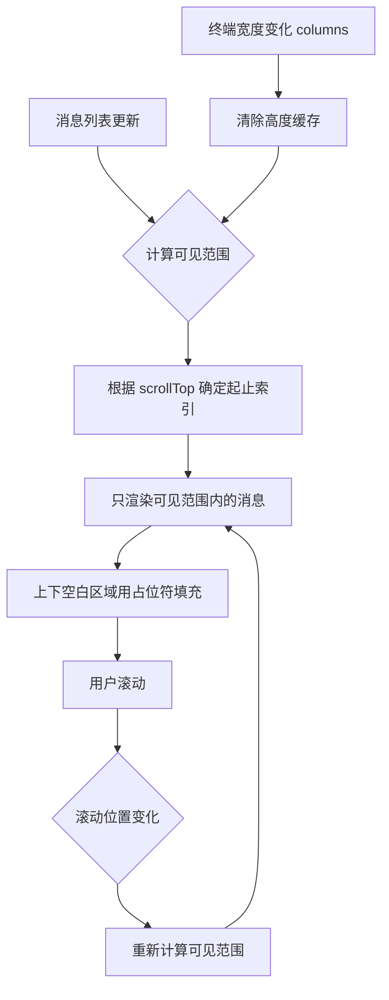
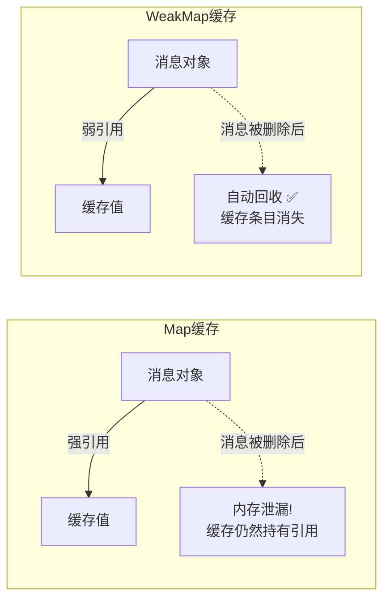
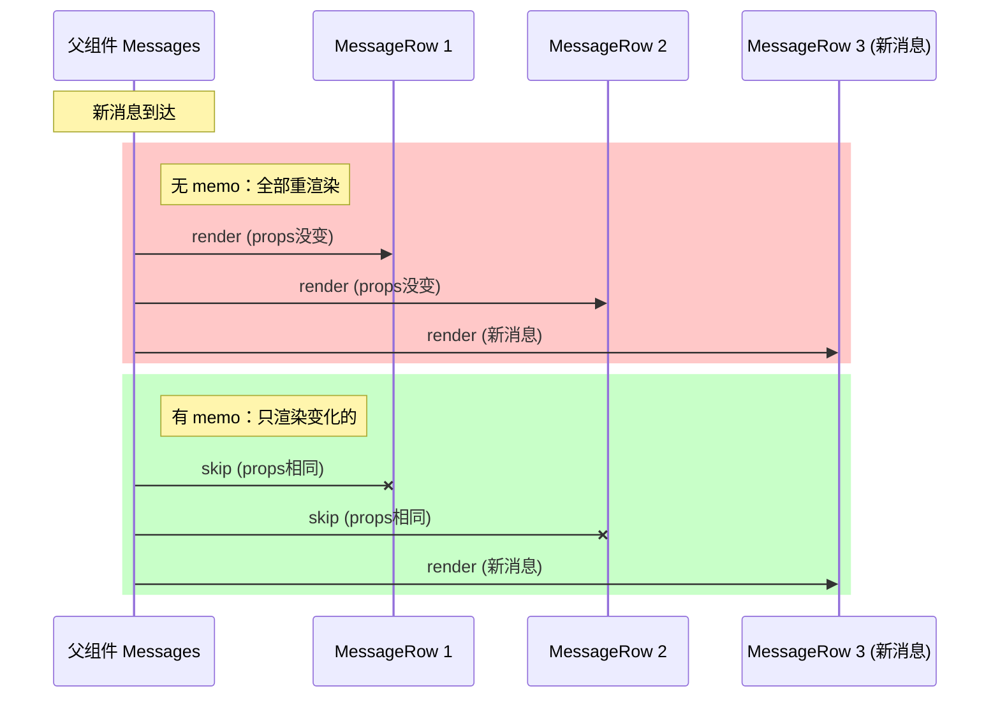

# 第8课：React 渲染优化 —— 虚拟滚动与 Memo

> 🎯 从 Claude Code 的终端 UI 源码出发，学习 React 渲染性能优化的核心技巧

---

## 📋 学习目标

1. 理解虚拟滚动（Virtual Scrolling）的原理及其解决的性能问题
2. 掌握 `React.memo`、`useMemo`、`useCallback` 的正确使用场景
3. 学习 OffscreenFreeze 模式——如何"冻结"不可见内容以避免无效渲染
4. 理解 GC（垃圾回收）压力优化：WeakMap 缓存与闭包分配控制
5. 学会在自己的项目中应用这些优化技巧

---

## 🌍 生活类比：超长菜单的餐厅

想象你去一家菜品极其丰富的餐厅，菜单有 **500 页**。

**方案一：全部打印**

把 500 页菜单全部打印出来放在桌上。纸张堆积如山，翻找费时，服务员每次更新一道菜就得重印整本菜单。

**方案二：电子屏幕（虚拟滚动）**

餐桌上放一个小屏幕，只显示当前浏览的那几页。往上翻就显示前面的菜，往下翻就显示后面的菜。屏幕只需要"渲染"你正在看的那几页。

**方案三：贴心标记（Memo）**

服务员记住你常看的几页菜单，下次直接翻到那里——不需要从头翻起。

**方案四：冻结旧菜单（OffscreenFreeze）**

翻过去的页面就"冻结"了，不再更新上面的动态内容（比如"今日特价"闪烁动画），直到你翻回来才重新激活。

Claude Code 的终端 UI 正是这样工作的！让我们看看它的源码。

---

## 🔍 核心概念一：虚拟滚动（Virtual Scrolling）

### 问题：为什么需要虚拟滚动？

Claude Code 是一个终端应用，一次对话可能产生**几百甚至上千条消息**（包括用户输入、AI 回复、工具调用结果等）。如果每次渲染都把所有消息全部挂载到 React 树上：

- 内存占用线性增长
- 每次状态更新都触发整棵消息树的 diff
- 终端刷新变慢，用户感觉"卡顿"

### Claude Code 的解决方案：VirtualMessageList

```typescript
// components/VirtualMessageList.tsx
import { useVirtualScroll } from '../hooks/useVirtualScroll.js';

type Props = {
  messages: RenderableMessage[];
  scrollRef: RefObject<ScrollBoxHandle | null>;
  columns: number; // 终端宽度变化时需要重新计算高度
  itemKey: (msg: RenderableMessage) => string;
  renderItem: (msg: RenderableMessage, index: number) => React.ReactNode;
  extractSearchText?: (msg: RenderableMessage) => string;
  trackStickyPrompt?: boolean;
  // ...更多 props
};
```

这个组件的核心思想是：

```
┌─────────────────────────────────┐
│     不可见区域（不渲染）          │  ← 上方的消息不挂载
├─────────────────────────────────┤
│  ┌───────────────────────────┐  │
│  │  可见消息 1               │  │  ← 只渲染
│  │  可见消息 2               │  │     终端视口内
│  │  可见消息 3               │  │     看得见的部分
│  └───────────────────────────┘  │
├─────────────────────────────────┤
│     不可见区域（不渲染）          │  ← 下方的消息不挂载
└─────────────────────────────────┘
```

### Mermaid 流程图：虚拟滚动工作流



### 高度缓存与终端宽度

虚拟滚动的一个关键挑战是：**消息高度不固定**。一条消息可能是一行文字，也可能是一大段代码。Claude Code 的做法是缓存已计算的高度，但在终端宽度变化时**清除缓存**：

```typescript
// columns 变化时高度缓存失效
// 因为文字换行会导致高度变化
type Props = {
  columns: number; // 终端宽度
  // ↑ 宽度变化时缓存的高度就不对了（文字重新换行 → 黑屏）
};
```

这就像手机横屏竖屏切换时，页面排版会变，原来缓存的每行高度都不准了。

---

## 🔍 核心概念二：OffscreenFreeze —— 冻结不可见内容

### 问题：滚出视口的内容还在更新？

在终端 UI 中，有些内容会定时更新——比如 **spinner 动画**、**elapsed 计时器**。即使这些内容已经滚到了看不见的地方（scrollback），每次更新仍会触发终端的**全屏重置**（因为终端无法局部更新已滚出的行）。

### Claude Code 的巧妙方案

```typescript
// components/OffscreenFreeze.tsx
export function OffscreenFreeze({ children }: Props): React.ReactNode {
  'use no memo' // 故意禁用 React Compiler 的 memo

  const inVirtualList = useContext(InVirtualListContext);
  const [ref, { isVisible }] = useTerminalViewport();
  const cached = useRef(children);

  // 虚拟列表内不需要冻结（ScrollBox 已经处理了裁剪）
  if (isVisible || inVirtualList) {
    cached.current = children; // 可见时更新缓存
  }

  // 不可见时返回缓存的旧 children
  // React reconciler 发现是同一个引用 → 跳过整个子树
  return <Box ref={ref}>{cached.current}</Box>;
}
```

这段代码的精妙之处在于：

| 状态 | 行为 | 效果 |
|------|------|------|
| 可见 | `cached.current = children` | 正常更新，最新内容 |
| 不可见 | 返回 `cached.current`（旧引用） | React 跳过 diff，零开销 |
| 重新可见 | 下次渲染更新 `cached.current` | 立即恢复最新内容 |

### 为什么要 `'use no memo'`？

```typescript
'use no memo' // 故意禁用 React Compiler 的自动 memo
```

这里有一个反直觉的点：**React Compiler 的自动 memo 会破坏冻结机制**。

因为 OffscreenFreeze 的核心是通过 `useRef` 手动控制"是否更新"。如果 React Compiler 自动 memo 了这个组件，它的输入 props 没变时整个组件都不会重新执行——那 `isVisible` 的变化就无法被检测到了。

---

## 🔍 核心概念三：WeakMap 缓存与 GC 压力

### 问题：频繁计算消耗大量内存

在滚动或搜索时，需要反复计算每条消息的"搜索文本"。如果每次都重新计算（`toLowerCase()`、字符串拼接），会产生大量临时字符串对象，给 GC 带来压力。

### Claude Code 的 WeakMap 缓存策略

```typescript
// components/VirtualMessageList.tsx
const fallbackLowerCache = new WeakMap<RenderableMessage, string>();

function defaultExtractSearchText(msg: RenderableMessage): string {
  const cached = fallbackLowerCache.get(msg);
  if (cached !== undefined) return cached;

  const lowered = renderableSearchText(msg); // 昂贵操作
  fallbackLowerCache.set(msg, lowered);
  return lowered;
}
```

**为什么选择 WeakMap 而不是 Map？**



| 特性 | Map | WeakMap |
|------|-----|---------|
| 键类型 | 任意 | 只能是对象 |
| GC 行为 | 键被删除后缓存仍存在（泄漏） | 键被 GC 后缓存自动清除 |
| 遍历 | 可遍历 | 不可遍历 |
| 适用场景 | 需要持久缓存 | 对象生命周期绑定的缓存 |

Claude Code 的消息列表在压缩（compact）后会整体替换，旧消息对象不再被引用。WeakMap 确保旧消息的缓存条目自动被 GC 回收，不会越积越多。

### 另一个例子：Sticky Prompt 缓存

```typescript
// components/VirtualMessageList.tsx
const promptTextCache = new WeakMap<RenderableMessage, string | null>();

function stickyPromptText(msg: RenderableMessage): string | null {
  const cached = promptTextCache.get(msg);
  if (cached !== undefined) return cached;

  const result = computeStickyPromptText(msg); // 包含字符串解析
  promptTextCache.set(msg, result);
  return result;
}
```

注释说得很清楚——StickyTracker 每次滚动 tick 都会调用这个函数 5-50+ 次，使用同一批消息对象。WeakMap 确保每条消息只计算一次。

---

## 🔍 核心概念四：React.memo 与 MessageRow

### 问题：父组件更新导致子组件无效重渲染

当消息列表有新消息到达时，即使旧消息完全没变化，默认情况下所有 MessageRow 都会重新渲染。

### Claude Code 的 MessageRow 优化

```typescript
// components/MessageRow.tsx
export type Props = {
  message: RenderableMessage;
  isUserContinuation: boolean;
  hasContentAfter: boolean;
  tools: Tools;
  commands: Command[];
  verbose: boolean;
  inProgressToolUseIDs: Set<string>;
  streamingToolUseIDs: Set<string>;
  // ...
};
```

MessageRow 接收精心设计的 props：

1. **布尔值代替数组**：`hasContentAfter: boolean` 而不是传递整个 `renderableMessages` 数组

```typescript
// ❌ 不好：每次渲染都传入新数组引用
<MessageRow messages={renderableMessages} index={i} />

// ✅ 好：预计算布尔值，React.memo 可以浅比较
<MessageRow hasContentAfter={hasContentAfterIndex(messages, i)} />
```

2. **避免闭包陷阱**：注释解释了为什么不传完整数组

```typescript
// 避免传递 renderableMessages 数组到 MessageRow
// React Compiler 会把它 pin 到 fiber 的 memoCache 中
// 导致每个历史版本的数组都被保留（~1-2MB / 7轮对话）
```

### Mermaid 图：有/无 memo 的渲染对比



---

## 🔍 核心概念五：增量搜索优化

### 问题：全文搜索在大量消息中很慢

当用户按 `/` 进行搜索时，需要在所有消息的文本中查找匹配项。如果每次按键都遍历所有消息并执行 `toLowerCase()` + `indexOf()`，延迟会很明显。

### Claude Code 的两阶段策略

```typescript
// components/VirtualMessageList.tsx - JumpHandle
export type JumpHandle = {
  // 预热搜索索引：提前提取所有消息的文本
  warmSearchIndex: () => Promise<number>;
  // 设置搜索关键词
  setSearchQuery: (q: string) => void;
  // 跳到下一个匹配
  nextMatch: () => void;
  // 跳到上一个匹配
  prevMatch: () => void;
};
```

**阶段一：预热（Warm）**

```
用户按下 "/" → 显示 "indexing..." → 后台遍历所有消息
                                      → 对每条消息执行 toLowerCase()
                                      → 结果存入 WeakMap 缓存
                                      → 显示 "indexed in Xms"
```

**阶段二：搜索（Search）**

```
用户输入字符 → 遍历缓存的小写文本（只做 indexOf）
             → 零 toLowerCase 分配
             → 毫秒级响应
```

这就是"空间换时间"的经典策略：用一次性的预计算，换取每次按键时的极速响应。

---

## 🛠️ 动手练习

### 练习1：实现一个简单的 OffscreenFreeze

用 React 实现一个简化版的 OffscreenFreeze：

```tsx
function SimpleOffscreenFreeze({ children, isVisible }) {
  // 你的实现：
  // 1. 使用 useRef 缓存最后一次可见时的 children
  // 2. 当 isVisible 为 true 时更新缓存
  // 3. 始终返回 cached.current
}
```

### 练习2：WeakMap vs Map 实验

```typescript
// 实验：观察 WeakMap 的 GC 行为
function experiment() {
  const weakMap = new WeakMap();
  const map = new Map();

  let obj = { data: 'hello' };
  weakMap.set(obj, 'cached-value');
  map.set(obj, 'cached-value');

  console.log(weakMap.has(obj)); // ???
  console.log(map.has(obj));     // ???

  obj = null; // 解除引用

  // 触发 GC 后：
  // weakMap 中的条目会被回收吗？
  // map 中的条目会被回收吗？
}
```

### 练习3：思考题

Claude Code 的 `OffscreenFreeze` 为什么要特别判断 `inVirtualList`？

```typescript
if (isVisible || inVirtualList) {
  cached.current = children;
}
```

如果在虚拟列表内也执行冻结逻辑会发生什么？

> 提示：虚拟列表的 ScrollBox 已经在裁剪内容了，`useTerminalViewport` 的可见性计算在虚拟列表上下文中可能不准确。

---

## 📝 本课小结

| 要点 | 说明 |
|------|------|
| 虚拟滚动 | 只渲染可见区域的消息，上下用占位符填充 |
| OffscreenFreeze | 不可见时返回缓存的旧 ReactElement 引用，跳过子树 diff |
| WeakMap 缓存 | 对象生命周期绑定的缓存，自动随 GC 清理 |
| Props 设计 | 传布尔值而非数组，减少引用变化和内存驻留 |
| 搜索预热 | 一次性预计算小写文本，后续搜索零分配 |
| `'use no memo'` | 需要每帧控制渲染的组件，要禁止 React Compiler 的自动 memo |

---

## 👉 下节预告

**第9课：流式处理 —— 异步生成器与背压控制**

我们将学习：
- `async function*` 异步生成器的工作原理
- Claude Code 的 query 循环如何用 `yield*` 构建流式管道
- 并发生成器执行器 `all()` 的实现
- StreamingToolExecutor 如何在模型流式返回时并行执行工具

---

> 💡 **学习提示**：打开你自己项目中渲染长列表的组件，检查是否有类似的优化机会。你的列表是全量渲染还是虚拟滚动？有没有不可见区域仍在更新的组件？
