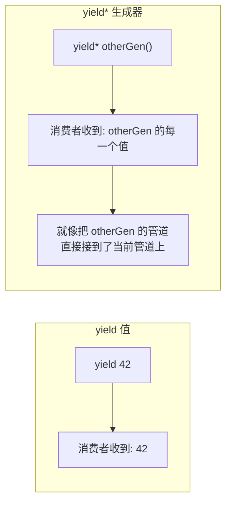
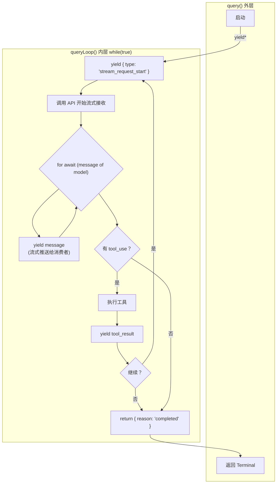
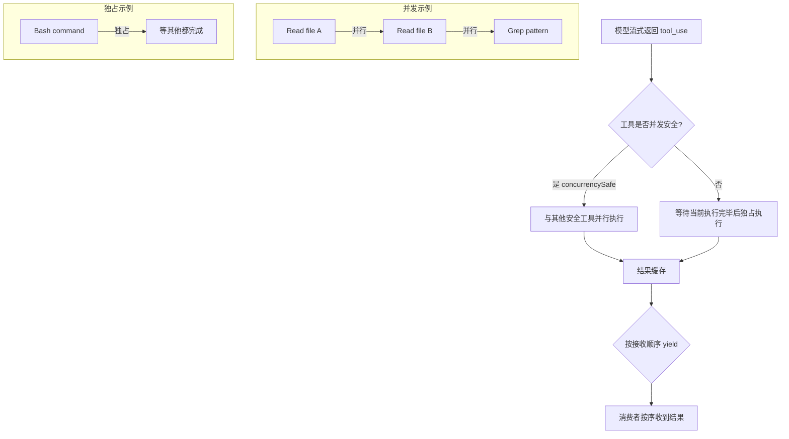
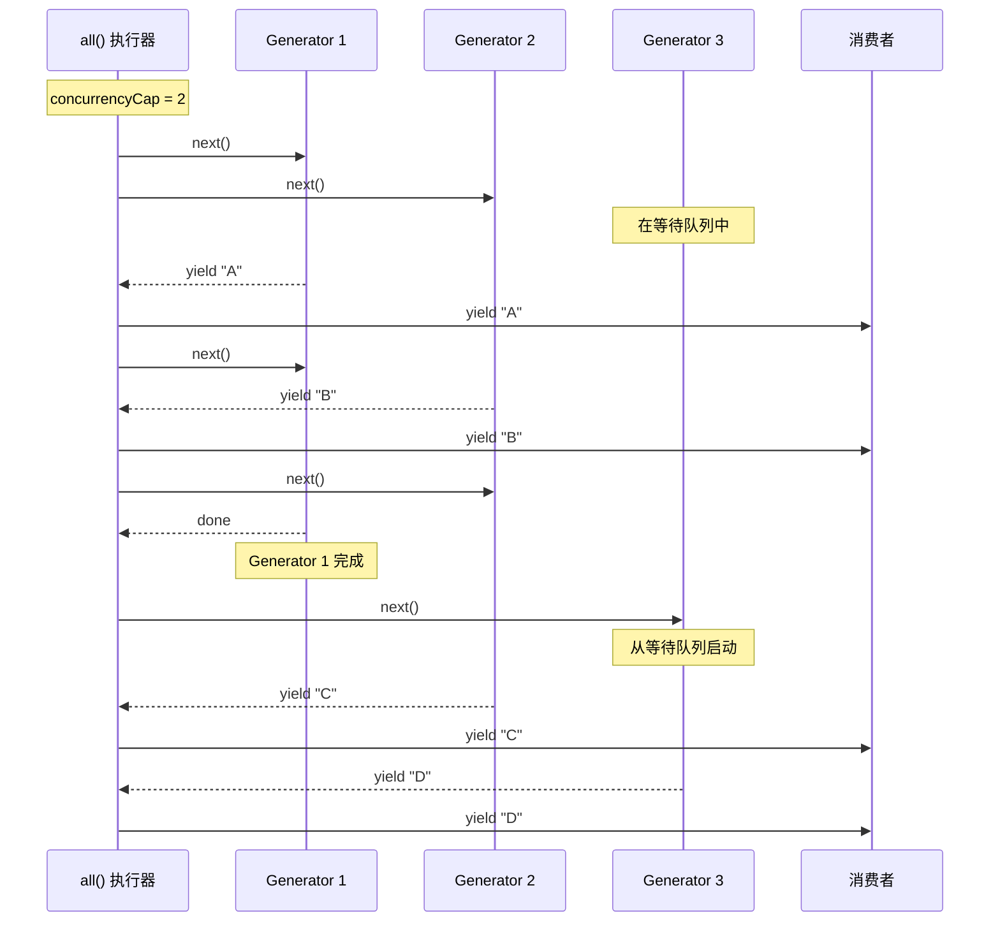

# 第9课：流式处理 —— 异步生成器与背压控制

> 🎯 从 Claude Code 的 query 循环和工具执行器源码出发，深入理解流式处理的核心模式

---

## 📋 学习目标

1. 理解 JavaScript 异步生成器（`async function*`）的工作原理
2. 掌握 `yield` 和 `yield*` 的区别及使用场景
3. 学习 Claude Code 的 query 循环如何构建流式管道
4. 理解 StreamingToolExecutor 如何实现"边接收边执行"
5. 学会并发生成器执行器 `all()` 的实现技巧

---

## 🌍 生活类比：流水线与传送带

### 传统方式：批量处理

想象一家包子铺的工作流程：

```
等所有面团揉完 → 等所有馅料拌好 → 逐个包包子 → 全部蒸完 → 一起端给客人
```

客人要等**很久**才能吃到第一个包子。

### 流式方式：流水线

```
揉好一块面团 → 立刻包一个包子 → 放进蒸笼
揉好一块面团 → 立刻包一个包子 → 放进蒸笼
... 第一笼蒸好了！先端给客人！
```

客人**很快**就能吃到第一个包子，同时后面的包子还在生产。

**Claude Code 就是这样工作的**：模型生成一段回复就立刻推送给用户，识别到一个工具调用就立刻开始执行——不需要等模型说完所有话。

---

## 🔍 核心概念一：异步生成器基础

### 普通函数 vs 生成器函数

```typescript
// 普通函数：计算完所有结果，一次性返回
function getNumbers(): number[] {
  return [1, 2, 3, 4, 5]; // 全部在内存中
}

// 生成器函数：一个一个"吐出"结果
function* generateNumbers(): Generator<number> {
  yield 1;  // 暂停，返回 1
  yield 2;  // 暂停，返回 2
  yield 3;  // 继续...
}

// 异步生成器：可以在 yield 之间做异步操作
async function* fetchItems(): AsyncGenerator<Item> {
  const page1 = await fetch('/api/items?page=1');
  yield* page1.items; // 逐个吐出第一页的结果

  const page2 = await fetch('/api/items?page=2');
  yield* page2.items; // 逐个吐出第二页的结果
}
```

### yield vs yield*



```typescript
// yield：吐出一个值
function* gen1() {
  yield 1;
  yield 2;
}

// yield*：把另一个生成器的所有值"透传"出去
function* gen2() {
  yield 0;
  yield* gen1(); // 透传 gen1 的 1, 2
  yield 3;
}
// gen2() 产出: 0, 1, 2, 3
```

---

## 🔍 核心概念二：Claude Code 的 Query 循环

### 整体架构

Claude Code 的核心交互循环是一个**异步生成器**，定义在 `query.ts` 中：

```typescript
// query.ts
export async function* query(
  params: QueryParams,
): AsyncGenerator<
  | StreamEvent      // 流式事件
  | RequestStartEvent
  | Message          // 消息
  | TombstoneMessage
  | ToolUseSummaryMessage,
  Terminal           // 返回值：结束原因
> {
  const consumedCommandUuids: string[] = [];
  const terminal = yield* queryLoop(params, consumedCommandUuids);
  for (const uuid of consumedCommandUuids) {
    notifyCommandLifecycle(uuid, 'completed');
  }
  return terminal;
}
```

注意这里的 `yield* queryLoop()`——它把 queryLoop 生成器的所有产出**透传**给外层消费者，同时获取 queryLoop 的**返回值**（终止原因）。

### Query 循环的流式管道



### 关键设计：状态机 + 流式输出

```typescript
// query.ts - 循环内的状态管理
let state: State = {
  messages: params.messages,
  toolUseContext: params.toolUseContext,
  autoCompactTracking: undefined,
  maxOutputTokensRecoveryCount: 0,
  hasAttemptedReactiveCompact: false,
  turnCount: 1,
  transition: undefined, // 记录上一次迭代为什么继续
};

while (true) {
  // 1. 预处理（压缩、snip 等）
  // 2. 调用模型，流式接收
  for await (const message of deps.callModel({...})) {
    yield message; // 立刻推送给消费者
    // 同时收集 tool_use 块
    if (message.type === 'assistant') {
      // 检测到工具调用 → 记录下来
    }
  }

  // 3. 没有工具调用 → 结束
  if (!needsFollowUp) {
    return { reason: 'completed' };
  }

  // 4. 执行工具，收集结果
  for await (const update of toolUpdates) {
    yield update.message; // 工具结果也流式推出
  }

  // 5. 更新状态，进入下一轮
  state = { ...nextState };
  // continue → 回到 while(true) 顶部
}
```

这个设计的精妙之处在于：**消费者不需要知道内部的循环逻辑**。它只需要 `for await (const event of query(...))` 就能逐个接收到所有事件——模型的流式文字、工具调用结果、压缩边界标记等等。

---

## 🔍 核心概念三：StreamingToolExecutor

### 问题：等模型说完再执行工具太慢

传统流程：

```
模型回复完整消息 → 解析出 tool_use → 逐个执行工具 → 收集结果 → 发送回模型
```

优化流程：

```
模型正在回复...
  ↓ 检测到 tool_use_1 → 立刻开始执行！
模型继续回复...
  ↓ 检测到 tool_use_2 → 立刻开始执行！
模型回复结束 → tool_use_1 已经执行完了 → 只需等 tool_use_2
```

### Claude Code 的 StreamingToolExecutor

```typescript
// services/tools/StreamingToolExecutor.ts

// 工具状态追踪
type ToolStatus = 'queued' | 'executing' | 'completed' | 'yielded';

type TrackedTool = {
  id: string;
  block: ToolUseBlock;
  status: ToolStatus;
  isConcurrencySafe: boolean;  // 是否可以并发执行
  promise?: Promise<void>;
  results?: Message[];
  pendingProgress: Message[];  // 进度消息（立即推送）
};

export class StreamingToolExecutor {
  private tools: TrackedTool[] = [];

  // 模型流式返回 tool_use 块时立刻调用
  addTool(block: ToolUseBlock, assistantMessage: AssistantMessage): void {
    // 1. 查找工具定义
    // 2. 判断是否可并发执行
    // 3. 如果可以，立刻开始执行！
  }

  // 模型回复结束后，获取剩余结果
  async *getRemainingResults(): AsyncGenerator<MessageUpdate> {
    // 等待所有工具执行完毕
    // 按接收顺序 yield 结果
  }
}
```

### 并发安全控制



并发安全的工具（如文件读取、搜索）可以同时执行，而非安全的工具（如 Bash 命令）需要独占执行。这样既保证了正确性，又最大化了并行度。

---

## 🔍 核心概念四：并发生成器执行器 all()

### 问题：如何同时运行多个异步生成器？

Claude Code 在 `utils/generators.ts` 中实现了一个优雅的并发生成器执行器：

```typescript
// utils/generators.ts
export async function* all<A>(
  generators: AsyncGenerator<A, void>[],
  concurrencyCap = Infinity,
): AsyncGenerator<A, void> {
  const next = (generator: AsyncGenerator<A, void>) => {
    const promise = generator.next().then(({ done, value }) => ({
      done, value, generator, promise,
    }));
    return promise;
  };

  const waiting = [...generators];
  const promises = new Set<Promise<QueuedGenerator<A>>>();

  // 启动初始批次（不超过并发上限）
  while (promises.size < concurrencyCap && waiting.length > 0) {
    promises.add(next(waiting.shift()!));
  }

  // 核心循环：哪个先完成就先处理哪个
  while (promises.size > 0) {
    const { done, value, generator, promise } = await Promise.race(promises);
    promises.delete(promise);

    if (!done) {
      promises.add(next(generator)); // 继续推进这个生成器
      if (value !== undefined) {
        yield value; // 产出值
      }
    } else if (waiting.length > 0) {
      // 一个完成了，从等待队列启动下一个
      promises.add(next(waiting.shift()!));
    }
  }
}
```

### 工作原理图解



### 关键点：Promise.race

```typescript
const { done, value, generator } = await Promise.race(promises);
```

`Promise.race` 返回**最先完成的那个** Promise。这意味着：

- 多个生成器同时在"等待下一个值"
- 谁先产出值，谁就被先处理
- 实现了"来一个处理一个"的流式效果
- **不会阻塞**——不需要等所有生成器都产出才继续

---

## 🔍 核心概念五：背压控制

### 什么是背压（Backpressure）？

当生产者的速度快于消费者时，如果没有控制机制，数据会在中间堆积，最终耗尽内存。

```
生产者(模型): 100 msg/s ──→ 缓冲区(无限增长!) ──→ 消费者(UI渲染): 10 msg/s
```

### 异步生成器的天然背压

异步生成器自带背压机制——**生产者在 yield 后暂停，直到消费者调用 next()**：

```typescript
async function* producer() {
  for (let i = 0; i < 1000; i++) {
    console.log(`生产: ${i}`);
    yield i; // 暂停！等待消费者消费
  }
}

async function consumer() {
  for await (const item of producer()) {
    console.log(`消费: ${item}`);
    await heavyProcessing(item); // 慢慢处理
    // 处理完才会触发下一个 next() → producer 才继续
  }
}
```

### Claude Code 中的背压

```typescript
// query.ts - 模型流式接收
for await (const message of deps.callModel({...})) {
  // 每收到一个 message：
  // 1. 做一些处理（检测 tool_use 等）
  // 2. yield 给消费者
  yield message;
  // ↑ 消费者处理完才会继续
  // 这自然地控制了速率
}
```

如果消费者（UI 渲染层）处理一条消息需要 10ms，那么无论模型返回多快，`yield` 都会自动"节流"——这就是背压。

```mermaid
flowchart LR
    subgraph 无背压
        A[API 流] -->|100条/秒| B[缓冲区<br/>内存爆炸💥]
        B -->|10条/秒| C[UI 渲染]
    end
    
    subgraph 有背压 - 异步生成器
        D[API 流] -->|yield 后暂停| E[逐条传递<br/>内存恒定 ✅]
        E -->|消费完调 next()| F[UI 渲染]
        F -->|next()| D
    end
```

---

## 🛠️ 动手练习

### 练习1：实现一个简单的流式管道

```typescript
// 实现一个转换生成器：将数字流翻倍
async function* double(
  source: AsyncGenerator<number>
): AsyncGenerator<number> {
  // 你的实现
}

// 使用
async function* numbers() {
  yield 1; yield 2; yield 3;
}

for await (const n of double(numbers())) {
  console.log(n); // 应输出 2, 4, 6
}
```

### 练习2：给 all() 加上错误处理

当前的 `all()` 实现中，如果某个生成器抛出错误，整个执行器会崩溃。试着修改它：

```typescript
async function* allWithErrorHandling<A>(
  generators: AsyncGenerator<A, void>[],
  onError?: (error: Error, index: number) => void
): AsyncGenerator<A, void> {
  // 你的实现：
  // 错误时调用 onError 回调
  // 跳过出错的生成器，继续处理其他的
}
```

### 练习3：思考题

在 Claude Code 的 query 循环中，为什么要用 `while (true)` + `state` 对象而不是递归调用？

```typescript
// 实际实现：迭代
while (true) {
  // ...处理
  state = { ...nextState };
  continue;
}

// 替代方案：递归（为什么不用？）
async function* queryLoop(state: State) {
  // ...处理
  yield* queryLoop(nextState); // 递归
}
```

> 提示：考虑栈深度、内存占用、以及异步生成器的 `.return()` 传播行为。

---

## 📝 本课小结

| 要点 | 说明 |
|------|------|
| 异步生成器 | `async function*` + `yield` 实现惰性流式处理 |
| yield* | 透传子生成器的所有产出，同时获取其返回值 |
| query 循环 | 用 while(true) + state 实现多轮对话的流式管道 |
| StreamingToolExecutor | 模型流式返回时立刻开始执行工具，支持并发 |
| all() 执行器 | Promise.race 驱动多个生成器并发执行 |
| 背压控制 | yield 天然暂停生产者，消费者 next() 驱动节奏 |

---

## 👉 下节预告

**第10课：综合实战 —— 性能优化检查清单**

我们将把前9课学到的知识汇总为一份实用的检查清单：
- 启动优化 Checklist
- 运行时优化 Checklist
- 内存管理 Checklist
- 前端渲染 Checklist
- 完整的实战案例分析

---

> 💡 **学习提示**：下次你需要处理"一边接收数据一边显示"的场景时（比如聊天应用、日志查看器），想想异步生成器能不能帮你简化代码。它比 EventEmitter 和回调更容易组合和测试。
