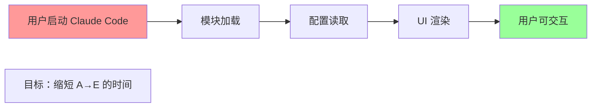
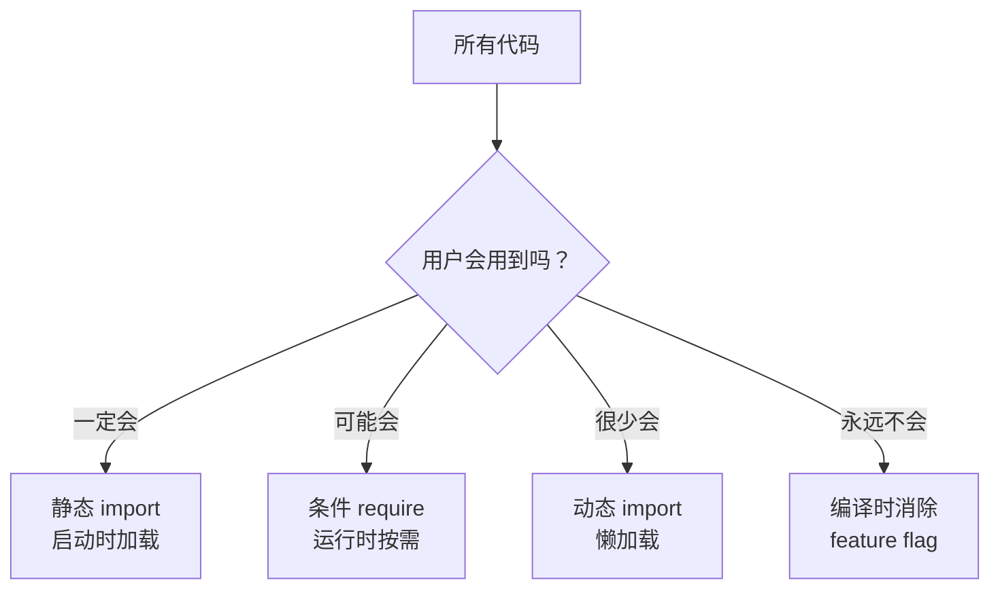
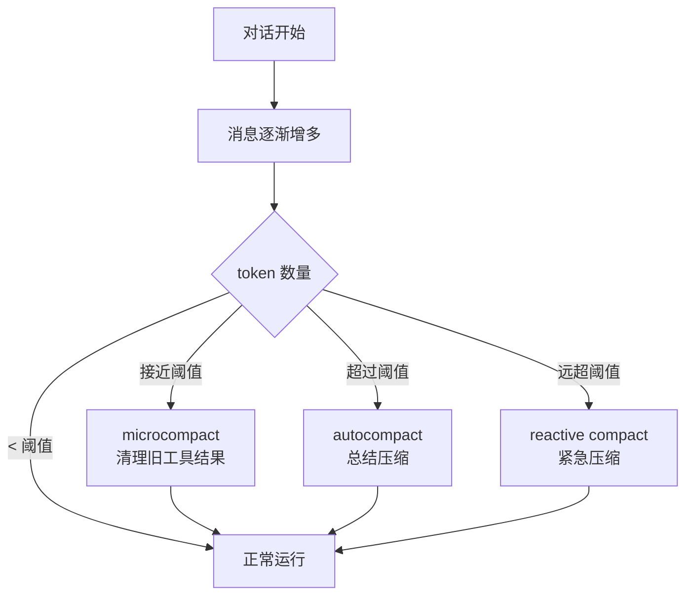
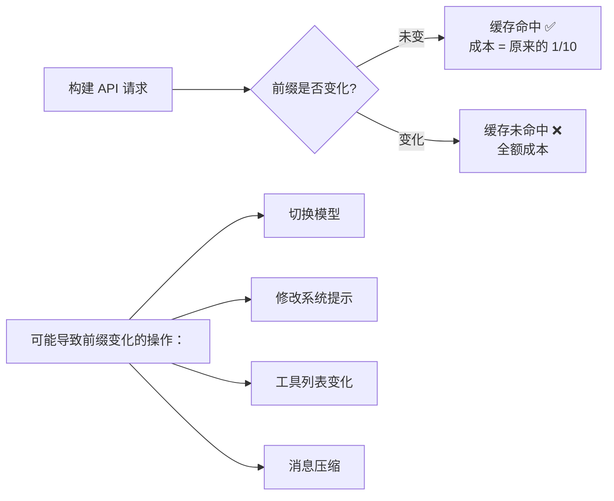
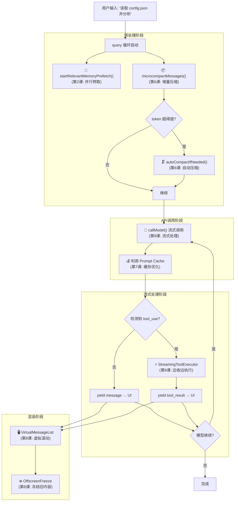
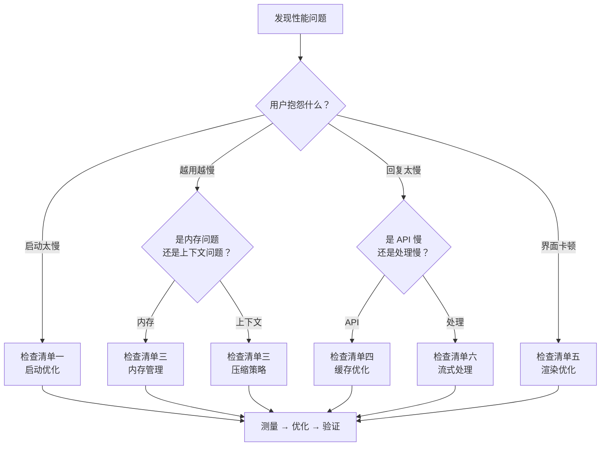

# 第10课：综合实战 —— 性能优化检查清单

> 🎯 汇总前 9 课所学，形成一份可直接使用的性能优化检查清单

---

## 📋 学习目标

1. 将分散的优化技巧整合为系统化的检查清单
2. 学会根据性能瓶颈类型选择正确的优化策略
3. 通过 Claude Code 的完整案例理解优化策略的组合运用
4. 建立"性能预算"思维——每个优化都有成本和收益
5. 掌握性能优化的优先级排序方法

---

## 🌍 生活类比：装修一栋房子

性能优化就像装修房子——你不能只关注某一个房间。

| 装修 | 性能优化 |
|------|----------|
| 打地基 | 选择正确的架构和数据结构 |
| 水电管线 | 模块加载和依赖管理 |
| 墙面粉刷 | UI 渲染优化 |
| 家具摆放 | 内存管理和缓存策略 |
| 日常保洁 | 持续监控和回归测试 |

你需要一份**装修清单**来确保每个环节都不遗漏。下面就是 Claude Code 的"装修清单"。

---

## ✅ 检查清单一：启动优化

### 第一优先级：关键路径加速



| # | 检查项 | 来源课程 | 相关源码 |
|---|--------|----------|----------|
| 1.1 | 是否有可以**并行执行**的启动任务？ | 第2课 | `main.tsx` - `Promise.all([getSkills(), getPluginCommands()])` |
| 1.2 | 启动时是否加载了**暂时不需要**的模块？ | 第3课 | `commands.ts` - `await import('./commands/insights.js')` |
| 1.3 | 是否有**编译时可消除**的死代码？ | 第4课 | `commands.ts` - `feature('PROACTIVE') ? require(...) : null` |
| 1.4 | 是否在入口点尽早启动了**异步预取**？ | 第2课 | `main.tsx` - `startKeychainPrefetch()` 在 import 之前 |
| 1.5 | 是否设置了**性能检查点**来追踪启动耗时？ | 第1课 | `profileCheckpoint('main_tsx_entry')` |

### Claude Code 的启动优化实例

```typescript
// main.tsx - 入口处的并行优化
// 这些副作用在所有其他 import 之前运行：
import { profileCheckpoint } from './utils/startupProfiler.js';
profileCheckpoint('main_tsx_entry');

import { startMdmRawRead } from './utils/settings/mdm/rawRead.js';
startMdmRawRead(); // 与后续 ~135ms 的 import 并行

import { startKeychainPrefetch } from './utils/secureStorage/keychainPrefetch.js';
startKeychainPrefetch(); // 并行启动 macOS 钥匙串读取
```

**原则：在最早的时机启动最慢的异步操作，让它们与模块加载并行运行。**

---

## ✅ 检查清单二：运行时代码加载

### 第二优先级：按需加载



| # | 检查项 | 来源课程 | 如何判断 |
|---|--------|----------|----------|
| 2.1 | 是否有**只在特定条件**下才用到的模块？ | 第5课 | 被 `if` 或环境变量包裹的 `require` |
| 2.2 | 是否有**只在特定功能**被触发时才需要的重量级模块？ | 第3课 | 113KB 的 `insights.ts` 通过 `await import()` 懒加载 |
| 2.3 | 是否利用了 **feature flag** 在编译时消除不需要的代码？ | 第4课 | `feature('VOICE_MODE') ? require('...') : null` |
| 2.4 | 条件加载时是否保留了**类型安全**？ | 第5课 | `as typeof import('...')` 类型断言 |

### 实战案例：commands.ts 的分层加载

```typescript
// 第一层：始终需要的核心命令 —— 静态 import
import clear from './commands/clear/index.js';
import help from './commands/help/index.js';
import compact from './commands/compact/index.js';

// 第二层：条件存在的功能 —— feature() + require
const voiceCommand = feature('VOICE_MODE')
  ? require('./commands/voice/index.js').default
  : null;

// 第三层：很少使用的重量级功能 —— 动态 import()
const usageReport: Command = {
  name: 'insights',
  async getPromptForCommand(args, context) {
    const real = (await import('./commands/insights.js')).default;
    return real.getPromptForCommand(args, context);
  },
};
```

---

## ✅ 检查清单三：上下文与内存管理

### 第三优先级：控制资源增长



| # | 检查项 | 来源课程 | 说明 |
|---|--------|----------|------|
| 3.1 | 是否有**自动压缩**机制防止上下文无限增长？ | 第6课 | `autoCompactIfNeeded()` - 超过阈值自动总结 |
| 3.2 | 是否有**增量压缩**减少不必要的全量操作？ | 第6课 | `microcompactMessages()` - 只清理旧工具结果 |
| 3.3 | 是否有**熔断器**防止失败操作反复重试？ | 第6课 | `MAX_CONSECUTIVE_AUTOCOMPACT_FAILURES = 3` |
| 3.4 | 是否使用 **WeakMap** 避免对象缓存导致内存泄漏？ | 第8课 | `fallbackLowerCache = new WeakMap()` |
| 3.5 | 是否在压缩后**只恢复必要的文件**而非全部？ | 第6课 | `POST_COMPACT_MAX_FILES_TO_RESTORE = 5` |
| 3.6 | 恢复是否有 **token 预算**约束？ | 第6课 | `POST_COMPACT_TOKEN_BUDGET = 50_000` |

### 三级压缩体系

```typescript
// 1. Microcompact：轻量级，清理旧工具结果
// services/compact/microCompact.ts
const COMPACTABLE_TOOLS = new Set([
  FILE_READ_TOOL_NAME,     // 文件读取结果
  ...SHELL_TOOL_NAMES,     // Shell 命令输出
  GREP_TOOL_NAME,          // 搜索结果
  GLOB_TOOL_NAME,          // 文件列表
]);

// 2. AutoCompact：中量级，API 调用生成总结
// services/compact/autoCompact.ts
export function getAutoCompactThreshold(model: string): number {
  return getEffectiveContextWindowSize(model) - AUTOCOMPACT_BUFFER_TOKENS;
}

// 3. ReactiveCompact：重量级，应急响应 prompt-too-long 错误
// 当 API 返回 413 时触发
```

---

## ✅ 检查清单四：API 调用优化

### 第四优先级：降低成本与延迟

| # | 检查项 | 来源课程 | 说明 |
|---|--------|----------|------|
| 4.1 | 是否**保持 prompt 前缀稳定**以利用缓存？ | 第7课 | 缓存命中时处理成本降至 1/10 |
| 4.2 | 是否有**缓存中断检测**机制？ | 第7课 | `promptCacheBreakDetection.ts` |
| 4.3 | 压缩 fork 是否**复用主线程缓存**？ | 第7课 | `promptCacheSharingEnabled` |
| 4.4 | 是否在修改 prompt 前缀时**通知缓存系统**？ | 第7课 | `notifyCompaction()` |
| 4.5 | 是否使用**流式 API**而非批量等待？ | 第9课 | `queryModelWithStreaming()` |

### 缓存一致性检查



---

## ✅ 检查清单五：前端渲染优化

### 第五优先级：流畅的用户体验

| # | 检查项 | 来源课程 | 说明 |
|---|--------|----------|------|
| 5.1 | 长列表是否使用了**虚拟滚动**？ | 第8课 | `VirtualMessageList.tsx` |
| 5.2 | 不可见内容是否**冻结更新**？ | 第8课 | `OffscreenFreeze.tsx` |
| 5.3 | 组件 props 是否避免了**不必要的引用变化**？ | 第8课 | 传布尔值而非数组 |
| 5.4 | 搜索是否做了**预热缓存**？ | 第8课 | `warmSearchIndex()` |
| 5.5 | 是否正确使用了 `React.memo` / `useMemo`？ | 第8课 | 避免每帧控制组件被自动 memo |
| 5.6 | 是否使用了**流式渲染**而非等待完整数据？ | 第9课 | `StreamingToolExecutor` |

---

## ✅ 检查清单六：流式处理与并发

### 第六优先级：高效的数据处理管道

| # | 检查项 | 来源课程 | 说明 |
|---|--------|----------|------|
| 6.1 | 是否使用**异步生成器**构建流式管道？ | 第9课 | `async function* query()` |
| 6.2 | 是否利用 **yield*** 组合子管道？ | 第9课 | `yield* queryLoop(params)` |
| 6.3 | 是否在**等待期间并行**执行其他工作？ | 第9课 | 模型流式返回时并行执行工具 |
| 6.4 | 并发是否有**安全控制**？ | 第9课 | `isConcurrencySafe` 标记 |
| 6.5 | 是否有**自然的背压**机制？ | 第9课 | yield 暂停 + next() 驱动 |
| 6.6 | 并行预取是否在**不阻塞主流程**的情况下运行？ | 第2课 | `startRelevantMemoryPrefetch()` |

---

## 🔍 综合案例分析：一次完整的用户交互

让我们追踪一次用户输入到收到回复的完整流程，看看所有优化如何协同工作：



### 各阶段的优化贡献

| 阶段 | 优化技术 | 节省了什么 |
|------|----------|-----------|
| 启动 | 并行预取 + 懒加载 | ~200ms 启动时间 |
| 预处理 | microcompact | 几千到几万 token |
| API 调用 | Prompt Cache | 90% API 成本 |
| 模型回复 | 流式处理 | 首字延迟 |
| 工具执行 | StreamingToolExecutor | 工具等待时间 |
| UI 渲染 | 虚拟滚动 + OffscreenFreeze | 渲染帧率 |

---

## 🧭 优化优先级决策树

不知道该从哪里开始优化？按照这个决策树：



---

## 🛠️ 动手练习

### 练习1：性能审计

找一个你自己的项目（或一个开源项目），用这份检查清单做一次性能审计：

1. 启动时有多少个模块被同步加载？
2. 有没有可以并行执行的初始化任务？
3. 列表/表格组件是全量渲染还是虚拟化？
4. API 调用有没有利用缓存？
5. 有没有资源无限增长的风险点？

### 练习2：设计你的压缩策略

假设你在做一个聊天应用，消息越来越多导致内存和 API 成本增长。参考 Claude Code 的三级压缩体系，设计你自己的方案：

```
Level 1 (低成本): ____________________
Level 2 (中成本): ____________________
Level 3 (高成本): ____________________
触发条件: ____________________
熔断机制: ____________________
```

### 练习3：综合思考

Claude Code 在以下场景中，哪些优化会**相互冲突**？如何取舍？

- Prompt Cache 要求前缀稳定 vs AutoCompact 会改变前缀
- 流式处理要求立刻推送 vs 批量处理减少渲染次数
- WeakMap 自动 GC vs 需要长期持久的缓存

---

## 📝 全课程总结

### 10 节课的知识地图

```mermaid
mindmap
  root((性能优化))
    加载优化
      并行预取 Promise.all
      懒加载 dynamic import
      死代码消除 feature()
      条件 Require
    运行时优化
      上下文压缩
        Microcompact
        AutoCompact
        ReactiveCompact
      Prompt 缓存
        前缀稳定
        中断检测
        缓存共享
    前端优化
      虚拟滚动
      OffscreenFreeze
      WeakMap 缓存
      React.memo
    数据流优化
      异步生成器
      yield* 管道
      StreamingToolExecutor
      背压控制
```

### 核心原则回顾

| 原则 | 解释 | 课程 |
|------|------|------|
| **不做无用功** | 死代码消除、条件加载 | 第3、4、5课 |
| **并行而非串行** | Promise.all、并行预取 | 第2课 |
| **渐进式处理** | 流式、增量压缩 | 第6、9课 |
| **空间换时间** | 缓存、预计算 | 第7、8课 |
| **按需而非预备** | 懒加载、虚拟滚动 | 第3、8课 |
| **设定预算** | token 预算、文件数量限制 | 第6课 |
| **有兜底方案** | 熔断器、多级降级 | 第6、7课 |

### 一句话总结

> **性能优化不是一次性的工程，而是一种持续的思维方式：每次写代码时都问自己——这件事真的需要现在做吗？能不能更快？能不能更省？**

---

## 🎓 课后阅读推荐

如果你想继续深入，以下是与本课程内容直接相关的源码文件：

| 文件 | 核心内容 |
|------|----------|
| `main.tsx` | 启动优化、并行预取、feature flag |
| `query.ts` | 流式处理、异步生成器、query 循环 |
| `commands.ts` | 条件 require、懒加载、命令系统 |
| `services/compact/compact.ts` | 全量压缩算法 |
| `services/compact/autoCompact.ts` | 自动压缩触发逻辑 |
| `services/compact/microCompact.ts` | 增量微压缩 |
| `services/api/promptCacheBreakDetection.ts` | Prompt 缓存中断检测 |
| `components/VirtualMessageList.tsx` | 虚拟滚动、搜索优化 |
| `components/OffscreenFreeze.tsx` | 不可见内容冻结 |
| `services/tools/StreamingToolExecutor.ts` | 流式工具执行 |
| `utils/generators.ts` | 并发生成器执行器 |

---

> 🎉 恭喜你完成了全部 10 节课！你已经掌握了 Claude Code 性能优化的核心技术。把这些知识应用到你自己的项目中，让你的代码跑得更快、更省、更流畅！
